# User and Role Management with Authentication

## Overview

This design defines a comprehensive user authentication and role-based access control (RBAC) system for the InventoryPro application. The system will manage users, roles, permissions, and authentication workflows while integrating with the existing Neon PostgreSQL database and Next.js architecture.

## Strategic Intent

The user and role management system aims to:

- Provide secure authentication and session management for application users
- Implement role-based access control to restrict feature access based on user permissions
- Support multi-branch user management with branch-level access control
- Enable audit trails for security and compliance requirements
- Integrate seamlessly with the existing repository-service-API architecture pattern
- Ensure scalability and security using modern authentication standards

## Data Model Design

### User Model

Represents system users who can access the application.

| Field | Type | Required | Constraints | Description |
|-------|------|----------|-------------|-------------|
| id | String | Yes | Primary Key, UUID | Unique identifier |
| email | String | Yes | Unique, Valid email format | User email address for login |
| passwordHash | String | Yes | Hashed with bcrypt | Securely hashed password |
| firstName | String | Yes | 1-100 characters | User's first name |
| lastName | String | Yes | 1-100 characters | User's last name |
| phone | String | No | Valid phone format | Contact phone number |
| roleId | String | Yes | Foreign Key to Role | Associated role |
| branchId | String | No | Foreign Key to Branch | Primary branch assignment |
| status | Enum | Yes | active, inactive, suspended | Account status |
| emailVerified | Boolean | Yes | Default: false | Email verification status |
| lastLoginAt | DateTime | No | | Last successful login timestamp |
| passwordChangedAt | DateTime | No | | Last password change timestamp |
| createdAt | DateTime | Yes | Auto-generated | Record creation timestamp |
| updatedAt | DateTime | Yes | Auto-updated | Record update timestamp |

### Role Model

Defines user roles with associated permissions.

| Field | Type | Required | Constraints | Description |
|-------|------|----------|-------------|-------------|
| id | String | Yes | Primary Key, UUID | Unique identifier |
| name | String | Yes | Unique, 3-50 characters | Role name (e.g., Admin, Manager, Cashier) |
| description | String | No | Max 500 characters | Role description |
| isSystem | Boolean | Yes | Default: false | System-defined role (cannot be deleted) |
| createdAt | DateTime | Yes | Auto-generated | Record creation timestamp |
| updatedAt | DateTime | Yes | Auto-updated | Record update timestamp |

### Permission Model

Defines granular permissions that can be assigned to roles.

| Field | Type | Required | Constraints | Description |
|-------|------|----------|-------------|-------------|
| id | String | Yes | Primary Key, UUID | Unique identifier |
| resource | String | Yes | Enum of resources | Resource being protected (e.g., products, inventory, sales) |
| action | String | Yes | Enum of actions | Action allowed (create, read, update, delete, manage) |
| description | String | No | Max 500 characters | Permission description |
| createdAt | DateTime | Yes | Auto-generated | Record creation timestamp |

### RolePermission Model

Junction table linking roles to permissions (many-to-many relationship).

| Field | Type | Required | Constraints | Description |
|-------|------|----------|-------------|-------------|
| id | String | Yes | Primary Key, UUID | Unique identifier |
| roleId | String | Yes | Foreign Key to Role | Associated role |
| permissionId | String | Yes | Foreign Key to Permission | Associated permission |
| createdAt | DateTime | Yes | Auto-generated | Record creation timestamp |

**Unique Constraint**: Combination of roleId and permissionId must be unique

### UserBranchAccess Model

Defines multi-branch access for users (optional, for users who can access multiple branches).

| Field | Type | Required | Constraints | Description |
|-------|------|----------|-------------|-------------|
| id | String | Yes | Primary Key, UUID | Unique identifier |
| userId | String | Yes | Foreign Key to User | Associated user |
| branchId | String | Yes | Foreign Key to Branch | Branch user can access |
| createdAt | DateTime | Yes | Auto-generated | Record creation timestamp |

**Unique Constraint**: Combination of userId and branchId must be unique

### Session Model

Manages active user sessions for authentication.

| Field | Type | Required | Constraints | Description |
|-------|------|----------|-------------|-------------|
| id | String | Yes | Primary Key, UUID | Unique identifier |
| userId | String | Yes | Foreign Key to User | Associated user |
| token | String | Yes | Unique, indexed | Session token (JWT identifier) |
| ipAddress | String | No | Valid IP format | Client IP address |
| userAgent | String | No | Max 500 characters | Client user agent |
| expiresAt | DateTime | Yes | | Session expiration timestamp |
| createdAt | DateTime | Yes | Auto-generated | Record creation timestamp |

**Index**: token field for fast session lookups

### AuditLog Model

Tracks user actions for security and compliance.

| Field | Type | Required | Constraints | Description |
|-------|------|----------|-------------|-------------|
| id | String | Yes | Primary Key, UUID | Unique identifier |
| userId | String | No | Foreign Key to User | User who performed action (null for system) |
| action | String | Yes | Max 100 characters | Action performed |
| resource | String | Yes | Max 100 characters | Resource affected |
| resourceId | String | No | | ID of affected resource |
| details | JSON | No | | Additional action details |
| ipAddress | String | No | Valid IP format | Client IP address |
| userAgent | String | No | Max 500 characters | Client user agent |
| createdAt | DateTime | Yes | Auto-generated | Timestamp of action |

**Indexes**: userId, resource, createdAt for efficient querying

### PasswordResetToken Model

Manages password reset tokens for forgotten password flow.

| Field | Type | Required | Constraints | Description |
|-------|------|----------|-------------|-------------|
| id | String | Yes | Primary Key, UUID | Unique identifier |
| userId | String | Yes | Foreign Key to User | Associated user |
| token | String | Yes | Unique, hashed | Reset token |
| expiresAt | DateTime | Yes | | Token expiration (typically 1 hour) |
| used | Boolean | Yes | Default: false | Whether token has been used |
| createdAt | DateTime | Yes | Auto-generated | Record creation timestamp |

**Index**: token field for fast lookups

## Entity Relationships

```mermaid
erDiagram
    User ||--o{ Session : has
    User }o--|| Role : "assigned to"
    User }o--o| Branch : "primary branch"
    User ||--o{ UserBranchAccess : "can access"
    Branch ||--o{ UserBranchAccess : "accessible by"
    User ||--o{ AuditLog : performs
    User ||--o{ PasswordResetToken : requests
    Role ||--o{ RolePermission : has
    Permission ||--o{ RolePermission : "assigned to"
    Role ||--o{ User : "assigned to users"
    
    User {
        string id PK
        string email UK
        string passwordHash
        string firstName
        string lastName
        string phone
        string roleId FK
        string branchId FK
        enum status
        boolean emailVerified
        datetime lastLoginAt
        datetime passwordChangedAt
        datetime createdAt
        datetime updatedAt
    }
    
    Role {
        string id PK
        string name UK
        string description
        boolean isSystem
        datetime createdAt
        datetime updatedAt
    }
    
    Permission {
        string id PK
        string resource
        string action
        string description
        datetime createdAt
    }
    
    RolePermission {
        string id PK
        string roleId FK
        string permissionId FK
        datetime createdAt
    }
    
    Session {
        string id PK
        string userId FK
        string token UK
        string ipAddress
        string userAgent
        datetime expiresAt
        datetime createdAt
    }
    
    AuditLog {
        string id PK
        string userId FK
        string action
        string resource
        string resourceId
        json details
        string ipAddress
        string userAgent
        datetime createdAt
    }
    
    UserBranchAccess {
        string id PK
        string userId FK
        string branchId FK
        datetime createdAt
    }
    
    PasswordResetToken {
        string id PK
        string userId FK
        string token UK
        datetime expiresAt
        boolean used
        datetime createdAt
    }
```



## Permission Structure

### Resource Categories

The system defines permissions across the following resource categories:

- **users**: User management
- **roles**: Role and permission management
- **products**: Product catalog management
- **inventory**: Inventory and warehouse management
- **sales**: Sales orders and POS transactions
- **purchases**: Purchase orders and supplier management
- **accounting**: AR/AP and expense management
- **reports**: Reporting and analytics
- **branches**: Branch management
- **settings**: System configuration

### Action Types

Standard actions for each resource:

- **read**: View resource data
- **create**: Create new resources
- **update**: Modify existing resources
- **delete**: Remove resources
- **manage**: Full control over resource (implies all other actions)

### Permission Naming Convention

Permissions follow the format: `{resource}:{action}`

Examples:
- `products:read`
- `products:create`
- `inventory:manage`
- `sales:read`
- `users:manage`

## Predefined System Roles

### Super Admin
- **Purpose**: Full system access for system administrators
- **Permissions**: All permissions across all resources
- **Characteristics**: 
  - isSystem = true (cannot be deleted)
  - Can manage all users, roles, and branches
  - Access to all system features without restriction

### Branch Manager
- **Purpose**: Manage a specific branch and its operations
- **Permissions**:
  - products: read, create, update
  - inventory: manage
  - sales: manage
  - purchases: manage
  - accounting: read, create, update
  - reports: read
  - users: read, create, update (limited to their branch)
- **Characteristics**:
  - Assigned to specific branch
  - Can manage users within their branch
  - Cannot access system-wide settings

### Cashier
- **Purpose**: Handle POS transactions and customer sales
- **Permissions**:
  - products: read
  - sales: create, read
  - inventory: read
  - accounting: read (limited to AR)
- **Characteristics**:
  - Assigned to specific branch
  - Limited access focused on sales operations
  - Cannot modify inventory or products

### Warehouse Staff
- **Purpose**: Manage inventory and stock movements
- **Permissions**:
  - products: read
  - inventory: create, read, update
  - purchases: read
- **Characteristics**:
  - Assigned to specific branch/warehouse
  - Can perform stock adjustments and transfers
  - Cannot access financial data

### Accountant
- **Purpose**: Manage financial operations and reporting
- **Permissions**:
  - accounting: manage
  - reports: read
  - sales: read
  - purchases: read
  - expenses: manage
- **Characteristics**:
  - May have multi-branch access
  - Focus on financial operations
  - Cannot modify inventory or products

## Authentication Workflow

### Registration Flow


**Process Steps**:
1. Client submits registration data
2. System validates email uniqueness
3. Password is hashed using bcrypt (salt rounds: 12)
4. User record created with emailVerified = false
5. Verification email sent with unique token
6. Response returned to client
7. User must verify email before login access is granted

### Login Flow


**Process Steps**:
1. Client submits email and password
2. System retrieves user with role and permissions
3. Validates user status (active, email verified)
4. Compares submitted password with stored hash
5. Generates JWT token with user claims
6. Creates session record in database
7. Updates lastLoginAt timestamp
8. Returns token in httpOnly cookie and user data
9. Failed attempts are logged for security monitoring

### Email Verification Flow


### Password Reset Flow


### Logout Flow


## Authorization and Middleware

### Authentication Middleware

Validates and verifies user authentication on protected routes.

**Responsibilities**:
- Extract JWT token from httpOnly cookie or Authorization header
- Verify token signature and expiration
- Validate session exists and is not expired
- Attach user context to request object
- Handle token refresh if near expiration

**Token Structure**:
```
{
  userId: string
  email: string
  roleId: string
  branchId?: string
  iat: number (issued at)
  exp: number (expiration)
}
```

**Token Expiration**: 24 hours (configurable)
**Refresh Strategy**: Refresh token 30 minutes before expiration if user is active

### Authorization Middleware

Validates user permissions for specific actions.

**Responsibilities**:
- Check if authenticated user has required permission
- Validate branch-level access when applicable
- Support multi-branch access validation
- Handle permission hierarchies (e.g., "manage" implies all actions)
- Return 403 Forbidden if unauthorized

**Usage Pattern**:
```
requirePermission(resource: string, action: string)
requireBranchAccess(branchId: string)
requireRole(roleName: string)
```

### Request Flow with Middleware


## API Endpoints

### Authentication Endpoints

| Method | Endpoint | Description | Auth Required | Permissions |
|--------|----------|-------------|---------------|-------------|
| POST | /api/auth/register | Register new user | No | - |
| POST | /api/auth/login | User login | No | - |
| POST | /api/auth/logout | User logout | Yes | - |
| GET | /api/auth/me | Get current user profile | Yes | - |
| GET | /api/auth/verify-email | Verify email address | No | - |
| POST | /api/auth/forgot-password | Request password reset | No | - |
| POST | /api/auth/reset-password | Reset password | No | - |
| POST | /api/auth/change-password | Change password (authenticated) | Yes | - |
| POST | /api/auth/refresh | Refresh access token | Yes | - |

### User Management Endpoints

| Method | Endpoint | Description | Auth Required | Permissions |
|--------|----------|-------------|---------------|-------------|
| GET | /api/users | List all users | Yes | users:read |
| GET | /api/users/:id | Get user by ID | Yes | users:read |
| POST | /api/users | Create new user | Yes | users:create |
| PATCH | /api/users/:id | Update user | Yes | users:update |
| DELETE | /api/users/:id | Delete user | Yes | users:delete |
| PATCH | /api/users/:id/status | Update user status | Yes | users:update |
| PATCH | /api/users/:id/role | Update user role | Yes | users:update |
| GET | /api/users/:id/permissions | Get user permissions | Yes | users:read |
| POST | /api/users/:id/branches | Add branch access | Yes | users:update |
| DELETE | /api/users/:id/branches/:branchId | Remove branch access | Yes | users:update |

### Role Management Endpoints

| Method | Endpoint | Description | Auth Required | Permissions |
|--------|----------|-------------|---------------|-------------|
| GET | /api/roles | List all roles | Yes | roles:read |
| GET | /api/roles/:id | Get role by ID | Yes | roles:read |
| POST | /api/roles | Create new role | Yes | roles:create |
| PATCH | /api/roles/:id | Update role | Yes | roles:update |
| DELETE | /api/roles/:id | Delete role (non-system) | Yes | roles:delete |
| GET | /api/roles/:id/permissions | Get role permissions | Yes | roles:read |
| POST | /api/roles/:id/permissions | Add permissions to role | Yes | roles:update |
| DELETE | /api/roles/:id/permissions/:permissionId | Remove permission from role | Yes | roles:update |

### Permission Management Endpoints

| Method | Endpoint | Description | Auth Required | Permissions |
|--------|----------|-------------|---------------|-------------|
| GET | /api/permissions | List all permissions | Yes | roles:read |
| GET | /api/permissions/grouped | Get permissions grouped by resource | Yes | roles:read |

### Audit Log Endpoints

| Method | Endpoint | Description | Auth Required | Permissions |
|--------|----------|-------------|---------------|-------------|
| GET | /api/audit-logs | List audit logs with filters | Yes | settings:read |
| GET | /api/audit-logs/:id | Get audit log by ID | Yes | settings:read |

## Service Layer Architecture

### AuthService

Handles authentication logic and token management.

**Key Methods**:

| Method | Parameters | Returns | Description |
|--------|-----------|---------|-------------|
| registerUser | userData, createdBy | User | Create new user account |
| login | email, password, ipAddress, userAgent | AuthResponse | Authenticate user and create session |
| logout | token | void | Invalidate session |
| verifyEmail | token | User | Mark email as verified |
| requestPasswordReset | email | void | Generate and send password reset token |
| resetPassword | token, newPassword | void | Reset user password |
| changePassword | userId, oldPassword, newPassword | void | Change password for authenticated user |
| refreshToken | oldToken | AuthResponse | Generate new access token |
| validateSession | token | SessionWithUser | Validate active session |

**AuthResponse Structure**:
```
{
  token: string
  user: {
    id: string
    email: string
    firstName: string
    lastName: string
    role: Role
    branch?: Branch
  }
  permissions: string[]
}
```

### UserService

Manages user accounts and profiles.

**Key Methods**:

| Method | Parameters | Returns | Description |
|--------|-----------|---------|-------------|
| getAllUsers | filters, pagination | PaginatedUsers | Retrieve all users with filtering |
| getUserById | userId | UserWithRelations | Get user with role and branch |
| createUser | userData, createdBy | User | Create new user |
| updateUser | userId, updates, updatedBy | User | Update user information |
| deleteUser | userId, deletedBy | void | Soft delete or remove user |
| updateStatus | userId, status, updatedBy | User | Update user status |
| updateRole | userId, roleId, updatedBy | User | Assign new role to user |
| getUserPermissions | userId | Permission[] | Get all permissions for user |
| addBranchAccess | userId, branchId, createdBy | UserBranchAccess | Grant access to additional branch |
| removeBranchAccess | userId, branchId, deletedBy | void | Revoke branch access |
| getUsersByBranch | branchId | User[] | Get all users assigned to branch |
| getUsersByRole | roleId | User[] | Get all users with specific role |

### RoleService

Manages roles and role-permission assignments.

**Key Methods**:

| Method | Parameters | Returns | Description |
|--------|-----------|---------|-------------|
| getAllRoles | includeSystem | Role[] | Retrieve all roles |
| getRoleById | roleId | RoleWithPermissions | Get role with permissions |
| createRole | roleData, createdBy | Role | Create new role |
| updateRole | roleId, updates, updatedBy | Role | Update role details |
| deleteRole | roleId, deletedBy | void | Delete non-system role |
| getRolePermissions | roleId | Permission[] | Get all permissions for role |
| addPermissionsToRole | roleId, permissionIds, updatedBy | void | Assign permissions to role |
| removePermissionFromRole | roleId, permissionId, updatedBy | void | Remove permission from role |
| getRolesByPermission | permissionId | Role[] | Get roles with specific permission |

### PermissionService

Manages permissions and authorization checks.

**Key Methods**:

| Method | Parameters | Returns | Description |
|--------|-----------|---------|-------------|
| getAllPermissions | | Permission[] | Retrieve all permissions |
| getPermissionsGrouped | | GroupedPermissions | Get permissions organized by resource |
| userHasPermission | userId, resource, action | boolean | Check if user has specific permission |
| userHasBranchAccess | userId, branchId | boolean | Check if user can access branch |
| getUserEffectivePermissions | userId | Permission[] | Get all permissions through role |

### AuditService

Manages audit logging for security and compliance.

**Key Methods**:

| Method | Parameters | Returns | Description |
|--------|-----------|---------|-------------|
| logAction | userId, action, resource, details | AuditLog | Create audit log entry |
| getAuditLogs | filters, pagination | PaginatedAuditLogs | Retrieve audit logs |
| getAuditLogById | logId | AuditLog | Get specific audit log |
| getUserAuditLogs | userId, filters | AuditLog[] | Get logs for specific user |
| getResourceAuditLogs | resource, resourceId | AuditLog[] | Get logs for specific resource |

## Repository Layer Architecture

### UserRepository

Data access for User model.

**Key Methods**:
- findAll(filters, pagination)
- findById(userId)
- findByEmail(email)
- create(userData)
- update(userId, updates)
- delete(userId)
- updateStatus(userId, status)
- updateLastLogin(userId)
- updatePassword(userId, passwordHash)
- findByBranch(branchId)
- findByRole(roleId)

### RoleRepository

Data access for Role model.

**Key Methods**:
- findAll(includeSystem)
- findById(roleId)
- findByName(name)
- create(roleData)
- update(roleId, updates)
- delete(roleId)
- findWithPermissions(roleId)

### PermissionRepository

Data access for Permission model.

**Key Methods**:
- findAll()
- findById(permissionId)
- findByResource(resource)
- findByResourceAndAction(resource, action)
- findGroupedByResource()

### RolePermissionRepository

Data access for RolePermission junction table.

**Key Methods**:
- findByRole(roleId)
- findByPermission(permissionId)
- create(roleId, permissionId)
- delete(roleId, permissionId)
- deleteAllByRole(roleId)
- bulkCreate(roleId, permissionIds)

### SessionRepository

Data access for Session model.

**Key Methods**:
- create(sessionData)
- findByToken(token)
- findByUser(userId)
- deleteByToken(token)
- deleteByUser(userId)
- deleteExpired()
- updateExpiration(sessionId, expiresAt)

### AuditLogRepository

Data access for AuditLog model.

**Key Methods**:
- create(logData)
- findAll(filters, pagination)
- findById(logId)
- findByUser(userId, filters)
- findByResource(resource, resourceId)
- deleteOlderThan(date)

### UserBranchAccessRepository

Data access for UserBranchAccess model.

**Key Methods**:
- findByUser(userId)
- findByBranch(branchId)
- create(userId, branchId)
- delete(userId, branchId)
- deleteAllByUser(userId)
- hasAccess(userId, branchId)

### PasswordResetTokenRepository

Data access for PasswordResetToken model.

**Key Methods**:
- create(userId, token, expiresAt)
- findByToken(token)
- findValidByToken(token)
- markAsUsed(tokenId)
- deleteByUser(userId)
- deleteExpired()

## Frontend Architecture

### Authentication Context

Manages global authentication state across the application.

**Context State**:
```
{
  user: User | null
  permissions: string[]
  isAuthenticated: boolean
  isLoading: boolean
  login: (email, password) => Promise<void>
  logout: () => Promise<void>
  refreshUser: () => Promise<void>
  hasPermission: (resource, action) => boolean
  hasBranchAccess: (branchId) => boolean
}
```

**Implementation Strategy**:
- Use React Context API for state management
- Store authentication state in context
- Provide hooks for components to access auth state
- Handle token refresh automatically
- Clear state on logout

### Protected Route Component

Wraps routes requiring authentication.

**Functionality**:
- Check if user is authenticated
- Redirect to login if not authenticated
- Optionally check for specific permissions
- Optionally check for specific role
- Show loading state while verifying authentication

### Permission Guard Component

Conditionally renders content based on permissions.

**Props**:
- resource: Resource name
- action: Action name
- fallback: Component to show if unauthorized
- children: Content to render if authorized

**Usage Pattern**:
```
<PermissionGuard resource="products" action="create">
  <CreateProductButton />
</PermissionGuard>
```

### User Management Components

#### UserTable
- Display paginated list of users
- Support filtering by role, branch, status
- Support search by name or email
- Actions: View, Edit, Delete, Change Status

#### UserDialog
- Form for creating/editing users
- Fields: Email, First Name, Last Name, Phone, Role, Branch
- Validation using Zod schema
- Success/error feedback

#### RoleSelector
- Dropdown component for selecting user role
- Fetches available roles from API
- Supports filtering system roles if needed

#### BranchAccessManager
- Manage multi-branch access for users
- Display assigned branches
- Add/remove branch access
- Visual indication of primary branch

### Role Management Components

#### RoleTable
- Display list of roles
- Show permission count for each role
- Actions: View, Edit, Delete (if not system role)

#### RoleDialog
- Form for creating/editing roles
- Fields: Name, Description
- Permission assignment interface
- Group permissions by resource

#### PermissionMatrix
- Grid view of permissions by resource and action
- Checkboxes for assigning permissions
- Visual grouping by resource category

## Security Considerations

### Password Security

**Hashing Strategy**:
- Use bcrypt with salt rounds: 12
- Never store plain text passwords
- Hash passwords before database insertion
- Compare hashes during authentication

**Password Requirements**:
- Minimum length: 8 characters
- Must contain at least one uppercase letter
- Must contain at least one lowercase letter
- Must contain at least one number
- Must contain at least one special character
- Cannot be common passwords (check against dictionary)

**Password Reset**:
- Tokens expire after 1 hour
- Tokens are single-use only
- All sessions invalidated on password reset
- Email notification sent on password change

### Session Management

**Session Security**:
- Use httpOnly cookies to prevent XSS attacks
- Set secure flag for HTTPS-only transmission
- Set sameSite=strict to prevent CSRF
- Implement session expiration (24 hours)
- Track session metadata (IP, user agent)
- Support logout from all devices

**Token Strategy**:
- Use JWT for stateless authentication
- Sign tokens with strong secret key (min 256 bits)
- Include minimal claims in token payload
- Set reasonable expiration time
- Validate token signature on every request
- Maintain session in database for revocation capability

### Rate Limiting

**Login Attempts**:
- Limit failed login attempts: 5 attempts per 15 minutes
- Implement exponential backoff after failures
- Lock account after 10 consecutive failures
- Send notification email on account lock
- Require admin intervention or password reset to unlock

**API Rate Limits**:
- 100 requests per minute per authenticated user
- 20 requests per minute for unauthenticated endpoints
- Return 429 Too Many Requests when exceeded
- Include retry-after header in response

### Input Validation

**Validation Strategy**:
- Validate all inputs using Zod schemas
- Sanitize string inputs to prevent XSS
- Use parameterized queries to prevent SQL injection
- Validate email format and uniqueness
- Enforce password complexity requirements
- Validate file uploads (type, size)

### Authorization

**Permission Checks**:
- Always verify authentication before authorization
- Check permissions on every protected endpoint
- Validate branch-level access when applicable
- Use middleware for consistent enforcement
- Log authorization failures for monitoring

**Branch-Level Security**:
- Users can only access data from authorized branches
- Primary branch is default for data operations
- Multi-branch users must specify branch context
- Super admins bypass branch restrictions

### Audit Logging

**What to Log**:
- User authentication events (login, logout, failures)
- User account changes (creation, updates, deletions)
- Role and permission changes
- Password changes and resets
- Authorization failures
- Data access for sensitive resources
- Configuration changes

**Log Retention**:
- Retain audit logs for minimum 90 days
- Archive older logs for compliance
- Implement log rotation strategy
- Protect logs from unauthorized access

### HTTPS and Transport Security

**Requirements**:
- Enforce HTTPS in production environment
- Redirect HTTP to HTTPS automatically
- Use TLS 1.2 or higher
- Implement HSTS headers
- Use secure cookies

## Data Validation

### User Registration Validation

| Field | Validation Rules |
|-------|------------------|
| email | Required, valid email format, unique, max 255 chars |
| password | Required, min 8 chars, complexity requirements |
| firstName | Required, min 1 char, max 100 chars, no special chars |
| lastName | Required, min 1 char, max 100 chars, no special chars |
| phone | Optional, valid phone format, max 20 chars |
| roleId | Required, must exist in roles table |
| branchId | Optional, must exist in branches table if provided |

### Role Validation

| Field | Validation Rules |
|-------|------------------|
| name | Required, unique, min 3 chars, max 50 chars, alphanumeric with spaces |
| description | Optional, max 500 chars |

### Password Change Validation

| Field | Validation Rules |
|-------|------------------|
| oldPassword | Required (for authenticated change) |
| newPassword | Required, min 8 chars, complexity requirements |
| confirmPassword | Required, must match newPassword |

**Additional Checks**:
- New password cannot be same as old password
- New password cannot be any of last 3 passwords (password history)

## Email Notifications

### Email Templates

| Event | Subject | Content |
|-------|---------|---------|
| Registration | Welcome to InventoryPro | Welcome message, email verification link |
| Email Verification | Verify Your Email | Verification instructions, verification link |
| Password Reset Request | Password Reset Request | Reset instructions, reset link, expiration time |
| Password Changed | Password Successfully Changed | Confirmation message, security reminder |
| Account Locked | Account Locked | Lock reason, unlock instructions |
| Role Changed | Your Role Has Been Updated | New role information, permission changes |
| Account Created | Your Account Has Been Created | Login credentials, temporary password |

### Email Service Configuration

**Requirements**:
- Support SMTP configuration
- Use email templates with variable substitution
- Handle email delivery failures gracefully
- Implement retry logic for failed sends
- Log email sending events

## Testing Strategy

### Unit Tests

**Authentication Service Tests**:
- Test user registration with valid data
- Test registration with duplicate email
- Test login with valid credentials
- Test login with invalid credentials
- Test login with unverified email
- Test login with suspended account
- Test password hashing and comparison
- Test JWT token generation and validation
- Test session creation and validation
- Test password reset flow
- Test email verification flow

**Authorization Tests**:
- Test permission checking logic
- Test role-permission relationships
- Test branch access validation
- Test permission hierarchies
- Test multi-branch access

**User Service Tests**:
- Test user CRUD operations
- Test user filtering and pagination
- Test role assignment
- Test status updates
- Test branch access management

**Role Service Tests**:
- Test role CRUD operations
- Test permission assignment
- Test system role protection
- Test role deletion with existing users

### Integration Tests

**Authentication API Tests**:
- Test POST /api/auth/register endpoint
- Test POST /api/auth/login endpoint
- Test POST /api/auth/logout endpoint
- Test GET /api/auth/me endpoint
- Test email verification endpoint
- Test password reset endpoints
- Test token refresh endpoint

**User Management API Tests**:
- Test GET /api/users with authentication
- Test POST /api/users with proper permissions
- Test PATCH /api/users/:id with authorization
- Test DELETE /api/users/:id with authorization
- Test user status update endpoint
- Test role assignment endpoint

**Role Management API Tests**:
- Test GET /api/roles endpoint
- Test POST /api/roles with permissions
- Test permission assignment endpoints
- Test role deletion protection for system roles

**Authorization Middleware Tests**:
- Test authentication middleware with valid token
- Test authentication middleware with invalid token
- Test authentication middleware with expired token
- Test authorization middleware with sufficient permissions
- Test authorization middleware with insufficient permissions

### End-to-End Tests

**User Registration Flow**:
1. Navigate to registration page
2. Fill in registration form
3. Submit form
4. Verify success message
5. Check email for verification link
6. Click verification link
7. Verify email confirmed message
8. Attempt login

**User Login Flow**:
1. Navigate to login page
2. Enter valid credentials
3. Submit form
4. Verify redirect to dashboard
5. Verify user menu shows correct name
6. Verify user can access permitted features

**Permission-Based Access Flow**:
1. Login as user with limited permissions
2. Navigate to restricted feature
3. Verify access denied or feature hidden
4. Login as admin user
5. Navigate to same feature
6. Verify access granted

**Password Reset Flow**:
1. Navigate to login page
2. Click "Forgot Password" link
3. Enter email address
4. Check email for reset link
5. Click reset link
6. Enter new password
7. Submit form
8. Verify success message
9. Login with new password

**User Management Flow** (as admin):
1. Navigate to users page
2. Click "Create User" button
3. Fill in user details
4. Assign role and branch
5. Submit form
6. Verify user appears in list
7. Edit user details
8. Change user status
9. Verify changes persist

### Test Database Strategy

**Approach**:
- Use separate test database instance
- Reset database state before each test suite
- Use database transactions for test isolation
- Seed test data for consistent test scenarios
- Clean up test data after tests complete

**Test Data Requirements**:
- Multiple users with different roles
- Multiple roles with different permissions
- Sample branches for access testing
- Expired and valid sessions
- Used and unused password reset tokens

## Prisma Schema Additions

The following models should be added to the existing `prisma/schema.prisma` file:

### User Model Schema

```prisma
model User {
  id                String    @id @default(uuid())
  email             String    @unique
  passwordHash      String
  firstName         String
  lastName          String
  phone             String?
  roleId            String
  branchId          String?
  status            UserStatus @default(ACTIVE)
  emailVerified     Boolean   @default(false)
  lastLoginAt       DateTime?
  passwordChangedAt DateTime?
  createdAt         DateTime  @default(now())
  updatedAt         DateTime  @updatedAt

  // Relations
  role              Role      @relation(fields: [roleId], references: [id], onDelete: Restrict)
  branch            Branch?   @relation(fields: [branchId], references: [id], onDelete: SetNull)
  sessions          Session[]
  auditLogs         AuditLog[]
  branchAccess      UserBranchAccess[]
  passwordResetTokens PasswordResetToken[]

  @@index([email], map: "idx_user_email")
  @@index([roleId], map: "idx_user_role")
  @@index([branchId], map: "idx_user_branch")
  @@index([status], map: "idx_user_status")
  @@index([emailVerified], map: "idx_user_email_verified")
  @@map("User")
}

enum UserStatus {
  ACTIVE
  INACTIVE
  SUSPENDED
}
```

### Role Model Schema

```prisma
model Role {
  id          String   @id @default(uuid())
  name        String   @unique
  description String?
  isSystem    Boolean  @default(false)
  createdAt   DateTime @default(now())
  updatedAt   DateTime @updatedAt

  // Relations
  users       User[]
  permissions RolePermission[]

  @@index([name], map: "idx_role_name")
  @@index([isSystem], map: "idx_role_is_system")
  @@map("Role")
}
```

### Permission Model Schema

```prisma
model Permission {
  id          String   @id @default(uuid())
  resource    PermissionResource
  action      PermissionAction
  description String?
  createdAt   DateTime @default(now())

  // Relations
  roles       RolePermission[]

  @@unique([resource, action], map: "unique_permission_resource_action")
  @@index([resource], map: "idx_permission_resource")
  @@index([action], map: "idx_permission_action")
  @@map("Permission")
}

enum PermissionResource {
  USERS
  ROLES
  PRODUCTS
  INVENTORY
  SALES
  PURCHASES
  ACCOUNTING
  REPORTS
  BRANCHES
  SETTINGS
}

enum PermissionAction {
  READ
  CREATE
  UPDATE
  DELETE
  MANAGE
}
```

### RolePermission Junction Model Schema

```prisma
model RolePermission {
  id           String     @id @default(uuid())
  roleId       String
  permissionId String
  createdAt    DateTime   @default(now())

  // Relations
  role         Role       @relation(fields: [roleId], references: [id], onDelete: Cascade)
  permission   Permission @relation(fields: [permissionId], references: [id], onDelete: Cascade)

  @@unique([roleId, permissionId], map: "unique_role_permission")
  @@index([roleId], map: "idx_role_permission_role")
  @@index([permissionId], map: "idx_role_permission_permission")
  @@map("RolePermission")
}
```

### Session Model Schema

```prisma
model Session {
  id        String   @id @default(uuid())
  userId    String
  token     String   @unique
  ipAddress String?
  userAgent String?  @db.VarChar(500)
  expiresAt DateTime
  createdAt DateTime @default(now())

  // Relations
  user      User     @relation(fields: [userId], references: [id], onDelete: Cascade)

  @@index([userId], map: "idx_session_user")
  @@index([token], map: "idx_session_token")
  @@index([expiresAt], map: "idx_session_expires")
  @@map("Session")
}
```

### AuditLog Model Schema

```prisma
model AuditLog {
  id         String   @id @default(uuid())
  userId     String?
  action     String   @db.VarChar(100)
  resource   String   @db.VarChar(100)
  resourceId String?
  details    Json?
  ipAddress  String?
  userAgent  String?  @db.VarChar(500)
  createdAt  DateTime @default(now())

  // Relations
  user       User?    @relation(fields: [userId], references: [id], onDelete: SetNull)

  @@index([userId], map: "idx_audit_log_user")
  @@index([resource], map: "idx_audit_log_resource")
  @@index([resourceId], map: "idx_audit_log_resource_id")
  @@index([createdAt], map: "idx_audit_log_created")
  @@index([action], map: "idx_audit_log_action")
  @@map("AuditLog")
}
```

### UserBranchAccess Model Schema

```prisma
model UserBranchAccess {
  id        String   @id @default(uuid())
  userId    String
  branchId  String
  createdAt DateTime @default(now())

  // Relations
  user      User     @relation(fields: [userId], references: [id], onDelete: Cascade)
  branch    Branch   @relation(fields: [branchId], references: [id], onDelete: Cascade)

  @@unique([userId, branchId], map: "unique_user_branch_access")
  @@index([userId], map: "idx_user_branch_access_user")
  @@index([branchId], map: "idx_user_branch_access_branch")
  @@map("UserBranchAccess")
}
```

### PasswordResetToken Model Schema

```prisma
model PasswordResetToken {
  id        String   @id @default(uuid())
  userId    String
  token     String   @unique
  expiresAt DateTime
  used      Boolean  @default(false)
  createdAt DateTime @default(now())

  // Relations
  user      User     @relation(fields: [userId], references: [id], onDelete: Cascade)

  @@index([userId], map: "idx_password_reset_user")
  @@index([token], map: "idx_password_reset_token")
  @@index([expiresAt], map: "idx_password_reset_expires")
  @@map("PasswordResetToken")
}
```

### Branch Model Update

Add the following relation to the existing Branch model:

```prisma
// Add to existing Branch model
model Branch {
  // ... existing fields ...
  
  // Add these relations
  users            User[]
  userBranchAccess UserBranchAccess[]
  
  // ... existing relations ...
}
```

## Migration Strategy

### Phase 1: Schema Addition and Migration

**Step 1.1**: Update Prisma Schema
- Add all new models to `prisma/schema.prisma`
- Add enums (UserStatus, PermissionResource, PermissionAction)
- Update Branch model with new relations
- Verify no naming conflicts with existing indexes

**Step 1.2**: Generate Migration
```bash
npx prisma migrate dev --name add_user_role_management
```

**Step 1.3**: Verify Migration
- Review generated SQL migration file
- Ensure all foreign keys are created
- Verify indexes are properly named and created
- Check cascade delete behaviors

**Step 1.4**: Apply Migration to Database
```bash
npx prisma migrate deploy
```

**Step 1.5**: Generate Prisma Client
```bash
npx prisma generate
```

### Phase 2: Seed Data Creation

**Step 2.1**: Create permissions seed data
- Generate all permission combinations (resource × action)
- Store in `prisma/seeds/permissions.seed.ts`

**Step 2.2**: Create system roles seed data
- Define 5 system roles with descriptions
- Store in `prisma/seeds/roles.seed.ts`

**Step 2.3**: Create role-permission mappings
- Map each system role to appropriate permissions
- Store in `prisma/seeds/role-permissions.seed.ts`

**Step 2.4**: Create default admin user
- Generate secure default password
- Create super admin user
- Store in `prisma/seeds/admin-user.seed.ts`

**Step 2.5**: Update main seed file
```typescript
// prisma/seed.ts
import { seedPermissions } from './seeds/permissions.seed';
import { seedRoles } from './seeds/roles.seed';
import { seedRolePermissions } from './seeds/role-permissions.seed';
import { seedAdminUser } from './seeds/admin-user.seed';

async function main() {
  // ... existing seeds ...
  
  // New authentication seeds
  await seedPermissions();
  await seedRoles();
  await seedRolePermissions();
  await seedAdminUser();
}
```

**Step 2.6**: Run seed script
```bash
npx prisma db seed
```

### Phase 3: Rollback Strategy

If issues occur during migration:

**Option A: Development Environment**
```bash
# Reset database and reapply all migrations
npx prisma migrate reset

# Or revert to specific migration
npx prisma migrate resolve --rolled-back <migration_name>
```

**Option B: Production Environment**
- Create rollback migration manually
- Test rollback in staging environment first
- Document all changes for audit trail
- Backup database before applying

**Rollback Migration Template**:
```sql
-- Drop tables in reverse order of creation
DROP TABLE IF EXISTS "PasswordResetToken";
DROP TABLE IF EXISTS "UserBranchAccess";
DROP TABLE IF EXISTS "AuditLog";
DROP TABLE IF EXISTS "Session";
DROP TABLE IF EXISTS "RolePermission";
DROP TABLE IF EXISTS "Permission";
DROP TABLE IF EXISTS "User";
DROP TABLE IF EXISTS "Role";

-- Drop enums
DROP TYPE IF EXISTS "UserStatus";
DROP TYPE IF EXISTS "PermissionResource";
DROP TYPE IF EXISTS "PermissionAction";
```

### Seed Data Implementation Details

**Permissions Seed Data** (`prisma/seeds/permissions.seed.ts`):

Total of 49 permissions to be created:

| Resource | Actions | Count |
|----------|---------|-------|
| USERS | READ, CREATE, UPDATE, DELETE, MANAGE | 5 |
| ROLES | READ, CREATE, UPDATE, DELETE, MANAGE | 5 |
| PRODUCTS | READ, CREATE, UPDATE, DELETE, MANAGE | 5 |
| INVENTORY | READ, CREATE, UPDATE, DELETE, MANAGE | 5 |
| SALES | READ, CREATE, UPDATE, DELETE, MANAGE | 5 |
| PURCHASES | READ, CREATE, UPDATE, DELETE, MANAGE | 5 |
| ACCOUNTING | READ, CREATE, UPDATE, DELETE, MANAGE | 5 |
| REPORTS | READ, MANAGE | 2 |
| BRANCHES | READ, CREATE, UPDATE, DELETE, MANAGE | 5 |
| SETTINGS | READ, UPDATE, MANAGE | 3 |

**System Roles Seed Data** (`prisma/seeds/roles.seed.ts`):

1. **Super Admin**
   - Name: "Super Admin"
   - Description: "Full system access with all permissions"
   - isSystem: true
   - Permissions: All 49 permissions

2. **Branch Manager**
   - Name: "Branch Manager"
   - Description: "Manage branch operations and staff"
   - isSystem: true
   - Permissions (24 total):
     - PRODUCTS: READ, CREATE, UPDATE
     - INVENTORY: READ, CREATE, UPDATE, DELETE, MANAGE
     - SALES: READ, CREATE, UPDATE, DELETE, MANAGE
     - PURCHASES: READ, CREATE, UPDATE, DELETE, MANAGE
     - ACCOUNTING: READ, CREATE, UPDATE
     - REPORTS: READ
     - USERS: READ, CREATE, UPDATE (branch-scoped)

3. **Cashier**
   - Name: "Cashier"
   - Description: "Handle POS transactions and customer sales"
   - isSystem: true
   - Permissions (5 total):
     - PRODUCTS: READ
     - SALES: READ, CREATE
     - INVENTORY: READ
     - ACCOUNTING: READ (AR only)

4. **Warehouse Staff**
   - Name: "Warehouse Staff"
   - Description: "Manage inventory and stock movements"
   - isSystem: true
   - Permissions (8 total):
     - PRODUCTS: READ
     - INVENTORY: READ, CREATE, UPDATE, DELETE
     - PURCHASES: READ
     - SALES: READ

5. **Accountant**
   - Name: "Accountant"
   - Description: "Manage financial operations and reporting"
   - isSystem: true
   - Permissions (13 total):
     - ACCOUNTING: READ, CREATE, UPDATE, DELETE, MANAGE
     - REPORTS: READ, MANAGE
     - SALES: READ
     - PURCHASES: READ
     - PRODUCTS: READ
     - INVENTORY: READ

**Default Super Admin User** (`prisma/seeds/admin-user.seed.ts`):

- Email: admin@inventorypro.com
- Password: Admin@123456! (hashed with bcrypt)
- First Name: System
- Last Name: Administrator
- Role: Super Admin
- Branch: None (access to all branches)
- Status: ACTIVE
- Email Verified: true
- Must change password on first login: true (implement via flag)

**Seed Data Creation Order**:
1. Permissions (no dependencies)
2. Roles (no dependencies)
3. RolePermissions (depends on Roles and Permissions)
4. Admin User (depends on Roles and existing Branches)

## Environment Variables

Required environment variables for the authentication system:

| Variable | Description | Example |
|----------|-------------|---------|
| JWT_SECRET | Secret key for signing JWT tokens (min 256 bits) | random_256_bit_string |
| JWT_EXPIRATION | Token expiration time | 24h |
| SMTP_HOST | SMTP server host | smtp.gmail.com |
| SMTP_PORT | SMTP server port | 587 |
| SMTP_USER | SMTP username | noreply@inventorypro.com |
| SMTP_PASSWORD | SMTP password | your_smtp_password |
| SMTP_FROM | From email address | "InventoryPro" <noreply@inventorypro.com> |
| APP_URL | Application base URL for email links | https://inventorypro.com |
| PASSWORD_RESET_EXPIRATION | Password reset token expiration | 1h |
| MAX_LOGIN_ATTEMPTS | Maximum failed login attempts | 5 |
| LOGIN_ATTEMPT_WINDOW | Time window for login attempts | 15m |

## Performance Considerations

### Database Optimization

**Indexing Strategy**:
- Index frequently queried fields (email, token, userId)
- Use composite indexes for common query patterns
- Index foreign keys for join performance
- Monitor slow queries and add indexes as needed

**Query Optimization**:
- Use select to fetch only required fields
- Include related data in single query when possible
- Implement pagination for large result sets
- Cache frequently accessed data (roles, permissions)

### Caching Strategy

**What to Cache**:
- Role-permission mappings (cache duration: 1 hour)
- User permissions (cache duration: 5 minutes)
- System roles (cache duration: until change)
- Permission list (cache duration: until change)

**Cache Invalidation**:
- Invalidate user permissions on role change
- Invalidate role permissions on permission assignment change
- Invalidate on user role update
- Use Redis or in-memory cache based on deployment

### Session Management

**Optimization**:
- Implement session cleanup job (delete expired sessions)
- Run cleanup daily during off-peak hours
- Consider using Redis for session storage in production
- Set reasonable session expiration time

## Deployment Considerations

### Pre-Deployment Checklist

1. Database migration applied successfully
2. Seed data created (roles, permissions, admin user)
3. Environment variables configured
4. JWT secret generated and secured
5. SMTP configuration tested
6. HTTPS enforced
7. Rate limiting configured
8. Session management tested
9. All tests passing
10. Audit logging functional

### Post-Deployment Verification

1. Admin user can login successfully
2. Email verification emails sent
3. Password reset emails sent
4. JWT tokens generated and validated
5. Permissions enforced correctly
6. Audit logs created
7. Session cleanup job running
8. Rate limiting working
9. Branch-level access enforced
10. All API endpoints responding correctly

### Monitoring Requirements

**Metrics to Monitor**:
- Failed login attempts per user
- Failed login attempts per IP address
- Active sessions count
- Token generation rate
- API endpoint response times
- Permission check failures
- Email delivery failures
- Database query performance

**Alerts to Configure**:
- High number of failed login attempts
- Account lockouts
- Email sending failures
- Slow authentication queries
- High rate of 401/403 responses
- Session table growth
- Audit log table growth

## Implementation Phases

### Phase 1: Foundation and Database (Week 1)

**Deliverables**:
- Prisma schema additions completed
- Database migration applied successfully
- Seed data created and tested
- TypeScript type definitions created

**Tasks**:
1. Add all models to Prisma schema
2. Create and apply migration
3. Generate Prisma client
4. Create type definition files:
   - `types/user.types.ts`
   - `types/role.types.ts`
   - `types/permission.types.ts`
   - `types/auth.types.ts`
   - `types/session.types.ts`
   - `types/audit.types.ts`
5. Create seed files for permissions, roles, and admin user
6. Run and verify seeds
7. Update environment variables

**Validation**:
- All tables created in database
- Indexes properly created
- Seed data inserted correctly
- No TypeScript compilation errors

### Phase 2: Repository Layer (Week 1-2)

**Deliverables**:
- All repository classes implemented
- Repository unit tests completed
- Data access patterns established

**Tasks**:
1. Create repository files:
   - `repositories/user.repository.ts`
   - `repositories/role.repository.ts`
   - `repositories/permission.repository.ts`
   - `repositories/role-permission.repository.ts`
   - `repositories/session.repository.ts`
   - `repositories/audit-log.repository.ts`
   - `repositories/user-branch-access.repository.ts`
   - `repositories/password-reset-token.repository.ts`
2. Implement all CRUD operations
3. Implement specialized query methods
4. Add proper error handling
5. Write unit tests for each repository

**Validation**:
- All repository methods tested
- Code coverage >85% for repositories
- All database operations functional

### Phase 3: Service Layer (Week 2-3)

**Deliverables**:
- Authentication service implemented
- User management service implemented
- Role management service implemented
- Permission service implemented
- Audit service implemented
- Service unit tests completed

**Tasks**:
1. Create service files:
   - `services/auth.service.ts`
   - `services/user.service.ts`
   - `services/role.service.ts`
   - `services/permission.service.ts`
   - `services/audit.service.ts`
2. Implement authentication logic (register, login, logout)
3. Implement password hashing with bcrypt
4. Implement JWT token generation and validation
5. Implement session management
6. Implement email verification logic
7. Implement password reset logic
8. Implement user CRUD operations
9. Implement role and permission management
10. Implement audit logging
11. Add validation using Zod schemas
12. Write unit tests for each service

**Validation**:
- All service methods tested
- Code coverage >85% for services
- Business logic working correctly
- Proper error handling in place

### Phase 4: API Routes (Week 3-4)

**Deliverables**:
- All authentication endpoints implemented
- All user management endpoints implemented
- All role management endpoints implemented
- API integration tests completed

**Tasks**:
1. Create API route files:
   - `app/api/auth/register/route.ts`
   - `app/api/auth/login/route.ts`
   - `app/api/auth/logout/route.ts`
   - `app/api/auth/me/route.ts`
   - `app/api/auth/verify-email/route.ts`
   - `app/api/auth/forgot-password/route.ts`
   - `app/api/auth/reset-password/route.ts`
   - `app/api/auth/change-password/route.ts`
   - `app/api/users/route.ts`
   - `app/api/users/[id]/route.ts`
   - `app/api/roles/route.ts`
   - `app/api/roles/[id]/route.ts`
   - `app/api/permissions/route.ts`
   - `app/api/audit-logs/route.ts`
2. Implement request validation
3. Implement response formatting
4. Add error handling middleware
5. Implement authentication middleware
6. Implement authorization middleware
7. Add rate limiting
8. Write integration tests for all endpoints

**Validation**:
- All endpoints return correct responses
- Proper error handling
- Authentication and authorization working
- Integration tests passing
- API documentation updated

### Phase 5: Middleware and Security (Week 4)

**Deliverables**:
- Authentication middleware implemented
- Authorization middleware implemented
- Rate limiting configured
- Security headers configured
- Audit logging integrated

**Tasks**:
1. Create middleware files:
   - `lib/middleware/auth.middleware.ts`
   - `lib/middleware/authorization.middleware.ts`
   - `lib/middleware/rate-limit.middleware.ts`
2. Implement JWT validation
3. Implement session validation
4. Implement permission checking
5. Implement branch access validation
6. Configure rate limiting rules
7. Add security headers
8. Integrate audit logging in all protected routes
9. Write middleware tests

**Validation**:
- Unauthorized access blocked
- Permissions enforced correctly
- Rate limiting working
- Audit logs created for all actions
- Security headers present in responses

### Phase 6: Email Service (Week 4-5)

**Deliverables**:
- Email service implemented
- Email templates created
- SMTP configuration completed
- Email delivery tested

**Tasks**:
1. Create email service: `services/email.service.ts`
2. Configure SMTP settings
3. Create email templates:
   - Welcome email
   - Email verification
   - Password reset
   - Password changed confirmation
   - Account locked notification
4. Implement email sending logic
5. Add retry mechanism for failed sends
6. Add email logging
7. Test email delivery

**Validation**:
- All email types sent successfully
- Email templates render correctly
- Links in emails work properly
- Email delivery logs recorded

### Phase 7: Frontend - Auth Context and Hooks (Week 5)

**Deliverables**:
- Authentication context implemented
- Custom hooks created
- Protected route component created
- Permission guard component created

**Tasks**:
1. Create context file: `contexts/auth-context.tsx`
2. Implement authentication state management
3. Create custom hooks:
   - `hooks/use-auth.ts`
   - `hooks/use-permissions.ts`
   - `hooks/use-users.ts`
   - `hooks/use-roles.ts`
4. Create protected route component
5. Create permission guard component
6. Integrate with React Query
7. Add token refresh logic
8. Write component tests

**Validation**:
- Auth state managed correctly
- Token refresh working
- Protected routes redirect properly
- Permission guards hide/show content correctly

### Phase 8: Frontend - Auth Pages (Week 5-6)

**Deliverables**:
- Login page implemented
- Registration page implemented
- Forgot password page implemented
- Reset password page implemented
- Email verification page implemented

**Tasks**:
1. Create page files:
   - `app/auth/login/page.tsx`
   - `app/auth/register/page.tsx`
   - `app/auth/forgot-password/page.tsx`
   - `app/auth/reset-password/page.tsx`
   - `app/auth/verify-email/page.tsx`
2. Create form components with validation
3. Implement form submission handlers
4. Add loading states
5. Add error handling and display
6. Add success messages
7. Implement redirects
8. Write E2E tests for auth flows

**Validation**:
- All forms validate correctly
- Users can register and login
- Password reset flow works end-to-end
- Email verification works
- Proper error messages displayed

### Phase 9: Frontend - User Management UI (Week 6-7)

**Deliverables**:
- User management page implemented
- User table component created
- User dialog (create/edit) implemented
- Role management UI implemented

**Tasks**:
1. Create page: `app/(dashboard)/users/page.tsx`
2. Create components:
   - `components/users/user-table.tsx`
   - `components/users/user-dialog.tsx`
   - `components/users/user-filters.tsx`
   - `components/users/role-selector.tsx`
   - `components/users/branch-access-manager.tsx`
3. Create role management page: `app/(dashboard)/roles/page.tsx`
4. Create components:
   - `components/roles/role-table.tsx`
   - `components/roles/role-dialog.tsx`
   - `components/roles/permission-matrix.tsx`
5. Implement pagination
6. Implement filtering and search
7. Add form validation
8. Write component tests

**Validation**:
- Users can be created, edited, deleted
- Roles can be managed
- Permissions can be assigned to roles
- Filtering and pagination work
- Forms validate correctly

### Phase 10: Testing and Documentation (Week 7-8)

**Deliverables**:
- All tests passing
- Code coverage >90%
- Documentation completed
- Implementation guide created

**Tasks**:
1. Complete all unit tests
2. Complete all integration tests
3. Complete all E2E tests
4. Run code coverage analysis
5. Fix any failing tests
6. Create documentation files:
   - `docs/USER_ROLE_MANAGEMENT.md`
   - `docs/AUTHENTICATION_GUIDE.md`
   - `docs/PERMISSION_SYSTEM.md`
7. Update API documentation
8. Create implementation completion report
9. Update project status summary

**Validation**:
- All test suites passing
- Code coverage meets threshold
- Documentation complete and accurate
- No critical bugs remaining

### Phase 11: Deployment and Monitoring (Week 8)

**Deliverables**:
- System deployed to production
- Monitoring configured
- Admin user created
- Initial users migrated

**Tasks**:
1. Run migration in production database
2. Run seed script in production
3. Verify all environment variables set
4. Test authentication flow in production
5. Configure monitoring and alerts
6. Set up audit log review process
7. Create initial user accounts
8. Train admin users
9. Monitor system performance
10. Document any issues

**Validation**:
- Production system functional
- All users can login
- Permissions enforced correctly
- Monitoring showing normal metrics
- No critical errors in logs

## Implementation Timeline Summary

| Phase | Duration | Key Milestone |
|-------|----------|---------------|
| Phase 1: Foundation and Database | Week 1 | Database ready |
| Phase 2: Repository Layer | Week 1-2 | Data access layer complete |
| Phase 3: Service Layer | Week 2-3 | Business logic implemented |
| Phase 4: API Routes | Week 3-4 | Backend API complete |
| Phase 5: Middleware and Security | Week 4 | Security enforced |
| Phase 6: Email Service | Week 4-5 | Email notifications working |
| Phase 7: Frontend - Auth Context | Week 5 | Auth infrastructure ready |
| Phase 8: Frontend - Auth Pages | Week 5-6 | Users can authenticate |
| Phase 9: Frontend - User Management | Week 6-7 | Complete user management |
| Phase 10: Testing and Documentation | Week 7-8 | Production ready |
| Phase 11: Deployment | Week 8 | Live in production |

**Total Estimated Duration**: 8 weeks

## Implementation Order and Dependencies


## Key Implementation Notes

### Critical Path Items
1. Database migration must be completed first
2. Repositories must be finished before services
3. Services must be completed before API routes
4. Middleware must be ready before frontend integration
5. Email service needed for complete auth flow

### Parallel Work Opportunities
1. Email service can be developed alongside API routes
2. Frontend auth context can start once API routes are ready
3. Auth pages and user management UI can be developed in parallel
4. Documentation can be written throughout development

### Risk Mitigation
1. Test each phase thoroughly before moving to next
2. Maintain rollback capability at each phase
3. Keep staging environment in sync with development
4. Document all configuration changes
5. Backup database before major changes

### Quality Gates
Each phase must meet these criteria before proceeding:
- All tests passing for that phase
- Code review completed
- Documentation updated
- No critical bugs
- Performance acceptable

## Future Enhancements

Potential improvements for future iterations:

1. **Multi-Factor Authentication (MFA)**
   - SMS-based verification
   - Authenticator app support
   - Backup codes

2. **OAuth/Social Login**
   - Google authentication
   - Microsoft authentication
   - SSO integration

3. **Advanced Permission Features**
   - Resource-level permissions (e.g., specific product access)
   - Time-based permissions
   - Conditional permissions

4. **Session Management Enhancements**
   - Device management (view/revoke sessions by device)
   - Suspicious activity detection
   - Geolocation tracking

5. **Enhanced Audit Logging**
   - Change tracking (before/after values)
   - Advanced filtering and search
   - Export capabilities
   - Compliance reports

6. **User Profiles**
   - Profile pictures
   - User preferences
   - Notification settings
   - Activity history

7. **Advanced Security**
   - Security questions
   - IP whitelisting
   - Login notifications
   - Passwordless authentication

8. **Delegation and Impersonation**
   - Allow admins to view system as another user
   - Temporary permission delegation
   - Audit trail for impersonation

## Success Criteria

The user and role management system will be considered successful when:

1. Users can register, verify email, and login successfully
2. Authentication tokens are securely generated and validated
3. Role-based permissions correctly restrict access to features
4. Branch-level access control is enforced
5. Password reset flow works end-to-end
6. All authentication and authorization events are logged
7. Failed login attempts are rate-limited
8. Sessions expire and can be revoked
9. All security best practices are implemented
10. Unit, integration, and E2E tests achieve >90% coverage
11. API response times are under 200ms for auth operations
12. System passes security audit
13. Documentation is complete and accurate
14. Admin users can manage users, roles, and permissions through UI
15. Email notifications are sent reliably
