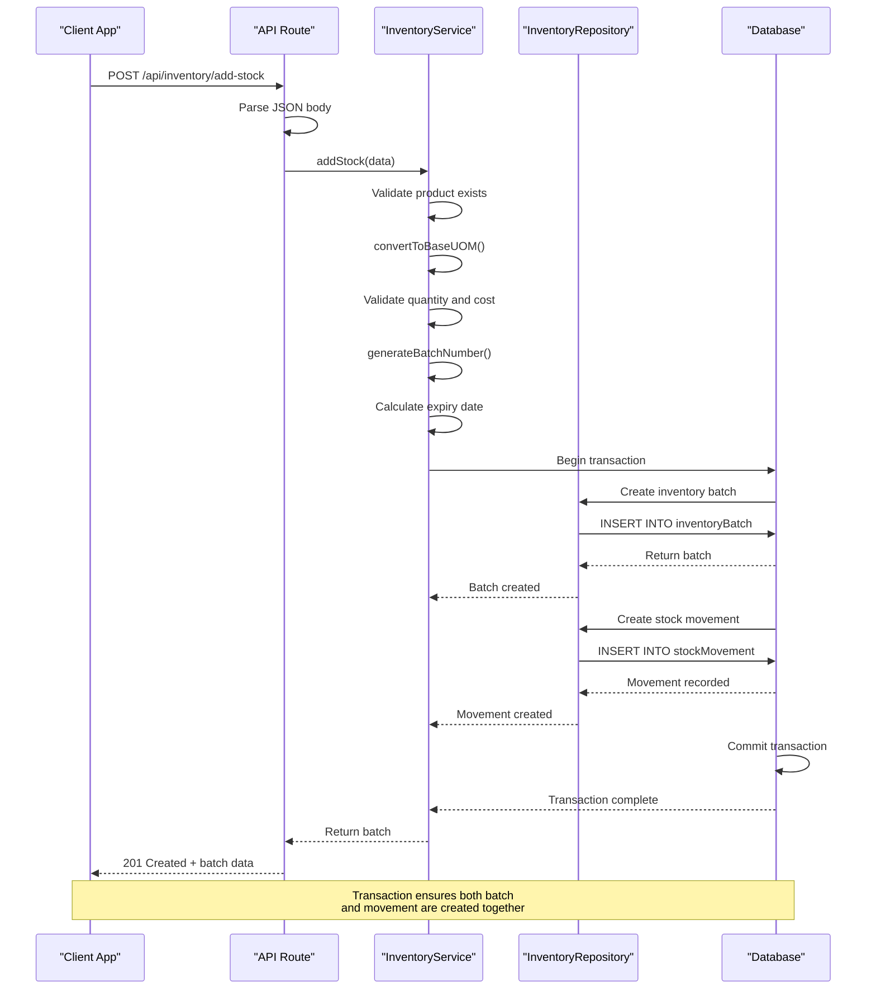

# Add Stock

<cite>
**Referenced Files in This Document**   
- [route.ts](file://app/api/inventory/add-stock/route.ts)
- [inventory.types.ts](file://types/inventory.types.ts)
- [inventory.service.ts](file://services/inventory.service.ts)
- [inventory.repository.ts](file://repositories/inventory.repository.ts)
- [inventory.validation.ts](file://lib/validations/inventory.validation.ts)
</cite>

## Table of Contents
1. [Introduction](#introduction)
2. [API Endpoint](#api-endpoint)
3. [Request Body Schema](#request-body-schema)
4. [Response](#response)
5. [Processing Logic](#processing-logic)
6. [UOM Conversion](#uom-conversion)
7. [Batch Number Generation](#batch-number-generation)
8. [Expiry Date Calculation](#expiry-date-calculation)
9. [Average Costing](#average-costing)
10. [Transactional Integrity](#transactional-integrity)
11. [Usage Examples](#usage-examples)
12. [Validation Errors](#validation-errors)
13. [Sequence Diagram](#sequence-diagram)

## Introduction
The POST `/api/inventory/add-stock` endpoint enables the addition of new stock to inventory by creating an inventory batch and recording the corresponding stock movement. This document details the endpoint's functionality, including unit of measure (UOM) conversion, batch number generation, expiry date calculation, average costing, and transactional integrity.

## API Endpoint
The endpoint accepts an HTTP POST request to add stock to inventory.

**Method**: `POST`  
**Path**: `/api/inventory/add-stock`  
**Authentication**: Required (not shown in code)  
**Content-Type**: `application/json`

**Section sources**
- [route.ts](file://app/api/inventory/add-stock/route.ts#L7-L37)

## Request Body Schema
The request body must conform to the `AddStockInput` interface defined in the inventory types.

| Field | Type | Required | Description |
|-------|------|----------|-------------|
| `productId` | string | Yes | UUID of the product being added |
| `warehouseId` | string | Yes | UUID of the warehouse receiving stock |
| `quantity` | number | Yes | Quantity of items to add (must be > 0) |
| `uom` | string | Yes | Unit of measure (e.g., "each", "box") |
| `unitCost` | number | Yes | Cost per unit (must be > 0) |
| `reason` | string | No | Reason for stock addition |
| `referenceId` | string | No | ID of the related document (e.g., PO ID) |
| `referenceType` | "PO" \| "SO" \| "POS" | No | Type of reference document |

**Section sources**
- [inventory.types.ts](file://types/inventory.types.ts#L26-L35)
- [inventory.validation.ts](file://lib/validations/inventory.validation.ts#L3-L19)

## Response
On successful stock addition, the server returns a `201 Created` status with the new inventory batch data.

**Status**: `201 Created`  
**Body**:
```json
{
  "success": true,
  "data": { /* new batch object */ },
  "message": "Stock added successfully"
}
```

The `data` field contains the newly created `InventoryBatch` record with all its properties.

**Section sources**
- [route.ts](file://app/api/inventory/add-stock/route.ts#L18-L21)

## Processing Logic
When a request is received, the system performs the following steps:
1. Parses the JSON request body
2. Validates input data
3. Converts quantity to base UOM
4. Generates a unique batch number
5. Calculates expiry date based on product shelf life
6. Creates inventory batch and stock movement records in a single transaction

**Section sources**
- [inventory.service.ts](file://services/inventory.service.ts#L115-L179)

## UOM Conversion
The system automatically converts quantities from any UOM to the product's base UOM using conversion factors defined in the product configuration.

- If the provided UOM matches the product's base UOM, the quantity is used as-is
- If the UOM is an alternate UOM, the quantity is multiplied by the conversion factor to get base units
- Invalid UOMs result in a validation error

**Section sources**
- [inventory.service.ts](file://services/inventory.service.ts#L76-L101)

## Batch Number Generation
The system generates unique batch numbers using the format: `BATCH-YYYYMMDD-XXXX`

- `YYYYMMDD`: Current date in ISO format (e.g., 20251113)
- `XXXX`: Sequential number padded to 4 digits (e.g., 0001, 0002)

The sequence resets daily and is determined by querying the last batch created on the same day.

**Section sources**
- [inventory.service.ts](file://services/inventory.service.ts#L21-L44)

## Expiry Date Calculation
The expiry date is calculated based on the product's shelf life:

- **Received Date**: Current date/time when the stock is added
- **Expiry Date**: Received date + product's `shelfLifeDays`

For example, if a product has a shelf life of 365 days and is received on 2025-11-13, the expiry date will be set to 2026-11-13.

**Section sources**
- [inventory.service.ts](file://services/inventory.service.ts#L143-L147)

## Average Costing
The system maintains weighted average costing at the product-warehouse level. When new stock is added, the average cost is recalculated for future transactions using the formula:

```
Weighted Average Cost = (Σ quantity × unitCost) / (Σ quantity)
```

This calculation is performed across all active batches of the product in the warehouse.

**Section sources**
- [inventory.service.ts](file://services/inventory.service.ts#L50-L71)

## Transactional Integrity
The creation of inventory batches and stock movement records is performed within a database transaction to ensure data consistency.

The transaction includes:
1. Creating a new `InventoryBatch` record with status "active"
2. Creating a corresponding `StockMovement` record with type "IN"

If either operation fails, the entire transaction is rolled back, preventing partial updates.

**Section sources**
- [inventory.service.ts](file://services/inventory.service.ts#L149-L177)
- [inventory.repository.ts](file://repositories/inventory.repository.ts#L111-L124)

## Usage Examples
### Example 1: Receiving Purchase Order
```json
{
  "productId": "a1b2c3d4-e5f6-7890-g1h2-i3j4k5l6m7n8",
  "warehouseId": "w1x2y3z4-a5b6-c7d8-e9f0-g1h2i3j4k5l6",
  "quantity": 10,
  "uom": "box",
  "unitCost": 25.50,
  "reason": "Received purchase order",
  "referenceId": "PO-2025-001",
  "referenceType": "PO"
}
```

### Example 2: Manual Stock Adjustment
```json
{
  "productId": "a1b2c3d4-e5f6-7890-g1h2-i3j4k5l6m7n8",
  "warehouseId": "w1x2y3z4-a5b6-c7d8-e9f0-g1h2i3j4k5l6",
  "quantity": 50,
  "uom": "each",
  "unitCost": 2.75,
  "reason": "Physical inventory adjustment",
  "referenceType": "ADJUSTMENT"
}
```

**Section sources**
- [inventory.types.ts](file://types/inventory.types.ts#L26-L35)
- [inventory.service.ts](file://services/inventory.service.ts#L115-L179)

## Validation Errors
The endpoint returns specific validation errors for invalid inputs:

| Error | Status | Response Body |
|-------|--------|---------------|
| Invalid quantity (≤ 0) | 400 | `{ "error": "Quantity must be greater than zero", "fields": { "quantity": "Invalid quantity" } }` |
| Invalid unit cost (≤ 0) | 400 | `{ "error": "Unit cost must be greater than zero", "fields": { "unitCost": "Invalid unit cost" } }` |
| Invalid UOM | 400 | `{ "error": "UOM 'xyz' not found for product Product Name", "fields": { "uom": "Invalid UOM for this product" } }` |
| Invalid product ID | 400 | Standard UUID validation error |
| Invalid warehouse ID | 400 | Standard UUID validation error |

**Section sources**
- [inventory.service.ts](file://services/inventory.service.ts#L127-L138)
- [inventory.validation.ts](file://lib/validations/inventory.validation.ts#L3-L19)

## Sequence Diagram
The following diagram illustrates the flow of the add stock operation:



**Diagram sources**
- [route.ts](file://app/api/inventory/add-stock/route.ts#L7-L37)
- [inventory.service.ts](file://services/inventory.service.ts#L115-L179)
- [inventory.repository.ts](file://repositories/inventory.repository.ts#L111-L124)