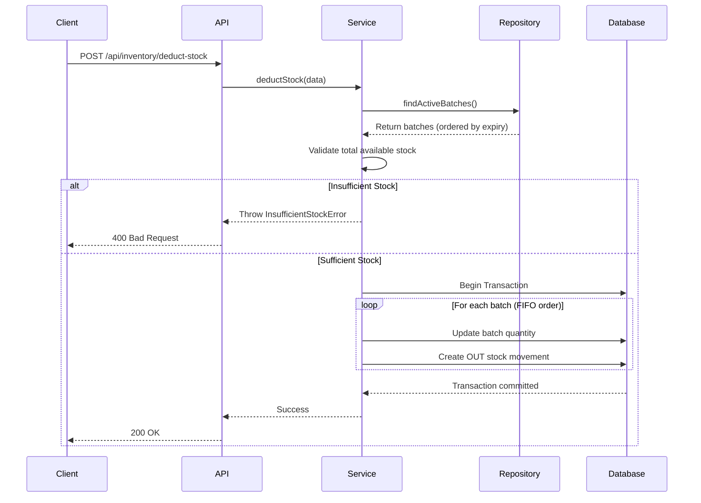
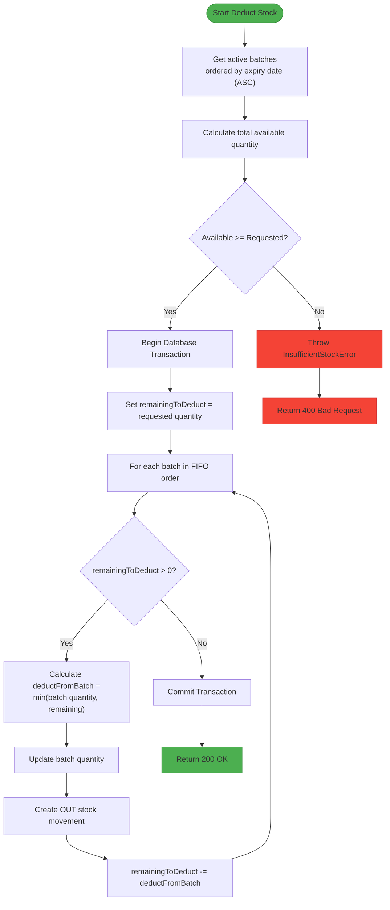

# Deduct Stock

<cite>
**Referenced Files in This Document**   
- [deduct-stock/route.ts](file://app/api/inventory/deduct-stock/route.ts)
- [inventory.types.ts](file://types/inventory.types.ts)
- [inventory.service.ts](file://services/inventory.service.ts)
- [inventory.repository.ts](file://repositories/inventory.repository.ts)
- [errors.ts](file://lib/errors.ts)
</cite>

## Table of Contents
1. [Introduction](#introduction)
2. [Endpoint Overview](#endpoint-overview)
3. [Request Schema](#request-schema)
4. [Response Format](#response-format)
5. [FIFO Stock Deduction Logic](#fifo-stock-deduction-logic)
6. [Stock Validation and Error Handling](#stock-validation-and-error-handling)
7. [Transactional Data Updates](#transactional-data-updates)
8. [Usage Examples](#usage-examples)
9. [Error Scenarios](#error-scenarios)

## Introduction
This document provides comprehensive API documentation for the `POST /api/inventory/deduct-stock` endpoint, which enables the removal of inventory stock based on specified criteria. The endpoint implements a FIFO (First In, First Out) strategy prioritizing batches with the earliest expiry dates. It ensures data consistency through transactional updates and validates stock availability before processing deductions. This functionality supports critical business operations such as sales fulfillment and waste management.

## Endpoint Overview
The `POST /api/inventory/deduct-stock` endpoint deducts a specified quantity of stock from inventory while adhering to FIFO principles based on batch expiry dates. The operation is atomic and performed within a database transaction to maintain data integrity.



**Diagram sources**
- [deduct-stock/route.ts](file://app/api/inventory/deduct-stock/route.ts#L7-L33)
- [inventory.service.ts](file://services/inventory.service.ts#L185-L258)
- [inventory.repository.ts](file://repositories/inventory.repository.ts#L96-L109)

**Section sources**
- [deduct-stock/route.ts](file://app/api/inventory/deduct-stock/route.ts#L7-L33)

## Request Schema
The request body must conform to the `DeductStockInput` interface defined in the system types. All required fields must be provided, and unit of measure (UOM) must be valid for the product.

| Field | Type | Required | Description |
|-------|------|----------|-------------|
| productId | string | Yes | Unique identifier of the product |
| warehouseId | string | Yes | Unique identifier of the warehouse |
| quantity | number | Yes | Quantity to deduct (in specified UOM) |
| uom | string | Yes | Unit of measure (must match product's base or alternate UOM) |
| reason | string | No | Description of the deduction purpose |
| referenceId | string | No | External reference ID (e.g., order ID) |
| referenceType | ReferenceType | No | Type of reference (PO, SO, POS) |

**Section sources**
- [inventory.types.ts](file://types/inventory.types.ts#L37-L45)

## Response Format
On successful deduction, the endpoint returns a 200 OK response with a success confirmation message.

```json
{
  "success": true,
  "message": "Stock deducted successfully"
}
```

**Section sources**
- [deduct-stock/route.ts](file://app/api/inventory/deduct-stock/route.ts#L13-L16)

## FIFO Stock Deduction Logic
The system implements FIFO (First In, First Out) logic by prioritizing inventory batches with the earliest expiry dates. When deducting stock, the service retrieves all active batches for the specified product and warehouse, sorted in ascending order by expiry date.



**Diagram sources**
- [inventory.service.ts](file://services/inventory.service.ts#L203-L258)
- [inventory.repository.ts](file://repositories/inventory.repository.ts#L96-L109)

**Section sources**
- [inventory.service.ts](file://services/inventory.service.ts#L203-L258)

## Stock Validation and Error Handling
Before processing the deduction, the system validates that sufficient stock is available across all active batches. If the total available quantity is less than the requested amount, an `InsufficientStockError` is thrown.

```mermaid
classDiagram
class AppError {
+message : string
+statusCode : number
+code? : string
}
class InsufficientStockError {
+productName : string
+available : number
+requested : number
}
AppError <|-- ValidationError
AppError <|-- NotFoundError
AppError <|-- InsufficientStockError
note right of InsufficientStockError
Thrown when available stock is
insufficient for requested deduction
statusCode : 400
code : INSUFFICIENT_STOCK
end note
```

**Diagram sources**
- [errors.ts](file://lib/errors.ts#L24-L32)
- [inventory.service.ts](file://services/inventory.service.ts#L215-L221)

**Section sources**
- [errors.ts](file://lib/errors.ts#L24-L32)
- [inventory.service.ts](file://services/inventory.service.ts#L215-L221)

## Transactional Data Updates
The stock deduction process is executed within a database transaction to ensure atomicity. For each batch involved in the deduction:
- The batch quantity is updated
- If the quantity reaches zero, the batch status is set to 'depleted'
- A corresponding OUT-type stock movement record is created

This transactional approach guarantees that either all updates succeed or none are applied, maintaining inventory data consistency.

**Section sources**
- [inventory.service.ts](file://services/inventory.service.ts#L224-L257)

## Usage Examples
### Sales Fulfillment
When fulfilling a sales order, the system deducts the sold quantity from inventory using FIFO logic to minimize expiry risks.

### Waste Management
For expired or damaged goods, warehouse staff can deduct stock with a reason such as "spoilage" or "damage", ensuring accurate inventory records.

**Section sources**
- [inventory.service.ts](file://services/inventory.service.ts#L249-L251)

## Error Scenarios
The endpoint handles several error conditions:
- **InsufficientStockError**: When available inventory is less than requested quantity
- **ValidationError**: When input data is invalid (e.g., negative quantity, invalid UOM)
- **500 Internal Server Error**: For unexpected server-side failures

The error handling middleware ensures appropriate HTTP status codes and error messages are returned to the client.

**Section sources**
- [deduct-stock/route.ts](file://app/api/inventory/deduct-stock/route.ts#L17-L30)
- [errors.ts](file://lib/errors.ts#L1-L32)