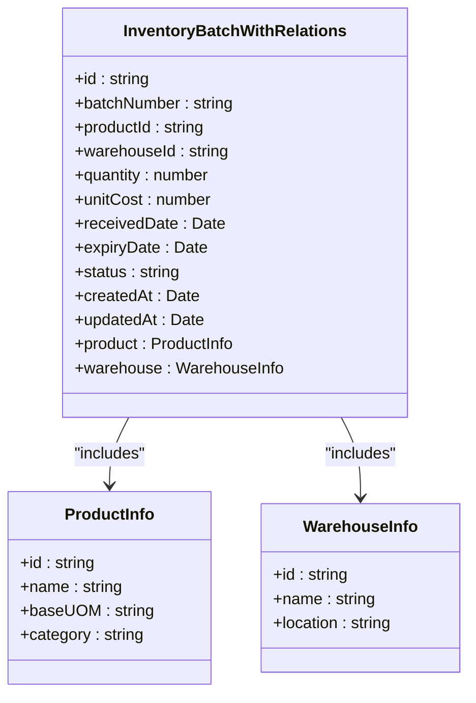
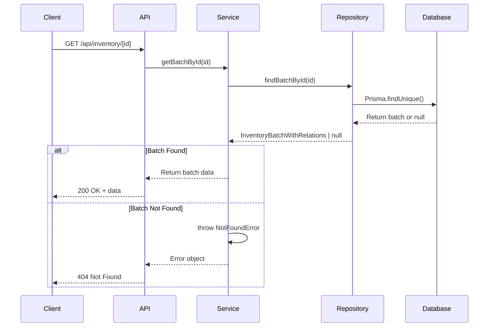
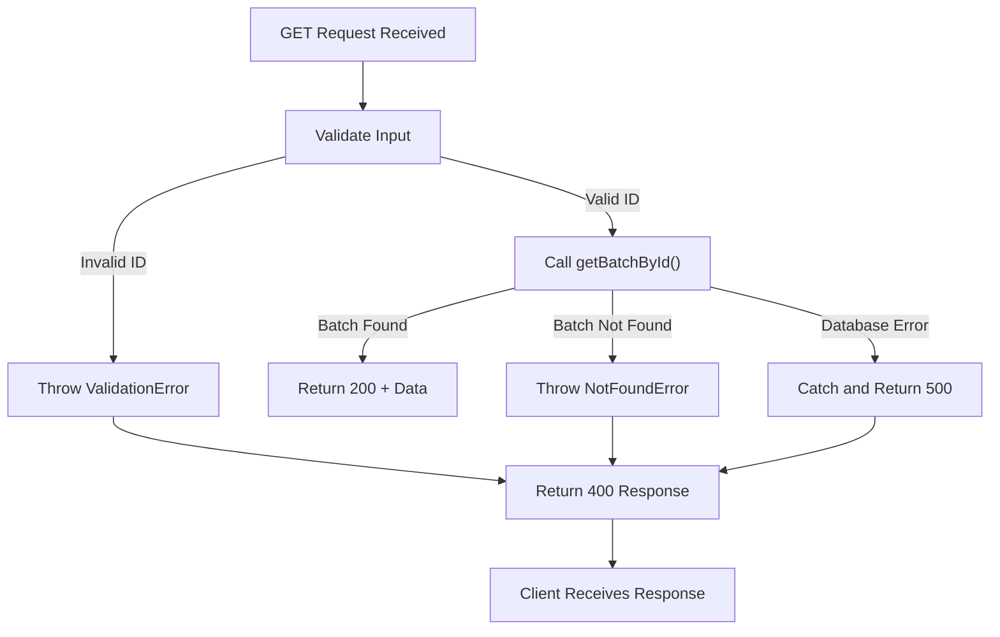

# Get Single Inventory Batch

<cite>
**Referenced Files in This Document**   
- [app/api/inventory/[id]/route.ts](file://app/api/inventory/[id]/route.ts)
- [services/inventory.service.ts](file://services/inventory.service.ts)
- [repositories/inventory.repository.ts](file://repositories/inventory.repository.ts)
- [types/inventory.types.ts](file://types/inventory.types.ts)
- [lib/errors.ts](file://lib/errors.ts)
</cite>

## Table of Contents
1. [Introduction](#introduction)
2. [Endpoint Overview](#endpoint-overview)
3. [Request Details](#request-details)
4. [Response Structure](#response-structure)
5. [Service Layer Implementation](#service-layer-implementation)
6. [Data Model Definition](#data-model-definition)
7. [Error Handling](#error-handling)
8. [Usage Examples](#usage-examples)
9. [Troubleshooting](#troubleshooting)

## Introduction
This document provides comprehensive API documentation for the `GET /api/inventory/[id]` endpoint, which retrieves a specific inventory batch by its unique identifier. The endpoint is part of an inventory management system that tracks product batches across warehouses with support for product and warehouse relationships. The documentation covers the complete request-response flow, data structures, service implementation, and error handling mechanisms.

## Endpoint Overview
The `GET /api/inventory/[id]` endpoint retrieves a single inventory batch record with its associated product and warehouse information. This endpoint follows RESTful principles and uses Next.js route handlers for server-side processing.

```mermaid
flowchart TD
Client["Client Application"] --> |GET /api/inventory/[id]| API["API Route Handler"]
API --> |params.id| Service["InventoryService.getBatchById()"]
Service --> |id| Repository["InventoryRepository.findBatchById()"]
Repository --> |Prisma Query| Database[(Database)]
Database --> |Batch with Relations| Repository
Repository --> |InventoryBatchWithRelations| Service
Service --> |Return Data| API
API --> |JSON Response| Client
```

**Diagram sources**
- [app/api/inventory/[id]/route.ts](file://app/api/inventory/[id]/route.ts#L5-L27)
- [services/inventory.service.ts](file://services/inventory.service.ts#L395-L401)
- [repositories/inventory.repository.ts](file://repositories/inventory.repository.ts#L67-L87)

**Section sources**
- [app/api/inventory/[id]/route.ts](file://app/api/inventory/[id]/route.ts#L5-L27)

## Request Details
The endpoint accepts an HTTP GET request with a route parameter specifying the inventory batch ID.

### HTTP Method
- **Method**: GET

### Route Parameter
- **Parameter**: `id`
- **Location**: URL path segment
- **Type**: string (UUID format)
- **Required**: Yes
- **Description**: Unique identifier of the inventory batch to retrieve

### Request Example
```
GET /api/inventory/cb6ab6f1-8b2e-4a8d-9f3a-1c4e5f6a7b8c
```

**Section sources**
- [app/api/inventory/[id]/route.ts](file://app/api/inventory/[id]/route.ts#L8-L9)

## Response Structure
The endpoint returns a JSON response containing the inventory batch data with related product and warehouse information.

### Response Format
```json
{
  "success": boolean,
  "data": InventoryBatchWithRelations
}
```

### InventoryBatchWithRelations Type
The response payload is defined by the `InventoryBatchWithRelations` type, which extends the base `InventoryBatch` with related entities:



**Diagram sources**
- [types/inventory.types.ts](file://types/inventory.types.ts#L84-L95)

**Section sources**
- [types/inventory.types.ts](file://types/inventory.types.ts#L84-L95)

## Service Layer Implementation
The service layer handles the business logic for retrieving inventory batches, including existence validation and error handling.

### Batch Retrieval Process
1. The `inventoryService.getBatchById()` method is called with the provided ID
2. The repository is queried to find the batch with related entities
3. If the batch is not found, a `NotFoundError` is thrown
4. The found batch is returned to the API handler



**Diagram sources**
- [services/inventory.service.ts](file://services/inventory.service.ts#L395-L400)
- [repositories/inventory.repository.ts](file://repositories/inventory.repository.ts#L67-L87)

**Section sources**
- [services/inventory.service.ts](file://services/inventory.service.ts#L395-L401)

## Data Model Definition
The `InventoryBatchWithRelations` type defines the structure of the response payload, combining the inventory batch data with related product and warehouse information.

### Type Definition
The type is defined as an intersection type that extends the Prisma-generated `InventoryBatch` model with additional related entities:

- **Product Information**: Includes product ID, name, base unit of measure, and category
- **Warehouse Information**: Includes warehouse ID, name, and location

This structure is achieved through Prisma's `include` feature, which automatically populates related records in the query result.

**Section sources**
- [types/inventory.types.ts](file://types/inventory.types.ts#L84-L95)
- [repositories/inventory.repository.ts](file://repositories/inventory.repository.ts#L67-L87)

## Error Handling
The endpoint implements comprehensive error handling to provide meaningful feedback for various failure scenarios.

### Error Scenarios
| Error Type | Status Code | Error Code | Response Body |
|-----------|------------|------------|---------------|
| Batch Not Found | 404 | NOT_FOUND | `{ success: false, error: "Inventory batch not found" }` |
| Invalid UUID Format | 400 | VALIDATION_ERROR | `{ success: false, error: "Invalid ID format" }` |
| Database Connectivity | 500 | Internal Server Error | `{ success: false, error: "Failed to fetch inventory batch" }` |

### Error Handling Flow


**Section sources**
- [services/inventory.service.ts](file://services/inventory.service.ts#L397-L399)
- [lib/errors.ts](file://lib/errors.ts#L18-L21)
- [app/api/inventory/[id]/route.ts](file://app/api/inventory/[id]/route.ts#L16-L25)

## Usage Examples
### Viewing Batch Details
To retrieve details of a specific inventory batch:

```bash
curl -X GET "http://localhost:3000/api/inventory/cb6ab6f1-8b2e-4a8d-9f3a-1c4e5f6a7b8c" \
  -H "Content-Type: application/json"
```

Successful response:
```json
{
  "success": true,
  "data": {
    "id": "cb6ab6f1-8b2e-4a8d-9f3a-1c4e5f6a7b8c",
    "batchNumber": "BATCH-20250115-0001",
    "productId": "a1b2c3d4-5e6f-7g8h-9i10-11j12k13l14m",
    "warehouseId": "w1x2y3z4-5a6b-7c8d-9e10-11f12g13h14i",
    "quantity": 100,
    "unitCost": 25.5,
    "receivedDate": "2025-01-15T10:30:00Z",
    "expiryDate": "2026-01-15T10:30:00Z",
    "status": "active",
    "createdAt": "2025-01-15T10:30:00Z",
    "updatedAt": "2025-01-15T10:30:00Z",
    "product": {
      "id": "a1b2c3d4-5e6f-7g8h-9i10-11j12k13l14m",
      "name": "Premium Coffee Beans",
      "baseUOM": "kg",
      "category": "Beverages"
    },
    "warehouse": {
      "id": "w1x2y3z4-5a6b-7c8d-9e10-11f12g13h14i",
      "name": "Central Warehouse",
      "location": "123 Main St, City, State"
    }
  }
}
```

**Section sources**
- [app/api/inventory/[id]/route.ts](file://app/api/inventory/[id]/route.ts#L11-L12)

## Troubleshooting
### Invalid ID Troubleshooting
When an invalid or non-existent batch ID is provided, the endpoint returns a 404 Not Found response:

```bash
curl -X GET "http://localhost:3000/api/inventory/invalid-id" \
  -H "Content-Type: application/json"
```

Response:
```json
{
  "success": false,
  "error": "Inventory batch not found"
}
```

### Common Issues and Solutions
| Issue | Cause | Solution |
|------|------|----------|
| 404 Not Found | Batch ID does not exist | Verify the batch ID is correct and the batch exists in the system |
| 400 Bad Request | Invalid UUID format | Ensure the ID follows UUID format (xxxxxxxx-xxxx-xxxx-xxxx-xxxxxxxxxxxx) |
| 500 Internal Server Error | Database connectivity issues | Check database connection and server logs for more details |
| Empty Response | Network connectivity problems | Verify network connection and retry the request |

**Section sources**
- [services/inventory.service.ts](file://services/inventory.service.ts#L397-L399)
- [lib/errors.ts](file://lib/errors.ts#L18-L21)
- [app/api/inventory/[id]/route.ts](file://app/api/inventory/[id]/route.ts#L16-L25)