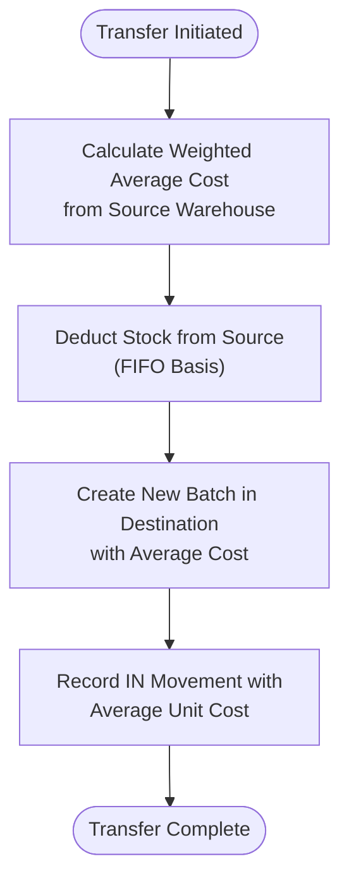

# Inventory API

<cite>
**Referenced Files in This Document**   
- [add-stock/route.ts](file://app/api/inventory/add-stock/route.ts)
- [deduct-stock/route.ts](file://app/api/inventory/deduct-stock/route.ts)
- [transfer/route.ts](file://app/api/inventory/transfer/route.ts)
- [movements/route.ts](file://app/api/inventory/movements/route.ts)
- [inventory.service.ts](file://services/inventory.service.ts)
- [inventory.types.ts](file://types/inventory.types.ts)
- [inventory.repository.ts](file://repositories/inventory.repository.ts)
</cite>

## Table of Contents
1. [Introduction](#introduction)
2. [API Endpoints](#api-endpoints)
3. [Stock Management Operations](#stock-management-operations)
4. [Batch Tracking and Expiry Management](#batch-tracking-and-expiry-management)
5. [Average Costing Logic](#average-costing-logic)
6. [Inventory Movements](#inventory-movements)
7. [Data Validation and Error Handling](#data-validation-and-error-handling)
8. [Integration with Warehouse and Product Systems](#integration-with-warehouse-and-product-systems)
9. [Usage Examples](#usage-examples)
10. [Conclusion](#conclusion)

## Introduction
The Inventory API provides a comprehensive system for managing stock across multiple warehouses with full traceability, cost tracking, and expiry management. It supports core operations such as adding stock, deducting stock, and transferring between warehouses, all while maintaining accurate inventory levels and financial costing. The system implements FIFO (First In, First Out) logic for stock deductions and uses weighted average costing to maintain accurate inventory valuation during transfers.

**Section sources**
- [inventory.service.ts](file://services/inventory.service.ts#L1-L504)

## API Endpoints

### Add Stock Endpoint
- **Method**: POST
- **Path**: `/api/inventory/add-stock`
- **Request Body**: `AddStockInput` type
- **Response**: Created batch object with success message
- **Status Codes**: 201 (Created), 400 (Validation Error), 500 (Server Error)

### Deduct Stock Endpoint
- **Method**: POST
- **Path**: `/api/inventory/deduct-stock`
- **Request Body**: `DeductStockInput` type
- **Response**: Success confirmation message
- **Status Codes**: 200 (OK), 400 (Validation/Insufficient Stock), 500 (Server Error)

### Transfer Stock Endpoint
- **Method**: POST
- **Path**: `/api/inventory/transfer`
- **Request Body**: `TransferStockInput` type
- **Response**: Success confirmation message
- **Status Codes**: 200 (OK), 400 (Validation/Insufficient Stock), 500 (Server Error)

### Movements Query Endpoint
- **Method**: GET
- **Path**: `/api/inventory/movements`
- **Query Parameters**: `productId`, `warehouseId`, `type`, `referenceType`, `dateFrom`, `dateTo`
- **Response**: Array of stock movement records
- **Status Codes**: 200 (OK), 500 (Server Error)

**Section sources**
- [add-stock/route.ts](file://app/api/inventory/add-stock/route.ts#L1-L38)
- [deduct-stock/route.ts](file://app/api/inventory/deduct-stock/route.ts#L1-L33)
- [transfer/route.ts](file://app/api/inventory/transfer/route.ts#L1-L33)
- [movements/route.ts](file://app/api/inventory/movements/route.ts#L1-L42)

## Stock Management Operations

### Add Stock Operation
The add-stock operation creates a new inventory batch with generated batch number, calculates expiry date based on product shelf life, and records the incoming movement. All quantities are converted to base UOM before storage.

### Deduct Stock Operation
Stock deduction follows FIFO (First Expiry, First Out) principle, automatically selecting batches with earliest expiry dates first. The system validates sufficient stock availability before processing.

### Transfer Between Warehouses
Transfers involve deducting stock from the source warehouse using FIFO logic and creating a new batch in the destination warehouse with weighted average cost from the source.


**Diagram sources**
- [add-stock/route.ts](file://app/api/inventory/add-stock/route.ts#L7-L38)
- [inventory.service.ts](file://services/inventory.service.ts#L115-L180)

**Section sources**
- [inventory.service.ts](file://services/inventory.service.ts#L115-L383)

## Batch Tracking and Expiry Management

### Batch Number Generation
Batches are assigned unique identifiers in the format `BATCH-YYYYMMDD-XXXX`, ensuring chronological traceability and preventing duplicates.

### Expiry Date Calculation
Expiry dates are automatically calculated based on product shelf life:
```
Expiry Date = Received Date + Product.shelfLifeDays
```

### Expiry Monitoring
The system provides methods to:
- Identify expired batches (`getExpiredBatches`)
- Find batches expiring within a timeframe (`getExpiringBatches`)
- Automatically mark expired batches via scheduled jobs


**Diagram sources**
- [inventory.service.ts](file://services/inventory.service.ts#L151-L162)
- [inventory.service.ts](file://services/inventory.service.ts#L167-L174)

**Section sources**
- [inventory.service.ts](file://services/inventory.service.ts#L141-L160)
- [inventory.service.ts](file://services/inventory.service.ts#L468-L499)

## Average Costing Logic

### Weighted Average Cost Calculation
The system uses weighted average costing for inventory valuation:
```
Weighted Average Cost = Σ(Quantity × Unit Cost) / Σ(Quantity)
```

### Cost Propagation in Transfers
When transferring stock between warehouses:
1. Calculate weighted average cost of source warehouse
2. Apply this cost to the new batch in destination warehouse
3. Maintain consistent valuation across locations



**Diagram sources**
- [inventory.service.ts](file://services/inventory.service.ts#L50-L71)
- [inventory.service.ts](file://services/inventory.service.ts#L309-L313)

**Section sources**
- [inventory.service.ts](file://services/inventory.service.ts#L50-L71)
- [inventory.service.ts](file://services/inventory.service.ts#L308-L382)

## Inventory Movements

### Movement Recording
Every stock change creates a movement record with:
- Type (IN/OUT)
- Quantity
- Reason
- Reference (PO, SO, Transfer, etc.)
- Timestamp

### Movement Querying
The `/movements` endpoint supports filtering by:
- Product ID
- Warehouse ID
- Movement type
- Reference type
- Date range


**Diagram sources**
- [movements/route.ts](file://app/api/inventory/movements/route.ts#L7-L42)
- [inventory.service.ts](file://services/inventory.service.ts#L406-L408)

**Section sources**
- [movements/route.ts](file://app/api/inventory/movements/route.ts#L7-L42)
- [inventory.service.ts](file://services/inventory.service.ts#L404-L408)

## Data Validation and Error Handling

### Input Validation
All operations validate:
- Positive quantities
- Valid product and warehouse references
- Correct UOM (Unit of Measure) for products
- Different source/destination warehouses for transfers

### Error Types
- `ValidationError`: Invalid input data
- `NotFoundError`: Resource not found
- `InsufficientStockError`: Not enough stock for deduction/transfer

### Error Response Structure
```json
{
  "success": false,
  "error": "Error message",
  "fields": { "fieldName": "Field error message" }
}
```

**Section sources**
- [inventory.service.ts](file://services/inventory.service.ts#L127-L138)
- [inventory.service.ts](file://services/inventory.service.ts#L197-L201)
- [inventory.service.ts](file://services/inventory.service.ts#L282-L286)
- [inventory.service.ts](file://services/inventory.service.ts#L264-L269)

## Integration with Warehouse and Product Systems

### Product Integration
- Validates product existence before operations
- Uses product shelf life for expiry calculation
- Converts between UOMs based on product configuration
- Retrieves base UOM information

### Warehouse Integration
- Validates warehouse existence
- Checks capacity constraints (via warehouse service)
- Maintains per-warehouse stock levels
- Supports multi-warehouse transfers

**Section sources**
- [inventory.service.ts](file://services/inventory.service.ts#L117-L118)
- [inventory.service.ts](file://services/inventory.service.ts#L144-L147)
- [inventory.service.ts](file://services/inventory.service.ts#L435-L438)

## Usage Examples

### Receiving Stock from Purchase Order
```typescript
// Add stock received from purchase order
const result = await fetch('/api/inventory/add-stock', {
  method: 'POST',
  body: JSON.stringify({
    productId: 'prod-001',
    warehouseId: 'wh-001',
    quantity: 100,
    uom: 'BOX',
    unitCost: 25.50,
    referenceId: 'PO-2024-001',
    referenceType: 'PURCHASE_ORDER',
    reason: 'Received purchase order'
  })
});
```

### Transferring Items Between Branches
```typescript
// Transfer stock between warehouses
await fetch('/api/inventory/transfer', {
  method: 'POST',
  body: JSON.stringify({
    productId: 'prod-001',
    sourceWarehouseId: 'wh-001',
    destinationWarehouseId: 'wh-002',
    quantity: 25,
    uom: 'UNIT',
    reason: 'Branch stock redistribution'
  })
});
```

**Section sources**
- [add-stock/route.ts](file://app/api/inventory/add-stock/route.ts#L9-L16)
- [transfer/route.ts](file://app/api/inventory/transfer/route.ts#L9-L12)

## Conclusion
The Inventory API provides a robust, transaction-safe system for managing stock movements with comprehensive tracking, costing, and validation. By implementing FIFO logic, weighted average costing, and automatic expiry management, it ensures accurate inventory accounting and compliance with financial standards. The API's integration with product and warehouse systems enables seamless operations across the entire supply chain.