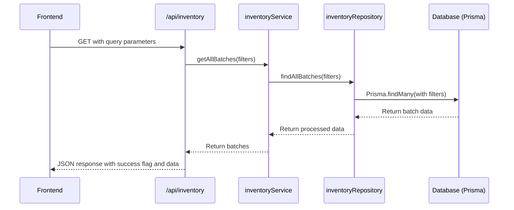
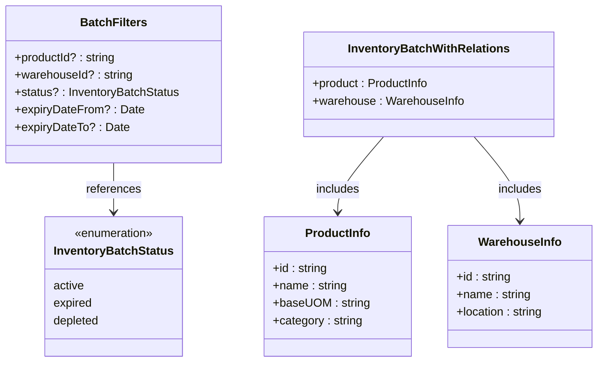
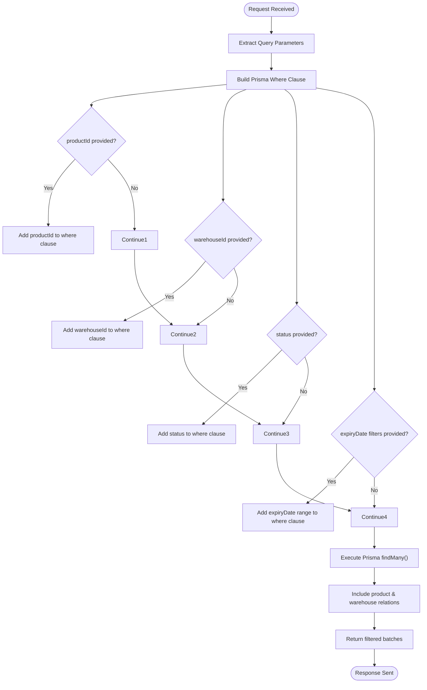
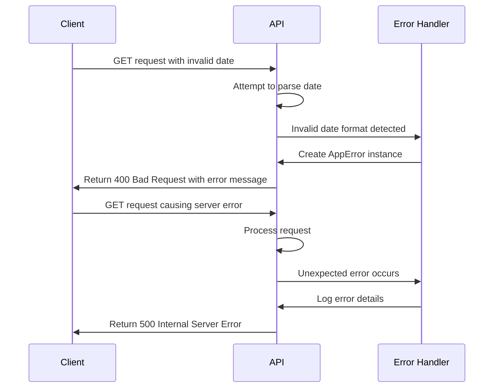
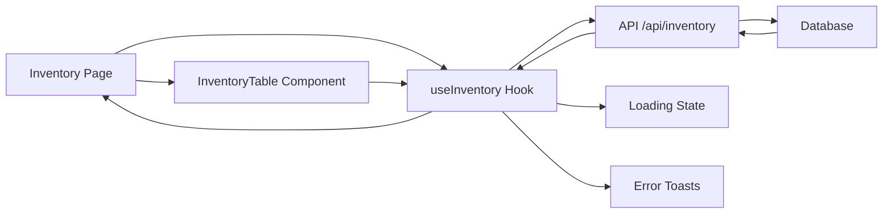
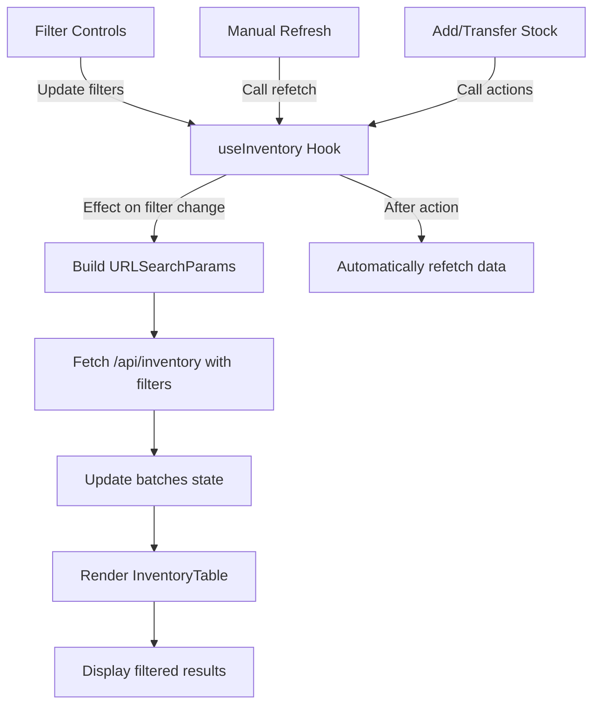

# List Inventory Batches

<cite>
**Referenced Files in This Document**   
- [app/api/inventory/route.ts](file://app/api/inventory/route.ts)
- [types/inventory.types.ts](file://types/inventory.types.ts)
- [repositories/inventory.repository.ts](file://repositories/inventory.repository.ts)
- [services/inventory.service.ts](file://services/inventory.service.ts)
- [hooks/use-inventory.ts](file://hooks/use-inventory.ts)
- [components/inventory/inventory-table.tsx](file://components/inventory/inventory-table.tsx)
</cite>

## Table of Contents
1. [Introduction](#introduction)
2. [API Endpoint Overview](#api-endpoint-overview)
3. [Query Parameters](#query-parameters)
4. [Response Structure](#response-structure)
5. [Filtering Logic and BatchFilters Interface](#filtering-logic-and-batchfilters-interface)
6. [Database Query Handling with Prisma](#database-query-handling-with-prisma)
7. [Example Requests](#example-requests)
8. [Error Handling](#error-handling)
9. [Frontend Integration](#frontend-integration)
10. [UI Filter Application](#ui-filter-application)

## Introduction
This document provides comprehensive API documentation for the `GET /api/inventory` endpoint, which retrieves all inventory batches with optional filtering capabilities. The endpoint supports filtering by product, warehouse, status, and expiry date range. It integrates with the frontend inventory page through a custom React hook and displays data using a structured table component. This documentation details the implementation of filtering logic, database interactions using Prisma ORM, error handling mechanisms, and integration with the user interface.

## API Endpoint Overview
The `GET /api/inventory` endpoint is responsible for retrieving a list of inventory batches with optional filtering parameters. It returns inventory data along with related product and warehouse information in a structured JSON format.



**Diagram sources**
- [app/api/inventory/route.ts](file://app/api/inventory/route.ts#L7-L41)
- [services/inventory.service.ts](file://services/inventory.service.ts#L388-L390)
- [repositories/inventory.repository.ts](file://repositories/inventory.repository.ts#L16-L65)

**Section sources**
- [app/api/inventory/route.ts](file://app/api/inventory/route.ts#L6-L41)

## Query Parameters
The endpoint accepts the following optional query parameters to filter inventory batches:

| Parameter | Type | Description | Example |
|---------|------|-------------|---------|
| productId | string | Filter by product ID | `?productId=prod_123` |
| warehouseId | string | Filter by warehouse ID | `?warehouseId=wh_456` |
| status | string | Filter by batch status (active, expired, depleted) | `?status=active` |
| expiryDateFrom | string (ISO date) | Include batches expiring on or after this date | `?expiryDateFrom=2025-01-01` |
| expiryDateTo | string (ISO date) | Include batches expiring on or before this date | `?expiryDateTo=2025-12-31` |

These parameters are extracted from the request URL and converted into a `BatchFilters` object that is passed to the service layer for processing.

**Section sources**
- [app/api/inventory/route.ts](file://app/api/inventory/route.ts#L11-L21)
- [types/inventory.types.ts](file://types/inventory.types.ts#L65-L71)

## Response Structure
The API returns a JSON response with the following structure:

```json
{
  "success": true,
  "data": [
    {
      "id": "string",
      "batchNumber": "string",
      "productId": "string",
      "warehouseId": "string",
      "quantity": "number",
      "unitCost": "number",
      "expiryDate": "string (ISO date)",
      "receivedDate": "string (ISO date)",
      "status": "active|expired|depleted",
      "createdAt": "string (ISO date)",
      "updatedAt": "string (ISO date)",
      "product": {
        "id": "string",
        "name": "string",
        "baseUOM": "string",
        "category": "string"
      },
      "warehouse": {
        "id": "string",
        "name": "string",
        "location": "string"
      }
    }
  ]
}
```

The response includes full inventory batch details with embedded product and warehouse relations as defined in the `InventoryBatchWithRelations` type.

**Section sources**
- [app/api/inventory/route.ts](file://app/api/inventory/route.ts#L24)
- [types/inventory.types.ts](file://types/inventory.types.ts#L84-L96)

## Filtering Logic and BatchFilters Interface
The filtering functionality is defined through the `BatchFilters` interface in `inventory.types.ts`, which specifies the optional filtering criteria that can be applied to inventory batch queries.



**Diagram sources**
- [types/inventory.types.ts](file://types/inventory.types.ts#L65-L96)

**Section sources**
- [types/inventory.types.ts](file://types/inventory.types.ts#L65-L71)

## Database Query Handling with Prisma
The inventory repository handles database queries using Prisma ORM to efficiently retrieve filtered inventory data. The `findAllBatches` method constructs a dynamic `where` clause based on the provided filters and executes a `findMany` operation with appropriate relations.



**Diagram sources**
- [repositories/inventory.repository.ts](file://repositories/inventory.repository.ts#L16-L65)

**Section sources**
- [repositories/inventory.repository.ts](file://repositories/inventory.repository.ts#L16-L65)
- [services/inventory.service.ts](file://services/inventory.service.ts#L388-L390)

## Example Requests
### Filtering by Expiration Date Range
Retrieve all inventory batches that expire between January 1, 2025, and December 31, 2025:

```
GET /api/inventory?expiryDateFrom=2025-01-01&expiryDateTo=2025-12-31
```

### Filtering by Warehouse
Retrieve all inventory batches from a specific warehouse:

```
GET /api/inventory?warehouseId=wh_001
```

### Combined Filtering
Retrieve active inventory batches for a specific product in a specific warehouse with expiry date filtering:

```
GET /api/inventory?productId=prod_123&warehouseId=wh_001&status=active&expiryDateFrom=2025-01-01&expiryDateTo=2025-06-30
```

**Section sources**
- [app/api/inventory/route.ts](file://app/api/inventory/route.ts#L11-L21)
- [hooks/use-inventory.ts](file://hooks/use-inventory.ts#L13-L20)

## Error Handling
The endpoint implements comprehensive error handling to manage various failure scenarios, including invalid date parameters and server errors.



When invalid date parameters are provided, the API catches the parsing error and returns a 400 Bad Request response. For other errors, it distinguishes between application-specific errors (AppError) and unexpected server errors, returning appropriate status codes and messages.

**Diagram sources**
- [app/api/inventory/route.ts](file://app/api/inventory/route.ts#L25-L38)

**Section sources**
- [app/api/inventory/route.ts](file://app/api/inventory/route.ts#L25-L38)
- [lib/errors.ts](file://lib/errors.ts)

## Frontend Integration
The inventory data is consumed by the frontend through a custom React hook (`useInventory`) that manages state, loading indicators, and data fetching.



The `useInventory` hook abstracts the API interaction and provides a clean interface for components to access inventory data, handle loading states, and display error messages through the toast notification system.

**Diagram sources**
- [hooks/use-inventory.ts](file://hooks/use-inventory.ts#L5-L43)
- [components/inventory/inventory-table.tsx](file://components/inventory/inventory-table.tsx#L32-L33)

**Section sources**
- [hooks/use-inventory.ts](file://hooks/use-inventory.ts#L5-L184)

## UI Filter Application
The inventory filtering functionality is integrated into the user interface through filter controls that update the hook's filter parameters, triggering automatic data refetching.



The UI components pass filter values to the `useInventory` hook, which automatically rebuilds the query parameters and fetches updated data whenever filters change. The `useEffect` dependency array ensures that the inventory is re-fetched whenever any filter parameter changes.

**Diagram sources**
- [hooks/use-inventory.ts](file://hooks/use-inventory.ts#L170-L171)
- [components/inventory/inventory-table.tsx](file://components/inventory/inventory-table.tsx#L32-L159)

**Section sources**
- [hooks/use-inventory.ts](file://hooks/use-inventory.ts#L169-L171)
- [components/inventory/inventory-table.tsx](file://components/inventory/inventory-table.tsx#L1-L159)