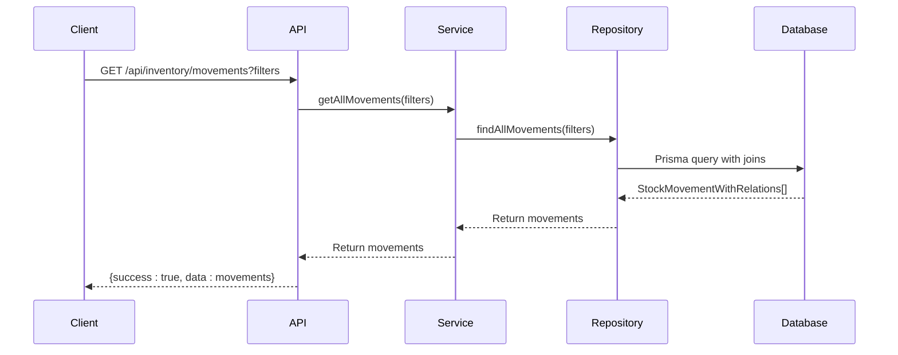
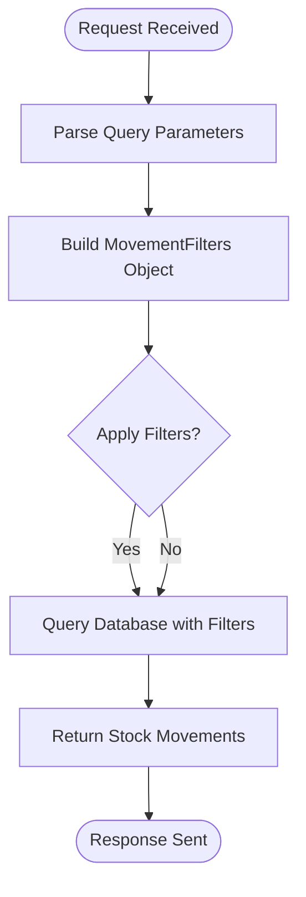
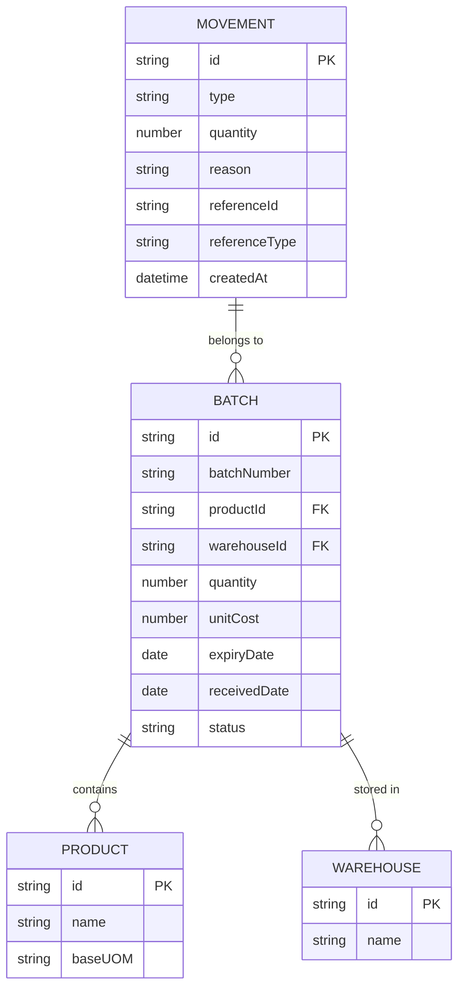
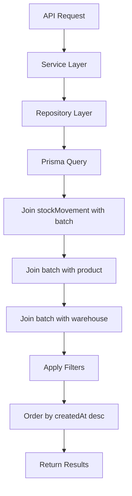
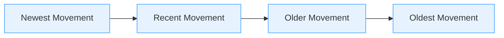

# Stock Movements

<cite>
**Referenced Files in This Document**   
- [route.ts](file://app/api/inventory/movements/route.ts)
- [inventory.repository.ts](file://repositories/inventory.repository.ts)
- [inventory.types.ts](file://types/inventory.types.ts)
- [inventory.service.ts](file://services/inventory.service.ts)
</cite>

## Table of Contents
1. [Introduction](#introduction)
2. [Endpoint Overview](#endpoint-overview)
3. [Query Parameters](#query-parameters)
4. [Response Structure](#response-structure)
5. [Filtering Capabilities](#filtering-capabilities)
6. [Data Retrieval and Joins](#data-retrieval-and-joins)
7. [Usage Examples](#usage-examples)
8. [Chronological Ordering](#chronological-ordering)

## Introduction
This document provides comprehensive API documentation for the `GET /api/inventory/movements` endpoint, which retrieves historical stock movement records with flexible filtering options. The endpoint enables clients to audit inventory changes, reconcile financial records, and analyze stock flow across different transaction types and reference systems. The implementation leverages Prisma ORM to join stock movement data with inventory batches, product details, and warehouse information.

**Section sources**
- [route.ts](file://app/api/inventory/movements/route.ts#L6-L42)

## Endpoint Overview
The `GET /api/inventory/movements` endpoint retrieves a collection of stock movement records based on optional query parameters. It supports filtering by product, warehouse, movement type, reference system, and date range. The response includes detailed information about each movement, including batch specifics, product attributes, and warehouse details.



**Diagram sources**
- [route.ts](file://app/api/inventory/movements/route.ts#L7-L25)
- [inventory.service.ts](file://services/inventory.service.ts#L405-L407)
- [inventory.repository.ts](file://repositories/inventory.repository.ts#L155-L217)

## Query Parameters
The endpoint accepts the following query parameters to filter stock movements:

| Parameter | Type | Description | Example |
|---------|------|-------------|---------|
| productId | string | Filter movements by product ID | ?productId=prod_123 |
| warehouseId | string | Filter movements by warehouse ID | ?warehouseId=wh_456 |
| type | string | Filter by movement type (IN, OUT, TRANSFER, ADJUSTMENT) | ?type=OUT |
| referenceType | string | Filter by reference system (PO, SO, POS) | ?referenceType=SO |
| dateFrom | string (ISO date) | Include movements from this date onward | ?dateFrom=2024-01-01 |
| dateTo | string (ISO date) | Include movements up to this date | ?dateTo=2024-12-31 |



**Diagram sources**
- [route.ts](file://app/api/inventory/movements/route.ts#L11-L22)
- [inventory.types.ts](file://types/inventory.types.ts#L72-L81)

**Section sources**
- [route.ts](file://app/api/inventory/movements/route.ts#L11-L22)
- [inventory.types.ts](file://types/inventory.types.ts#L72-L81)

## Response Structure
The endpoint returns an array of stock movement records, each containing comprehensive details about the movement, associated batch, product, and warehouse.

```mermaid
classDiagram
class StockMovementWithRelations {
+id : string
+batchId : string
+type : StockMovementType
+quantity : number
+reason : string
+referenceId : string
+referenceType : ReferenceType
+createdAt : Date
+batch : InventoryBatch & { product, warehouse }
}
class InventoryBatch {
+id : string
+batchNumber : string
+productId : string
+warehouseId : string
+quantity : number
+unitCost : number
+expiryDate : Date
+receivedDate : Date
+status : string
}
class Product {
+id : string
+name : string
+baseUOM : string
}
class Warehouse {
+id : string
+name : string
}
StockMovementWithRelations --> InventoryBatch : "has"
InventoryBatch --> Product : "references"
InventoryBatch --> Warehouse : "located in"
```

**Diagram sources**
- [inventory.types.ts](file://types/inventory.types.ts#L97-L109)
- [inventory.repository.ts](file://repositories/inventory.repository.ts#L198-L213)

**Section sources**
- [inventory.types.ts](file://types/inventory.types.ts#L97-L109)
- [inventory.repository.ts](file://repositories/inventory.repository.ts#L198-L213)

## Filtering Capabilities
The `MovementFilters` interface enables flexible querying across different transaction types and reference systems. The system supports four movement types: IN (incoming stock), OUT (outgoing stock), TRANSFER (between warehouses), and ADJUSTMENT (inventory corrections). It also supports three reference systems: PO (Purchase Order), SO (Sales Order), and POS (Point of Sale).



**Diagram sources**
- [inventory.types.ts](file://types/inventory.types.ts#L5-L7)
- [inventory.types.ts](file://types/inventory.types.ts#L72-L81)

**Section sources**
- [inventory.types.ts](file://types/inventory.types.ts#L5-L8)
- [inventory.types.ts](file://types/inventory.types.ts#L72-L81)

## Data Retrieval and Joins
The repository implementation uses Prisma to join stock movement data with inventory batches and related entities. When filtering by `productId` or `warehouseId`, the query traverses the relationship through the batch entity. The database query includes product name and base unit of measure, as well as warehouse name in the response.



**Diagram sources**
- [inventory.repository.ts](file://repositories/inventory.repository.ts#L155-L217)
- [inventory.service.ts](file://services/inventory.service.ts#L405-L407)

**Section sources**
- [inventory.repository.ts](file://repositories/inventory.repository.ts#L155-L217)

## Usage Examples
The endpoint can be used for various business scenarios including inventory auditing and financial reconciliation.

### Auditing Inventory Changes
To audit all stock movements for a specific product in a warehouse over a time period:
```
GET /api/inventory/movements?productId=prod_123&warehouseId=wh_456&dateFrom=2024-01-01&dateTo=2024-12-31
```

### Reconciling Financial Records
To reconcile financial records by examining all purchase order-related movements:
```
GET /api/inventory/movements?type=IN&referenceType=PO&dateFrom=2024-03-01
```

**Section sources**
- [inventory.repository.ts](file://repositories/inventory.repository.ts#L184-L192)
- [inventory.types.ts](file://types/inventory.types.ts#L5-L7)

## Chronological Ordering
All stock movement results are ordered chronologically in descending order by creation date (most recent first). This ensures that users can easily track the latest inventory changes and follow the sequence of stock movements over time.



**Diagram sources**
- [inventory.repository.ts](file://repositories/inventory.repository.ts#L216)
- [inventory.repository.ts](file://repositories/inventory.repository.ts#L248)

**Section sources**
- [inventory.repository.ts](file://repositories/inventory.repository.ts#L216)
- [inventory.repository.ts](file://repositories/inventory.repository.ts#L248)