# Transfer Stock

<cite>
**Referenced Files in This Document**   
- [route.ts](file://app/api/inventory/transfer/route.ts)
- [inventory.types.ts](file://types/inventory.types.ts)
- [inventory.service.ts](file://services/inventory.service.ts)
- [inventory.validation.ts](file://lib/validations/inventory.validation.ts)
- [inventory.repository.ts](file://repositories/inventory.repository.ts)
</cite>

## Table of Contents
1. [Introduction](#introduction)
2. [Endpoint Overview](#endpoint-overview)
3. [Request Schema](#request-schema)
4. [Response Format](#response-format)
5. [Transfer Process](#transfer-process)
6. [Validation Rules](#validation-rules)
7. [Batch Creation Logic](#batch-creation-logic)
8. [Error Scenarios](#error-scenarios)
9. [Usage Examples](#usage-examples)

## Introduction
The POST /api/inventory/transfer endpoint enables the movement of inventory between warehouses within the system. This document details the endpoint's functionality, request structure, processing logic, and error handling mechanisms. The transfer operation is designed to maintain inventory accuracy through a two-phase transaction that ensures data consistency across warehouse stock levels.

**Section sources**
- [route.ts](file://app/api/inventory/transfer/route.ts#L6-L33)

## Endpoint Overview
The transfer endpoint processes HTTP POST requests to move stock between different warehouse locations. It operates as a transactional operation that first deducts stock from the source warehouse and then creates a new batch in the destination warehouse. The endpoint ensures atomicity through database transactions, preventing partial updates in case of failures.


**Diagram sources**
- [route.ts](file://app/api/inventory/transfer/route.ts#L7-L33)
- [inventory.service.ts](file://services/inventory.service.ts#L263-L382)
- [inventory.repository.ts](file://repositories/inventory.repository.ts#L96-L109)

## Request Schema
The endpoint accepts a JSON request body conforming to the TransferStockInput interface, which specifies the parameters required for inventory transfer.

| Field | Type | Required | Description |
|-------|------|----------|-------------|
| productId | string | Yes | Unique identifier of the product being transferred |
| sourceWarehouseId | string | Yes | Unique identifier of the warehouse from which stock is deducted |
| destinationWarehouseId | string | Yes | Unique identifier of the warehouse receiving the stock |
| quantity | number | Yes | Amount of product to transfer (in specified UOM) |
| uom | string | Yes | Unit of measure for the transferred quantity |
| reason | string | No | Optional description of the transfer purpose |

**Section sources**
- [inventory.types.ts](file://types/inventory.types.ts#L47-L54)
- [inventory.validation.ts](file://lib/validations/inventory.validation.ts#L31-L44)

## Response Format
Upon successful processing, the endpoint returns a 200 OK status with a JSON response confirming the transfer completion.

**Success Response (200 OK)**
```json
{
  "success": true,
  "message": "Stock transferred successfully"
}
```

The response indicates that both phases of the transfer transaction have been completed successfully, with stock deducted from the source warehouse and a new batch created in the destination warehouse.

**Section sources**
- [route.ts](file://app/api/inventory/transfer/route.ts#L13-L16)

## Transfer Process
The stock transfer operation follows a two-phase transaction process to ensure data consistency and inventory accuracy.

```mermaid
flowchart TD
Start([Transfer Initiated]) --> ValidateInput["Validate Request Data"]
ValidateInput --> CheckWarehouses["Verify Source ≠ Destination"]
CheckWarehouses --> FindSourceBatches["Find Active Batches in Source Warehouse"]
FindSourceBatches --> CheckAvailability["Verify Sufficient Stock Available"]
CheckAvailability --> CalculateCost["Calculate Weighted Average Cost"]
CalculateCost --> BeginTransaction["Begin Database Transaction"]
BeginTransaction --> DeductPhase["Phase 1: Deduct from Source"]
DeductPhase --> SortBatches["Sort Batches by Expiry Date (FIFO)"]
SortBatches --> ProcessBatches["Process Each Batch"]
ProcessBatches --> UpdateBatch["Update Batch Quantity"]
UpdateBatch --> CreateOutMovement["Create OUT Stock Movement"]
ProcessBatches --> MoreBatches{More Batches Needed?}
MoreBatches --> |Yes| ProcessBatches
MoreBatches --> |No| DeductComplete["Deduction Complete"]
DeductComplete --> CreatePhase["Phase 2: Create in Destination"]
CreatePhase --> GenerateBatch["Generate New Batch Number"]
GenerateBatch --> SetDates["Set Received & Expiry Dates"]
SetDates --> CreateNewBatch["Create New Inventory Batch"]
CreateNewBatch --> CreateInMovement["Create IN Stock Movement"]
CreateInMovement --> Commit["Commit Transaction"]
Commit --> Success([Transfer Complete])
Error{Error Occurred} --> Rollback["Rollback Transaction"]
Rollback --> ReturnError["Return Error Response"]
ValidateInput --> |Invalid| Error
CheckWarehouses --> |Same Warehouse| Error
CheckAvailability --> |Insufficient Stock| Error
```



**Diagram sources**
- [inventory.service.ts](file://services/inventory.service.ts#L263-L382)

## Validation Rules
The system enforces several validation rules to prevent invalid transfer operations and maintain data integrity.

**Key Validation Rules:**
- **Warehouse Differentiation**: Source and destination warehouse IDs must be different
- **Positive Quantity**: Transfer quantity must be greater than zero
- **Valid UOM**: Unit of measure must be valid for the specified product
- **Sufficient Stock**: Source warehouse must contain adequate inventory
- **Active Product**: Product must exist and be active in the system

The validation process occurs before transaction initiation, preventing unnecessary database operations for invalid requests.

**Section sources**
- [inventory.service.ts](file://services/inventory.service.ts#L264-L269)
- [inventory.validation.ts](file://lib/validations/inventory.validation.ts#L38-L44)

## Batch Creation Logic
When transferring stock, the system creates a new inventory batch in the destination warehouse with specific attributes derived from the transfer context.

**New Batch Attributes:**
- **Batch Number**: Generated using date-based sequence (BATCH-YYYYMMDD-XXXX)
- **Quantity**: Matches the transferred amount (converted to base UOM)
- **Unit Cost**: Weighted average cost from source warehouse inventory
- **Received Date**: Timestamp of transfer execution
- **Expiry Date**: Calculated based on product shelf life days from received date
- **Status**: Initially set to "active"

The weighted average cost is calculated from all active batches of the product in the source warehouse, ensuring cost accuracy is maintained across transfers.

**Section sources**
- [inventory.service.ts](file://services/inventory.service.ts#L308-L313)
- [inventory.service.ts](file://services/inventory.service.ts#L350-L369)

## Error Scenarios
The endpoint handles various error conditions with appropriate HTTP status codes and error messages.

| Error Scenario | HTTP Status | Error Type | Response Fields |
|----------------|-------------|------------|-----------------|
| Same source and destination warehouse | 400 Bad Request | ValidationError | warehouse: "Cannot transfer to the same warehouse" |
| Insufficient stock in source warehouse | 400 Bad Request | InsufficientStockError | error: "Insufficient stock for [product]" |
| Invalid product ID | 404 Not Found | NotFoundError | error: "Product not found" |
| Invalid warehouse ID | 404 Not Found | NotFoundError | error: "Warehouse not found" |
| Invalid UOM for product | 400 Bad Request | ValidationError | uom: "Invalid UOM for this product" |
| Server processing error | 500 Internal Server Error | Generic Error | error: "Failed to transfer stock" |

All validation and business logic errors are caught and returned with descriptive messages to aid troubleshooting, while unexpected errors are logged and return a generic failure response.

**Section sources**
- [route.ts](file://app/api/inventory/transfer/route.ts#L17-L30)
- [inventory.service.ts](file://services/inventory.service.ts#L264-L269)
- [inventory.service.ts](file://services/inventory.service.ts#L300-L306)

## Usage Examples
The transfer endpoint supports various inventory management scenarios across different warehouse configurations.

**Inter-Branch Transfer Example:**
A retail chain transfers 100 units of Product A from an overstocked downtown branch warehouse to a suburban branch experiencing high demand. The system deducts the stock from the downtown warehouse using FIFO logic and creates a new batch in the suburban warehouse with the weighted average cost from the source location.

**Regional Distribution Center to Store Transfer:**
A distribution center transfers seasonal merchandise to multiple retail stores ahead of a promotional event. Each transfer operation is processed as an atomic transaction, ensuring that stock levels are accurately updated across the network.

**Emergency Stock Redistribution:**
During unexpected demand spikes, inventory is rapidly transferred from backup warehouses to primary sales locations. The system's validation rules prevent erroneous transfers while the transactional design ensures data consistency during high-volume operations.

**Section sources**
- [inventory.service.ts](file://services/inventory.service.ts#L263-L382)
- [inventory.repository.ts](file://repositories/inventory.repository.ts#L96-L109)