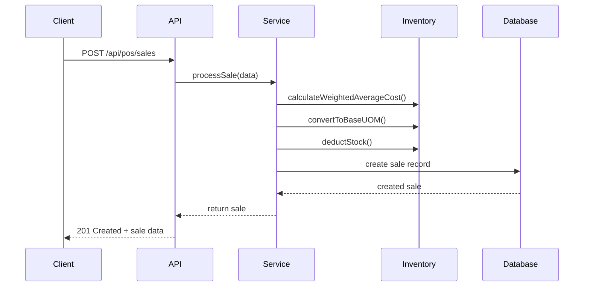
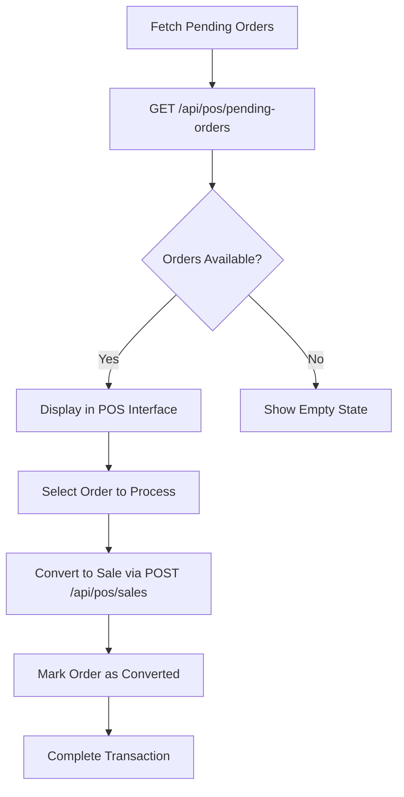
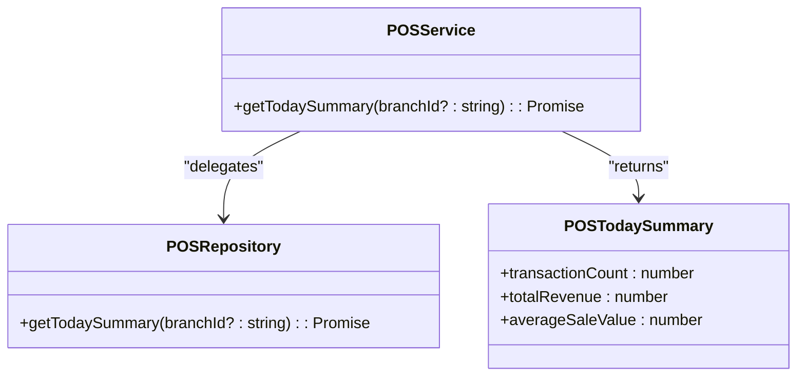
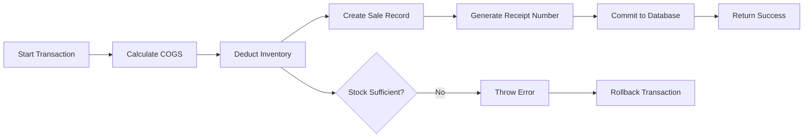

# POS API

<cite>
**Referenced Files in This Document**   
- [app/api/pos/sales/route.ts](file://app/api/pos/sales/route.ts)
- [app/api/pos/pending-orders/route.ts](file://app/api/pos/pending-orders/route.ts)
- [app/api/pos/sales/today-summary/route.ts](file://app/api/pos/sales/today-summary/route.ts)
- [services/pos.service.ts](file://services/pos.service.ts)
- [repositories/pos.repository.ts](file://repositories/pos.repository.ts)
- [types/pos.types.ts](file://types/pos.types.ts)
- [lib/validations/sales-order.validation.ts](file://lib/validations/sales-order.validation.ts)
</cite>

## Table of Contents
1. [Introduction](#introduction)
2. [Sales Creation Process](#sales-creation-process)
3. [Pending Orders Workflow](#pending-orders-workflow)
4. [Today Summary Endpoint](#today-summary-endpoint)
5. [Request Schema: SaleCreateInput](#request-schema-salecreateinput)
6. [Receipt Generation and Inventory Deduction](#receipt-generation-and-inventory-deduction)
7. [Error Handling](#error-handling)
8. [Practical Examples](#practical-examples)
9. [Security and Idempotency](#security-and-idempotency)

## Introduction
The Point of Sale (POS) API provides a robust interface for managing retail transactions, including sales processing, inventory tracking, and daily reporting. This documentation details the core endpoints and workflows essential for integrating with the POS system, focusing on transaction creation, payment handling, pending orders, and daily sales summaries.

**Section sources**
- [app/api/pos/sales/route.ts](file://app/api/pos/sales/route.ts#L1-L75)
- [services/pos.service.ts](file://services/pos.service.ts#L1-L214)

## Sales Creation Process
The `/api/pos/sales` POST endpoint processes new sales transactions. It supports multiple payment methods including cash, GCash, and credit. For cash payments, the `amountReceived` field is required, and change is automatically calculated if the received amount exceeds the total.

Partial payments are not supported directly; the full `totalAmount` must be covered by the selected payment method. The system validates sufficient inventory before processing and deducts stock upon successful transaction completion.

**Diagram sources**
- [app/api/pos/sales/route.ts](file://app/api/pos/sales/route.ts#L48-L75)
- [services/pos.service.ts](file://services/pos.service.ts#L127-L209)

**Section sources**
- [app/api/pos/sales/route.ts](file://app/api/pos/sales/route.ts#L48-L75)
- [services/pos.service.ts](file://services/pos.service.ts#L127-L209)

## Pending Orders Workflow
The `/api/pos/pending-orders` GET endpoint retrieves all pending sales orders that can be converted into POS transactions. This enables users to resume incomplete transactions initiated through sales order workflows.

When a pending order is processed as a sale, the `convertedFromOrderId` field in the `CreatePOSSaleInput` links the POS transaction to its originating sales order. The system automatically updates the sales order status to "converted" after successful processing.

**Diagram sources**
- [app/api/pos/pending-orders/route.ts](file://app/api/pos/pending-orders/route.ts#L6-L29)
- [services/pos.service.ts](file://services/pos.service.ts#L204-L206)

**Section sources**
- [app/api/pos/pending-orders/route.ts](file://app/api/pos/pending-orders/route.ts#L6-L29)
- [services/pos.service.ts](file://services/pos.service.ts#L204-L206)

## Today Summary Endpoint
The `/api/pos/sales/today-summary` GET endpoint returns key metrics for the current day's sales activity, including transaction count, total revenue, and average sale value. Results can be filtered by branch using the `branchId` query parameter.

This endpoint is optimized for dashboard displays and real-time performance monitoring, providing aggregated data without requiring client-side calculations.

**Diagram sources**
- [app/api/pos/sales/today-summary/route.ts](file://app/api/pos/sales/today-summary/route.ts#L6-L29)
- [types/pos.types.ts](file://types/pos.types.ts#L66-L70)
- [services/pos.service.ts](file://services/pos.service.ts#L120-L122)
- [repositories/pos.repository.ts](file://repositories/pos.repository.ts#L101-L134)

**Section sources**
- [app/api/pos/sales/today-summary/route.ts](file://app/api/pos/sales/today-summary/route.ts#L6-L29)
- [types/pos.types.ts](file://types/pos.types.ts#L66-L70)

## Request Schema: SaleCreateInput
The `CreatePOSSaleInput` interface defines the structure for creating new sales. It includes:

- **receiptNumber**: Optional; auto-generated if not provided
- **branchId**: Required; identifies the transaction location
- **warehouseId**: Required for inventory deduction
- **items**: Array of line items with product ID, quantity, unit of measure, price, and subtotal
- **subtotal, tax, totalAmount**: Pre-calculated monetary values
- **paymentMethod**: One of: cash, card, check, gcash, online_transfer
- **amountReceived**: Required for cash payments
- **change**: Automatically calculated for cash
- **convertedFromOrderId**: Optional; links to a sales order

Validation is enforced through Zod schemas and service-level checks.

**Section sources**
- [types/pos.types.ts](file://types/pos.types.ts#L14-L26)
- [lib/validations/sales-order.validation.ts](file://lib/validations/sales-order.validation.ts#L3-L38)

## Receipt Generation and Inventory Deduction
Receipt numbers are generated in the format `RCP-YYYYMMDD-XXXX` using a daily sequence. The system ensures uniqueness by checking existing receipts before creation.

Inventory deduction occurs during transaction processing using FIFO (First-In, First-Out) logic for batched items with expiry dates. Stock levels are updated atomically within a database transaction to prevent race conditions. Cost of Goods Sold (COGS) is calculated using weighted average cost per product.

**Diagram sources**
- [services/pos.service.ts](file://services/pos.service.ts#L20-L49)
- [services/pos.service.ts](file://services/pos.service.ts#L160-L209)
- [repositories/pos.repository.ts](file://repositories/pos.repository.ts#L73-L99)

**Section sources**
- [services/pos.service.ts](file://services/pos.service.ts#L20-L49)
- [services/pos.service.ts](file://services/pos.service.ts#L160-L209)

## Error Handling
The API implements structured error handling using custom `AppError` types. Common error scenarios include:

- **Invalid Products**: Thrown when a product ID in the items list does not exist or is inactive
- **Insufficient Stock**: Prevents sales when requested quantity exceeds available inventory
- **Payment Mismatches**: Validates that `amountReceived` ≥ `totalAmount` for cash payments
- **Duplicate Receipt Numbers**: Ensures each receipt number is unique

Errors return a standardized JSON response with `success: false`, error message, and appropriate HTTP status codes (400 for validation, 404 for not found, 500 for server errors).

**Section sources**
- [services/pos.service.ts](file://services/pos.service.ts#L131-L139)
- [services/pos.service.ts](file://services/pos.service.ts#L151-L157)
- [app/api/pos/sales/route.ts](file://app/api/pos/sales/route.ts#L62-L67)

## Practical Examples
### Completing a Sale
Send a POST request to `/api/pos/sales` with complete `CreatePOSSaleInput` data, including items, payment method, and customer details.

### Applying Promotions
Promotions must be applied at the point of sale before submission. The API expects final prices in the `unitPrice` and `subtotal` fields.

### Processing Refunds
Refunds are handled through a separate reversal process not detailed in this document. The system maintains audit trails for all transactions.

**Section sources**
- [services/pos.service.ts](file://services/pos.service.ts#L127-L209)
- [types/pos.types.ts](file://types/pos.types.ts#L14-L26)

## Security and Idempotency
All financial endpoints require authentication and authorization. Sensitive data is transmitted over HTTPS and logged with masking.

The `receiptNumber` field provides idempotency: resubmitting a request with the same receipt number will result in a validation error rather than duplicate processing. This prevents accidental double-charging.

**Section sources**
- [services/pos.service.ts](file://services/pos.service.ts#L151-L157)
- [app/api/pos/sales/route.ts](file://app/api/pos/sales/route.ts#L12-L15)