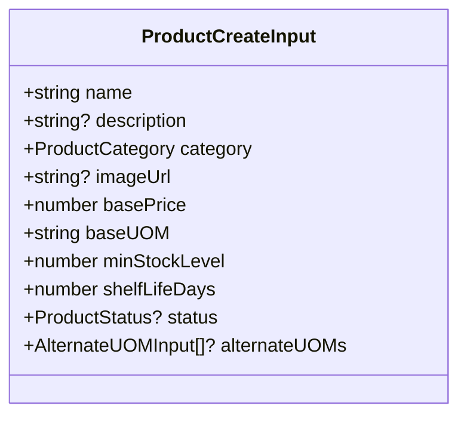
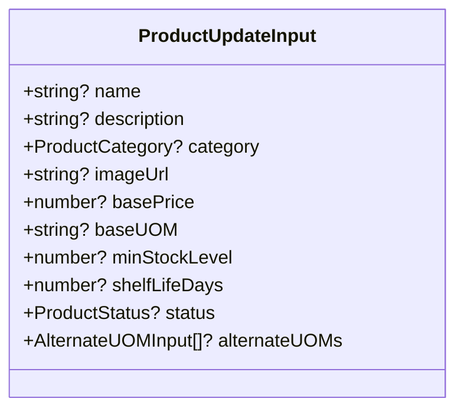
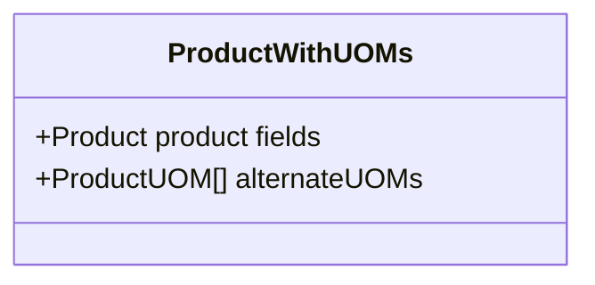
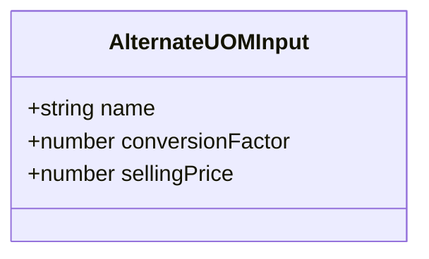
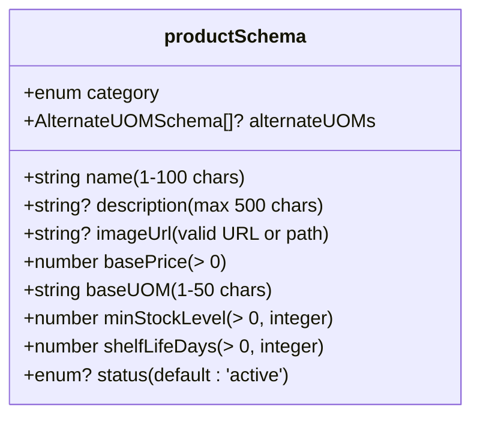
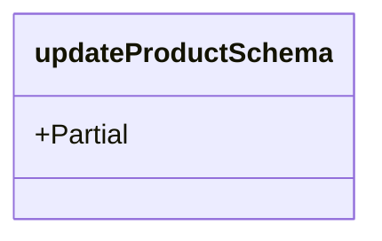
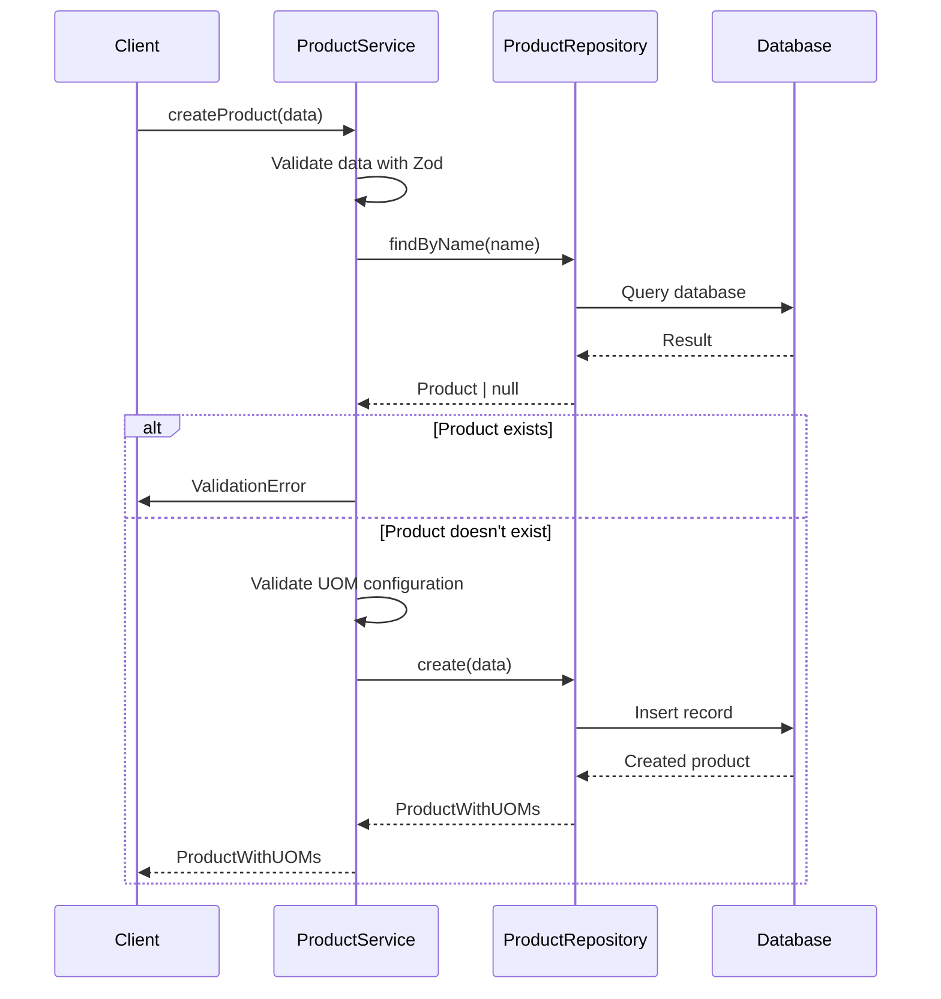
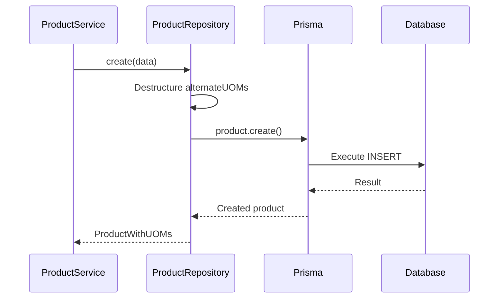

# Products API

<cite>
**Referenced Files in This Document**  
- [product.types.ts](file://types/product.types.ts)
- [product.validation.ts](file://lib/validations/product.validation.ts)
- [product.service.ts](file://services/product.service.ts)
- [product.repository.ts](file://repositories/product.repository.ts)
</cite>

## Table of Contents
1. [Introduction](#introduction)
2. [API Endpoints](#api-endpoints)
3. [Request/Response Schemas](#requestresponse-schemas)
4. [Query Parameters](#query-parameters)
5. [Unit of Measure (UOM) Configuration](#unit-of-measure-uom-configuration)
6. [Validation Rules](#validation-rules)
7. [Service Layer Integration](#service-layer-integration)
8. [Data Persistence](#data-persistence)
9. [Error Responses](#error-responses)
10. [Usage Examples](#usage-examples)

## Introduction
The Products API provides a complete interface for managing product data within the inventory system. It supports CRUD operations for products, including advanced features such as multiple unit-of-measure configurations, pricing tiers, and status management. The API integrates with the service and repository layers to enforce business logic and data validation rules.

**Section sources**
- [product.service.ts](file://services/product.service.ts#L12-L193)
- [product.repository.ts](file://repositories/product.repository.ts#L5-L127)

## API Endpoints
The Products API exposes RESTful endpoints under `/api/products` for full product lifecycle management:

- `GET /api/products` - Retrieve a list of products with optional filtering
- `GET /api/products/[id]` - Retrieve a specific product by ID
- `POST /api/products` - Create a new product
- `PUT /api/products/[id]` - Update an existing product
- `DELETE /api/products/[id]` - Delete a product (only if inactive)
- `POST /api/products/[id]/toggle-status` - Toggle product status between active and inactive

**Section sources**
- [product.service.ts](file://services/product.service.ts#L13-L144)
- [product.repository.ts](file://repositories/product.repository.ts#L6-L56)

## Request/Response Schemas
The API uses TypeScript interfaces defined in `product.types.ts` to define input and output structures.

### ProductCreateInput
Used for creating new products. All required fields must be provided.



**Diagram sources**
- [product.types.ts](file://types/product.types.ts#L13-L24)

### ProductUpdateInput
Used for updating existing products. All fields are optional.



**Diagram sources**
- [product.types.ts](file://types/product.types.ts#L26-L37)

### ProductResponse
The response structure includes product details and associated UOMs.



**Diagram sources**
- [product.types.ts](file://types/product.types.ts#L39-L41)

## Query Parameters
Products can be filtered using query parameters in GET requests:

| Parameter | Type | Description |
|---------|------|-------------|
| `category` | ProductCategory | Filter by product category (Carbonated, Juices, Energy Drinks, Water, Other) |
| `status` | ProductStatus | Filter by product status (active, inactive) |
| `search` | string | Search products by name (case-insensitive) |

These parameters are encapsulated in the `ProductFilters` interface and processed by the repository layer.

**Section sources**
- [product.types.ts](file://types/product.types.ts#L43-L47)
- [product.repository.ts](file://repositories/product.repository.ts#L7-L22)

## Unit of Measure (UOM) Configuration
Products support multiple unit-of-measure configurations through the `alternateUOMs` array.

### AlternateUOMInput
Defines configuration for alternative units of measure.



**Diagram sources**
- [product.types.ts](file://types/product.types.ts#L7-L11)

Each alternate UOM must:
- Have a unique name across all alternate UOMs for the product
- Not conflict with the base UOM name
- Include a positive conversion factor and selling price

The service layer validates these constraints before persistence.

**Section sources**
- [product.service.ts](file://services/product.service.ts#L45-L63)
- [product.service.ts](file://services/product.service.ts#L92-L114)

## Validation Rules
Input validation is enforced using Zod schemas defined in `product.validation.ts`.

### productSchema
Validates complete product data during creation.



**Diagram sources**
- [product.validation.ts](file://lib/validations/product.validation.ts#L9-L25)

### updateProductSchema
Partial version of productSchema used for updates.



**Diagram sources**
- [product.validation.ts](file://lib/validations/product.validation.ts#L27)

Validation occurs in the service layer before any database operations, ensuring data integrity.

**Section sources**
- [product.validation.ts](file://lib/validations/product.validation.ts#L1-L32)
- [product.service.ts](file://services/product.service.ts#L31-L35)

## Service Layer Integration
The `ProductService` class orchestrates business logic and coordinates between the API and data layers.



**Diagram sources**
- [product.service.ts](file://services/product.service.ts#L29-L65)

The service layer handles:
- Input validation
- Business rule enforcement (e.g., unique product names)
- UOM configuration validation
- Status management rules
- Error handling and transformation

**Section sources**
- [product.service.ts](file://services/product.service.ts#L12-L193)

## Data Persistence
The `ProductRepository` class manages all database interactions using Prisma ORM.



**Diagram sources**
- [product.repository.ts](file://repositories/product.repository.ts#L58-L74)

Key persistence behaviors:
- Uses Prisma's `include` to automatically load alternate UOMs
- Handles alternate UOMs as a separate relation with create/delete operations
- Implements soft delete prevention by requiring inactive status
- Supports filtered queries with case-insensitive search

**Section sources**
- [product.repository.ts](file://repositories/product.repository.ts#L5-L127)

## Error Responses
The API returns standardized error responses for various failure conditions.

| Status | Error Type | Trigger Condition |
|-------|------------|-------------------|
| 400 | ValidationError | Invalid input data, UOM conflicts, duplicate names |
| 404 | NotFoundError | Product ID not found in GET, PUT, DELETE operations |
| 409 | ValidationError | Attempt to delete active product |

Error responses include detailed field-level validation messages to assist clients in correcting requests.

**Section sources**
- [product.service.ts](file://services/product.service.ts#L20-L22)
- [product.service.ts](file://services/product.service.ts#L72-L73)
- [product.service.ts](file://services/product.service.ts#L128-L131)

## Usage Examples
Common operations can be performed using standard HTTP clients.

### Create Product with Multiple UOMs
```bash
curl -X POST http://localhost:3000/api/products \
  -H "Content-Type: application/json" \
  -d '{
    "name": "Sparkling Water",
    "category": "Water",
    "basePrice": 1.50,
    "baseUOM": "bottle",
    "minStockLevel": 50,
    "shelfLifeDays": 365,
    "alternateUOMs": [
      {
        "name": "case",
        "conversionFactor": 24,
        "sellingPrice": 30.00
      },
      {
        "name": "pack",
        "conversionFactor": 6,
        "sellingPrice": 8.00
      }
    ]
  }'
```

### Update Product Pricing
```javascript
fetch('/api/products/123', {
  method: 'PUT',
  headers: { 'Content-Type': 'application/json' },
  body: JSON.stringify({
    basePrice: 1.75,
    alternateUOMs: [
      { name: 'case', conversionFactor: 24, sellingPrice: 36.00 },
      { name: 'pack', conversionFactor: 6, sellingPrice: 9.00 }
    ]
  })
})
.then(response => response.json())
.then(data => console.log(data));
```

### Bulk Product Import (Pseudocode)
```typescript
// In a real implementation
const importProducts = async (products: CreateProductInput[]) => {
  return Promise.all(
    products.map(product => 
      fetch('/api/products', {
        method: 'POST',
        headers: { 'Content-Type': 'application/json' },
        body: JSON.stringify(product)
      })
    )
  );
};
```

**Section sources**
- [product.service.ts](file://services/product.service.ts#L29-L65)
- [product.service.ts](file://services/product.service.ts#L68-L117)