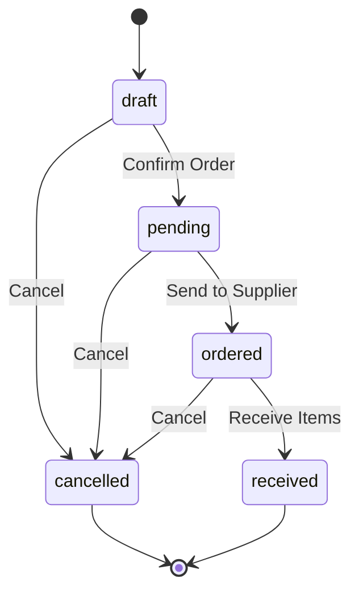
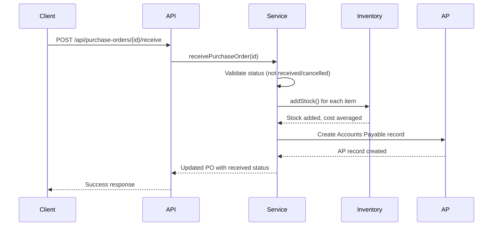

# Purchase Orders API

<cite>
**Referenced Files in This Document**   
- [route.ts](file://app/api/purchase-orders/route.ts)
- [route.ts](file://app/api/purchase-orders/[id]/route.ts)
- [receive/route.ts](file://app/api/purchase-orders/[id]/receive/route.ts)
- [cancel/route.ts](file://app/api/purchase-orders/[id]/cancel/route.ts)
- [purchase-order.service.ts](file://services/purchase-order.service.ts)
- [purchase-order.repository.ts](file://repositories/purchase-order.repository.ts)
- [purchase-order.validation.ts](file://lib/validations/purchase-order.validation.ts)
- [purchase-order.types.ts](file://types/purchase-order.types.ts)
</cite>

## Table of Contents
1. [Introduction](#introduction)
2. [API Endpoints](#api-endpoints)
3. [Request Schemas](#request-schemas)
4. [Order Lifecycle and Status Transitions](#order-lifecycle-and-status-transitions)
5. [Inventory and Cost Updates on Receipt](#inventory-and-cost-updates-on-receipt)
6. [Error Handling](#error-handling)
7. [Examples](#examples)

## Introduction
The Purchase Orders API enables full lifecycle management of purchase orders, from creation to receipt and cancellation. It supports retrieving filtered lists of orders, creating new orders with supplier and product details, receiving items into inventory, and canceling unfulfilled orders. The system enforces business rules around order status, validation, and inventory updates to ensure data integrity and accurate financial tracking.

**Section sources**
- [purchase-order.service.ts](file://services/purchase-order.service.ts#L15-L375)
- [purchase-order.types.ts](file://types/purchase-order.types.ts#L3-L54)

## API Endpoints

### GET /api/purchase-orders
Retrieves a list of purchase orders with optional filtering by status, branch, supplier, warehouse, and date range.

### POST /api/purchase-orders
Creates a new purchase order in "draft" status. The order must include valid supplier, warehouse, branch, delivery date, and at least one item.

### GET /api/purchase-orders/[id]
Retrieves a specific purchase order by ID, including supplier, warehouse, branch, and line item details.

### PUT /api/purchase-orders/[id]
Updates an existing purchase order. Only orders in "draft" or "pending" status can be modified.

### POST /api/purchase-orders/[id]/receive
Marks a purchase order as received, triggering inventory updates and creating an Accounts Payable record.

### POST /api/purchase-orders/[id]/cancel
Cancels a purchase order that has not been received, requiring a cancellation reason.

**Section sources**
- [route.ts](file://app/api/purchase-orders/route.ts#L6-L71)
- [route.ts](file://app/api/purchase-orders/[id]/route.ts#L5-L64)
- [receive/route.ts](file://app/api/purchase-orders/[id]/receive/route.ts#L5-L35)
- [cancel/route.ts](file://app/api/purchase-orders/[id]/cancel/route.ts#L5-L46)

## Request Schemas

### PurchaseOrderCreateInput
```typescript
interface CreatePurchaseOrderInput {
  supplierId: string;
  warehouseId: string;
  branchId: string;
  expectedDeliveryDate: Date;
  notes?: string;
  items: PurchaseOrderItemInput[];
}
```

### PurchaseOrderItemInput
```typescript
interface PurchaseOrderItemInput {
  productId: string;
  quantity: number; // > 0
  unitPrice: number; // > 0
}
```

### ReceiveItemsInput
No request body required. Receiving is a state transition that processes all ordered items.

### CancelPurchaseOrderInput
```typescript
interface CancelPurchaseOrderInput {
  reason: string; // Required field
}
```

Validation is enforced using Zod schemas that require:
- All required fields present
- Positive quantities and unit prices
- Active supplier and products
- At least one item in the order

**Section sources**
- [purchase-order.types.ts](file://types/purchase-order.types.ts#L11-L31)
- [purchase-order.validation.ts](file://lib/validations/purchase-order.validation.ts#L3-L31)
- [purchase-order.service.ts](file://services/purchase-order.service.ts#L96-L137)

## Order Lifecycle and Status Transitions



**Diagram sources**
- [purchase-order.types.ts](file://types/purchase-order.types.ts#L3)
- [purchase-order.service.ts](file://services/purchase-order.service.ts#L247-L257)

### Status Rules:
- **draft**: Order created but not confirmed. Can be edited or canceled.
- **pending**: Order confirmed but not yet sent to supplier. Can be edited or canceled.
- **ordered**: Order sent to supplier. Cannot be edited but can be canceled before receipt.
- **received**: All items received. Order is complete and cannot be modified or canceled.
- **cancelled**: Order was canceled before fulfillment. No further actions allowed.

Only "draft" and "pending" orders can be updated. Once received, an order cannot be canceled.

**Section sources**
- [purchase-order.types.ts](file://types/purchase-order.types.ts#L3)
- [purchase-order.service.ts](file://services/purchase-order.service.ts#L168-L173)

## Inventory and Cost Updates on Receipt

When a purchase order is received, the system automatically updates inventory and creates financial records:



**Diagram sources**
- [receive/route.ts](file://app/api/purchase-orders/[id]/receive/route.ts#L5-L35)
- [purchase-order.service.ts](file://services/purchase-order.service.ts#L274-L370)
- [inventory.service.ts](file://services/inventory.service.ts#L311-L321)

### Key Actions on Receipt:
1. **Inventory Update**: Each item's quantity is added to stock using the unit cost from the purchase order.
2. **Average Cost Recalculation**: The inventory system recalculates the weighted average cost for each product.
3. **Accounts Payable Creation**: An AP record is created with due date calculated from supplier payment terms (Net 15, Net 30, etc.).
4. **Status Update**: Purchase order status changes to "received" with actual delivery timestamp.

All operations occur within a database transaction to ensure atomicity.

**Section sources**
- [purchase-order.service.ts](file://services/purchase-order.service.ts#L274-L370)
- [inventory.service.ts](file://services/inventory.service.ts#L311-L321)

## Error Handling

The API returns structured error responses with appropriate HTTP status codes:

| Error Condition | Status Code | Response Structure |
|----------------|------------|-------------------|
| Invalid input data | 400 | `{ success: false, error: string, fields: { [field: string]: string } }` |
| Order not found | 404 | `{ success: false, error: "Purchase Order not found" }` |
| Invalid status transition | 400 | `{ success: false, error: string, fields: { status: string } }` |
| Server error | 500 | `{ success: false, error: "Failed to process request" }` |

Common validation errors include:
- Attempting to cancel a received order
- Creating an order with inactive supplier or products
- Negative or zero quantities/prices
- Missing required fields

**Section sources**
- [purchase-order.service.ts](file://services/purchase-order.service.ts#L247-L257)
- [purchase-order.service.ts](file://services/purchase-order.service.ts#L96-L137)
- [route.ts](file://app/api/purchase-orders/route.ts#L25-L36)

## Examples

### Creating a Purchase Order with Multiple Items
```json
POST /api/purchase-orders
{
  "supplierId": "sup-001",
  "warehouseId": "wh-001",
  "branchId": "br-001",
  "expectedDeliveryDate": "2025-12-01T00:00:00Z",
  "notes": "Urgent shipment required",
  "items": [
    {
      "productId": "prod-001",
      "quantity": 100,
      "unitPrice": 25.50
    },
    {
      "productId": "prod-002",
      "quantity": 50,
      "unitPrice": 15.75
    }
  ]
}
```

### Processing Partial Receipt
*Note: The current implementation receives all items at once. Partial receipt would require enhancement to accept quantities per item.*

### Canceling an Unfulfilled Order
```json
POST /api/purchase-orders/{id}/cancel
{
  "reason": "Supplier price increased unexpectedly"
}
```

**Section sources**
- [purchase-order.service.ts](file://services/purchase-order.service.ts#L95-L153)
- [purchase-order.service.ts](file://services/purchase-order.service.ts#L240-L269)
- [purchase-order.types.ts](file://types/purchase-order.types.ts#L11-L28)