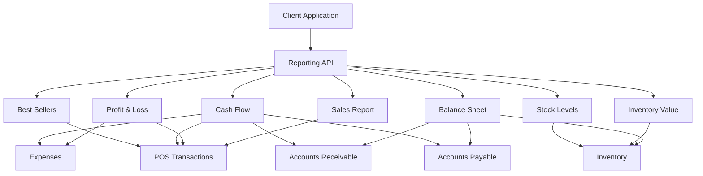
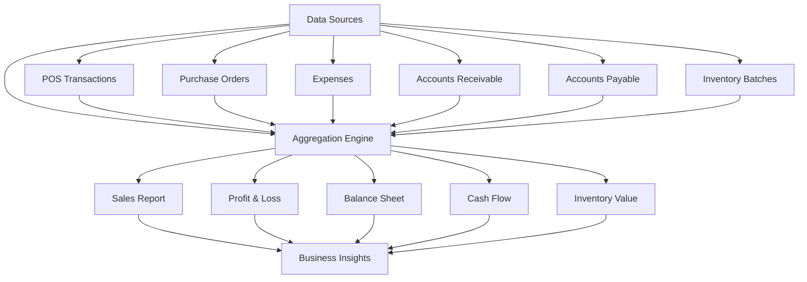

# Reporting API

<cite>
**Referenced Files in This Document**   
- [report.service.ts](file://services/report.service.ts)
- [report.types.ts](file://types/report.types.ts)
- [sales/route.ts](file://app/api/reports/sales/route.ts)
- [profit-loss/route.ts](file://app/api/reports/profit-loss/route.ts)
- [balance-sheet/route.ts](file://app/api/reports/balance-sheet/route.ts)
- [cash-flow/route.ts](file://app/api/reports/cash-flow/route.ts)
- [inventory-value/route.ts](file://app/api/reports/inventory-value/route.ts)
- [stock-levels/route.ts](file://app/api/reports/stock-levels/route.ts)
- [requirements.md](file://specs/inventory-pro-system/requirements.md)
</cite>

## Table of Contents
1. [Introduction](#introduction)
2. [Report Endpoints](#report-endpoints)
3. [Query Parameters](#query-parameters)
4. [Response Schemas](#response-schemas)
5. [Data Aggregation Logic](#data-aggregation-logic)
6. [Usage Examples](#usage-examples)
7. [Performance Considerations](#performance-considerations)
8. [Export and Integration](#export-and-integration)

## Introduction
The Reporting Engine provides comprehensive financial and operational reporting capabilities for the inventory management system. It aggregates data from POS transactions, purchase orders, expenses, accounts receivable, and accounts payable to generate accurate business insights. The API supports filtering by date ranges, branches, warehouses, and product categories, enabling detailed analysis across different dimensions of the business.

**Section sources**
- [requirements.md](file://specs/inventory-pro-system/requirements.md#L214-L233)

## Report Endpoints
The Reporting API exposes several endpoints for generating different types of reports:

- **GET /api/reports/sales**: Generates sales reports with daily transaction summaries
- **GET /api/reports/profit-loss**: Generates profit and loss statements
- **GET /api/reports/balance-sheet**: Generates balance sheet reports
- **GET /api/reports/cash-flow**: Generates cash flow statements
- **GET /api/reports/inventory-value**: Generates inventory valuation reports
- **GET /api/reports/stock-levels**: Generates stock level reports
- **GET /api/reports/best-sellers**: Generates best-selling products reports

Each endpoint returns structured JSON data that can be consumed by frontend applications or external analytics tools.



**Diagram sources**
- [report.service.ts](file://services/report.service.ts#L14-L393)
- [sales/route.ts](file://app/api/reports/sales/route.ts#L6-L28)
- [profit-loss/route.ts](file://app/api/reports/profit-loss/route.ts#L6-L27)

## Query Parameters
All reporting endpoints support standardized query parameters for filtering and segmentation:

### Common Filters
- **branchId**: Filter reports by specific branch (string)
- **warehouseId**: Filter inventory reports by warehouse (string)
- **category**: Filter reports by product category (string)
- **fromDate**: Start date for date range filtering (ISO date string)
- **toDate**: End date for date range filtering (ISO date string)

### Endpoint-Specific Parameters
- **/sales**: Supports `groupBy` parameter (day, week, month) for aggregation
- **/balance-sheet**: Supports `asOfDate` parameter to specify the valuation date
- **/best-sellers**: Supports `limit` parameter to control the number of results

The filtering system allows for precise data segmentation, enabling users to analyze performance across different business units and time periods.

**Section sources**
- [report.types.ts](file://types/report.types.ts#L78-L84)
- [sales/route.ts](file://app/api/reports/sales/route.ts#L8-L12)
- [balance-sheet/route.ts](file://app/api/reports/balance-sheet/route.ts#L10)

## Response Schemas
The API returns standardized response formats with consistent data structures for each report type.

### Standard Response Format
```json
{
  "success": true,
  "data": { /* report-specific data */ }
}
```

### Report-Specific Schemas

#### StockLevelReport
```typescript
interface StockLevelReport {
  productId: string;
  productName: string;
  category: string;
  warehouseId: string;
  warehouseName: string;
  currentStock: number;
  baseUOM: string;
  minStockLevel: number;
  status: 'adequate' | 'low' | 'critical';
}
```

#### InventoryValueReport
```typescript
interface InventoryValueReport {
  productId: string;
  productName: string;
  totalQuantity: number;
  averageCost: Decimal;
  totalValue: Decimal;
}
```

#### SalesReport
```typescript
interface SalesReport {
  date: Date;
  transactionCount: number;
  totalRevenue: Decimal;
  totalCOGS: Decimal;
  grossProfit: Decimal;
  grossMargin: number; // percentage
}
```

#### ProfitLossStatement
```typescript
interface ProfitLossStatement {
  revenue: Decimal;
  cogs: Decimal;
  grossProfit: Decimal;
  expenses: Decimal;
  netProfit: Decimal;
  grossMargin: number; // percentage
  netMargin: number; // percentage
}
```

#### CashFlowStatement
```typescript
interface CashFlowStatement {
  cashInflows: {
    posSales: Decimal;
    arPayments: Decimal;
    total: Decimal;
  };
  cashOutflows: {
    expenses: Decimal;
    apPayments: Decimal;
    total: Decimal;
  };
  netCashFlow: Decimal;
}
```

#### BalanceSheet
```typescript
interface BalanceSheet {
  assets: {
    inventoryValue: Decimal;
    accountsReceivable: Decimal;
    total: Decimal;
  };
  liabilities: {
    accountsPayable: Decimal;
    total: Decimal;
  };
  equity: Decimal;
}
```

**Section sources**
- [report.types.ts](file://types/report.types.ts#L3-L76)

## Data Aggregation Logic
The Reporting Engine aggregates data from multiple sources across the system to provide comprehensive business insights.

### Data Sources
- **POS Transactions**: Sales data from point-of-sale systems
- **Purchase Orders**: Procurement and inventory acquisition data
- **Expenses**: Operational expense records
- **Accounts Receivable**: Customer outstanding balances
- **Accounts Payable**: Supplier outstanding balances
- **Inventory Batches**: Current stock levels and costs

### Calculation Methods
- **Revenue**: Sum of all POS sale amounts within the date range
- **Cost of Goods Sold (COGS)**: Sum of item-level COGS from sales transactions
- **Gross Profit**: Revenue minus COGS
- **Net Profit**: Gross profit minus total expenses
- **Inventory Value**: Weighted average cost calculation across all active inventory batches
- **Cash Flow**: Net difference between cash inflows (POS sales, AR payments) and outflows (expenses, AP payments)

The system uses precise decimal arithmetic to ensure financial accuracy and prevent floating-point errors in calculations.



**Diagram sources**
- [report.service.ts](file://services/report.service.ts#L14-L393)
- [dashboard.service.ts](file://services/dashboard.service.ts#L79-L170)

## Usage Examples
The Reporting API supports various use cases for business analysis and decision-making.

### Monthly Sales Report with Product Breakdown
To generate a monthly sales report with product breakdown:
```
GET /api/reports/sales?fromDate=2025-01-01&toDate=2025-01-31&branchId=BR001
```

This returns daily sales summaries including transaction count, revenue, COGS, and gross margin percentages.

### Real-Time Inventory Valuation
To retrieve real-time inventory valuation:
```
GET /api/reports/inventory-value?branchId=BR001&warehouseId=WH001
```

This returns the total inventory value calculated using weighted average costing, broken down by product.

### Profit and Loss Statement
To generate a profit and loss statement:
```
GET /api/reports/profit-loss?fromDate=2025-01-01&toDate=2025-01-31&branchId=BR001
```

This calculates revenue, COGS, gross profit, expenses, and net profit with margin percentages.

### Stock Level Monitoring
To check current stock levels:
```
GET /api/reports/stock-levels?branchId=BR001&category=Electronics
```

This returns stock levels with status indicators (adequate, low, critical) based on minimum stock thresholds.

**Section sources**
- [sales/route.ts](file://app/api/reports/sales/route.ts#L6-L28)
- [inventory-value/route.ts](file://app/api/reports/inventory-value/route.ts#L6-L25)
- [profit-loss/route.ts](file://app/api/reports/profit-loss/route.ts#L6-L27)
- [stock-levels/route.ts](file://app/api/reports/stock-levels/route.ts#L6-L27)

## Performance Considerations
The Reporting Engine is designed to handle large datasets efficiently while maintaining responsive performance.

### Data Processing Strategies
- **Batch Processing**: Large datasets are processed in memory using efficient data structures like Maps for aggregation
- **Database Filtering**: Filters are applied at the database level to minimize data transfer
- **Caching**: Frequently accessed reports can be cached to improve response times
- **Indexing**: Database queries leverage indexes on key fields like date, branchId, and warehouseId

### Optimization Techniques
- **Decimal Arithmetic**: Uses the Decimal library for precise financial calculations without floating-point errors
- **Map-based Aggregation**: Employs Map objects for O(1) lookups during data aggregation
- **Prisma Includes**: Utilizes Prisma's include feature to fetch related data in single queries, reducing database round trips
- **Memory Management**: Processes data in streams where possible to minimize memory footprint

For very large datasets, consider implementing pagination or time-based chunking to maintain optimal performance.

**Section sources**
- [report.service.ts](file://services/report.service.ts#L14-L393)
- [IMPLEMENTATION-GUIDE.md](file://IMPLEMENTATION-GUIDE.md#L287-L291)

## Export and Integration
The Reporting API supports data export and integration with external analytics tools.

### Export Capabilities
While the API endpoints return JSON data, the system supports CSV export for external analysis:
- All reports can be converted to CSV format
- Column selection options allow customization of exported data
- Currency values are formatted in Philippine Peso (₱) with thousand separators and 2 decimal places
- Date values use the consistent format YYYY-MM-DD

### Integration with Analytics Tools
The API's standardized JSON responses enable easy integration with:
- Business intelligence platforms
- Data visualization tools
- Spreadsheet applications
- Custom analytics dashboards

External systems can programmatically retrieve report data and incorporate it into broader business intelligence workflows.

**Section sources**
- [IMPLEMENTATION-GUIDE.md](file://IMPLEMENTATION-GUIDE.md#L292-L302)
- [requirements.md](file://specs/inventory-pro-system/requirements.md#L229-L230)