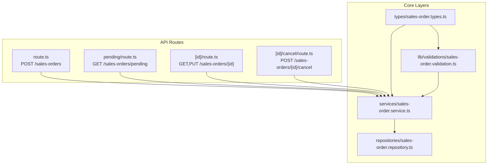
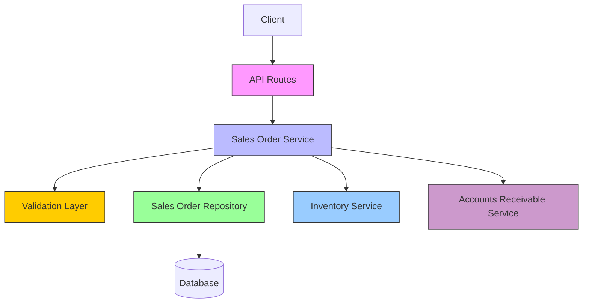
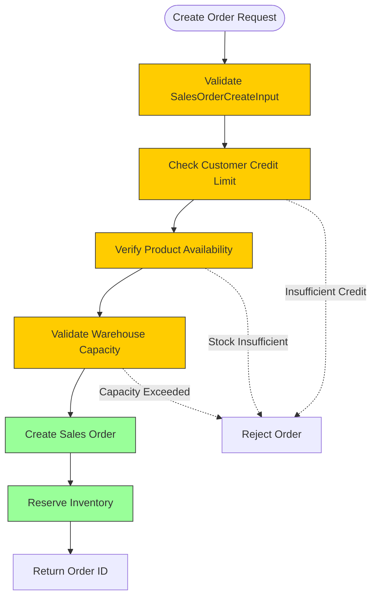
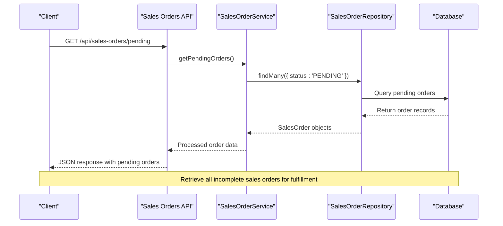
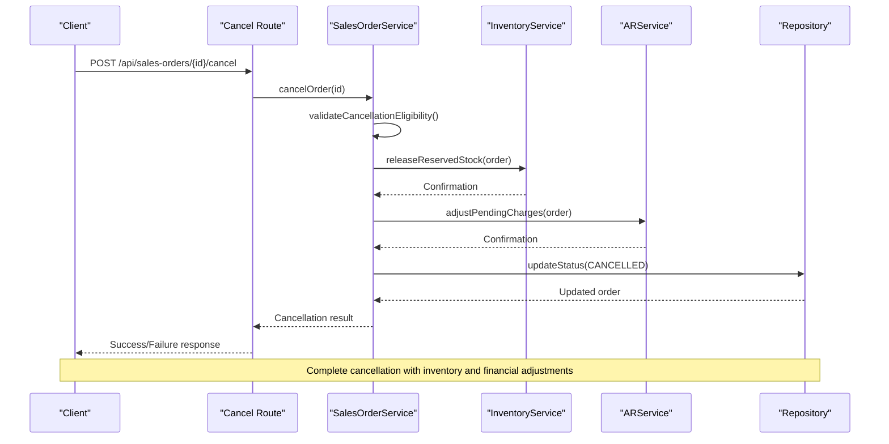

# Sales Orders API

<cite>
**Referenced Files in This Document**   
- [route.ts](file://app/api/sales-orders/route.ts)
- [pending/route.ts](file://app/api/sales-orders/pending/route.ts)
- [id/route.ts](file://app/api/sales-orders/[id]/route.ts)
- [id/cancel/route.ts](file://app/api/sales-orders/[id]/cancel/route.ts)
- [sales-order.types.ts](file://types/sales-order.types.ts)
- [sales-order.validation.ts](file://lib/validations/sales-order.validation.ts)
- [sales-order.service.ts](file://services/sales-order.service.ts)
- [sales-order.repository.ts](file://repositories/sales-order.repository.ts)
- [inventory.service.ts](file://services/inventory.service.ts)
- [ar.service.ts](file://services/ar.service.ts)
</cite>

## Table of Contents
1. [Introduction](#introduction)
2. [Project Structure](#project-structure)
3. [Core Components](#core-components)
4. [Architecture Overview](#architecture-overview)
5. [Detailed Component Analysis](#detailed-component-analysis)
6. [Dependency Analysis](#dependency-analysis)
7. [Performance Considerations](#performance-considerations)
8. [Troubleshooting Guide](#troubleshooting-guide)
9. [Conclusion](#conclusion)

## Introduction
The Sales Orders API provides a robust system for managing sales order lifecycle operations including creation, fulfillment tracking, and cancellation. This documentation details the endpoints, data schemas, business logic validations, inventory integration, and financial system coordination required to effectively use and extend the API. The system enforces credit limits, product availability checks, and warehouse capacity constraints while supporting installment payments and audit logging.

## Project Structure
The Sales Orders API is organized within a Next.js application using the App Router pattern. API routes are located under `app/api/sales-orders`, with dedicated subroutes for pending orders and cancellation. Type definitions, validation logic, service layer, and repository components are separated into distinct directories to promote modularity and maintainability.



**Diagram sources**
- [route.ts](file://app/api/sales-orders/route.ts)
- [pending/route.ts](file://app/api/sales-orders/pending/route.ts)
- [id/route.ts](file://app/api/sales-orders/[id]/route.ts)
- [id/cancel/route.ts](file://app/api/sales-orders/[id]/cancel/route.ts)
- [sales-order.types.ts](file://types/sales-order.types.ts)
- [sales-order.validation.ts](file://lib/validations/sales-order.validation.ts)
- [sales-order.service.ts](file://services/sales-order.service.ts)
- [sales-order.repository.ts](file://repositories/sales-order.repository.ts)

**Section sources**
- [route.ts](file://app/api/sales-orders/route.ts)
- [sales-order.types.ts](file://types/sales-order.types.ts)

## Core Components
The Sales Orders API consists of several key components that handle order creation, validation, inventory reservation, and financial integration. The system validates customer credit limits and product availability before creating orders, reserves inventory upon successful creation, and integrates with accounts receivable upon completion. The API supports retrieval of pending orders and provides a cancellation workflow with proper state management.

**Section sources**
- [sales-order.service.ts](file://services/sales-order.service.ts)
- [sales-order.repository.ts](file://repositories/sales-order.repository.ts)
- [sales-order.validation.ts](file://lib/validations/sales-order.validation.ts)

## Architecture Overview
The Sales Orders API follows a layered architecture with clear separation between API routes, service logic, validation, data access, and external integrations. The API layer handles HTTP requests and responses, the service layer orchestrates business logic, the validation layer ensures data integrity, and the repository layer manages database operations.



**Diagram sources**
- [route.ts](file://app/api/sales-orders/route.ts)
- [sales-order.service.ts](file://services/sales-order.service.ts)
- [sales-order.validation.ts](file://lib/validations/sales-order.validation.ts)
- [sales-order.repository.ts](file://repositories/sales-order.repository.ts)
- [inventory.service.ts](file://services/inventory.service.ts)
- [ar.service.ts](file://services/ar.service.ts)

## Detailed Component Analysis

### Order Creation and Validation
The order creation process begins with validation of the SalesOrderCreateInput schema, which includes checks for customer credit limits and product availability. The validation layer ensures all required fields are present and meet business rules before the service layer processes the order.



**Diagram sources**
- [sales-order.validation.ts](file://lib/validations/sales-order.validation.ts)
- [sales-order.service.ts](file://services/sales-order.service.ts)
- [inventory.service.ts](file://services/inventory.service.ts)

**Section sources**
- [sales-order.validation.ts](file://lib/validations/sales-order.validation.ts)
- [sales-order.service.ts](file://services/sales-order.service.ts)

### Fulfillment Tracking and Pending Orders
The pending endpoint retrieves incomplete sales orders for fulfillment processing. This endpoint queries the database for orders with status 'PENDING' and includes relevant customer and product information for warehouse staff to process shipments.



**Diagram sources**
- [pending/route.ts](file://app/api/sales-orders/pending/route.ts)
- [sales-order.service.ts](file://services/sales-order.service.ts)
- [sales-order.repository.ts](file://repositories/sales-order.repository.ts)

**Section sources**
- [pending/route.ts](file://app/api/sales-orders/pending/route.ts)
- [sales-order.service.ts](file://services/sales-order.service.ts)

### Order Cancellation Workflow
The cancellation process follows a structured workflow that validates cancellation eligibility, releases reserved inventory, updates financial records, and maintains audit logs. The cancel subroute handles POST requests to terminate orders before fulfillment.



**Diagram sources**
- [id/cancel/route.ts](file://app/api/sales-orders/[id]/cancel/route.ts)
- [sales-order.service.ts](file://services/sales-order.service.ts)
- [inventory.service.ts](file://services/inventory.service.ts)
- [ar.service.ts](file://services/ar.service.ts)
- [sales-order.repository.ts](file://repositories/sales-order.repository.ts)

**Section sources**
- [id/cancel/route.ts](file://app/api/sales-orders/[id]/cancel/route.ts)
- [sales-order.service.ts](file://services/sales-order.service.ts)

## Dependency Analysis
The Sales Orders API has well-defined dependencies across the application layers and external systems. The API routes depend on the service layer, which in turn depends on validation, repository, inventory, and accounts receivable services.

```mermaid
classDiagram
class SalesOrderAPI {
+POST /sales-orders
+GET /sales-orders/pending
+GET,PUT /sales-orders/{id}
+POST /sales-orders/{id}/cancel
}
class SalesOrderService {
+createOrder(input)
+getPendingOrders()
+getOrder(id)
+updateOrder(id, data)
+cancelOrder(id)
+validateCancellationEligibility(order)
}
class SalesOrderValidation {
+validateCreateInput(input)
+validateCustomerCredit(customer, total)
+validateProductAvailability(items)
+validateWarehouseCapacity(warehouse, items)
}
class SalesOrderRepository {
+create(data)
+findMany(query)
+findUnique(id)
+update(id, data)
}
class InventoryService {
+reserveStock(items, warehouse)
+releaseReservedStock(order)
+checkAvailability(productId, quantity)
}
class ARService {
+createInvoice(order)
+adjustPendingCharges(order)
+recordPayment(order, payment)
}
SalesOrderAPI --> SalesOrderService : "uses"
SalesOrderService --> SalesOrderValidation : "uses"
SalesOrderService --> SalesOrderRepository : "uses"
SalesOrderService --> InventoryService : "uses"
SalesOrderService --> ARService : "uses"
```

**Diagram sources**
- [route.ts](file://app/api/sales-orders/route.ts)
- [sales-order.service.ts](file://services/sales-order.service.ts)
- [sales-order.validation.ts](file://lib/validations/sales-order.validation.ts)
- [sales-order.repository.ts](file://repositories/sales-order.repository.ts)
- [inventory.service.ts](file://services/inventory.service.ts)
- [ar.service.ts](file://services/ar.service.ts)

**Section sources**
- [sales-order.service.ts](file://services/sales-order.service.ts)
- [sales-order.validation.ts](file://lib/validations/sales-order.validation.ts)

## Performance Considerations
The Sales Orders API is designed with performance in mind, utilizing efficient database queries, connection pooling, and caching where appropriate. The pending orders endpoint uses indexed queries on the status field for fast retrieval of incomplete orders. Inventory checks are optimized to minimize database round trips by validating multiple products in a single query. The system implements proper error handling to prevent cascading failures during high load periods.

## Troubleshooting Guide
Common issues with the Sales Orders API typically involve validation failures, inventory conflicts, or integration errors. When creating orders, ensure customer credit limits are sufficient and requested products are available in the specified warehouse. For cancellation issues, verify the order is still in a cancellable state (PENDING). Monitor inventory service availability as it is critical for order creation and cancellation workflows.

**Section sources**
- [sales-order.validation.ts](file://lib/validations/sales-order.validation.ts)
- [sales-order.service.ts](file://services/sales-order.service.ts)
- [inventory.service.ts](file://services/inventory.service.ts)

## Conclusion
The Sales Orders API provides a comprehensive solution for managing the complete sales order lifecycle. With robust validation, inventory integration, and financial system coordination, the API ensures data integrity and business rule enforcement. The modular architecture allows for easy maintenance and extension, while the clear separation of concerns promotes code quality and testability. By following the documented workflows and error handling patterns, developers can effectively integrate with and extend the Sales Orders functionality.