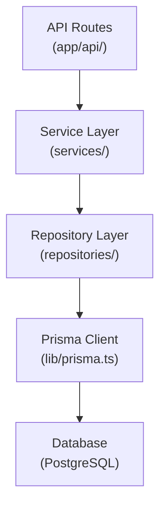
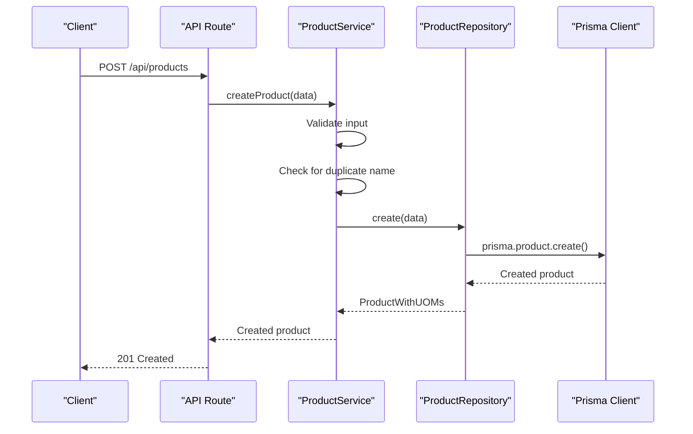
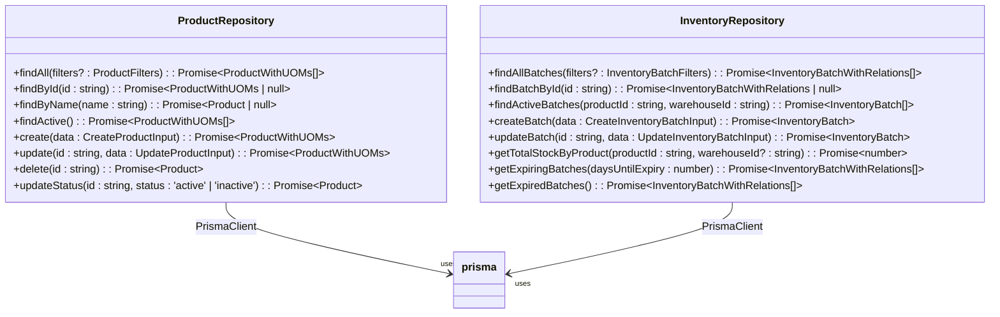
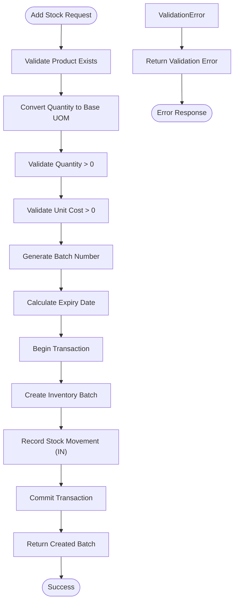
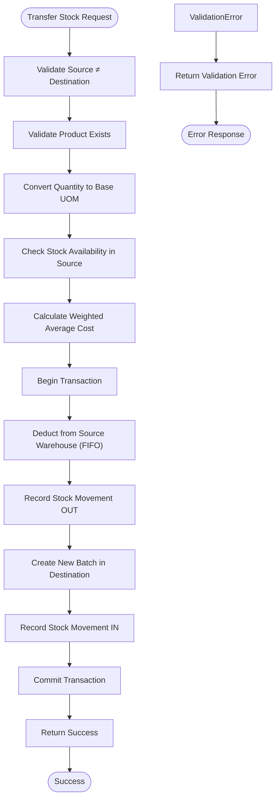
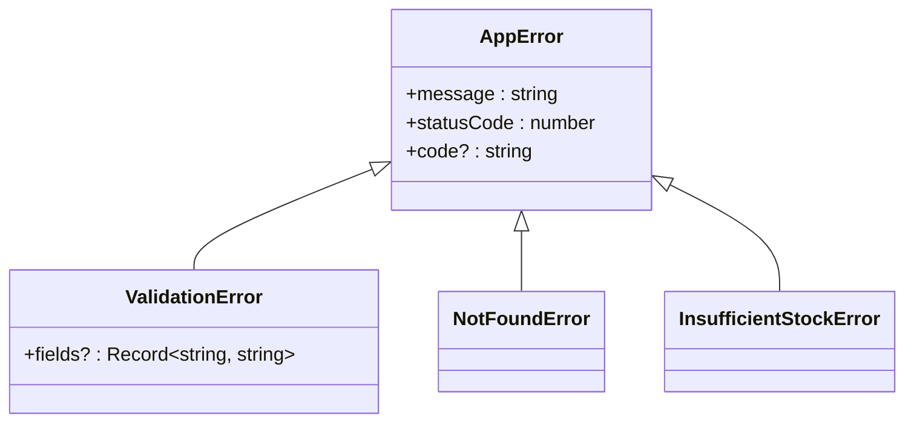
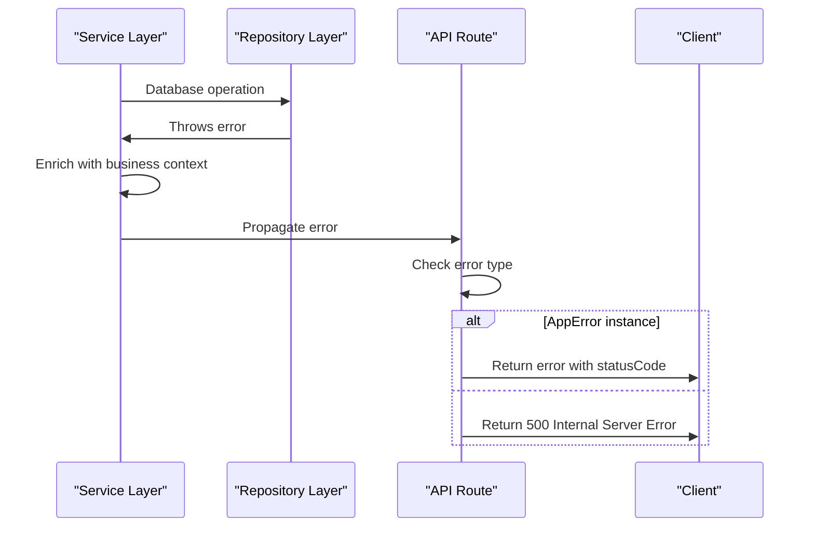
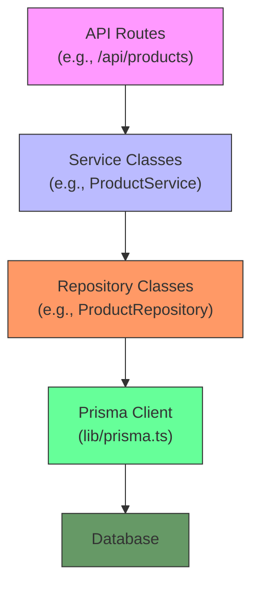

# Backend Architecture

<cite>
**Referenced Files in This Document**   
- [prisma.ts](file://lib/prisma.ts)
- [product.repository.ts](file://repositories/product.repository.ts)
- [inventory.repository.ts](file://repositories/inventory.repository.ts)
- [product.service.ts](file://services/product.service.ts)
- [inventory.service.ts](file://services/inventory.service.ts)
- [route.ts](file://app/api/products/route.ts)
- [add-stock/route.ts](file://app/api/inventory/add-stock/route.ts)
- [deduct-stock/route.ts](file://app/api/inventory/deduct-stock/route.ts)
- [transfer/route.ts](file://app/api/inventory/transfer/route.ts)
- [errors.ts](file://lib/errors.ts)
- [product.validation.ts](file://lib/validations/product.validation.ts)
</cite>

## Table of Contents
1. [Architecture Overview](#architecture-overview)
2. [Layered Architecture](#layered-architecture)
3. [Request Flow](#request-flow)
4. [Repository Pattern Implementation](#repository-pattern-implementation)
5. [Service Layer Implementation](#service-layer-implementation)
6. [Complex Operations and Transactions](#complex-operations-and-transactions)
7. [Error Handling Patterns](#error-handling-patterns)
8. [Dependency Chain](#dependency-chain)

## Architecture Overview

The backend architecture follows a clean architecture pattern with distinct layers: API routes, service layer, repository layer, and data access through Prisma ORM. This separation ensures business logic is decoupled from HTTP concerns and database operations are abstracted through type-safe interfaces.



**Diagram sources**
- [prisma.ts](file://lib/prisma.ts)
- [product.service.ts](file://services/product.service.ts)
- [inventory.service.ts](file://services/inventory.service.ts)
- [product.repository.ts](file://repositories/product.repository.ts)
- [inventory.repository.ts](file://repositories/inventory.repository.ts)

## Layered Architecture

The application implements a three-tier architecture with clear separation of concerns:

1. **API Layer**: Handles HTTP requests and responses
2. **Service Layer**: Contains business logic, validation, and transaction management
3. **Repository Layer**: Abstracts database operations with type-safe interfaces

This pattern ensures that business rules are not tied to HTTP concerns and database access is encapsulated in dedicated classes.

**Section sources**
- [product.service.ts](file://services/product.service.ts#L1-L193)
- [inventory.service.ts](file://services/inventory.service.ts#L1-L504)
- [product.repository.ts](file://repositories/product.repository.ts#L1-L127)
- [inventory.repository.ts](file://repositories/inventory.repository.ts#L1-L375)

## Request Flow

The request flow follows a consistent pattern across all endpoints:

1. API route receives HTTP request
2. Route handler parses and validates input
3. Service layer is called with validated data
4. Service executes business logic and calls repository methods
5. Repository performs database operations via Prisma
6. Response flows back through the same layers

For example, when creating a product:


**Diagram sources**
- [route.ts](file://app/api/products/route.ts)
- [product.service.ts](file://services/product.service.ts#L29-L65)
- [product.repository.ts](file://repositories/product.repository.ts#L58-L74)

## Repository Pattern Implementation

The repository pattern is implemented with dedicated classes for each domain entity, providing type-safe interfaces for database operations. Each repository abstracts Prisma operations and provides methods for common CRUD operations and queries.

Key features of the repository implementation:
- Type-safe methods using TypeScript interfaces
- Encapsulation of Prisma client operations
- Query building with proper filtering and sorting
- Inclusion of related entities through Prisma's include feature



**Diagram sources**
- [product.repository.ts](file://repositories/product.repository.ts#L5-L123)
- [inventory.repository.ts](file://repositories/inventory.repository.ts#L13-L371)
- [prisma.ts](file://lib/prisma.ts)

## Service Layer Implementation

The service layer encapsulates business logic, validation, and transaction management. Each service class coordinates operations between repositories and enforces business rules.

Key responsibilities of service classes:
- Input validation using Zod schemas
- Business rule enforcement (e.g., preventing deletion of active products)
- Transaction management for complex operations
- Coordination between multiple repositories when needed
- Error handling with domain-specific exceptions

```mermaid
classDiagram
class ProductService {
+getAllProducts(filters? : ProductFilters) : Promise~ProductWithUOMs[]~
+getProductById(id : string) : Promise~ProductWithUOMs~
+getActiveProducts() : Promise~ProductWithUOMs[]~
+createProduct(data : CreateProductInput) : Promise~ProductWithUOMs~
+updateProduct(id : string, data : UpdateProductInput) : Promise~ProductWithUOMs~
+deleteProduct(id : string) : Promise~void~
+toggleProductStatus(id : string) : Promise~Product~
+getProductUOMs(productId : string) : Promise~{ name : string; sellingPrice : number }[]~
+getUOMSellingPrice(productId : string, uomName : string) : Promise~number~
}
class InventoryService {
+generateBatchNumber() : Promise~string~
+calculateWeightedAverageCost(productId : string, warehouseId : string) : Promise~number~
+convertToBaseUOM(productId : string, quantity : number, uom : string) : Promise~number~
+getCurrentStockLevel(productId : string, warehouseId : string) : Promise~number~
+addStock(data : AddStockInput) : Promise~InventoryBatch~
+deductStock(data : DeductStockInput) : Promise~void~
+transferStock(data : TransferStockInput) : Promise~void~
+getStockLevel(productId : string, warehouseId : string) : Promise~StockLevel | null~
+getTotalStock(productId : string, warehouseId? : string) : Promise~number~
}
ProductService --> "depends on" ProductRepository
InventoryService --> "depends on" InventoryRepository
InventoryService --> "depends on" ProductService
```

**Diagram sources**
- [product.service.ts](file://services/product.service.ts#L11-L189)
- [inventory.service.ts](file://services/inventory.service.ts#L16-L500)
- [product.repository.ts](file://repositories/product.repository.ts)
- [inventory.repository.ts](file://repositories/inventory.repository.ts)

## Complex Operations and Transactions

Complex operations involving multiple model updates are handled within database transactions to ensure data consistency. The Prisma client's transaction feature is used to group related operations.

### Inventory Stock Adjustment Example

When adding stock to inventory, the system performs multiple operations within a single transaction:
1. Create a new inventory batch
2. Record a stock movement of type "IN"
3. Generate a unique batch number
4. Calculate expiry date based on product shelf life



**Diagram sources**
- [add-stock/route.ts](file://app/api/inventory/add-stock/route.ts)
- [inventory.service.ts](file://services/inventory.service.ts#L115-L180)
- [inventory.repository.ts](file://repositories/inventory.repository.ts)

### Warehouse Transfer Example

Transferring stock between warehouses involves a more complex transaction with multiple steps:
1. Deduct stock from source warehouse using FIFO (First In, First Out) logic
2. Record stock movement OUT from source warehouse
3. Create new batch in destination warehouse with weighted average cost
4. Record stock movement IN to destination warehouse



**Diagram sources**
- [transfer/route.ts](file://app/api/inventory/transfer/route.ts)
- [inventory.service.ts](file://services/inventory.service.ts#L263-L383)
- [inventory.repository.ts](file://repositories/inventory.repository.ts)

## Error Handling Patterns

The application implements a comprehensive error handling system with domain-specific exceptions that separate business logic errors from HTTP concerns.

### Error Hierarchy



**Diagram sources**
- [errors.ts](file://lib/errors.ts)

### Error Handling Flow

When an error occurs in the service layer, it propagates through the call stack to the API route, where it's converted to an appropriate HTTP response:



**Section sources**
- [errors.ts](file://lib/errors.ts)
- [add-stock/route.ts](file://app/api/inventory/add-stock/route.ts#L22-L35)
- [deduct-stock/route.ts](file://app/api/inventory/deduct-stock/route.ts#L17-L30)
- [product.service.ts](file://services/product.service.ts)

## Dependency Chain

The dependency chain follows a strict unidirectional flow from top to bottom:



Key dependency rules:
- API routes depend on service classes
- Service classes depend on repository classes
- Repository classes depend on the Prisma client singleton
- No reverse dependencies are allowed
- Services may depend on other services when business logic requires it (e.g., InventoryService depends on ProductService)

The Prisma client is instantiated as a singleton in `lib/prisma.ts` to ensure a single connection pool across the application:

```typescript
import { PrismaClient } from '@prisma/client';

const globalForPrisma = globalThis as unknown as {
  prisma: PrismaClient | undefined;
};

export const prisma = globalForPrisma.prisma ?? new PrismaClient();

if (process.env.NODE_ENV !== 'production') globalForPrisma.prisma = prisma;
```

**Section sources**
- [prisma.ts](file://lib/prisma.ts)
- [product.service.ts](file://services/product.service.ts)
- [inventory.service.ts](file://services/inventory.service.ts)
- [product.repository.ts](file://repositories/product.repository.ts)
- [inventory.repository.ts](file://repositories/inventory.repository.ts)
- [route.ts](file://app/api/products/route.ts)
- [add-stock/route.ts](file://app/api/inventory/add-stock/route.ts)