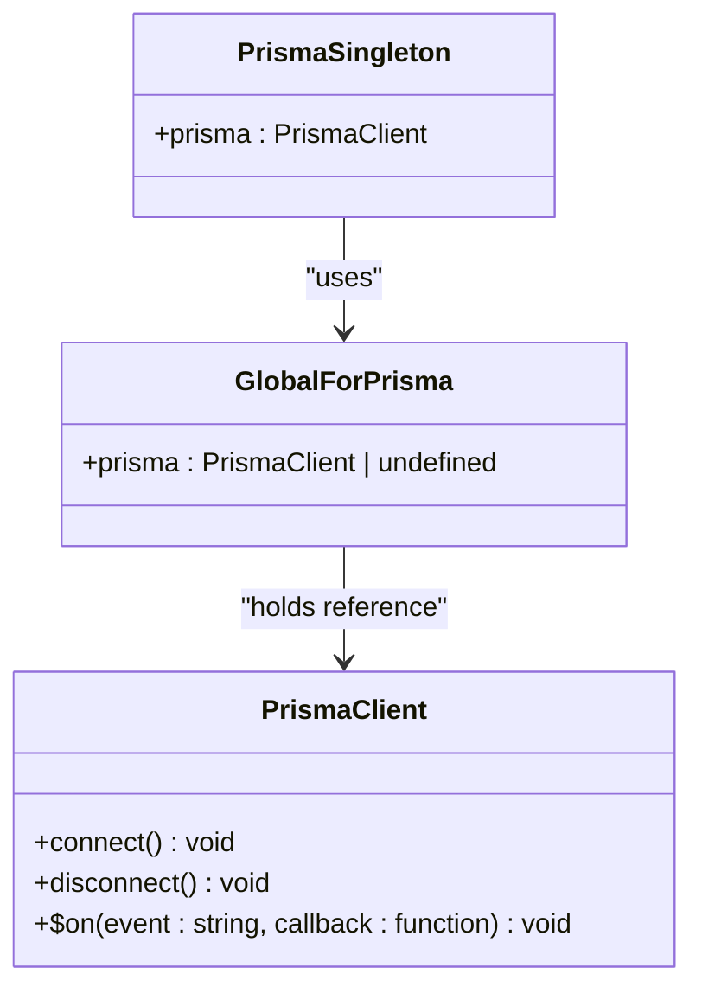
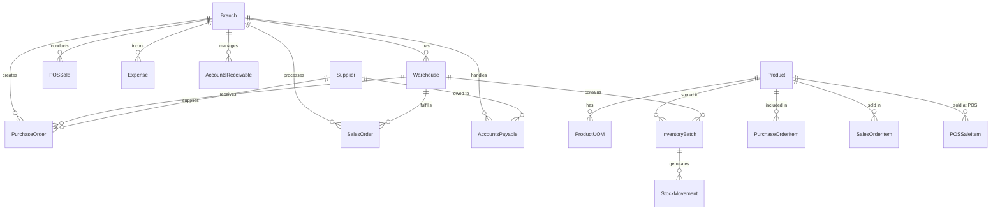
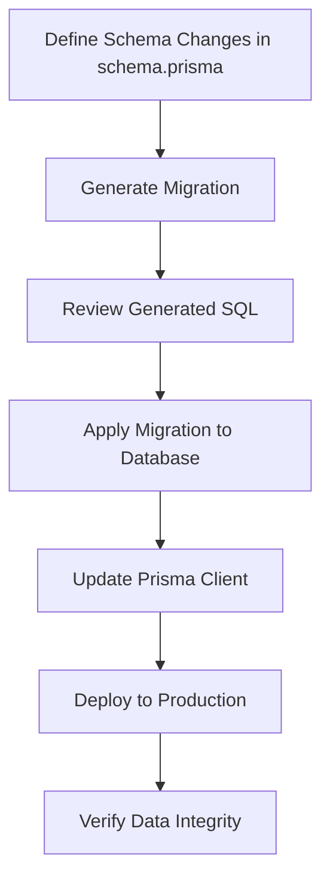
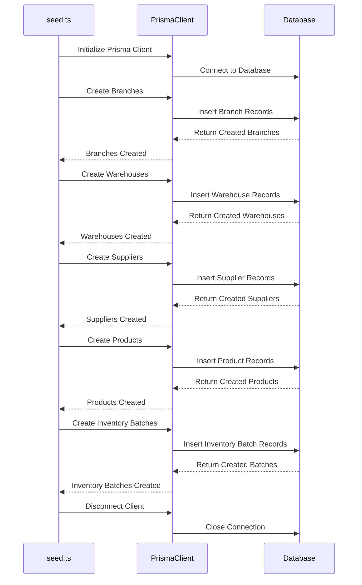
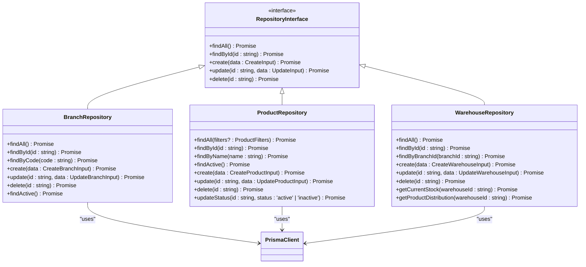
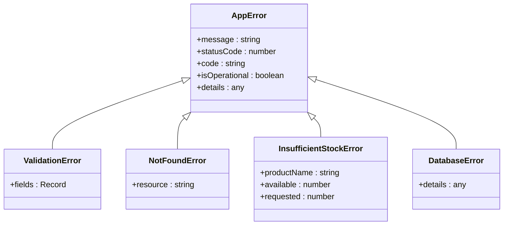

# Data Persistence Layer

<cite>
**Referenced Files in This Document**   
- [lib/prisma.ts](file://lib/prisma.ts)
- [prisma/schema.prisma](file://prisma/schema.prisma)
- [prisma/seed.ts](file://prisma/seed.ts)
- [repositories/branch.repository.ts](file://repositories/branch.repository.ts)
- [repositories/product.repository.ts](file://repositories/product.repository.ts)
- [repositories/warehouse.repository.ts](file://repositories/warehouse.repository.ts)
- [lib/errors.ts](file://lib/errors.ts)
- [prisma/migrations/20251113094445_init/migration.sql](file://prisma/migrations/20251113094445_init/migration.sql)
</cite>

## Table of Contents
1. [Introduction](#introduction)
2. [Prisma Client Singleton Pattern](#prisma-client-singleton-pattern)
3. [Prisma Schema Design Principles](#prisma-schema-design-principles)
4. [Migration Workflow with Prisma Migrate](#migration-workflow-with-prisma-migrate)
5. [Database Seeding Process](#database-seeding-process)
6. [Repository Pattern Implementation](#repository-pattern-implementation)
7. [Connection Pooling and Performance](#connection-pooling-and-performance)
8. [Error Handling at Database Level](#error-handling-at-database-level)
9. [Query Optimization and N+1 Prevention](#query-optimization-and-n1-prevention)
10. [Schema Evolution and Data Integrity](#schema-evolution-and-data-integrity)

## Introduction
The Data Persistence Layer in this application is built around Prisma ORM, providing a type-safe and efficient interface for database operations. This documentation details the architectural decisions, implementation patterns, and best practices employed in the persistence layer, focusing on the singleton pattern for Prisma client instantiation, schema design principles, migration workflows, and performance considerations.

**Section sources**
- [lib/prisma.ts](file://lib/prisma.ts)
- [prisma/schema.prisma](file://prisma/schema.prisma)

## Prisma Client Singleton Pattern
The Prisma client is implemented as a singleton to prevent multiple instances in development environments, which could lead to memory leaks and connection issues. The implementation uses a global variable to store the Prisma client instance, ensuring that only one instance is created and reused across the application.

**Diagram sources**
- [lib/prisma.ts](file://lib/prisma.ts#L1-L10)

**Section sources**
- [lib/prisma.ts](file://lib/prisma.ts#L1-L10)

## Prisma Schema Design Principles
The Prisma schema is designed with a focus on data integrity, performance, and maintainability. Key design principles include proper model relationships, constraints, and indexing strategies to optimize query performance and ensure data consistency.

**Diagram sources**
- [prisma/schema.prisma](file://prisma/schema.prisma#L14-L408)

**Section sources**
- [prisma/schema.prisma](file://prisma/schema.prisma#L14-L408)

## Migration Workflow with Prisma Migrate
The migration workflow uses Prisma Migrate to manage schema evolution across different environments. Migrations are version-controlled and applied in a sequential manner, ensuring that the database schema remains consistent and can be reproduced in any environment.

**Diagram sources**
- [prisma/migrations/20251113094445_init/migration.sql](file://prisma/migrations/20251113094445_init/migration.sql)

**Section sources**
- [prisma/migrations/20251113094445_init/migration.sql](file://prisma/migrations/20251113094445_init/migration.sql)

## Database Seeding Process
The database seeding process initializes the application with reference data using the `seed.ts` script. This ensures that the application starts with a consistent set of data, including branches, warehouses, suppliers, and products, which are essential for testing and demonstration purposes.

**Diagram sources**
- [prisma/seed.ts](file://prisma/seed.ts#L1-L257)

**Section sources**
- [prisma/seed.ts](file://prisma/seed.ts#L1-L257)

## Repository Pattern Implementation
The repository pattern is implemented to abstract database operations and provide a clean interface for services to interact with the data layer. Each repository encapsulates CRUD operations for a specific entity, promoting separation of concerns and testability.

**Diagram sources**
- [repositories/branch.repository.ts](file://repositories/branch.repository.ts#L4-L55)
- [repositories/product.repository.ts](file://repositories/product.repository.ts#L4-L123)
- [repositories/warehouse.repository.ts](file://repositories/warehouse.repository.ts#L4-L113)

**Section sources**
- [repositories/branch.repository.ts](file://repositories/branch.repository.ts#L4-L55)
- [repositories/product.repository.ts](file://repositories/product.repository.ts#L4-L123)
- [repositories/warehouse.repository.ts](file://repositories/warehouse.repository.ts#L4-L113)

## Connection Pooling and Performance
Connection pooling is managed by Prisma ORM to optimize database performance and resource utilization. The Prisma client automatically handles connection pooling, ensuring efficient reuse of database connections and minimizing the overhead of establishing new connections.

**Section sources**
- [lib/prisma.ts](file://lib/prisma.ts#L1-L10)

## Error Handling at Database Level
Error handling at the database level is implemented through custom error classes and centralized error handling mechanisms. This ensures that database errors are caught, logged, and transformed into user-friendly messages, maintaining application stability and providing meaningful feedback to users.

**Diagram sources**
- [lib/errors.ts](file://lib/errors.ts#L1-L33)

**Section sources**
- [lib/errors.ts](file://lib/errors.ts#L1-L33)

## Query Optimization and N+1 Prevention
Query optimization is achieved through the use of proper indexing, eager loading, and batch operations. The N+1 query problem is prevented by using Prisma's `include` and `select` options to fetch related data in a single query, reducing the number of database round trips and improving performance.

**Section sources**
- [prisma/schema.prisma](file://prisma/schema.prisma#L14-L408)
- [repositories/product.repository.ts](file://repositories/product.repository.ts#L4-L123)

## Schema Evolution and Data Integrity
Schema evolution is managed through Prisma Migrate, allowing for controlled and reversible changes to the database schema. Data integrity is maintained through the use of constraints, foreign keys, and validation rules defined in the Prisma schema, ensuring that the data remains consistent and reliable across all environments.

**Section sources**
- [prisma/schema.prisma](file://prisma/schema.prisma#L14-L408)
- [prisma/migrations/20251113094445_init/migration.sql](file://prisma/migrations/20251113094445_init/migration.sql)