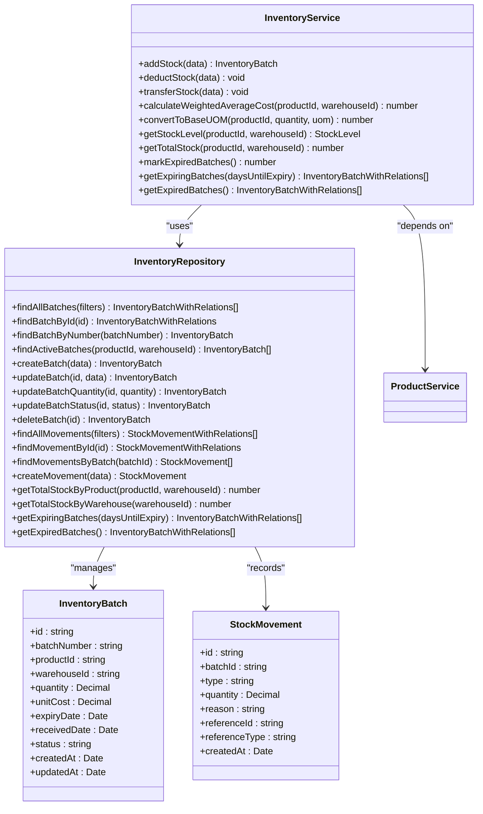
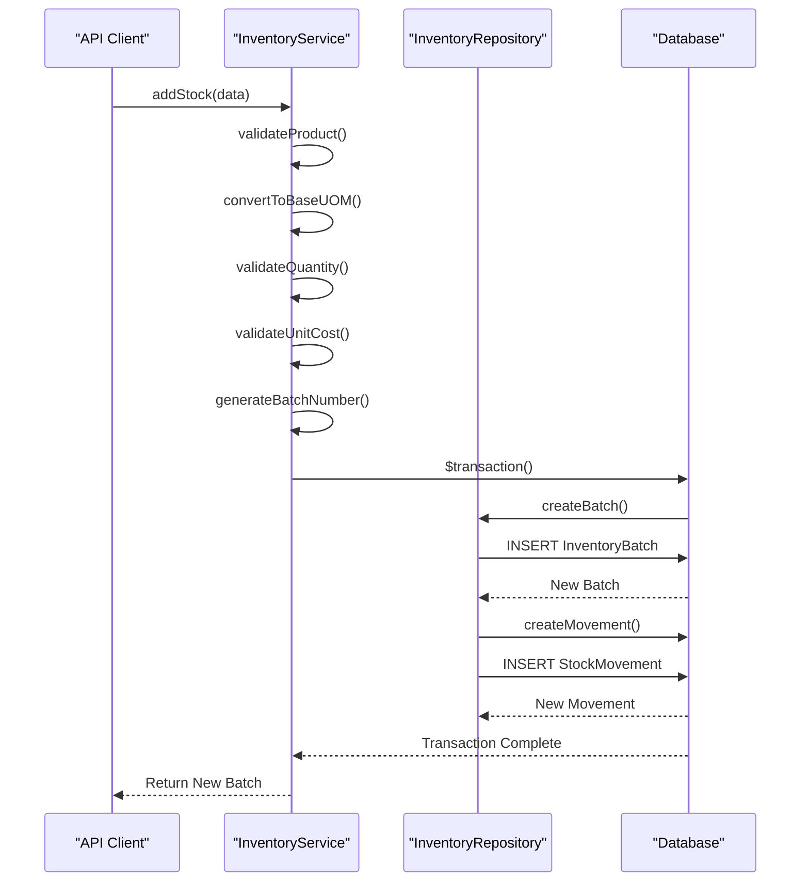
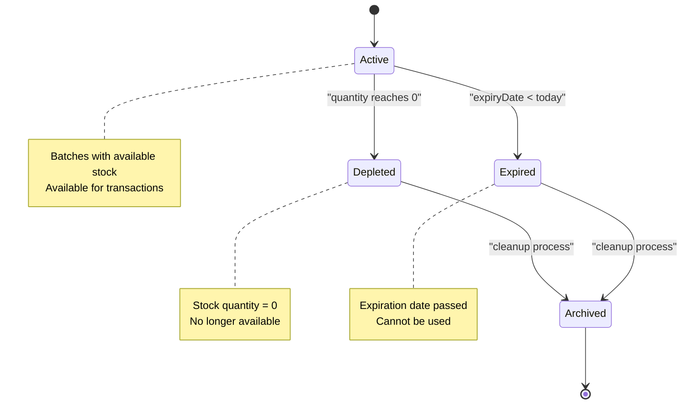
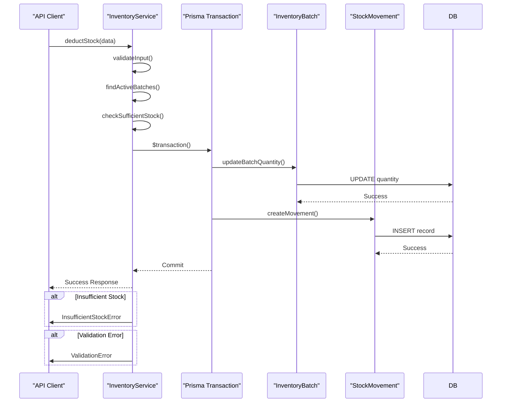
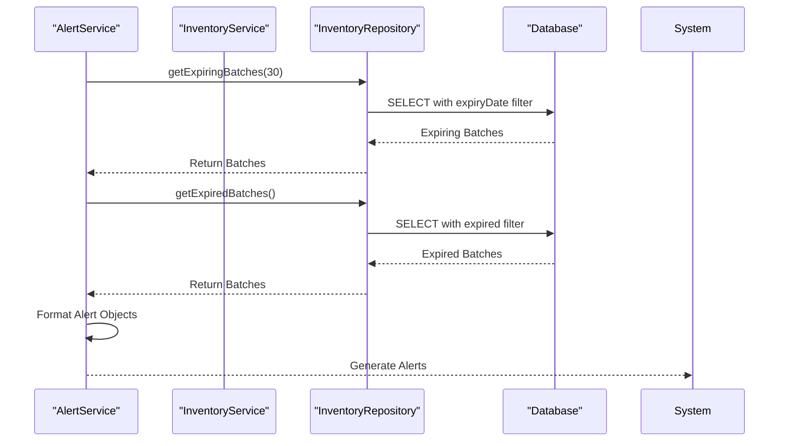
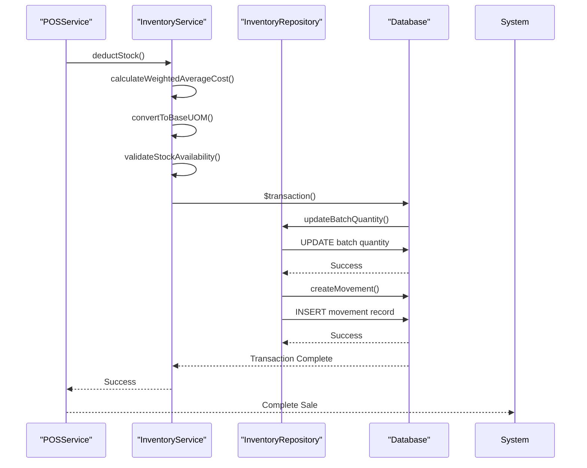

# Inventory Repository

<cite>
**Referenced Files in This Document**   
- [inventory.repository.ts](file://repositories/inventory.repository.ts)
- [inventory.service.ts](file://services/inventory.service.ts)
- [inventory.types.ts](file://types/inventory.types.ts)
- [add-stock/route.ts](file://app/api/inventory/add-stock/route.ts)
- [deduct-stock/route.ts](file://app/api/inventory/deduct-stock/route.ts)
- [transfer/route.ts](file://app/api/inventory/transfer/route.ts)
- [migration.sql](file://prisma/migrations/20251113094445_init/migration.sql)
- [pos.service.ts](file://services/pos.service.ts)
- [alert.service.ts](file://services/alert.service.ts)
</cite>

## Table of Contents
1. [Introduction](#introduction)
2. [Core Components](#core-components)
3. [Stock Management Operations](#stock-management-operations)
4. [Batch Tracking and Expiry Management](#batch-tracking-and-expiry-management)
5. [Average Costing Implementation](#average-costing-implementation)
6. [Data Integrity and Transactions](#data-integrity-and-transactions)
7. [Stock-Level Alerts and Monitoring](#stock-level-alerts-and-monitoring)
8. [Query Optimization and Performance](#query-optimization-and-performance)
9. [Integration with POS and Purchase Orders](#integration-with-pos-and-purchase-orders)
10. [Warehouse Capacity Constraints](#warehouse-capacity-constraints)

## Introduction
The InventoryRepository serves as the data access layer for managing inventory operations within the InventoryPro System. It provides a comprehensive interface for stock level management, batch tracking, and warehouse operations. This repository implements critical business logic for inventory control including FIFO-based stock deductions, average costing calculations, and expiration date tracking. The system maintains data integrity through atomic operations and Prisma transactions, ensuring reliable inventory tracking across multiple warehouses and business locations.

## Core Components

The InventoryRepository is structured around three primary operational domains: inventory batch management, stock movement tracking, and aggregate queries. These components work together to provide a complete inventory management solution that supports complex business requirements including expiration date tracking, cost accounting, and multi-warehouse operations.



**Diagram sources**
- [inventory.repository.ts](file://repositories/inventory.repository.ts#L13-L371)
- [inventory.service.ts](file://services/inventory.service.ts#L16-L500)
- [migration.sql](file://prisma/migrations/20251113094445_init/migration.sql#L60-L75)

**Section sources**
- [inventory.repository.ts](file://repositories/inventory.repository.ts#L13-L371)
- [inventory.service.ts](file://services/inventory.service.ts#L16-L500)
- [inventory.types.ts](file://types/inventory.types.ts#L1-L128)

## Stock Management Operations

The InventoryRepository provides comprehensive methods for managing stock levels through addition, deduction, and transfer operations. These operations are implemented with careful attention to data integrity, unit of measure conversion, and business rule enforcement.

### Add Stock Operation
The `addStock` method creates new inventory batches when goods are received. This operation converts quantities to the base unit of measure (UOM), generates unique batch numbers, calculates expiration dates based on product shelf life, and records the transaction as a stock movement. The operation is performed within a database transaction to ensure atomicity.

### Deduct Stock Operation
The `deductStock` method removes inventory when goods are sold or consumed. It implements First-In, First-Out (FIFO) logic by processing batches in order of their expiration dates. The system validates that sufficient stock is available before processing the deduction and updates batch quantities accordingly. When a batch is depleted, its status is automatically changed to "depleted".

### Transfer Between Warehouses
The `transferStock` method facilitates inventory movement between different warehouse locations. The operation follows a two-step process: first deducting stock from the source warehouse using FIFO logic, then creating a new batch in the destination warehouse. The transferred batch inherits the weighted average cost from the source warehouse, maintaining accurate cost accounting across locations.



**Diagram sources**
- [inventory.service.ts](file://services/inventory.service.ts#L115-L180)
- [inventory.repository.ts](file://repositories/inventory.repository.ts#L111-L151)
- [add-stock/route.ts](file://app/api/inventory/add-stock/route.ts#L6-L20)

**Section sources**
- [inventory.service.ts](file://services/inventory.service.ts#L115-L180)
- [inventory.repository.ts](file://repositories/inventory.repository.ts#L111-L151)
- [add-stock/route.ts](file://app/api/inventory/add-stock/route.ts#L6-L20)

## Batch Tracking and Expiry Management

The InventoryRepository implements sophisticated batch tracking capabilities that support expiration date management and FIFO inventory rotation. Each inventory batch contains detailed information including production date, expiration date, and current status.

### Batch Expiry Date Management
Batches are created with expiration dates calculated from the product's shelf life days property. The system automatically tracks batches that are approaching expiration or have already expired. When a batch's expiration date passes, its status is updated to "expired" to prevent further use in inventory transactions.

### FIFO Stock Deduction Logic
The system implements First-Expiry, First-Out (FEFO) logic for stock deductions, prioritizing batches with the nearest expiration dates. This approach minimizes waste by ensuring older inventory is used before newer stock. The `findActiveBatches` method retrieves batches ordered by expiration date, enabling the FIFO deduction process.

### Batch Status Lifecycle
Inventory batches progress through a defined status lifecycle: active → depleted/expired → archived. Active batches contain available inventory, depleted batches have been fully consumed, and expired batches have passed their expiration date. This status tracking enables accurate inventory reporting and helps prevent the use of expired goods.



**Diagram sources**
- [inventory.service.ts](file://services/inventory.service.ts#L184-L258)
- [inventory.repository.ts](file://repositories/inventory.repository.ts#L96-L109)
- [migration.sql](file://prisma/migrations/20251113094445_init/migration.sql#L66-L70)

**Section sources**
- [inventory.service.ts](file://services/inventory.service.ts#L184-L258)
- [inventory.repository.ts](file://repositories/inventory.repository.ts#L96-L109)
- [inventory.types.ts](file://types/inventory.types.ts#L3)

## Average Costing Implementation

The inventory system implements weighted average costing to maintain accurate cost accounting across inventory movements. This costing method ensures that the cost of goods sold and inventory valuation reflect the actual average cost of purchased items.

### Weighted Average Cost Calculation
The `calculateWeightedAverageCost` method computes the average cost using the formula: (sum of quantity × unitCost) / (sum of quantity). This calculation considers all active batches for a product in a specific warehouse, providing an accurate representation of the current inventory cost basis.

### Cost Propagation During Transfers
When inventory is transferred between warehouses, the destination batch is created with the weighted average cost from the source warehouse. This ensures consistent cost accounting across all locations and prevents cost distortion when inventory is moved between warehouses.

### Unit of Measure Conversion
The system supports multiple units of measure (UOM) for products, converting all quantities to the base UOM for cost calculations. This conversion ensures accurate cost accounting regardless of the unit in which transactions are recorded. The conversion factor is stored in the ProductUOM table and applied during inventory operations.

```mermaid
flowchart TD
A[Start] --> B[Get All Active Batches]
B --> C{Batches Exist?}
C --> |No| D[Return 0]
C --> |Yes| E[Calculate Total Cost]
E --> F[Sum of (quantity × unitCost)]
F --> G[Calculate Total Quantity]
G --> H[Sum of quantity]
H --> I{Total Quantity > 0?}
I --> |No| J[Return 0]
I --> |Yes| K[Calculate Average Cost]
K --> L[Total Cost / Total Quantity]
L --> M[Return Average Cost]
style A fill:#4CAF50,stroke:#388E3C
style D fill:#FF9800,stroke:#F57C00
style M fill:#4CAF50,stroke:#388E3C
```

**Diagram sources**
- [inventory.service.ts](file://services/inventory.service.ts#L50-L71)
- [inventory.service.ts](file://services/inventory.service.ts#L76-L101)
- [pos.service.ts](file://services/pos.service.ts#L164-L178)

**Section sources**
- [inventory.service.ts](file://services/inventory.service.ts#L50-L71)
- [inventory.service.ts](file://services/inventory.service.ts#L76-L101)
- [pos.service.ts](file://services/pos.service.ts#L164-L178)

## Data Integrity and Transactions

The InventoryRepository ensures data integrity through the use of atomic database transactions and comprehensive validation rules. All inventory operations that affect multiple records are wrapped in transactions to maintain consistency.

### Atomic Operations
Critical operations such as adding stock, deducting stock, and transferring inventory are implemented as atomic transactions. For example, when adding stock, both the inventory batch creation and the corresponding stock movement record are created within a single transaction. If any part of the operation fails, the entire transaction is rolled back, preventing data inconsistency.

### Validation Rules
The system implements multiple layers of validation to prevent invalid inventory states:
- Quantity validation ensures positive values for all inventory movements
- Sufficient stock validation prevents over-deduction
- Warehouse validation ensures transfers occur between different locations
- Product and warehouse existence validation prevents orphaned records

### Error Handling
The repository works in conjunction with the service layer to provide meaningful error messages. Insufficient stock conditions trigger specific `InsufficientStockError` exceptions, while validation failures generate `ValidationError` instances with field-specific details. This structured error handling enables client applications to provide informative feedback to users.



**Diagram sources**
- [inventory.service.ts](file://services/inventory.service.ts#L149-L177)
- [inventory.service.ts](file://services/inventory.service.ts#L224-L257)
- [inventory.service.ts](file://services/inventory.service.ts#L315-L382)

**Section sources**
- [inventory.service.ts](file://services/inventory.service.ts#L149-L177)
- [inventory.service.ts](file://services/inventory.service.ts#L224-L257)
- [inventory.service.ts](file://services/inventory.service.ts#L315-L382)

## Stock-Level Alerts and Monitoring

The inventory system includes comprehensive alerting capabilities that monitor stock levels and expiration dates, providing proactive notifications for potential issues.

### Low Stock Alerts
The system generates low stock alerts when inventory levels fall below predefined minimum thresholds. These alerts are based on the product's minStockLevel property and current available quantity across all active batches. Critical alerts are triggered when stock is completely depleted.

### Expiration Date Alerts
The system monitors batch expiration dates and generates two types of alerts:
- Expiring soon alerts for batches that will expire within a configurable period (default 30 days)
- Expired alerts for batches where the expiration date has passed but inventory remains

### Alert Integration
While the InventoryRepository provides the data access methods for retrieving expiring and expired batches, the alert generation logic is implemented in the AlertService. The `getExpiringBatches` and `getExpiredBatches` methods in the repository are called by the service layer to identify batches that require alerting.



**Diagram sources**
- [inventory.repository.ts](file://repositories/inventory.repository.ts#L306-L371)
- [alert.service.ts](file://services/alert.service.ts#L100-L187)
- [inventory.service.ts](file://services/inventory.service.ts#L487-L500)

**Section sources**
- [inventory.repository.ts](file://repositories/inventory.repository.ts#L306-L371)
- [alert.service.ts](file://services/alert.service.ts#L100-L187)
- [IMPLEMENTATION-GUIDE.md](file://IMPLEMENTATION-GUIDE.md#L212-L251)

## Query Optimization and Performance

The InventoryRepository implements several optimization techniques to ensure high performance for frequent inventory queries and reporting operations.

### Indexed Database Queries
The underlying database schema includes strategic indexes to optimize common query patterns:
- Composite index on productId and warehouseId for batch lookups
- Index on expiryDate for expiration date queries
- Index on status for filtering active batches
- Index on batchNumber for unique batch lookups

### Aggregate Queries
The repository provides optimized aggregate methods that leverage database-level aggregation rather than in-memory calculations:
- `getTotalStockByProduct` uses Prisma's aggregate function to sum quantities at the database level
- `getTotalStockByWarehouse` similarly uses database aggregation for warehouse-level totals
- These methods minimize data transfer and processing overhead

### Filtered Batch Retrieval
The `findAllBatches` and `findAllMovements` methods support comprehensive filtering options that are translated to efficient database queries. Filters can be applied by product, warehouse, status, and date ranges, allowing clients to retrieve only the data they need.

```mermaid
erDiagram
INVENTORY_BATCH ||--o{ STOCK_MOVEMENT : "has"
PRODUCT ||--o{ INVENTORY_BATCH : "has"
WAREHOUSE ||--o{ INVENTORY_BATCH : "stores"
INVENTORY_BATCH {
string id PK
string batchNumber UK
string productId FK
string warehouseId FK
decimal quantity
decimal unitCost
date expiryDate
date receivedDate
string status
datetime createdAt
datetime updatedAt
}
STOCK_MOVEMENT {
string id PK
string batchId FK
string type
decimal quantity
string reason
string referenceId
string referenceType
datetime createdAt
}
PRODUCT {
string id PK
string name UK
string category
string baseUOM
int minStockLevel
int shelfLifeDays
}
WAREHOUSE {
string id PK
string name
string location
string branchId FK
int maxCapacity
}
INDEX "idx_product_warehouse" ON INVENTORY_BATCH(productId, warehouseId)
INDEX "idx_expiry_date" ON INVENTORY_BATCH(expiryDate)
INDEX "idx_status" ON INVENTORY_BATCH(status)
INDEX "idx_batch_number" ON INVENTORY_BATCH(batchNumber)
```

**Diagram sources**
- [migration.sql](file://prisma/migrations/20251113094445_init/migration.sql#L60-L322)
- [inventory.repository.ts](file://repositories/inventory.repository.ts#L16-L64)
- [inventory.repository.ts](file://repositories/inventory.repository.ts#L267-L304)

**Section sources**
- [migration.sql](file://prisma/migrations/20251113094445_init/migration.sql#L60-L322)
- [inventory.repository.ts](file://repositories/inventory.repository.ts#L16-L64)
- [inventory.repository.ts](file://repositories/inventory.repository.ts#L267-L304)

## Integration with POS and Purchase Orders

The InventoryRepository integrates seamlessly with point-of-sale (POS) and purchase order systems, providing the data access layer for inventory updates during sales and procurement operations.

### POS Integration
When a sale is processed through the POS system, the `deductStock` method is called to reduce inventory levels. The POS service calculates the cost of goods sold using the weighted average cost and records the inventory deduction with a reference to the sale transaction. This integration ensures that inventory levels are updated in real-time as sales occur.

### Purchase Order Fulfillment
When a purchase order is received, the `addStock` method is invoked to create new inventory batches. Each purchase order item generates a corresponding inventory batch with cost and quantity information from the purchase order. The system links the inventory addition to the purchase order through the referenceId and referenceType fields.

### Reference Tracking
The stock movement records include referenceId and referenceType fields that link inventory changes to their source transactions. This creates a complete audit trail from procurement through to sales, enabling comprehensive inventory traceability.



**Diagram sources**
- [pos.service.ts](file://services/pos.service.ts#L181-L188)
- [purchase-order.service.ts](file://services/purchase-order.service.ts#L310-L320)
- [inventory.types.ts](file://types/inventory.types.ts#L7)

**Section sources**
- [pos.service.ts](file://services/pos.service.ts#L181-L188)
- [purchase-order.service.ts](file://services/purchase-order.service.ts#L310-L320)
- [inventory.types.ts](file://types/inventory.types.ts#L7)

## Warehouse Capacity Constraints

The inventory system incorporates warehouse capacity constraints to prevent overstocking and ensure efficient space utilization. While the InventoryRepository focuses on inventory operations, it works in conjunction with warehouse management components to enforce capacity limits.

### Capacity Monitoring
The `getTotalStockByWarehouse` method provides the foundation for capacity monitoring by calculating the total quantity of all active inventory in a warehouse. This value can be compared against the warehouse's maxCapacity to determine utilization percentage and identify potential overcapacity issues.

### Integration with Warehouse Management
The Warehouse entity includes a maxCapacity field that defines the maximum inventory units the warehouse can hold. Although the current implementation in the InventoryRepository does not enforce capacity limits during stock additions, this information is available for business logic in the service layer to prevent overstocking.

### Utilization Reporting
The system supports warehouse utilization reporting through aggregate queries that calculate current stock levels by warehouse. This data can be used to generate utilization reports and inform inventory distribution decisions across multiple warehouse locations.

**Section sources**
- [inventory.repository.ts](file://repositories/inventory.repository.ts#L291-L304)
- [migration.sql](file://prisma/migrations/20251113094445_init/migration.sql#L48-L57)
- [inventory.service.ts](file://services/inventory.service.ts#L461-L463)