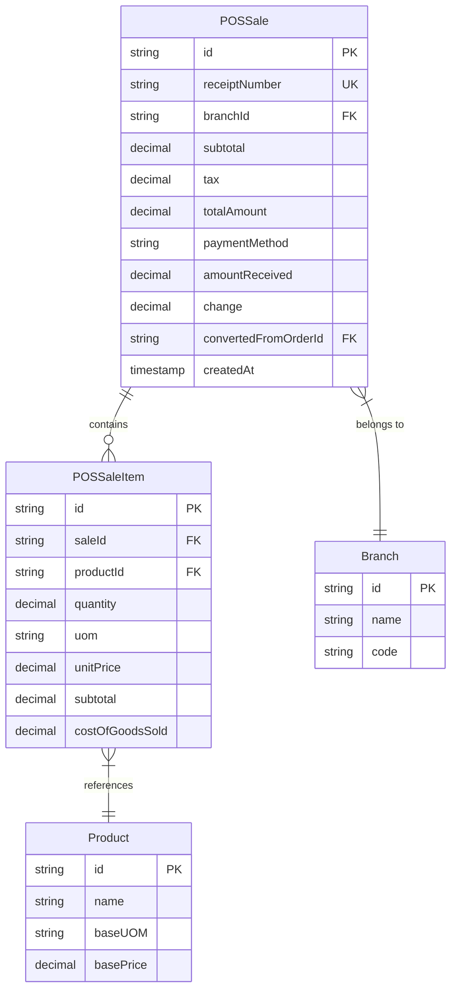
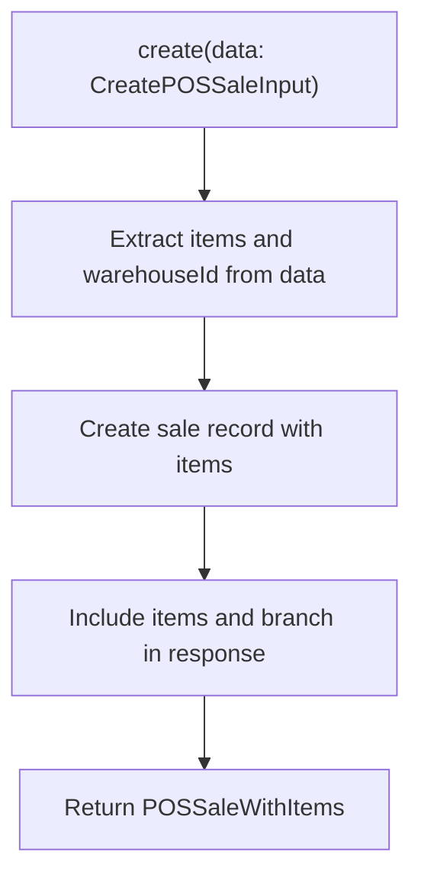
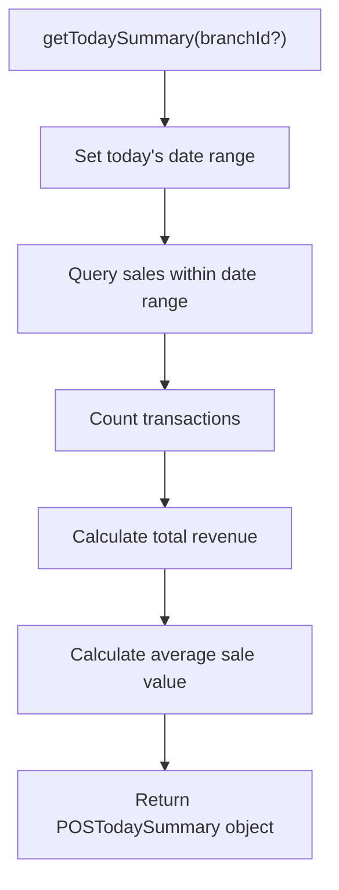
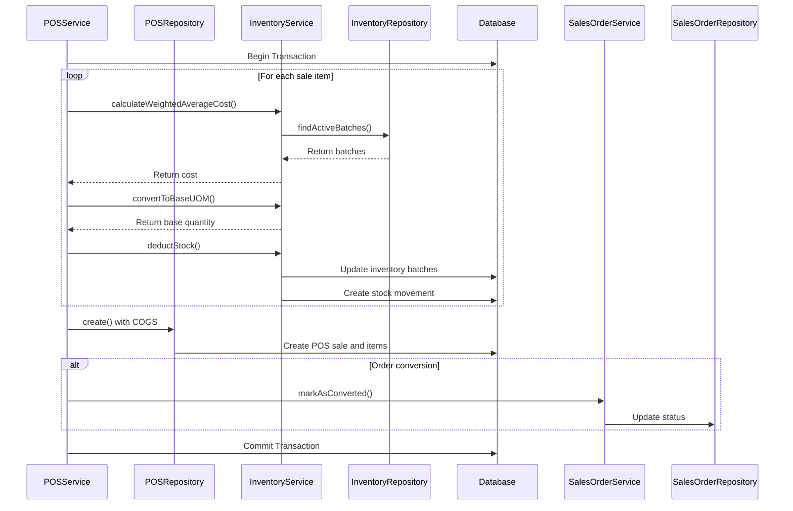
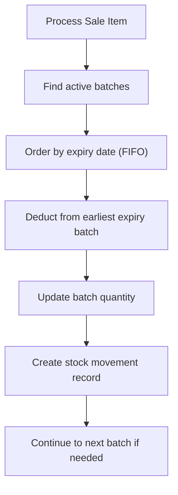
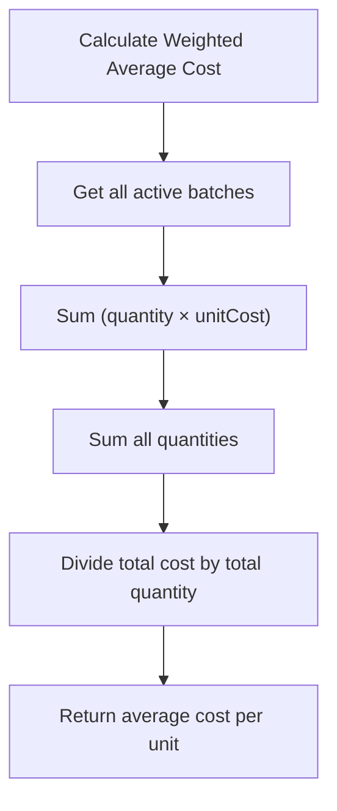
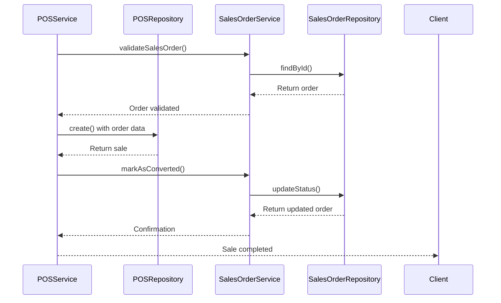
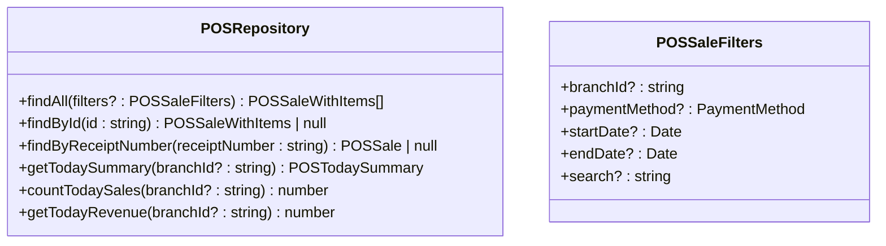
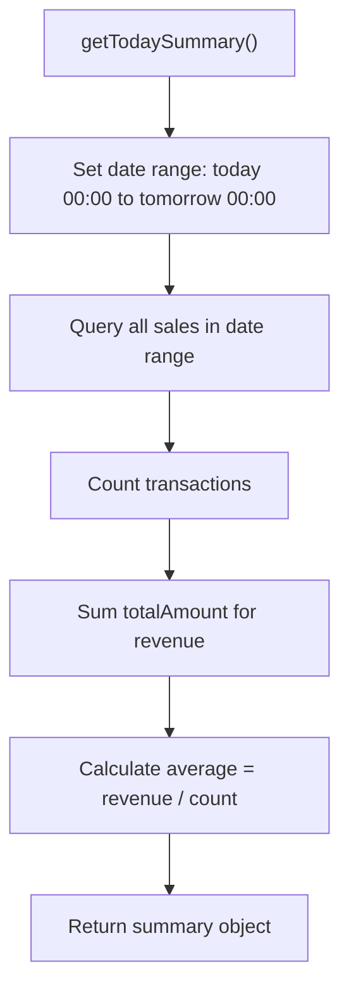
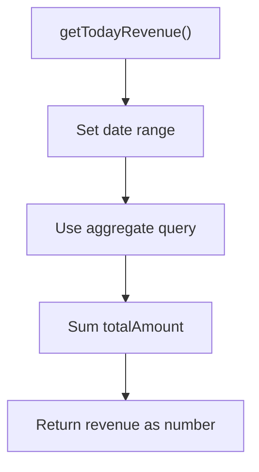

# POS Repository

<cite>
**Referenced Files in This Document**   
- [pos.repository.ts](file://repositories/pos.repository.ts)
- [pos.types.ts](file://types/pos.types.ts)
- [pos.service.ts](file://services/pos.service.ts)
- [inventory.service.ts](file://services/inventory.service.ts)
- [inventory.repository.ts](file://repositories/inventory.repository.ts)
- [sales-order.service.ts](file://services/sales-order.service.ts)
- [migration.sql](file://prisma/migrations/20251113094445_init/migration.sql)
</cite>

## Table of Contents
1. [Introduction](#introduction)
2. [Core Responsibilities](#core-responsibilities)
3. [Sales Transaction Model](#sales-transaction-model)
4. [Key Methods](#key-methods)
5. [Database Transactions and Atomicity](#database-transactions-and-atomicity)
6. [Integration with Inventory System](#integration-with-inventory-system)
7. [Integration with Sales Orders](#integration-with-sales-orders)
8. [Querying Sales Data](#querying-sales-data)
9. [Daily Summary and Reporting](#daily-summary-and-reporting)
10. [Receipt Generation and Reconciliation](#receipt-generation-and-reconciliation)

## Introduction

The POS Repository is a critical component in the point-of-sale system, responsible for managing sales transactions, maintaining data consistency, and ensuring atomic operations across related systems. It serves as the data access layer for POS operations, providing methods to create, retrieve, and summarize sales data while maintaining integrity with inventory, accounts receivable, and reporting systems.

**Section sources**
- [pos.repository.ts](file://repositories/pos.repository.ts#L10-L181)

## Core Responsibilities

The POS Repository has several key responsibilities in the sales processing workflow:

1. **Sales Record Management**: Creating and retrieving sales records with complete transaction details
2. **Data Consistency**: Ensuring consistency between sales, inventory, and financial records
3. **Transaction Atomicity**: Guaranteeing that sales operations are atomic through database transactions
4. **Reporting**: Providing methods to summarize sales data for daily reporting and analytics
5. **Integration**: Coordinating with inventory and sales order systems to maintain data integrity

The repository works in conjunction with the POS Service layer, which handles business logic, validation, and coordination between different system components.

**Section sources**
- [pos.repository.ts](file://repositories/pos.repository.ts#L10-L181)
- [pos.service.ts](file://services/pos.service.ts#L16-L213)

## Sales Transaction Model

The sales transaction model is defined in the database schema and TypeScript types, capturing all essential information about a POS sale.



**Diagram sources**
- [migration.sql](file://prisma/migrations/20251113094445_init/migration.sql#L170-L199)
- [pos.types.ts](file://types/pos.types.ts#L14-L25)

The sales transaction model includes:

- **Core Financial Data**: Subtotal, tax, and total amount with proper decimal precision
- **Payment Information**: Payment method, amount received, and change calculation
- **Inventory Tracking**: Reference to warehouse for inventory deduction
- **Order Conversion**: Link to sales orders when a pending order is converted to a POS sale
- **Receipt Management**: Unique receipt numbers with date-based sequencing

The model supports multiple payment methods including cash, card, check, gcash, and online transfer, with specific handling for cash transactions that require amount received and change calculation.

**Section sources**
- [pos.types.ts](file://types/pos.types.ts#L14-L25)
- [migration.sql](file://prisma/migrations/20251113094445_init/migration.sql#L170-L199)

## Key Methods

### createSale Method

The `create` method in the POS Repository is responsible for creating a new sales record in the database. It accepts a `CreatePOSSaleInput` object containing all sale details and returns a `POSSaleWithItems` object with the complete transaction.



**Diagram sources**
- [pos.repository.ts](file://repositories/pos.repository.ts#L72-L98)

The method handles:
- Creating the main sale record with financial details
- Creating associated sale items with product references
- Including related data (items and branch) in the response
- Properly typing the return value with all necessary relationships

**Section sources**
- [pos.repository.ts](file://repositories/pos.repository.ts#L72-L98)
- [pos.types.ts](file://types/pos.types.ts#L14-L25)

### getTodaySalesSummary Method

The `getTodaySummary` method provides a comprehensive summary of today's sales performance, which is essential for daily reporting and business analysis.



**Diagram sources**
- [pos.repository.ts](file://repositories/pos.repository.ts#L100-L133)

The method calculates three key performance indicators:
- **Transaction Count**: Total number of sales transactions
- **Total Revenue**: Sum of all sale amounts
- **Average Sale Value**: Mean value of transactions

The method supports optional filtering by branch, allowing for both system-wide and branch-specific summaries.

**Section sources**
- [pos.repository.ts](file://repositories/pos.repository.ts#L100-L133)
- [pos.types.ts](file://types/pos.types.ts#L66-L69)

### savePendingOrder Method

While the POS Repository itself doesn't directly handle pending orders, it works in conjunction with the Sales Order system to manage order conversion. When a sales order is converted to a POS sale, the repository creates the corresponding sale record.

The workflow for saving and converting pending orders involves:
1. Creating a sales order through the Sales Order Service
2. When ready for fulfillment, converting the sales order to a POS sale
3. The POS Service calling the POS Repository to create the sale
4. Updating the original sales order status to "converted"

This integration ensures that pending orders can be managed separately from immediate sales while maintaining a consistent transaction history.

**Section sources**
- [pos.service.ts](file://services/pos.service.ts#L126-L209)
- [sales-order.service.ts](file://services/sales-order.service.ts#L261-L268)

## Database Transactions and Atomicity

The POS system ensures atomicity of sales operations through database transactions managed at the service layer. While the repository provides the data access methods, the service orchestrates the transaction to maintain consistency across multiple systems.



**Diagram sources**
- [pos.service.ts](file://services/pos.service.ts#L160-L209)
- [inventory.service.ts](file://services/inventory.service.ts#L184-L257)

The transaction ensures that:
- Inventory is deducted only if the sale is successfully recorded
- Cost of Goods Sold (COGS) is calculated consistently with inventory costs
- Stock movements are recorded for audit purposes
- Sales order status is updated if the sale was converted from an order

If any part of the transaction fails, all operations are rolled back, preventing data inconsistency.

**Section sources**
- [pos.service.ts](file://services/pos.service.ts#L160-L209)
- [inventory.service.ts](file://services/inventory.service.ts#L184-L257)

## Integration with Inventory System

The POS Repository integrates closely with the inventory system to ensure accurate stock levels and proper cost accounting. This integration is managed through the POS Service, which coordinates between the POS Repository and Inventory Service.

### Inventory Deduction Process

When a sale is processed, inventory is deducted using a First-In, First-Out (FIFO) approach based on expiry dates:



**Diagram sources**
- [inventory.service.ts](file://services/inventory.service.ts#L184-L257)
- [inventory.repository.ts](file://repositories/inventory.repository.ts#L95-L108)

The process involves:
- Finding all active inventory batches for the product
- Sorting batches by expiry date (earliest first)
- Deducting stock from the earliest expiry batch
- Moving to the next batch if the current one is depleted
- Creating stock movement records for audit trails

### Cost of Goods Sold Calculation

The POS system uses weighted average cost for COGS calculation, which provides a more accurate representation of inventory costs:



**Diagram sources**
- [inventory.service.ts](file://services/inventory.service.ts#L49-L70)
- [inventory.repository.ts](file://repositories/inventory.repository.ts#L95-L108)

The weighted average cost formula is:
- Total Cost = Σ (quantity × unitCost) for all batches
- Total Quantity = Σ quantity for all batches
- Weighted Average Cost = Total Cost / Total Quantity

This cost is then used to calculate COGS for each sale item, ensuring accurate profit margin reporting.

**Section sources**
- [inventory.service.ts](file://services/inventory.service.ts#L49-L70)
- [inventory.repository.ts](file://repositories/inventory.repository.ts#L95-L108)

## Integration with Sales Orders

The POS system supports conversion of sales orders to POS sales, allowing for pre-orders and reservations to be fulfilled at the point of sale.

### Order Conversion Workflow



**Diagram sources**
- [pos.service.ts](file://services/pos.service.ts#L204-L206)
- [sales-order.service.ts](file://services/sales-order.service.ts#L261-L268)

When a sales order is converted to a POS sale:
1. The original sales order is validated and retrieved
2. The POS sale is created with the order details
3. The sales order status is updated to "converted"
4. The POS sale record references the original order ID

This integration maintains a complete audit trail from order creation to fulfillment.

**Section sources**
- [pos.service.ts](file://services/pos.service.ts#L204-L206)
- [sales-order.service.ts](file://services/sales-order.service.ts#L261-L268)

## Querying Sales Data

The POS Repository provides flexible querying capabilities to retrieve sales data based on various criteria.

### Query Methods

The repository implements several methods for retrieving sales data:



**Diagram sources**
- [pos.repository.ts](file://repositories/pos.repository.ts#L10-L181)
- [pos.types.ts](file://types/pos.types.ts#L58-L63)

The `findAll` method supports filtering by:
- **Branch**: Filter sales by specific branch
- **Payment Method**: Filter by cash, card, or other payment types
- **Date Range**: Filter sales between specific dates
- **Search**: Search by receipt number (case-insensitive)

### Query Examples

**Query pending orders by terminal:**
```typescript
// This would be handled by the sales order system
const pendingOrders = await salesOrderService.getPendingSalesOrders(branchId);
```

**Query completed sales by cashier:**
```typescript
// The current system doesn't track cashier, but could be extended
const salesByCashier = await posRepository.findAll({
  branchId: "branch-123",
  // Additional cashier filter would need to be added
});
```

**Query sales by date range:**
```typescript
const sales = await posRepository.findAll({
  startDate: new Date("2025-01-01"),
  endDate: new Date("2025-01-31"),
  branchId: "branch-123"
});
```

**Section sources**
- [pos.repository.ts](file://repositories/pos.repository.ts#L10-L50)
- [pos.types.ts](file://types/pos.types.ts#L58-L63)

## Daily Summary and Reporting

The POS Repository provides methods to generate daily summaries, which are essential for reconciliation and performance monitoring.

### Today's Sales Summary

The `getTodaySummary` method calculates key metrics for the current day:



**Diagram sources**
- [pos.repository.ts](file://repositories/pos.repository.ts#L100-L133)

The method is optimized by:
- Using a single query to retrieve all necessary sales records
- Calculating the average value in application code to avoid database aggregation complexity
- Supporting optional branch filtering for multi-branch operations

### Revenue Calculation

The repository also provides dedicated methods for revenue calculation:



**Diagram sources**
- [pos.repository.ts](file://repositories/pos.repository.ts#L156-L180)

The `getTodayRevenue` method uses Prisma's aggregate functionality to efficiently calculate the sum at the database level, reducing data transfer and improving performance for large datasets.

**Section sources**
- [pos.repository.ts](file://repositories/pos.repository.ts#L100-L180)

## Receipt Generation and Reconciliation

While the POS Repository doesn't directly handle receipt printing, it provides the data structure and integrity needed for reliable receipt generation and daily reconciliation.

### Receipt Number Generation

The system generates unique receipt numbers in the format RCP-YYYYMMDD-XXXX, where:
- RCP: Receipt prefix
- YYYYMMDD: Date of transaction
- XXXX: Sequential number for the day

This ensures:
- Chronological organization of receipts
- Uniqueness within each day
- Easy identification and lookup

### Daily Reconciliation

The repository supports daily reconciliation through:
- Complete transaction records with timestamps
- Detailed item-level information
- Payment method tracking
- Daily summary statistics

These features enable accurate reconciliation of cash, card, and other payment types against physical counts and bank deposits.

**Section sources**
- [pos.service.ts](file://services/pos.service.ts#L20-L48)
- [pos.repository.ts](file://repositories/pos.repository.ts#L100-L133)