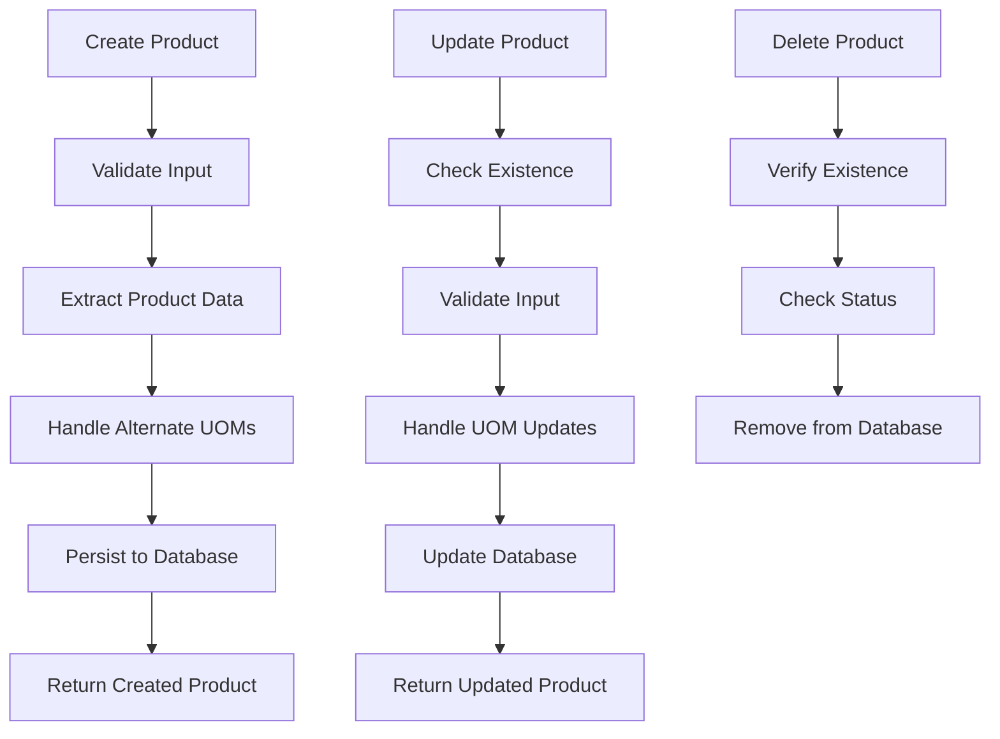
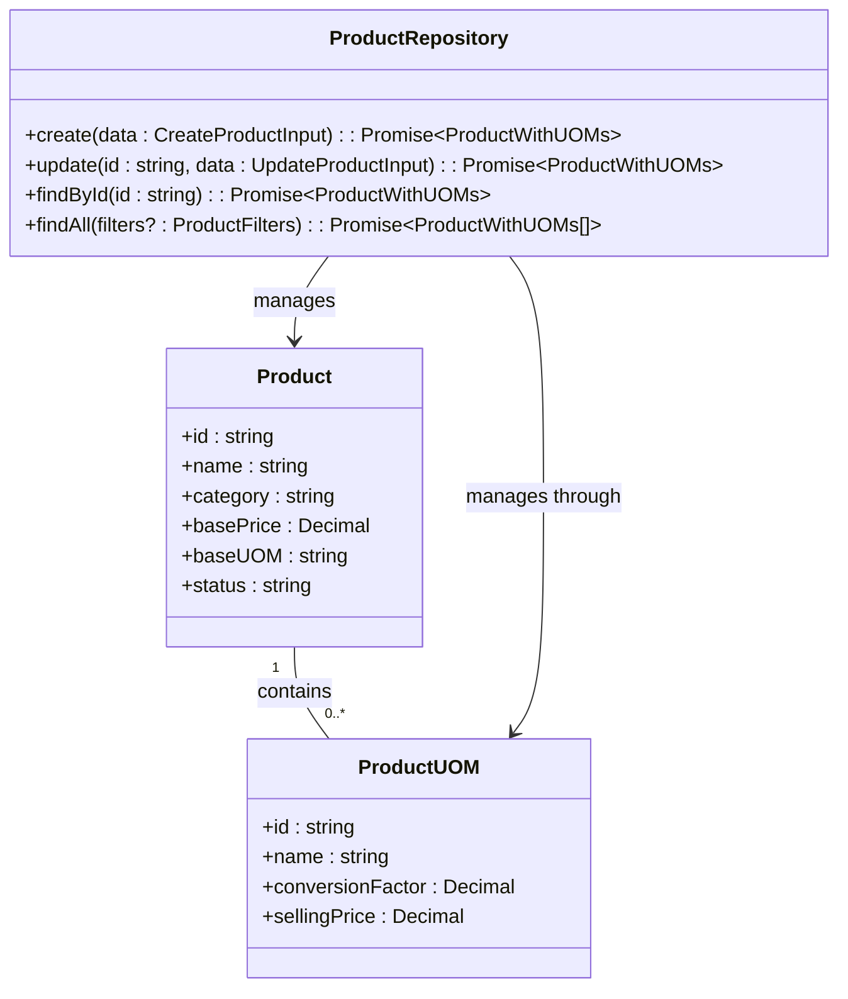
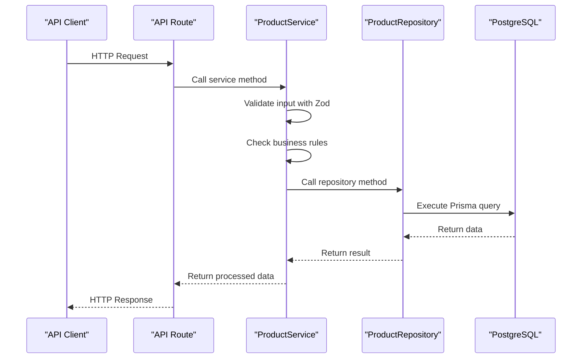

# Product Repository

<cite>
**Referenced Files in This Document**   
- [product.repository.ts](file://repositories/product.repository.ts)
- [product.service.ts](file://services/product.service.ts)
- [product.validation.ts](file://lib/validations/product.validation.ts)
- [product.types.ts](file://types/product.types.ts)
- [prisma/schema.prisma](file://prisma/schema.prisma)
- [migration.sql](file://prisma/migrations/20251113094445_init/migration.sql)
</cite>

## Table of Contents
1. [Introduction](#introduction)
2. [Core CRUD Operations](#core-crud-operations)
3. [Relational Data Management](#relational-data-management)
4. [Data Validation and Error Handling](#data-validation-and-error-handling)
5. [Query Filtering and Indexing](#query-filtering-and-indexing)
6. [Integration with ProductService](#integration-with-productservice)
7. [Soft Delete and Status Management](#soft-delete-and-status-management)
8. [Transaction Safety](#transaction-safety)

## Introduction
The ProductRepository class provides a comprehensive data access layer for managing Product entities within the inventory management system. It encapsulates all database operations for products, including CRUD functionality, relational data handling for Unit of Measure (UOM) configurations, and complex querying capabilities. Built on Prisma ORM, the repository ensures type-safe database interactions and efficient data retrieval patterns. The implementation follows a clean separation of concerns, with the repository focusing exclusively on data access logic while delegating business validation to the ProductService layer. This design enables maintainable code and clear responsibility boundaries across the application architecture.

**Section sources**
- [product.repository.ts](file://repositories/product.repository.ts#L5-L126)

## Core CRUD Operations
The ProductRepository implements standard CRUD operations for product management, providing methods to create, read, update, and delete product records. The `create` method accepts a CreateProductInput object and persists it to the database, while the `findById` and `findAll` methods enable retrieval of individual products or collections based on various criteria. The `update` method handles modifications to existing products, and the `delete` method removes products from the system. These operations leverage Prisma's type-safe query builder to ensure compile-time verification of database interactions. The repository returns ProductWithUOMs type for operations that require relational data, ensuring consumers receive complete product information with associated UOM configurations.



**Diagram sources**
- [product.repository.ts](file://repositories/product.repository.ts#L58-L116)

**Section sources**
- [product.repository.ts](file://repositories/product.repository.ts#L58-L116)

## Relational Data Management
The repository handles complex relational data operations for products and their associated Unit of Measure (UOM) configurations. When creating or updating products, the repository processes alternate UOMs through Prisma's nested write operations, ensuring atomic transactions between product and UOM records. The `create` method uses Prisma's create relation syntax to establish connections between products and their alternate UOMs in a single operation. For updates, the repository implements a replace pattern: when alternate UOMs are provided, it first deletes existing UOM configurations and then creates new ones, maintaining data consistency. All read operations that return products include the alternateUOMs relation by default, providing consumers with complete product data in a single query.



**Diagram sources**
- [product.repository.ts](file://repositories/product.repository.ts#L58-L116)
- [prisma/schema.prisma](file://prisma/schema.prisma#L18-L44)

**Section sources**
- [product.repository.ts](file://repositories/product.repository.ts#L58-L116)
- [prisma/schema.prisma](file://prisma/schema.prisma#L18-L44)

## Data Validation and Error Handling
While the ProductRepository focuses on data access, it works in conjunction with Zod-based validation implemented in the ProductService layer to ensure data integrity. The repository methods accept pre-validated input from the service layer, allowing it to concentrate on database operations without duplicating validation logic. When database operations fail, Prisma automatically throws appropriate exceptions that can be mapped to meaningful error types by higher layers. The repository design follows fail-fast principles, with database constraints enforcing critical business rules such as unique product names. This separation of concerns allows the repository to remain focused on data persistence while enabling comprehensive validation at the service boundary.

**Section sources**
- [product.service.ts](file://services/product.service.ts#L29-L65)
- [product.validation.ts](file://lib/validations/product.validation.ts#L9-L25)

## Query Filtering and Indexing
The repository supports flexible product querying through the `findAll` method, which accepts optional ProductFilters to constrain results by category, status, or search term. The implementation builds dynamic WHERE clauses based on provided filter criteria, enabling efficient data retrieval patterns. Database indexing strategies have been implemented to optimize query performance on critical fields including product name, category, and status. The migration script shows creation of indexes on Product_status_idx, Product_category_idx, and Product_name_idx, ensuring fast lookups for common filtering operations. Text search is implemented using Prisma's case-insensitive contains operator, allowing partial matching on product names.

```mermaid
erDiagram
PRODUCT {
string id PK
string name UK
string category
string status
decimal basePrice
string baseUOM
}
PRODUCT_UOM {
string id PK
string productId FK
string name
decimal conversionFactor
decimal sellingPrice
}
PRODUCT ||--o{ PRODUCT_UOM : "1 to many"
INDEX Product_status_idx ON PRODUCT(status)
INDEX Product_category_idx ON PRODUCT(category)
INDEX Product_name_idx ON PRODUCT(name)
```

**Diagram sources**
- [product.repository.ts](file://repositories/product.repository.ts#L6-L30)
- [migration.sql](file://prisma/migrations/20251113094445_init/migration.sql#L291-L297)

**Section sources**
- [product.repository.ts](file://repositories/product.repository.ts#L6-L30)
- [migration.sql](file://prisma/migrations/20251113094445_init/migration.sql#L291-L297)

## Integration with ProductService
The ProductRepository serves as the data access foundation for the ProductService, which implements business logic and validation rules. The service layer consumes the repository's methods, adding validation, business rules, and error handling before delegating to the repository for data persistence. This layered architecture enables separation of concerns, with the repository handling database interactions and the service managing application logic. The productService uses methods like `getAllProducts`, `getProductById`, and `createProduct` to expose functionality through API routes, creating a clear progression from HTTP requests to database operations. This design promotes reusability and testability, as the repository can be easily mocked for service layer testing.



**Diagram sources**
- [product.service.ts](file://services/product.service.ts#L13-L65)
- [product.repository.ts](file://repositories/product.repository.ts#L6-L30)

**Section sources**
- [product.service.ts](file://services/product.service.ts#L13-L65)

## Soft Delete and Status Management
The repository implements a soft delete pattern through status management rather than physical record deletion. The `updateStatus` method allows transitioning products between 'active' and 'inactive' states, preserving historical data while controlling visibility in the system. The `delete` method physically removes products from the database but is intended to be used only for inactive products, as enforced by the ProductService. Query methods like `findActive` automatically filter for products with 'active' status, ensuring that inactive products are excluded from standard operations. This approach maintains referential integrity with related records in inventory batches, purchase orders, and sales transactions while providing the flexibility to reactivate products if needed.

**Section sources**
- [product.repository.ts](file://repositories/product.repository.ts#L48-L56)
- [product.repository.ts](file://repositories/product.repository.ts#L118-L123)

## Transaction Safety
While individual repository methods operate within implicit database transactions managed by Prisma, complex operations involving multiple entities are handled at the service layer with explicit transaction management. The repository's design supports transactional safety by providing atomic methods for create, update, and delete operations. When updating products with alternate UOMs, the repository ensures data consistency by first deleting existing UOM configurations before creating new ones, preventing orphaned records. For operations that span multiple repositories, such as inventory updates during product creation, the ProductService coordinates transactions across repository boundaries, maintaining data integrity across the system. This layered transaction approach provides both simplicity for single-entity operations and robustness for complex workflows.

**Section sources**
- [product.repository.ts](file://repositories/product.repository.ts#L76-L109)
- [product.service.ts](file://services/product.service.ts#L68-L117)