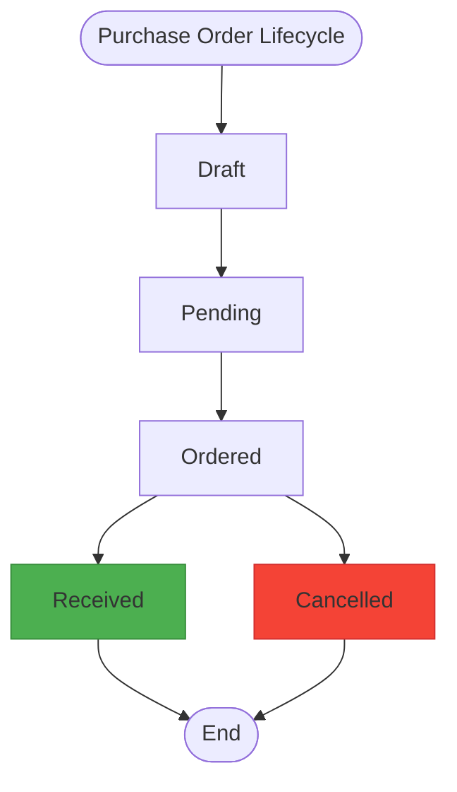
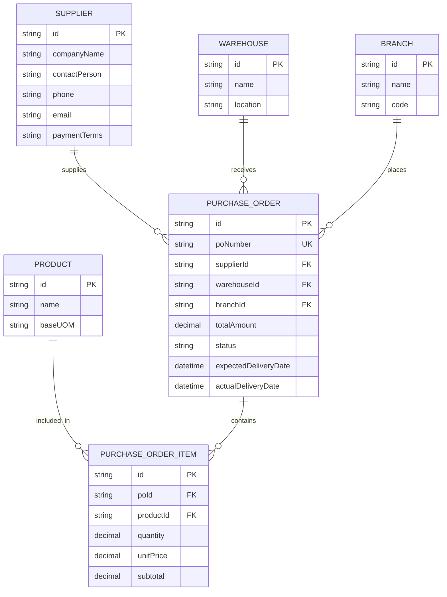
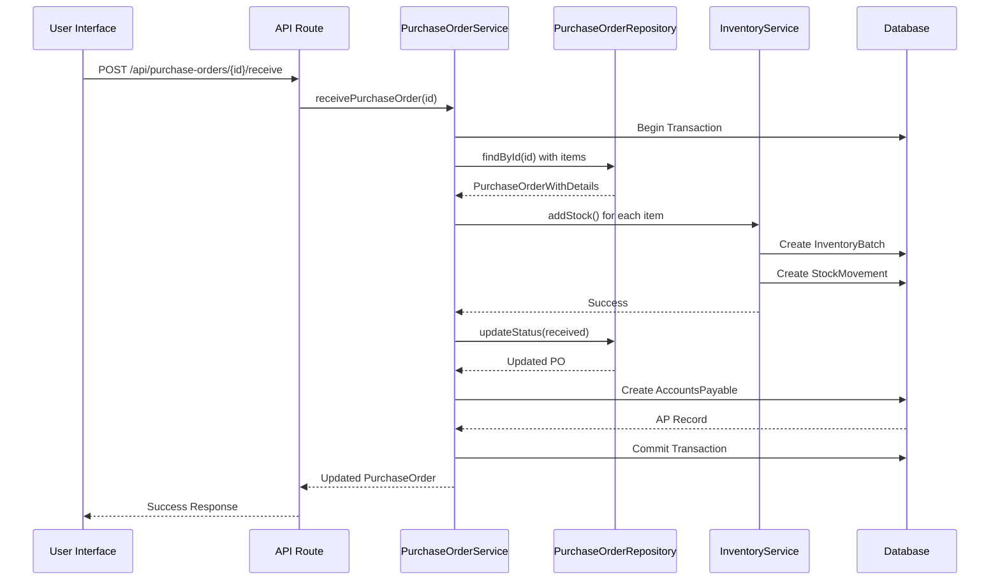

# Purchase Order Repository

<cite>
**Referenced Files in This Document**   
- [purchase-order.repository.ts](file://repositories/purchase-order.repository.ts)
- [purchase-order.types.ts](file://types/purchase-order.types.ts)
- [purchase-order.service.ts](file://services/purchase-order.service.ts)
- [inventory.service.ts](file://services/inventory.service.ts)
- [migration.sql](file://prisma/migrations/20251113094445_init/migration.sql)
- [receive/route.ts](file://app/api/purchase-orders/[id]/receive/route.ts)
- [cancel/route.ts](file://app/api/purchase-orders/[id]/cancel/route.ts)
</cite>

## Table of Contents
1. [Introduction](#introduction)
2. [Core Lifecycle Management](#core-lifecycle-management)
3. [Relational Data Handling](#relational-data-handling)
4. [Transaction Boundaries and Error Handling](#transaction-boundaries-and-error-handling)
5. [Querying Purchase Orders](#querying-purchase-orders)
6. [Integration with AP and Inventory Systems](#integration-with-ap-and-inventory-systems)
7. [Conclusion](#conclusion)

## Introduction

The `PurchaseOrderRepository` is a central component in the inventory and procurement system, responsible for managing the complete lifecycle of purchase orders from creation to receipt and cancellation. It operates as a data access layer that abstracts direct interactions with the database, ensuring consistent and validated operations across the application. The repository works in conjunction with the `PurchaseOrderService` to enforce business rules, maintain data integrity, and coordinate with other systems such as inventory management and accounts payable (AP). This document provides a comprehensive overview of its functionality, focusing on key methods, relational data handling, transaction management, and integration points.

**Section sources**
- [purchase-order.repository.ts](file://repositories/purchase-order.repository.ts#L1-L223)
- [purchase-order.types.ts](file://types/purchase-order.types.ts#L1-L54)

## Core Lifecycle Management

The `PurchaseOrderRepository` supports the full lifecycle of a purchase order through a series of well-defined methods that handle creation, updates, receipt, and cancellation. Each stage enforces specific business rules and transitions the order through defined statuses: draft, pending, ordered, received, and cancelled.

### Creation and Update of Purchase Orders

Purchase orders are created using the `create` method, which accepts structured input containing supplier, warehouse, branch, expected delivery date, and line items. The method automatically calculates the total amount by summing the product of quantity and unit price for each item. It also generates a unique PO number via the service layer and persists the order along with its associated items in a single atomic operation.

Updates to purchase orders are handled by the `update` method. If new items are provided, the existing items are first deleted and replaced with the updated list. This ensures data consistency and prevents orphaned records. The update operation is restricted to orders in "draft" or "pending" status, preventing modifications to orders that are already in process or fulfilled.

### Receiving a Purchase Order

The `receiveOrder` functionality is implemented in the `PurchaseOrderService` rather than directly in the repository, as it involves multiple system interactions. When a purchase order is received, the system performs the following actions within a database transaction:

1. Validates that the order is not already received or cancelled.
2. For each line item, calls the `inventoryService.addStock` method to create new inventory batches.
3. Updates the purchase order status to "received" and records the actual delivery date.
4. Creates an Accounts Payable (AP) record with a due date calculated based on the supplier's payment terms.

This process ensures that inventory levels are updated and financial obligations are tracked simultaneously, maintaining system-wide consistency.

### Cancelling a Purchase Order

The `cancelOrder` operation prevents cancellation of received or already cancelled orders. When a cancellation is requested, the system:
1. Updates the order status to "cancelled".
2. Appends the cancellation reason to the order notes, preserving any original notes.
3. Returns the updated order details.

This two-step update (status then notes) ensures auditability and traceability of the cancellation event.



**Diagram sources**
- [purchase-order.repository.ts](file://repositories/purchase-order.repository.ts#L194-L213)
- [purchase-order.service.ts](file://services/purchase-order.service.ts#L273-L370)
- [purchase-order.types.ts](file://types/purchase-order.types.ts#L3)

**Section sources**
- [purchase-order.repository.ts](file://repositories/purchase-order.repository.ts#L91-L192)
- [purchase-order.service.ts](file://services/purchase-order.service.ts#L239-L268)
- [purchase-order.service.ts](file://services/purchase-order.service.ts#L273-L370)

## Relational Data Handling

The `PurchaseOrderRepository` manages complex relational data involving suppliers, products, warehouses, and branches. It leverages Prisma's relational queries to include related entities when retrieving purchase orders, providing a complete view of each order.

### Purchase Order Structure

Each purchase order contains:
- **Supplier Information**: Linked via `supplierId`, including company name, contact details, and payment terms.
- **Warehouse and Branch**: Specifies where the goods should be delivered and which business unit placed the order.
- **Line Items**: A collection of `PurchaseOrderItem` records, each referencing a product, quantity, unit price, and subtotal.
- **Product Details**: When retrieving orders, product information such as name and base unit of measure (UOM) is included for display purposes.

The repository uses the `include` option in Prisma queries to eagerly load these relationships, reducing the need for additional database calls.

### Foreign Key Constraints

The database schema enforces referential integrity through foreign key constraints:
- `PurchaseOrder.supplierId` references `Supplier.id`
- `PurchaseOrder.warehouseId` references `Warehouse.id`
- `PurchaseOrder.branchId` references `Branch.id`
- `PurchaseOrderItem.poId` references `PurchaseOrder.id`
- `PurchaseOrderItem.productId` references `Product.id`

These constraints ensure that purchase orders cannot reference non-existent entities, maintaining data consistency.



**Diagram sources**
- [migration.sql](file://prisma/migrations/20251113094445_init/migration.sql#L107-L134)
- [purchase-order.repository.ts](file://repositories/purchase-order.repository.ts#L43-L58)

**Section sources**
- [purchase-order.repository.ts](file://repositories/purchase-order.repository.ts#L43-L58)
- [migration.sql](file://prisma/migrations/20251113094445_init/migration.sql#L107-L134)

## Transaction Boundaries and Error Handling

The `PurchaseOrderRepository` itself executes individual database operations, but transaction boundaries are managed at the service layer to coordinate multi-step processes. This separation of concerns allows the repository to remain focused on data access while the service handles business logic and transaction orchestration.

### Transaction Management During Order Fulfillment

When receiving a purchase order, the `receivePurchaseOrder` method in `PurchaseOrderService` wraps the entire operation in a Prisma transaction (`prisma.$transaction`). This ensures that all steps—updating inventory, changing order status, and creating AP records—are executed atomically. If any step fails, the entire transaction is rolled back, preventing partial updates that could lead to data inconsistency.

For example, if inventory update succeeds but AP creation fails, the inventory changes are automatically reverted, and the purchase order remains in its previous state.

### Error Handling for Partial Receives

The current implementation does not support partial receives; a purchase order must be received in full or not at all. The system validates this by checking the order status before processing. If an attempt is made to receive an already received or cancelled order, a `ValidationError` is thrown with an appropriate message.

Additionally, the system performs pre-flight validation:
- Ensures the purchase order exists
- Verifies the supplier is active
- Confirms all products in the order are active and available
- Validates quantities and prices are positive

These validations prevent invalid states from being persisted to the database.



**Diagram sources**
- [receive/route.ts](file://app/api/purchase-orders/[id]/receive/route.ts#L6-L34)
- [purchase-order.service.ts](file://services/purchase-order.service.ts#L273-L370)
- [inventory.service.ts](file://services/inventory.service.ts#L115-L180)

**Section sources**
- [purchase-order.service.ts](file://services/purchase-order.service.ts#L273-L370)
- [inventory.service.ts](file://services/inventory.service.ts#L115-L180)

## Querying Purchase Orders

The repository provides flexible querying capabilities through the `findAll` and `findById` methods, allowing retrieval of purchase orders based on various filters.

### Filtering Options

The `findAll` method supports filtering by:
- **Status**: Retrieve orders in a specific state (e.g., pending, received)
- **Branch**: Filter by the branch that placed the order
- **Supplier**: Find all orders for a specific supplier
- **Warehouse**: Identify orders destined for a particular warehouse
- **Date Range**: Query orders created within a specific time period using `startDate` and `endDate`

These filters are combined using Prisma's `where` conditions, enabling complex queries such as "all pending orders from Supplier X to Branch Y created last week."

### Query Examples

To retrieve all pending purchase orders for a specific supplier:
```typescript
const pendingOrders = await purchaseOrderRepository.findAll({
  status: 'pending',
  supplierId: 'sup-123'
});
```

To find all orders received in the last 30 days:
```typescript
const thirtyDaysAgo = new Date();
thirtyDaysAgo.setDate(thirtyDaysAgo.getDate() - 30);

const recentOrders = await purchaseOrderRepository.findAll({
  status: 'received',
  startDate: thirtyDaysAgo
});
```

The results are returned with full relational data, including supplier details, warehouse information, and line items with product names and base UOMs.

**Section sources**
- [purchase-order.repository.ts](file://repositories/purchase-order.repository.ts#L12-L60)

## Integration with AP and Inventory Systems

The `PurchaseOrderRepository` serves as the foundation for integration with both inventory and accounts payable systems, with the actual integration logic implemented in the service layer.

### Inventory System Integration

When a purchase order is received, the system integrates with the inventory module by calling `inventoryService.addStock` for each line item. This method:
- Creates a new `InventoryBatch` with a unique batch number
- Sets the received date and calculates the expiry date based on the product's shelf life
- Records a stock movement of type "IN"
- Uses the purchase order's unit price as the cost basis for inventory valuation

The integration ensures that inventory levels are updated in real-time, and cost accounting is maintained accurately.

### Accounts Payable Integration

Upon receipt, the system automatically creates an `AccountsPayable` record with:
- The total amount from the purchase order
- A due date calculated based on the supplier's payment terms (e.g., Net 30)
- A status of "pending"
- A reference to the purchase order ID

This integration eliminates manual data entry and ensures that financial obligations are tracked from the moment goods are received.

### Data Flow on Receipt

The data flow during order receipt demonstrates tight integration between systems:
1. Purchase order status changes to "received"
2. Inventory system receives product, quantity, cost, and warehouse
3. Inventory creates batch and updates stock levels
4. Accounts Payable system receives order total, supplier, and branch
5. AP record is created with calculated due date
6. All changes are committed atomically

This coordinated workflow ensures that operational and financial systems remain synchronized.

**Section sources**
- [purchase-order.service.ts](file://services/purchase-order.service.ts#L333-L346)
- [inventory.service.ts](file://services/inventory.service.ts#L115-L180)

## Conclusion

The `PurchaseOrderRepository` provides a robust foundation for managing purchase order data with strong support for relational integrity, flexible querying, and lifecycle management. While the repository handles data access, the business logic for order receipt and cancellation is implemented in the service layer, allowing for transactional consistency across multiple domains. The system's integration with inventory and accounts payable ensures that receiving a purchase order automatically updates both physical stock levels and financial records, creating a seamless procurement workflow. Future enhancements could include support for partial receives and more sophisticated inventory costing methods, but the current implementation effectively meets core business requirements.