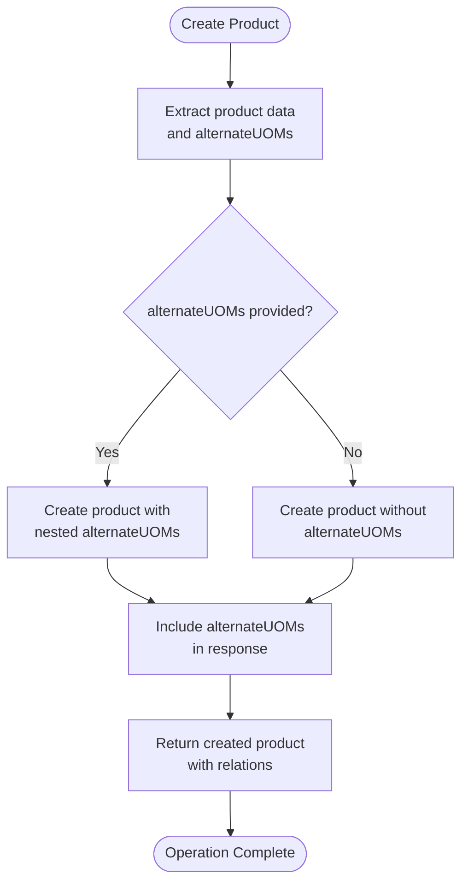
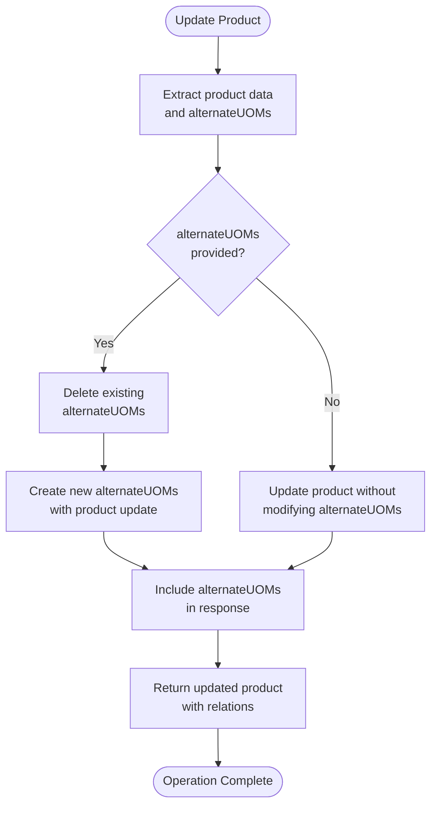
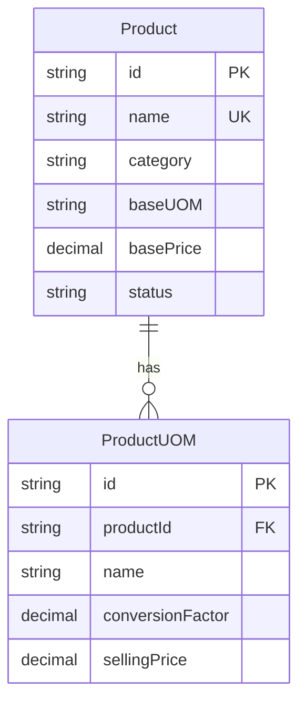
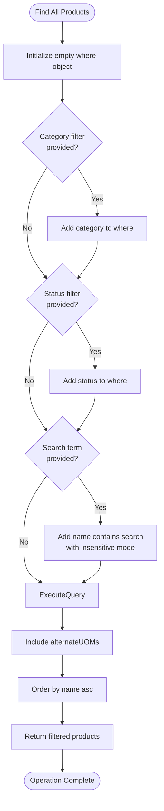
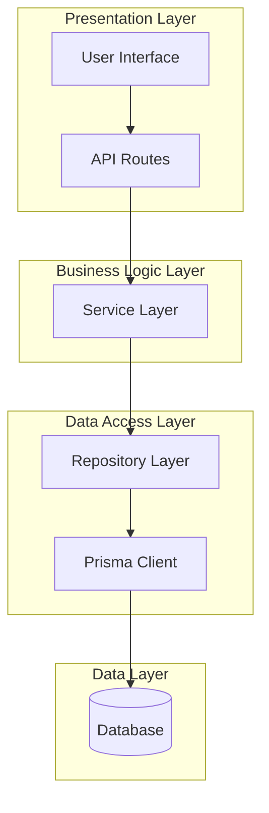

# Repository Pattern

<cite>
**Referenced Files in This Document**   
- [product.repository.ts](file://repositories/product.repository.ts)
- [product.service.ts](file://services/product.service.ts)
- [prisma.ts](file://lib/prisma.ts)
- [product.types.ts](file://types/product.types.ts)
- [supplier.repository.ts](file://repositories/supplier.repository.ts)
- [branch.repository.ts](file://repositories/branch.repository.ts)
- [migration.sql](file://prisma/migrations/20251113094445_init/migration.sql)
</cite>

## Table of Contents
1. [Introduction](#introduction)
2. [Repository Pattern Overview](#repository-pattern-overview)
3. [Core Components](#core-components)
4. [CRUD Operations](#crud-operations)
5. [Relational Data Handling](#relational-data-handling)
6. [Query Filtering and Indexing](#query-filtering-and-indexing)
7. [Error Handling and Data Consistency](#error-handling-and-data-consistency)
8. [Best Practices](#best-practices)
9. [Architecture Overview](#architecture-overview)

## Introduction
The Repository Pattern in this application provides a clean abstraction layer between business logic and database operations using Prisma ORM. This documentation details how repositories encapsulate data access logic, ensuring type safety and separation of concerns. The pattern enables consistent data operations across the application while maintaining flexibility for complex queries and transaction management.

## Repository Pattern Overview
The repository pattern implements a consistent interface for data access across all entities in the system. Each repository class abstracts Prisma operations behind type-safe methods, providing a uniform API for services to interact with the database. The pattern ensures business logic remains decoupled from data access concerns, improving testability and maintainability.

Repositories follow a standard structure with methods for CRUD operations, filtering, and relational data fetching. They work in conjunction with service layers that handle business logic and validation, creating a clear separation of responsibilities. The repositories use Prisma Client as the underlying ORM, leveraging its type safety and query capabilities.

**Section sources**
- [product.repository.ts](file://repositories/product.repository.ts#L5-L126)
- [supplier.repository.ts](file://repositories/supplier.repository.ts#L5-L97)
- [branch.repository.ts](file://repositories/branch.repository.ts#L5-L58)

## Core Components

The core components of the repository pattern include the repository classes, type definitions, and the Prisma client instance. Repository classes encapsulate all data access logic for their respective entities, exposing methods that abstract the underlying Prisma operations. Type definitions ensure type safety throughout the data access layer, while the Prisma client provides the connection to the database.

Each repository follows the same design pattern with consistent method signatures for common operations. This consistency makes it easy to understand and use any repository in the system. The repositories are instantiated as singletons and exported for use by service layers, ensuring efficient resource usage.

**Section sources**
- [product.repository.ts](file://repositories/product.repository.ts#L5-L126)
- [product.types.ts](file://types/product.types.ts#L1-L48)
- [prisma.ts](file://lib/prisma.ts#L1-L9)

## CRUD Operations

### Create Operation
The create operation in the ProductRepository handles the creation of new product records with support for nested relations. When creating a product, the repository accepts a CreateProductInput type that includes both product data and optional alternate UOMs (Units of Measure). The implementation separates the product data from the alternateUOMs property and uses Prisma's nested write operations to create both the product and its related UOMs in a single transaction.

**Diagram sources**
- [product.repository.ts](file://repositories/product.repository.ts#L58-L74)

**Section sources**
- [product.repository.ts](file://repositories/product.repository.ts#L58-L74)
- [product.types.ts](file://types/product.types.ts#L13-L24)

### Read Operations
The repository provides multiple methods for reading data, including findById, findAll, and findActive. The findById method retrieves a single product by its ID, including its alternate UOMs. The findAll method supports filtering through the ProductFilters interface, allowing clients to filter by category, status, or search term. The findActive method returns all products with an 'active' status, ordered by name.

These methods use Prisma's include feature to automatically load related data (alternateUOMs) and apply appropriate ordering. The filtering logic in findAll builds a dynamic where clause based on the provided filters, enabling flexible querying while maintaining type safety.

**Section sources**
- [product.repository.ts](file://repositories/product.repository.ts#L33-L56)

### Update Operation
The update operation handles both simple updates and complex scenarios involving nested relations. When updating a product, the repository checks if alternateUOMs are provided in the update data. If they are, it first deletes all existing alternate UOMs for the product and then creates new ones, effectively replacing the entire collection. This approach ensures data consistency and prevents orphaned records.

The implementation separates the update logic into two paths: one for updates that include alternateUOMs and one for updates that don't. This conditional logic allows the repository to handle both scenarios efficiently while maintaining data integrity.

**Diagram sources**
- [product.repository.ts](file://repositories/product.repository.ts#L76-L109)

**Section sources**
- [product.repository.ts](file://repositories/product.repository.ts#L76-L109)

### Delete Operation
The repository implements both hard and soft delete patterns depending on the entity. For products, the delete method performs a hard delete using Prisma's delete operation. However, other repositories like SupplierRepository implement soft delete through an update operation that changes the status field to 'inactive'.

The delete operation for products is straightforward, simply calling Prisma's delete method with the provided ID. This operation will cascade to related records based on the Prisma schema configuration, ensuring referential integrity is maintained.

**Section sources**
- [product.repository.ts](file://repositories/product.repository.ts#L112-L116)
- [supplier.repository.ts](file://repositories/supplier.repository.ts#L78-L82)

## Relational Data Handling

### ProductWithUOMs Relationship
The Product and ProductUOM entities have a one-to-many relationship, where a product can have multiple alternate units of measure. This relationship is defined in the Prisma schema with appropriate foreign key constraints and cascade behavior. The ProductWithUOMs type combines the Product entity with its related alternateUOMs array, providing a convenient interface for consumers.

When creating or updating a product with alternate UOMs, the repository uses Prisma's nested write operations to manage the relationship. For creation, it uses the 'create' directive within the data object. For updates, it first deletes existing UOMs and then creates new ones, ensuring the relationship is properly maintained.

The database schema includes a composite unique index on ProductUOM (productId, name) to prevent duplicate UOM names for the same product, and a foreign key constraint with cascade delete to automatically clean up UOMs when a product is deleted.

**Diagram sources**
- [product.repository.ts](file://repositories/product.repository.ts#L58-L74)
- [migration.sql](file://prisma/migrations/20251113094445_init/migration.sql#L34-L44)

**Section sources**
- [product.repository.ts](file://repositories/product.repository.ts#L58-L74)
- [product.types.ts](file://types/product.types.ts#L39-L41)
- [migration.sql](file://prisma/migrations/20251113094445_init/migration.sql#L17-L44)

### Nested Relation Management
The repository pattern handles nested relations through careful management of Prisma's nested write operations. For the product-alternateUOM relationship, the implementation uses a replace pattern rather than an update pattern. When alternateUOMs are provided in an update, the repository first deletes all existing UOMs for the product and then creates new ones.

This approach ensures data consistency and prevents issues with partial updates. It also simplifies the implementation by avoiding complex merge logic. The trade-off is that it generates more database operations, but this is acceptable given the relatively low frequency of product updates compared to reads.

The pattern could be extended to support more sophisticated relation management, such as partial updates or differential updates, but the current implementation prioritizes simplicity and data integrity.

**Section sources**
- [product.repository.ts](file://repositories/product.repository.ts#L76-L109)

## Query Filtering and Indexing

### Filter Implementation
The findAll method implements flexible filtering through the ProductFilters interface, which supports filtering by category, status, and search term. The implementation builds a dynamic where clause based on the provided filters, allowing for optional filtering on any combination of criteria.

For text search, the implementation uses Prisma's contains operator with case-insensitive matching (mode: 'insensitive'). This enables users to search for products by name without worrying about case sensitivity. The filtering logic is extensible and could be enhanced with additional criteria such as price range, date ranges, or custom attributes.

**Diagram sources**
- [product.repository.ts](file://repositories/product.repository.ts#L6-L30)

**Section sources**
- [product.repository.ts](file://repositories/product.repository.ts#L6-L30)
- [product.types.ts](file://types/product.types.ts#L43-L47)

### Database Indexing
The database schema includes several indexes to optimize query performance. For the Product table, there are indexes on status, category, and name fields, as well as a unique index on the name field to enforce uniqueness. These indexes support the common query patterns used by the repository methods.

The ProductUOM table has an index on productId to optimize queries that fetch UOMs for a specific product, and a composite unique index on (productId, name) to prevent duplicate UOM names for the same product. These indexes ensure that relational queries perform efficiently even as data volumes grow.

Additional indexes could be added based on query patterns observed in production, such as compound indexes for common filter combinations (e.g., category and status).

**Section sources**
- [migration.sql](file://prisma/migrations/20251113094445_init/migration.sql#L278-L304)

## Error Handling and Data Consistency

### Error Propagation
The repository layer follows a consistent error handling pattern, allowing Prisma errors to propagate to the service layer where they can be handled appropriately. The repositories themselves do not implement extensive error handling, instead focusing on data access logic and allowing higher layers to determine the appropriate response to errors.

This approach keeps the repositories focused on their primary responsibility while enabling the service layer to implement business-appropriate error handling and recovery strategies. For example, the service layer can catch Prisma's unique constraint violations and convert them to validation errors with user-friendly messages.

**Section sources**
- [product.repository.ts](file://repositories/product.repository.ts#L5-L126)
- [product.service.ts](file://services/product.service.ts#L37-L43)

### Data Consistency
The repository implementation ensures data consistency through several mechanisms. For the product-alternateUOM relationship, it uses a replace pattern that first deletes existing UOMs before creating new ones. This prevents orphaned records and ensures the relationship state is always consistent.

The database schema enforces referential integrity through foreign key constraints with appropriate cascade behaviors. For example, when a product is deleted, its related UOMs are automatically deleted due to the CASCADE DELETE constraint. This ensures that the database remains in a consistent state even if application-level logic fails.

The repositories also leverage Prisma's type safety to prevent many common data consistency issues at compile time. By using strongly-typed input and output types, the repositories reduce the risk of runtime errors caused by incorrect data structures.

**Section sources**
- [product.repository.ts](file://repositories/product.repository.ts#L82-L84)
- [migration.sql](file://prisma/migrations/20251113094445_init/migration.sql#L464-L465)

## Best Practices

### Query Optimization
The repository pattern follows several best practices for query optimization. It uses Prisma's include feature judiciously, only loading related data when needed. The findAll and findById methods both include alternateUOMs because this data is typically needed when retrieving products, avoiding additional queries.

The implementation avoids the N+1 query problem by using Prisma's eager loading capabilities. When retrieving multiple products, all their related UOMs are loaded in a single query rather than making separate queries for each product. This significantly improves performance for list operations.

For complex queries, the pattern could be extended to support select operations that retrieve only specific fields, further optimizing performance for scenarios where full entity data is not needed.

**Section sources**
- [product.repository.ts](file://repositories/product.repository.ts#L24-L30)
- [product.repository.ts](file://repositories/product.repository.ts#L34-L39)

### Relation Loading Strategies
The repository uses a consistent strategy for loading related data: it includes relations in find operations but not in create, update, or delete operations unless specifically needed. This balances the need for complete data in read operations with the performance requirements of write operations.

For the Product entity, alternateUOMs are always included in find operations because they are considered essential to the product's data. This prevents the need for additional queries when working with product data in the service layer.

The pattern could be enhanced with more sophisticated loading strategies, such as providing variants of methods that allow callers to specify which relations to include, or implementing lazy loading patterns for less frequently accessed data.

**Section sources**
- [product.repository.ts](file://repositories/product.repository.ts#L26-L28)
- [product.repository.ts](file://repositories/product.repository.ts#L36-L38)

### Cascading Operations
The repository leverages Prisma's cascading operations through the database schema rather than implementing cascade logic in application code. Foreign key constraints with CASCADE DELETE ensure that related records are automatically cleaned up when parent records are deleted.

This approach is more reliable than application-level cascade logic because it is enforced at the database level, ensuring consistency even if application code is bypassed. It also reduces the complexity of the repository implementation by offloading cascade management to the database.

For soft deletes, the pattern uses update operations to change status fields rather than deleting records. This preserves data for reporting and audit purposes while marking records as inactive for business operations.

**Section sources**
- [migration.sql](file://prisma/migrations/20251113094445_init/migration.sql#L464-L465)
- [supplier.repository.ts](file://repositories/supplier.repository.ts#L78-L82)

## Architecture Overview

The repository pattern forms a critical layer in the application's architecture, sitting between the service layer and the database. It provides a clean abstraction that allows services to interact with data without knowledge of the underlying database technology or schema details.

**Diagram sources**
- [product.service.ts](file://services/product.service.ts#L12-L192)
- [product.repository.ts](file://repositories/product.repository.ts#L5-L126)
- [prisma.ts](file://lib/prisma.ts#L1-L9)

**Section sources**
- [product.service.ts](file://services/product.service.ts#L12-L192)
- [product.repository.ts](file://repositories/product.repository.ts#L5-L126)

The pattern enables loose coupling between components, making the system more maintainable and testable. Services can be tested with mocked repositories, and repositories can be developed independently of the service layer. This separation of concerns is a key factor in the application's scalability and maintainability.