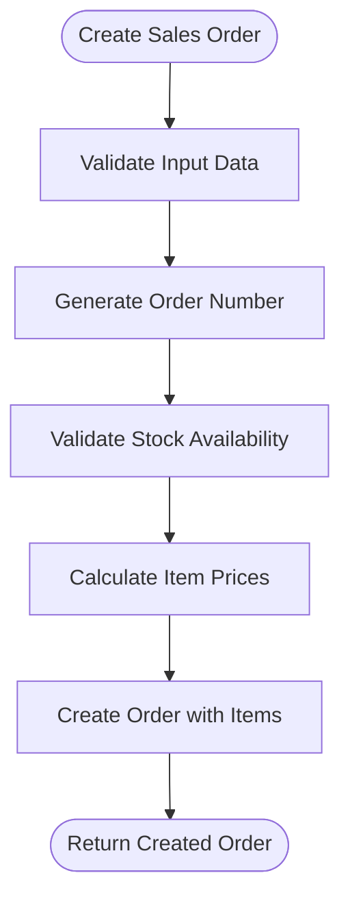
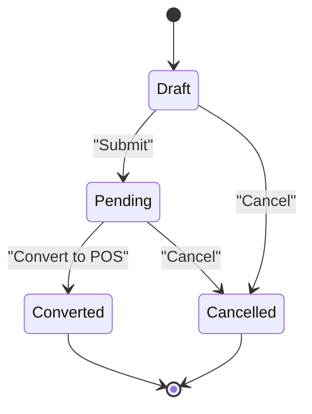
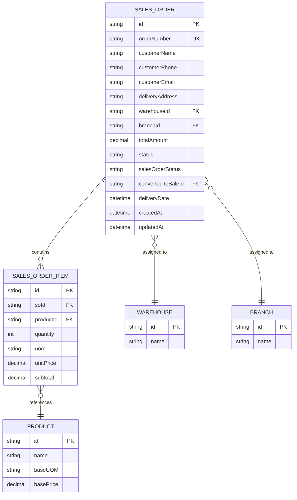
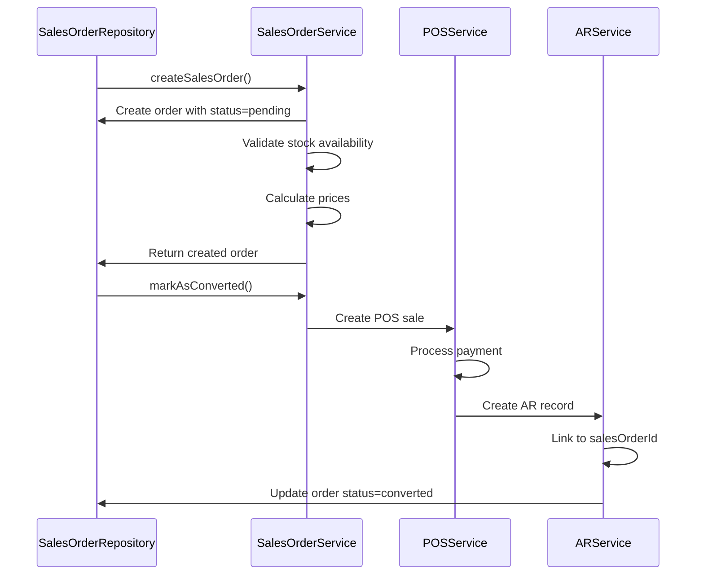
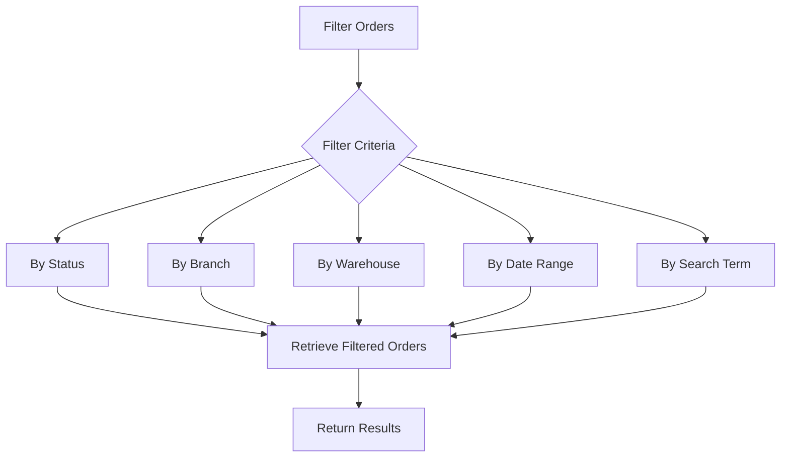

# Sales Order Repository

<cite>
**Referenced Files in This Document**   
- [sales-order.repository.ts](file://repositories/sales-order.repository.ts)
- [sales-order.service.ts](file://services/sales-order.service.ts)
- [sales-order.types.ts](file://types/sales-order.types.ts)
- [inventory.service.ts](file://services/inventory.service.ts)
- [ar.service.ts](file://services/ar.service.ts)
- [cancel/route.ts](file://app/api/sales-orders/[id]/cancel/route.ts)
</cite>

## Table of Contents
1. [Introduction](#introduction)
2. [Core Methods](#core-methods)
3. [Order Status Management](#order-status-management)
4. [Relational Queries](#relational-queries)
5. [Transaction Safety and Inventory Management](#transaction-safety-and-inventory-management)
6. [Integration with AR System](#integration-with-ar-system)
7. [POS and Delivery Workflow Integration](#pos-and-delivery-workflow-integration)
8. [Filtering and Reporting](#filtering-and-reporting)
9. [Error Handling](#error-handling)

## Introduction
The SalesOrderRepository is a core component responsible for managing sales order operations in the inventory management system. It provides comprehensive functionality for creating, fulfilling, and canceling sales orders while maintaining data integrity and enforcing business rules. The repository serves as the data access layer between the application logic and the underlying database, ensuring proper transaction handling and relational integrity.

The repository works in conjunction with the SalesOrderService, which handles business logic, validation, and integration with other systems such as inventory management and accounts receivable. This separation of concerns allows for clean architecture where the repository focuses on data persistence while the service layer manages workflow and business rules.

**Section sources**
- [sales-order.repository.ts](file://repositories/sales-order.repository.ts#L10-L238)

## Core Methods
The SalesOrderRepository provides several key methods for managing sales orders throughout their lifecycle.

### Order Creation
The `create` method handles the creation of new sales orders with their associated line items. It accepts a `CreateSalesOrderInput` object containing order details and an array of order items. The method creates the sales order record and establishes relationships with the line items in a single database operation.

**Diagram sources**
- [sales-order.repository.ts](file://repositories/sales-order.repository.ts#L114-L130)
- [sales-order.service.ts](file://services/sales-order.service.ts#L108-L163)

### Order Fulfillment
While the repository itself doesn't directly handle fulfillment, it provides the `markAsConverted` method that updates the order status when a sales order is converted to a POS sale. This method sets the `salesOrderStatus` to 'converted' and records the ID of the corresponding POS sale.

### Order Cancellation
The repository provides the `updateStatus` method to change the status of a sales order. For cancellation, this method is called with a status of 'cancelled'. The actual cancellation logic, including validation checks, is implemented in the service layer.

**Section sources**
- [sales-order.repository.ts](file://repositories/sales-order.repository.ts#L114-L175)
- [sales-order.types.ts](file://types/sales-order.types.ts#L14-L27)

## Order Status Management
The SalesOrderRepository implements a comprehensive order status management system that tracks orders through their lifecycle.

### Status Transitions
The repository supports the following order statuses:
- **draft**: Initial state for newly created orders
- **pending**: Orders ready for fulfillment
- **converted**: Orders that have been converted to POS sales
- **cancelled**: Orders that have been cancelled

The `updateStatus` method allows changing the order status, while the `markAsConverted` method specifically handles the transition to converted status when an order is fulfilled through the POS system.

### Status Validation
The repository works with the service layer to enforce business rules around status transitions. Orders can only be cancelled if they are not already cancelled or converted. Similarly, only draft and pending orders can be modified.

**Diagram sources**
- [sales-order.repository.ts](file://repositories/sales-order.repository.ts#L177-L202)
- [sales-order.types.ts](file://types/sales-order.types.ts#L3-L4)

## Relational Queries
The SalesOrderRepository provides several methods for querying orders with related data.

### Fetching Orders with Customer Details
The `findAll` and `findById` methods include customer information such as name, phone, email, and delivery address. These methods support filtering by customer name through the search parameter.

### Product Line Items
All order retrieval methods include the associated line items, which contain product references, quantities, units of measure, pricing, and subtotals. The `findById` method additionally includes product details such as name and base UOM.

### Payment Status Integration
While the repository doesn't directly manage payment status, it includes fields that indicate the order's relationship to the accounts receivable system. The `convertedToSaleId` field references the corresponding POS sale, which may have associated payment information.

**Diagram sources**
- [sales-order.repository.ts](file://repositories/sales-order.repository.ts#L11-L65)
- [sales-order.types.ts](file://types/sales-order.types.ts#L44-L53)

## Transaction Safety and Inventory Management
The SalesOrderRepository ensures transaction safety through its integration with the inventory system.

### Inventory Deduction
While the repository itself doesn't handle inventory deduction, it works with the InventoryService to ensure stock availability before order creation. The service layer validates that sufficient inventory is available before creating the order.

### Partial Fulfillments
The current implementation does not support partial fulfillments directly in the repository. Orders are either fully converted to POS sales or remain pending. The inventory system handles partial stock deductions through its FIFO (First In, First Out) algorithm when processing POS transactions.

### Transaction Safety
All database operations in the repository are atomic and ensure data consistency. When creating orders with items, both the order and its line items are created in a single transaction, preventing orphaned records.

**Section sources**
- [sales-order.repository.ts](file://repositories/sales-order.repository.ts#L114-L130)
- [inventory.service.ts](file://services/inventory.service.ts#L185-L258)

## Integration with AR System
The SalesOrderRepository integrates with the accounts receivable system through its relationship with POS sales.

### Conversion Process
When a sales order is converted to a POS sale, the `markAsConverted` method records the POS sale ID in the `convertedToSaleId` field. This creates a direct link between the sales order and the corresponding receivable.

### AR Creation
While the repository doesn't directly create AR records, it provides the necessary data for the AR system to create accounts receivable entries when POS sales are completed. The original sales order contains all customer and order information needed for AR processing.

**Diagram sources**
- [sales-order.repository.ts](file://repositories/sales-order.repository.ts#L194-L202)
- [ar.service.ts](file://services/ar.service.ts#L7-L20)

## POS and Delivery Workflow Integration
The repository supports integration with both POS and delivery workflows.

### POS Integration
The repository provides methods specifically designed for POS integration:
- `findPendingOrders`: Retrieves all pending orders that can be converted to POS sales
- `markAsConverted`: Updates the order status when converted to a POS sale

The `findPendingOrders` method filters orders by status and sorts them by delivery date, making it easy for the POS system to identify orders ready for fulfillment.

### Delivery Workflow
The repository supports delivery workflows through:
- Delivery date tracking
- Branch and warehouse assignment
- Customer delivery address storage

These fields enable the system to coordinate deliveries based on location, timing, and inventory availability.

**Section sources**
- [sales-order.repository.ts](file://repositories/sales-order.repository.ts#L89-L112)
- [sales-order.types.ts](file://types/sales-order.types.ts#L14-L27)

## Filtering and Reporting
The repository provides comprehensive filtering capabilities for reporting and analysis.

### Pending Order Filtering
The `findPendingOrders` method allows filtering pending orders by branch, making it easy to view orders specific to a particular location. This is particularly useful for branch managers who need to oversee local operations.

### Advanced Filtering
The `findAll` method supports multiple filter criteria:
- Status filtering
- Branch and warehouse filtering
- Date range filtering
- Text search (by customer name or order number)

### Reporting Metrics
The repository includes methods for calculating key business metrics:
- `countActiveOrders`: Counts draft and pending orders
- `calculateConversionRate`: Calculates the percentage of orders converted to sales

**Diagram sources**
- [sales-order.repository.ts](file://repositories/sales-order.repository.ts#L11-L65)
- [sales-order.repository.ts](file://repositories/sales-order.repository.ts#L204-L235)

## Error Handling
The repository implements robust error handling in conjunction with the service layer.

### Validation
The service layer performs comprehensive validation before calling repository methods:
- Input data validation using Zod schemas
- Stock availability verification
- Order status validation
- Unique order number enforcement

### Error Propagation
The repository follows a clean error handling pattern, allowing errors to propagate to the service layer where they are converted to appropriate application errors. This separation ensures that data access concerns are kept separate from user-facing error messages.

**Section sources**
- [sales-order.repository.ts](file://repositories/sales-order.repository.ts#L114-L175)
- [sales-order.service.ts](file://services/sales-order.service.ts#L108-L283)