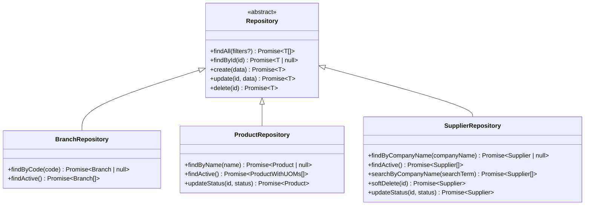
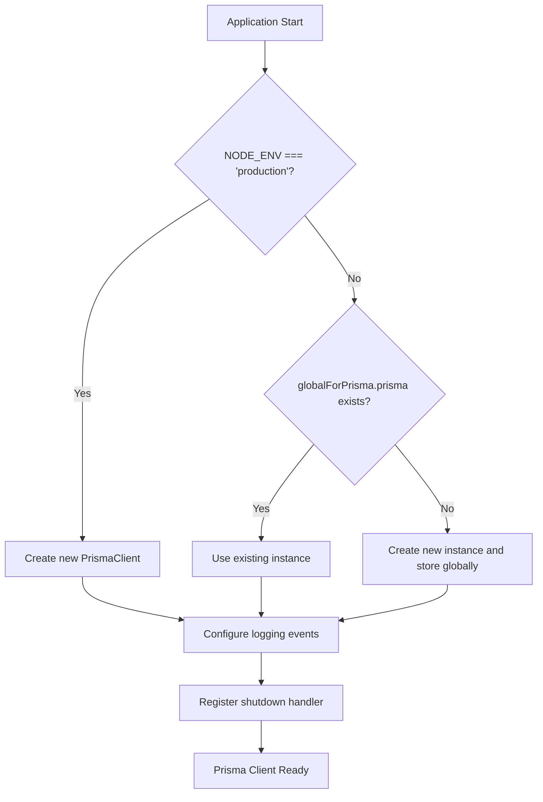
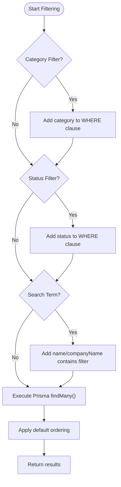
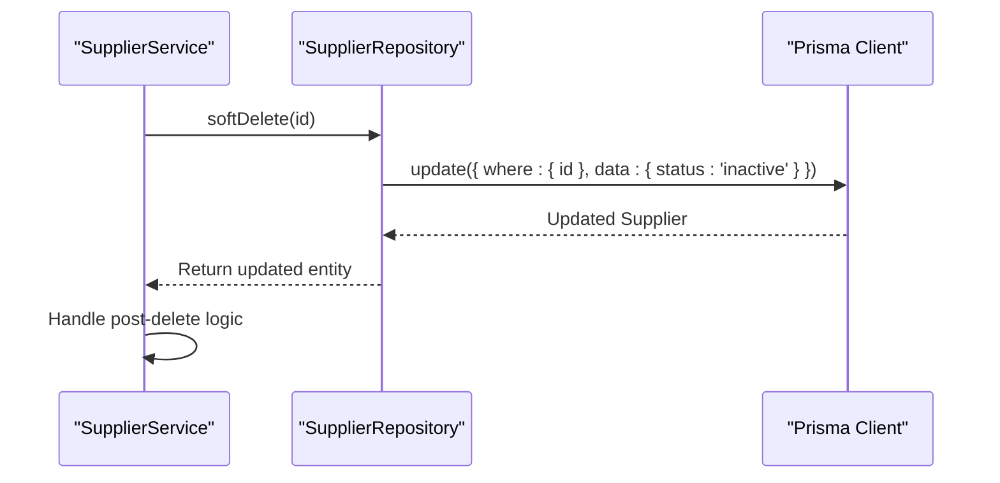
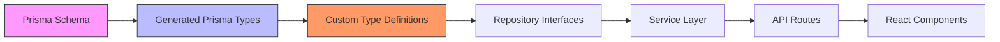
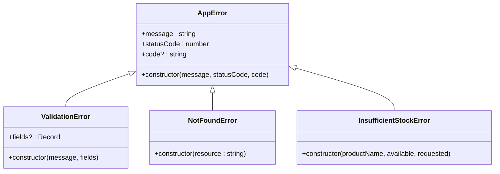

# Shared Repository Contracts

<cite>
**Referenced Files in This Document**   
- [prisma.ts](file://lib/prisma.ts)
- [branch.repository.ts](file://repositories/branch.repository.ts)
- [product.repository.ts](file://repositories/product.repository.ts)
- [supplier.repository.ts](file://repositories/supplier.repository.ts)
- [errors.ts](file://lib/errors.ts)
- [design.md](file://specs/inventory-pro-system/design.md)
</cite>

## Table of Contents
1. [Introduction](#introduction)
2. [Base Repository Structure](#base-repository-structure)
3. [Standardized Method Signatures](#standardized-method-signatures)
4. [Prisma Client Singleton Pattern](#prisma-client-singleton-pattern)
5. [Shared Utilities for Filtering and Pagination](#shared-utilities-for-filtering-and-pagination)
6. [Soft Delete and Status Management](#soft-delete-and-status-management)
7. [TypeScript Type Safety Across Layers](#typescript-type-safety-across-layers)
8. [Standardized Error Handling Mechanisms](#standardized-error-handling-mechanisms)
9. [Cross-Cutting Concerns](#cross-cutting-concerns)
10. [Conclusion](#conclusion)

## Introduction
This document outlines the shared patterns, interfaces, and architectural contracts used across all repository modules in the InventoryPro system. The application follows a consistent design pattern for data access, ensuring type safety, maintainability, and predictable behavior across all business domains including products, suppliers, branches, and inventory. The repository layer serves as the single source of truth for database interactions, abstracting Prisma ORM usage behind standardized interfaces.

## Base Repository Structure
The repository pattern is uniformly implemented across all modules with a consistent class-based structure. Each repository encapsulates data access logic for a specific domain entity and exposes a standardized set of methods. The base structure includes entity-specific operations while maintaining a common interface for create, read, update, and delete operations. All repositories are instantiated as singletons and exported for dependency injection into service layers.

**Diagram sources**
- [branch.repository.ts](file://repositories/branch.repository.ts#L5-L55)
- [product.repository.ts](file://repositories/product.repository.ts#L5-L123)
- [supplier.repository.ts](file://repositories/supplier.repository.ts#L5-L96)

**Section sources**
- [branch.repository.ts](file://repositories/branch.repository.ts#L1-L59)
- [product.repository.ts](file://repositories/product.repository.ts#L1-L127)
- [supplier.repository.ts](file://repositories/supplier.repository.ts#L1-L99)

## Standardized Method Signatures
All repositories implement a consistent set of method signatures that provide a uniform interface for data operations. The core CRUD operations follow a predictable pattern with standardized parameter types and return values. Method signatures are designed to be type-safe through TypeScript generics and interface contracts, ensuring compile-time verification of data access patterns.

### Core Method Signatures
| Method | Parameters | Return Type | Description |
|--------|------------|-------------|-------------|
| `findAll` | `(filters?: TFilters)` | `Promise<T[]>` | Retrieves all records with optional filtering |
| `findById` | `(id: string)` | `Promise<T \| null>` | Finds a single record by ID |
| `create` | `(data: CreateInput)` | `Promise<T>` | Creates a new record with validation |
| `update` | `(id: string, data: UpdateInput)` | `Promise<T>` | Updates an existing record |
| `delete` | `(id: string)` | `Promise<T>` | Hard deletes a record |
| `findActive` | `()` | `Promise<T[]>` | Retrieves only active records |
| `updateStatus` | `(id: string, status: 'active' \| 'inactive')` | `Promise<T>` | Updates entity status |

**Section sources**
- [branch.repository.ts](file://repositories/branch.repository.ts#L6-L48)
- [product.repository.ts](file://repositories/product.repository.ts#L6-L118)
- [supplier.repository.ts](file://repositories/supplier.repository.ts#L6-L91)

## Prisma Client Singleton Pattern
The Prisma client is implemented as a singleton instance to prevent multiple database connections in development environments. The implementation uses a global variable to store the client instance, ensuring that only one instance is created and reused across the application lifecycle. This pattern optimizes resource usage and prevents memory leaks during hot reloading in development.

**Diagram sources**
- [prisma.ts](file://lib/prisma.ts#L1-L62)

**Section sources**
- [prisma.ts](file://lib/prisma.ts#L1-L63)

## Shared Utilities for Filtering and Pagination
The repository layer implements consistent filtering mechanisms across all modules using a standardized approach to query construction. Filtering is achieved through dynamic WHERE clause generation based on input parameters, with case-insensitive text matching and enum-based status filtering. While explicit pagination parameters are not shown in the current implementation, the pattern supports extension for offset/limit-based pagination.

### Filtering Implementation Pattern

**Diagram sources**
- [product.repository.ts](file://repositories/product.repository.ts#L6-L30)
- [supplier.repository.ts](file://repositories/supplier.repository.ts#L6-L23)

**Section sources**
- [product.repository.ts](file://repositories/product.repository.ts#L6-L31)
- [supplier.repository.ts](file://repositories/supplier.repository.ts#L6-L23)

## Soft Delete and Status Management
The system implements a soft delete pattern through status field updates rather than physical record deletion. This approach preserves data integrity for historical reporting while allowing entities to be deactivated. The `softDelete` method updates the status field to 'inactive', while `updateStatus` provides explicit control over entity activation states. Hard deletion is reserved for exceptional cases and typically requires the entity to be inactive first.

### Soft Delete Workflow

**Diagram sources**
- [supplier.repository.ts](file://repositories/supplier.repository.ts#L78-L83)
- [supplier.service.ts](file://services/supplier.service.ts#L81-L89)

**Section sources**
- [supplier.repository.ts](file://repositories/supplier.repository.ts#L78-L83)
- [branch.repository.ts](file://repositories/branch.repository.ts#L44-L54)

## TypeScript Type Safety Across Layers
The application enforces strict type safety through a comprehensive TypeScript interface system that spans from the database layer to the API interface. Type contracts are defined in the types/ directory and imported by repositories, services, and API routes, ensuring consistency across the entire stack. The Prisma-generated types are extended with custom interfaces to include relationships and computed properties.

### Type Contract Flow

**Diagram sources**
- [product.types.ts](file://types/product.types.ts#L1-L48)
- [product.repository.ts](file://repositories/product.repository.ts#L3)
- [design.md](file://specs/inventory-pro-system/design.md#L172-L204)

**Section sources**
- [product.types.ts](file://types/product.types.ts#L1-L48)
- [product.repository.ts](file://repositories/product.repository.ts#L3)

## Standardized Error Handling Mechanisms
The system implements a hierarchical error handling system with custom error classes that extend a base `AppError`. This approach provides consistent error responses with standardized status codes and error codes. The error handling is integrated at the repository and service layers, with specific error types for validation failures, resource not found scenarios, and business rule violations.

### Error Class Hierarchy

**Diagram sources**
- [errors.ts](file://lib/errors.ts#L1-L33)

**Section sources**
- [errors.ts](file://lib/errors.ts#L1-L33)
- [supplier.service.ts](file://services/supplier.service.ts#L18-L20)

## Cross-Cutting Concerns
The repository layer addresses several cross-cutting concerns that apply consistently across all modules. These include audit logging, branch scoping, and transaction management. While not explicitly shown in all repository methods, these concerns are handled through middleware, service layer coordination, and Prisma event listeners that provide system-wide consistency.

### Audit Logging Implementation
The Prisma client is configured with event listeners for query, error, and warning events that automatically log relevant information. Slow queries (over 1 second) are specifically flagged in development environments, and all errors are logged with contextual information. This provides comprehensive visibility into database operations without requiring explicit logging calls in repository methods.

### Transaction Management
Complex operations that involve multiple database writes are managed through Prisma's transaction system at the service layer. The repository methods are designed to be composable within transactions, allowing the service layer to coordinate multiple repository calls within a single atomic operation. This ensures data consistency for business processes that affect multiple entities.

**Section sources**
- [prisma.ts](file://lib/prisma.ts#L27-L55)
- [design.md](file://specs/inventory-pro-system/design.md#L791-L866)

## Conclusion
The shared repository contracts in the InventoryPro system establish a robust foundation for consistent, type-safe, and maintainable data access patterns. By standardizing method signatures, error handling, and architectural patterns across all modules, the system ensures predictability and reduces cognitive load for developers working across different domains. The combination of Prisma ORM, TypeScript interfaces, and well-defined service contracts creates a cohesive architecture that supports the application's scalability and long-term maintainability. These patterns should be followed for any new repository implementations to maintain system consistency.