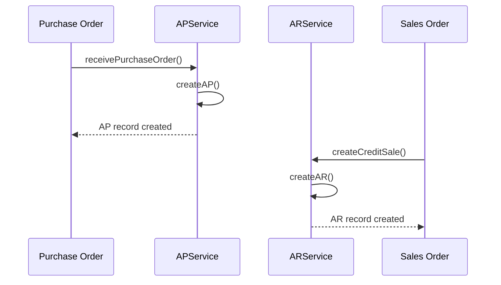
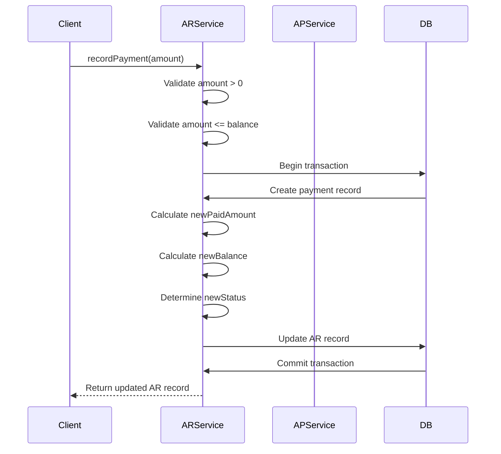
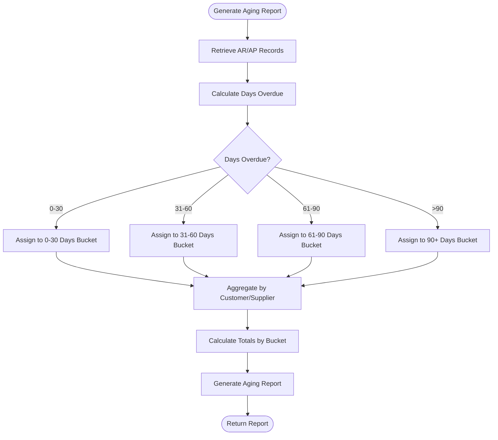
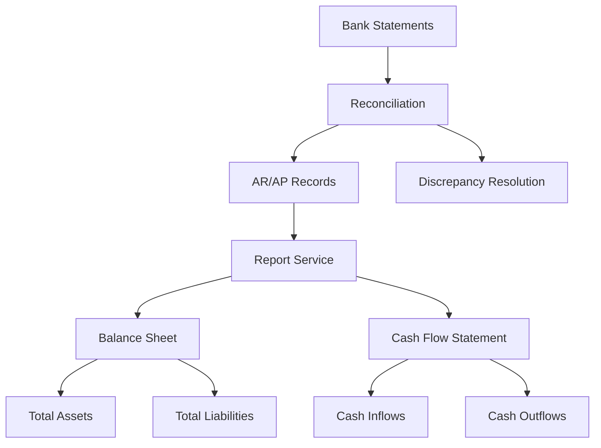

# AR/AP Service

<cite>
**Referenced Files in This Document**   
- [ar.service.ts](file://services/ar.service.ts)
- [ap.service.ts](file://services/ap.service.ts)
- [ar.repository.ts](file://repositories/ar.repository.ts)
- [ap.repository.ts](file://repositories/ap.repository.ts)
- [ar.types.ts](file://types/ar.types.ts)
- [ap.types.ts](file://types/ap.types.ts)
- [purchase-order.service.ts](file://services/purchase-order.service.ts)
- [report.service.ts](file://services/report.service.ts)
</cite>

## Table of Contents
1. [Introduction](#introduction)
2. [AR Service Implementation](#ar-service-implementation)
3. [AP Service Implementation](#ap-service-implementation)
4. [Integration with Sales and Purchase Orders](#integration-with-sales-and-purchase-orders)
5. [Payment Processing and Partial Payments](#payment-processing-and-partial-payments)
6. [Aging Calculations and Reports](#aging-calculations-and-reports)
7. [Reconciliation and General Ledger Integration](#reconciliation-and-general-ledger-integration)
8. [Credit Memo, Write-offs, and Dispute Management](#credit-memo-write-offs-and-dispute-management)
9. [Audit Requirements and Financial Controls](#audit-requirements-and-financial-controls)
10. [Sequence Diagrams](#sequence-diagrams)

## Introduction
The ARService and APService implementations provide comprehensive functionality for managing accounts receivable and accounts payable within the inventory management system. These services handle the complete lifecycle of receivables and payables, from creation through payment application and aging analysis. The system integrates with sales and purchase orders to automate invoice and bill creation, supports partial payments with proper status tracking, and generates detailed aging reports for financial analysis. This documentation details the implementation of these critical financial services, including their integration points, business logic, and compliance with financial controls.

## AR Service Implementation
The ARService manages accounts receivable entries, payment application, and aging calculations. It provides methods to create AR records from sales orders, record customer payments, retrieve AR details, and generate aging reports. The service maintains accurate balance calculations by tracking total amount, paid amount, and outstanding balance for each receivable. It supports various payment methods and reference numbers for audit trail purposes. The service also handles status transitions based on payment activity, updating records from 'pending' to 'partial' or 'paid' status as payments are applied. For overdue accounts, the service automatically updates the status to 'overdue' when the due date has passed and a balance remains.

**Section sources**
- [ar.service.ts](file://services/ar.service.ts#L6-L164)
- [ar.types.ts](file://types/ar.types.ts#L35-L49)

## AP Service Implementation
The APService manages accounts payable entries, payment application, and aging calculations. It provides functionality to create AP records from purchase orders, record supplier payments, retrieve AP details, and generate aging reports. The service includes a payment terms calculator that determines due dates based on supplier terms (Net 15, Net 30, Net 60, or COD). Like the ARService, it maintains accurate balance calculations and handles status transitions from 'pending' to 'partial' or 'paid' as payments are applied. The service also automatically updates the status to 'overdue' when the due date has passed and a balance remains. The implementation ensures data consistency through Prisma transactions when recording payments.

**Section sources**
- [ap.service.ts](file://services/ap.service.ts#L6-L180)
- [ap.types.ts](file://types/ap.types.ts#L36-L50)

## Integration with Sales and Purchase Orders
The AR and AP services integrate with sales and purchase orders to automatically create invoices and bills. When a sales order is processed as a credit sale, the system creates an accounts receivable record linked to the sales order. Similarly, when a purchase order is received, the system automatically creates an accounts payable record linked to the purchase order. This integration ensures that financial obligations are created at the appropriate time in the order fulfillment process. The ARService creates receivables with the customer name and sales order reference, while the APService creates payables with the supplier information and purchase order reference. This linkage enables traceability from financial records back to the originating orders.

**Diagram sources**
- [purchase-order.service.ts](file://services/purchase-order.service.ts#L876-L957)
- [ar.service.ts](file://services/ar.service.ts#L7-L19)
- [ap.service.ts](file://services/ap.service.ts#L7-L19)

## Payment Processing and Partial Payments
Both ARService and APService support comprehensive payment processing, including partial payments. When recording a payment, the services validate that the payment amount is greater than zero and does not exceed the outstanding balance. The payment recording process is wrapped in a database transaction to ensure data consistency. The services update the paid amount and recalculate the balance, then determine the appropriate status based on the remaining balance. If the balance reaches zero, the status is set to 'paid'; if there is still an outstanding amount, the status becomes 'partial'. The services also support various payment methods and reference numbers, which are stored with the payment record for audit purposes.

**Diagram sources**
- [ar.service.ts](file://services/ar.service.ts#L22-L82)
- [ap.service.ts](file://services/ap.service.ts#L43-L99)

## Aging Calculations and Reports
The ARService and APService provide aging report functionality that categorizes outstanding balances into time buckets (0-30, 31-60, 61-90, and 90+ days). The services calculate the number of days overdue by comparing the current date with the due date of each record. Based on this calculation, records are assigned to the appropriate aging bucket. The reports include summary information such as total outstanding amounts and counts by bucket, as well as detailed breakdowns by customer (for AR) or supplier (for AP). These reports are used for dunning workflow triggers and financial analysis. The system also supports filtering aging reports by branch for multi-location organizations.

**Diagram sources**
- [ar.service.ts](file://services/ar.service.ts#L97-L157)
- [ap.service.ts](file://services/ap.service.ts#L114-L172)

## Reconciliation and General Ledger Integration
The AR and AP services support reconciliation with bank statements and integration with the general ledger through the reporting service. The system maintains detailed payment records with dates, amounts, methods, and reference numbers, enabling reconciliation with bank statements. The report service integrates AR and AP data into financial statements such as the balance sheet and cash flow statement. Accounts receivable and payable balances are included in the calculation of total assets and liabilities on the balance sheet. The services also support filtering by branch, enabling multi-entity financial reporting. This integration ensures that financial data flows seamlessly from operational transactions to financial reporting.

**Diagram sources**
- [report.service.ts](file://services/report.service.ts#L348-L396)
- [ar.service.ts](file://services/ar.service.ts#L97-L157)
- [ap.service.ts](file://services/ap.service.ts#L114-L172)

## Credit Memo, Write-offs, and Dispute Management
While the current implementation does not explicitly show credit memo processing, write-offs, or dispute management functionality, the architecture supports these features through the existing payment and status management systems. Credit memos could be implemented as negative payments or adjustments to AR records. Write-offs could be handled by creating a specific payment method or status to indicate written-off amounts. Dispute management could be implemented by adding a 'disputed' status and associated metadata to track dispute resolution. The services' use of transactions and detailed audit trails provides the foundation for these advanced financial operations. Future enhancements could extend the current services to include these capabilities while maintaining data integrity.

## Audit Requirements and Financial Controls
The AR and AP services implement several financial controls to ensure data integrity and support audit requirements. All payment recording operations are performed within database transactions to maintain consistency between AR/AP records and payment records. The services validate payment amounts to prevent overpayments and ensure that payments do not exceed outstanding balances. The system maintains a complete audit trail by storing payment details including date, amount, method, and reference number. Status changes are automatically calculated based on business rules rather than manual input, reducing the risk of errors. The services also support filtering by branch, enabling segregation of duties in multi-location organizations. These controls help ensure the accuracy and reliability of financial data.

**Section sources**
- [ar.service.ts](file://services/ar.service.ts#L22-L82)
- [ap.service.ts](file://services/ap.service.ts#L43-L99)
- [ar.repository.ts](file://repositories/ar.repository.ts)
- [ap.repository.ts](file://repositories/ap.repository.ts)