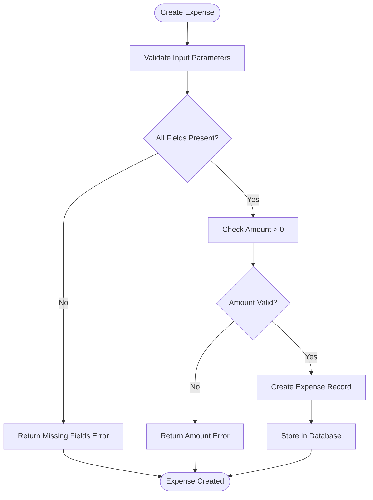
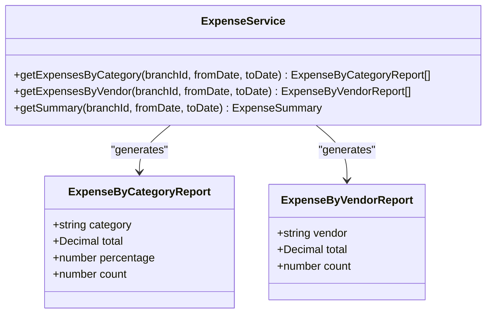
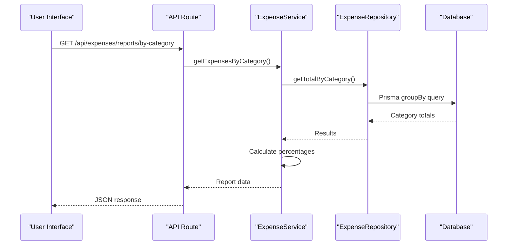
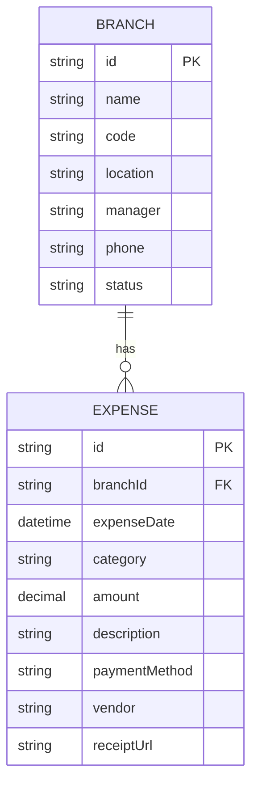

# Expense Service

<cite>
**Referenced Files in This Document**   
- [expense.service.ts](file://services/expense.service.ts)
- [expense.repository.ts](file://repositories/expense.repository.ts)
- [expense.types.ts](file://types/expense.types.ts)
- [expense.validation.ts](file://lib/validations/expense.validation.ts)
- [route.ts](file://app/api/expenses/route.ts)
- [schema.prisma](file://prisma/schema.prisma)
</cite>

## Table of Contents
1. [Introduction](#introduction)
2. [Expense Recording and Validation](#expense-recording-and-validation)
3. [Categorization and Reporting](#categorization-and-reporting)
4. [Integration with Supplier Management](#integration-with-supplier-management)
5. [Financial Reporting and P&L Impact](#financial-reporting-and-pl-impact)
6. [Receipt Attachment and Supporting Features](#receipt-attachment-and-supporting-features)
7. [Multi-Branch Allocation and Filtering](#multi-branch-allocation-and-filtering)
8. [Audit Trails and Compliance](#audit-trails-and-compliance)
9. [API Endpoints and Data Flow](#api-endpoints-and-data-flow)

## Introduction
The Expense Service provides a comprehensive solution for managing business expenses within a multi-branch retail environment. It enables users to record, categorize, and analyze expenses while ensuring compliance with financial policies. The service supports integration with supplier management, financial reporting, and branch-specific operations. Key features include expense validation, receipt attachment, multi-branch allocation, and detailed reporting by category, vendor, or time period.

**Section sources**
- [expense.service.ts](file://services/expense.service.ts#L1-L93)
- [requirements.md](file://specs/inventory-pro-system/requirements.md#L289-L307)

## Expense Recording and Validation
The Expense Service handles the creation and modification of expense records with strict validation rules. Each expense must include essential fields such as expense date, category, amount, description, payment method, and branch association. The system enforces business rules including positive amounts, required descriptions, and valid UUIDs for branch identification.

Validation is implemented through Zod schemas that define field requirements and constraints. The `expenseSchema` validates incoming data during creation, while `updateExpenseSchema` applies similar rules for updates. These validations ensure data integrity and prevent invalid entries from being stored in the database.



**Diagram sources**
- [expense.service.ts](file://services/expense.service.ts#L11-L27)
- [expense.validation.ts](file://lib/validations/expense.validation.ts#L3-L24)

**Section sources**
- [expense.service.ts](file://services/expense.service.ts#L11-L27)
- [expense.validation.ts](file://lib/validations/expense.validation.ts#L3-L24)

## Categorization and Reporting
Expenses are categorized using a predefined set of categories including Utilities, Rent, Salaries, Transportation, Marketing, Maintenance, and Other. The service provides robust reporting capabilities that allow users to generate insights based on these categories.

Two primary report types are supported: expense by category and expense by vendor. The category report calculates total expenses per category, computes percentages of total spending, and includes transaction counts. The vendor report aggregates expenses by vendor name, sorts them in descending order by total amount, and excludes null vendor entries.



**Diagram sources**
- [expense.types.ts](file://types/expense.types.ts#L22-L33)
- [expense.service.ts](file://services/expense.service.ts#L49-L86)

**Section sources**
- [expense.types.ts](file://types/expense.types.ts#L22-L33)
- [expense.service.ts](file://services/expense.service.ts#L49-L86)

## Integration with Supplier Management
The Expense Service integrates with supplier management through the optional vendor field in expense records. While not creating direct relationships with the Supplier model, it allows expenses to be associated with specific vendors through free-text entry. This enables reporting and analysis of spending patterns across different suppliers.

The service supports filtering and searching expenses by vendor name using case-insensitive partial matching. This functionality allows users to track expenditures with specific suppliers across multiple branches and time periods, facilitating supplier performance evaluation and cost analysis.

**Section sources**
- [expense.repository.ts](file://repositories/expense.repository.ts#L39-L43)
- [expense.types.ts](file://types/expense.types.ts#L42)

## Financial Reporting and P&L Impact
The Expense Service contributes to financial reporting by providing data for Profit & Loss (P&L) analysis. Expense data is aggregated to calculate total expenditures over specified time periods, which directly impacts net profit calculations. The service supports generating expense summaries that include total amounts and transaction counts, enabling financial analysts to assess cost structures.

Integration with broader financial reporting occurs through the export of expense data to CSV format and API endpoints that feed into financial statement generation. This data is combined with revenue and cost of goods sold information to produce comprehensive financial reports that show the impact of operating expenses on profitability.



**Diagram sources**
- [expense.service.ts](file://services/expense.service.ts#L49-L69)
- [expense.repository.ts](file://repositories/expense.repository.ts#L81-L105)
- [by-category/route.ts](file://app/api/expenses/reports/by-category/route.ts#L1-L26)

**Section sources**
- [expense.service.ts](file://services/expense.service.ts#L49-L69)
- [by-category/route.ts](file://app/api/expenses/reports/by-category/route.ts#L1-L26)

## Receipt Attachment and Supporting Features
The Expense Service supports receipt attachment through a URL-based storage system. Users can attach digital copies of receipts to expense records by providing a URL, which is validated to ensure it represents a proper web address. This feature enables digital documentation of expenses for audit and compliance purposes.

Additional supporting features include mileage tracking (implied through transportation category) and recurring expense patterns (supported through manual entry of similar expenses over time). The service also supports various payment methods including Cash, Card, Check, and Online Transfer, allowing for comprehensive tracking of different payment channels.

**Section sources**
- [expense.types.ts](file://types/expense.types.ts#L43)
- [expense.validation.ts](file://lib/validations/expense.validation.ts#L23)

## Multi-Branch Allocation and Filtering
The service fully supports multi-branch operations by associating each expense with a specific branch. This enables branch-level financial management and reporting. Users can filter expenses by branch ID, allowing for isolated analysis of expenses within individual locations.

All reporting functions support optional branch filtering, enabling comparisons between branches or consolidated views across the organization. The underlying data model includes indexes on branch-related fields to optimize query performance for branch-specific operations.



**Diagram sources**
- [schema.prisma](file://prisma/schema.prisma#L14-L37)
- [schema.prisma](file://prisma/schema.prisma#L386-L409)

**Section sources**
- [schema.prisma](file://prisma/schema.prisma#L14-L37)
- [schema.prisma](file://prisma/schema.prisma#L386-L409)

## Audit Trails and Compliance
The Expense Service maintains audit trails through automatic timestamping of expense records. Each expense captures creation and update times, providing a temporal record of financial transactions. The system enforces data integrity through validation rules that align with expense policies, budget limits, and tax treatment requirements.

Compliance is supported through structured data entry, required fields, and validation of critical information. The service ensures that all expenses have valid amounts greater than zero and include necessary descriptive information. These controls help organizations meet internal policy requirements and external regulatory standards for financial documentation.

**Section sources**
- [expense.service.ts](file://services/expense.service.ts#L13-L14)
- [expense.service.ts](file://services/expense.service.ts#L30-L31)
- [schema.prisma](file://prisma/schema.prisma#L397-L398)

## API Endpoints and Data Flow
The Expense Service exposes RESTful API endpoints that handle CRUD operations and reporting functions. The main endpoint at `/api/expenses` supports GET requests for retrieving filtered lists of expenses and POST requests for creating new expense records. Individual expense records can be accessed via `/api/expenses/[id]` with support for GET, PUT, and DELETE methods.

Reporting endpoints are available at `/api/expenses/reports/by-category` and `/api/expenses/reports/by-vendor`, both accepting optional parameters for branch ID and date range filtering. The API layer transforms HTTP requests into service method calls, handles errors, and returns standardized JSON responses.

```mermaid
graph TB
A[Client] --> B[/api/expenses]
A --> C[/api/expenses/:id]
A --> D[/api/expenses/reports/by-category]
A --> E[/api/expenses/reports/by-vendor]
B --> F[GET: getAllExpenses]
B --> G[POST: createExpense]
C --> H[GET: getExpenseById]
C --> I[PUT: updateExpense]
C --> J[DELETE: deleteExpense]
D --> K[GET: getExpensesByCategory]
E --> L[GET: getExpensesByVendor]
F --> M[ExpenseService]
G --> M
H --> M
I --> M
J --> M
K --> M
L --> M
M --> N[ExpenseRepository]
N --> O[Database]
```

**Diagram sources**
- [route.ts](file://app/api/expenses/route.ts#L4-L67)
- [expense.service.ts](file://services/expense.service.ts#L11-L93)

**Section sources**
- [route.ts](file://app/api/expenses/route.ts#L4-L67)
- [expense.service.ts](file://services/expense.service.ts#L11-L93)