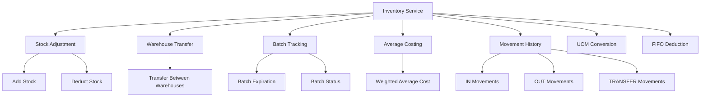
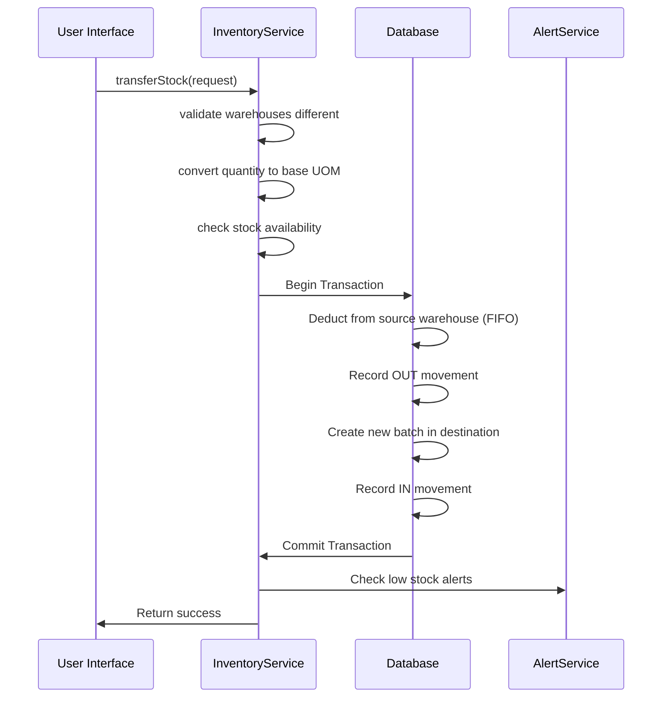
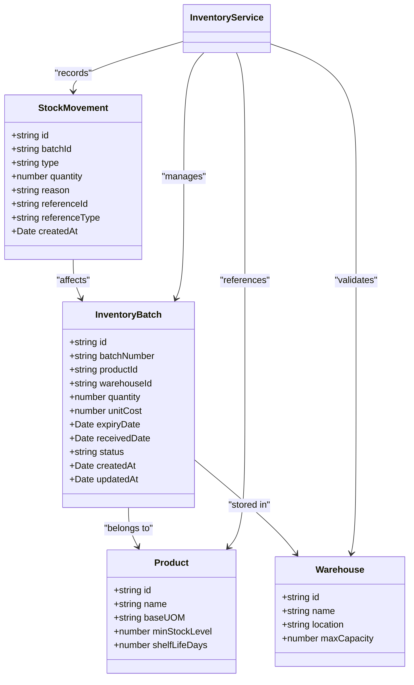

# Inventory Service

<cite>
**Referenced Files in This Document**   
- [inventory.service.ts](file://services/inventory.service.ts)
- [inventory.repository.ts](file://repositories/inventory.repository.ts)
- [inventory.types.ts](file://types/inventory.types.ts)
- [requirements.md](file://specs/inventory-pro-system/requirements.md)
- [design.md](file://specs/inventory-pro-system/design.md)
</cite>

## Table of Contents
1. [Introduction](#introduction)
2. [Core Functionality](#core-functionality)
3. [Stock Adjustment Operations](#stock-adjustment-operations)
4. [Warehouse Transfer Process](#warehouse-transfer-process)
5. [Batch-Level Tracking and Average Costing](#batch-level-tracking-and-average-costing)
6. [Transactional Integrity and Data Consistency](#transactional-integrity-and-data-consistency)
7. [Integration with Warehouse Capacity Checks](#integration-with-warehouse-capacity-checks)
8. [Expiration Date Management](#expiration-date-management)
9. [Low-Stock Alerts via AlertService](#low-stock-alerts-via-alertservice)
10. [Reconciliation Workflows](#reconciliation-workflows)
11. [Integration with POS and Purchase Order Fulfillment](#integration-with-pos-and-purchase-order-fulfillment)
12. [Error Handling](#error-handling)
13. [Bulk Inventory Imports and Cycle Counting](#bulk-inventory-imports-and-cycle-counting)

## Introduction

The Inventory Service is a core component of the InventoryPro system, responsible for managing all inventory-related operations including stock adjustments, warehouse transfers, batch tracking, and cost calculations. Built with TypeScript and integrated with Prisma ORM, the service ensures data consistency through transactional operations and implements average costing for accurate inventory valuation. The service interacts with multiple modules including POS, purchase orders, alerts, and warehouse management to provide a comprehensive inventory solution for soft drinks wholesale delivery companies.

**Section sources**
- [inventory.service.ts](file://services/inventory.service.ts#L1-L504)
- [requirements.md](file://specs/inventory-pro-system/requirements.md#L73-L91)

## Core Functionality

The Inventory Service provides a comprehensive set of operations for inventory management, centered around batch-level tracking and average costing calculations. The service handles stock additions, deductions, and transfers between warehouses while maintaining complete movement history. It integrates with the Product Module to handle multiple units of measure (UOM) and converts all quantities to base UOM for consistent inventory tracking. The service also calculates weighted average costs for inventory valuation and supports FIFO (First In, First Out) principles for stock deductions based on expiration dates.

**Diagram sources**
- [inventory.service.ts](file://services/inventory.service.ts#L115-L263)
- [inventory.repository.ts](file://repositories/inventory.repository.ts#L16-L152)

## Stock Adjustment Operations

The Inventory Service provides robust functionality for adding and deducting stock from inventory. When adding stock, the service converts quantities to base UOM using conversion factors from the Product Module, validates unit costs, generates unique batch numbers, and calculates expiration dates based on product shelf life. The service records all stock movements with timestamps, reasons, and reference IDs to maintain a complete audit trail.

For stock deductions, the service implements a FIFO (First Expiry, First Out) approach, prioritizing batches with the earliest expiration dates to minimize waste. Before deducting stock, the service validates that sufficient inventory is available and prevents deductions that would exceed available quantities. All stock adjustments are performed within database transactions to ensure data consistency.

**Section sources**
- [inventory.service.ts](file://services/inventory.service.ts#L115-L258)
- [requirements.md](file://specs/inventory-pro-system/requirements.md#L79-L89)

## Warehouse Transfer Process

The Inventory Service enables seamless transfer of inventory between warehouses while maintaining data integrity. The transfer process involves deducting stock from the source warehouse and adding it to the destination warehouse in a single atomic transaction. The service validates that source and destination warehouses are different and checks for sufficient stock availability in the source warehouse before initiating the transfer.

During transfers, the service uses the weighted average cost from the source warehouse as the unit cost for the new batch in the destination warehouse, ensuring consistent inventory valuation across locations. The process generates unique batch numbers for transferred inventory and calculates new expiration dates based on the product's shelf life. All transfer operations are recorded as stock movements with type "TRANSFER" and appropriate reference information.

**Diagram sources**
- [inventory.service.ts](file://services/inventory.service.ts#L263-L383)
- [inventory.repository.ts](file://repositories/inventory.repository.ts#L252-L263)

## Batch-Level Tracking and Average Costing

The Inventory Service implements comprehensive batch-level tracking with average costing calculations. Each inventory batch contains detailed information including batch number, warehouse location, quantity in base UOM, unit cost, expiration date, and received date. The service maintains complete movement history for each batch, recording all additions, deductions, and transfers.

The weighted average cost calculation is a core feature of the inventory system. The service calculates the average cost as the total cost of all base units divided by the total base unit quantity. This method provides accurate inventory valuation that reflects the actual cost of goods over time. The average cost is recalculated whenever new stock is added or existing stock is adjusted, ensuring up-to-date costing information.

**Diagram sources**
- [inventory.service.ts](file://services/inventory.service.ts#L50-L71)
- [inventory.types.ts](file://types/inventory.types.ts#L9-L25)
- [design.md](file://specs/inventory-pro-system/design.md#L222-L238)

## Transactional Integrity and Data Consistency

The Inventory Service ensures data consistency through the use of transactional operations for all critical inventory movements. When adding stock, deducting stock, or transferring between warehouses, the service wraps the database operations in Prisma transactions to guarantee atomicity. This means that either all operations in a transaction succeed, or they all fail, preventing partial updates that could lead to data inconsistencies.

For stock additions, the transaction creates both the inventory batch and the corresponding stock movement record. For stock deductions, the transaction updates multiple batch quantities and creates movement records for each affected batch. During warehouse transfers, the transaction deducts from the source warehouse, adds to the destination warehouse, and records movements for both operations. This transactional approach ensures that inventory levels and movement history remain synchronized at all times.

**Section sources**
- [inventory.service.ts](file://services/inventory.service.ts#L149-L177)
- [inventory.service.ts](file://services/inventory.service.ts#L224-L257)
- [inventory.service.ts](file://services/inventory.service.ts#L315-L382)

## Integration with Warehouse Capacity Checks

While the Inventory Service itself does not directly implement warehouse capacity checks, it integrates with the Warehouse Module to support capacity management. The service provides methods to calculate current stock levels by warehouse, which the Warehouse Module uses to determine utilization percentages. When transferring stock between warehouses, the service validates that the source warehouse has sufficient inventory but relies on the Warehouse Module to prevent overcapacity in the destination warehouse.

The service's ability to calculate total stock by warehouse enables the system to display utilization percentages and trigger capacity alerts when utilization reaches 60% (yellow alert) or 80% (red alert). This integration ensures that warehouse managers can monitor capacity and prevent overstocking while maintaining accurate inventory records.

**Section sources**
- [inventory.service.ts](file://services/inventory.service.ts#L461-L463)
- [inventory.repository.ts](file://repositories/inventory.repository.ts#L291-L304)
- [requirements.md](file://specs/inventory-pro-system/requirements.md#L98-L104)

## Expiration Date Management

The Inventory Service implements comprehensive expiration date management to ensure product quality and minimize waste. When adding stock, the service automatically calculates the expiration date by adding the product's shelf life days to the received date. The service marks batches as expired when their expiration date is past the current date, preventing their use in sales or transfers.

The service prioritizes deducting from batches with the earliest expiration dates (FIFO for physical stock), which helps minimize waste by ensuring older inventory is used first. The system also provides functionality to identify batches expiring within a specified number of days, enabling proactive management of near-expiration inventory. This expiration management is critical for the soft drinks industry where product freshness is essential.

**Section sources**
- [inventory.service.ts](file://services/inventory.service.ts#L144-L146)
- [inventory.service.ts](file://services/inventory.service.ts#L468-L486)
- [inventory.service.ts](file://services/inventory.service.ts#L491-L493)
- [requirements.md](file://specs/inventory-pro-system/requirements.md#L88-L89)

## Low-Stock Alerts via AlertService

The Inventory Service integrates with the AlertService to generate low-stock alerts when inventory levels fall below minimum thresholds. The service provides methods to calculate current stock levels for products in specific warehouses, which the AlertService uses to compare against minimum stock levels defined in the Product Module.

When stock levels drop below the minimum, the AlertService generates low-stock alerts that are displayed on the Dashboard and can trigger notifications to warehouse managers. The integration between these services enables proactive inventory management, allowing users to reorder products before stockouts occur. The service also supports identifying expiring soon alerts for batches within 30 days of expiration, helping prevent waste.

**Section sources**
- [inventory.service.ts](file://services/inventory.service.ts#L106-L110)
- [inventory.service.ts](file://services/inventory.service.ts#L458-L467)
- [requirements.md](file://specs/inventory-pro-system/requirements.md#L196-L207)

## Reconciliation Workflows

The Inventory Service supports reconciliation workflows through its comprehensive movement history and audit trail capabilities. The service maintains complete records of all stock movements, including additions, deductions, transfers, and adjustments, with timestamps and reasons for each transaction. This detailed history enables users to reconcile physical inventory counts with system records during cycle counting or periodic audits.

The service provides methods to retrieve all movements for specific batches, products, or warehouses within date ranges, facilitating the identification of discrepancies. When discrepancies are found, the service supports adjustment operations to correct inventory records while maintaining the integrity of the audit trail. This reconciliation capability is essential for maintaining accurate inventory data and ensuring financial reporting accuracy.

**Section sources**
- [inventory.service.ts](file://services/inventory.service.ts#L406-L408)
- [inventory.repository.ts](file://repositories/inventory.repository.ts#L155-L217)
- [requirements.md](file://specs/inventory-pro-system/requirements.md#L86-L87)

## Integration with POS and Purchase Order Fulfillment

The Inventory Service integrates seamlessly with both the POS Module and Purchase Order Module to update inventory levels in real-time. When a purchase order is received, the service automatically creates inventory batches for each product item in the assigned warehouse, using the unit cost from the PO and calculating expiration dates based on product shelf life.

When POS sales are completed, the service deducts inventory quantities from batches using the FIFO principle to prioritize earliest expiration dates. The service converts sold quantities to base UOM before deduction and records the cost of goods sold using the weighted average cost per product. This integration ensures that inventory levels are always up-to-date across all sales channels, providing accurate stock information for both online and offline transactions.

**Section sources**
- [inventory.service.ts](file://services/inventory.service.ts#L182-L258)
- [requirements.md](file://specs/inventory-pro-system/requirements.md#L82-L85)
- [requirements.md](file://specs/inventory-pro-system/requirements.md#L132-L138)

## Error Handling

The Inventory Service implements comprehensive error handling to manage various error conditions that may occur during inventory operations. The service throws specific error types for different scenarios, including ValidationError for input validation failures, NotFoundError for missing resources, and InsufficientStockError when stock deductions exceed available quantities.

For insufficient stock conditions, the service provides detailed error messages including the product name, available quantity, and requested quantity, helping users understand the issue. The service also validates UOM conversions, ensuring that requested UOMs exist for products and that conversion factors are valid. All error conditions are handled gracefully, with appropriate error messages returned to the user interface to guide corrective actions.

**Section sources**
- [inventory.service.ts](file://services/inventory.service.ts#L127-L138)
- [inventory.service.ts](file://services/inventory.service.ts#L197-L201)
- [inventory.service.ts](file://services/inventory.service.ts#L300-L306)
- [inventory.service.ts](file://services/inventory.service.ts#L94-L97)

## Bulk Inventory Imports and Cycle Counting

The Inventory Service supports best practices for bulk inventory imports and cycle counting processes through its robust API and transactional design. For bulk imports, the service can process multiple stock additions in sequence, with each addition wrapped in its own transaction to ensure data integrity. The service validates each import record for product existence, valid UOMs, positive quantities, and appropriate unit costs before creating inventory batches.

For cycle counting, the service provides detailed inventory reports showing current stock levels by product and warehouse, batch tracking with expiration dates, and complete stock movement history. These reports enable users to perform accurate physical counts and reconcile discrepancies. The service's ability to handle inventory adjustments allows users to update records based on cycle count results while maintaining a complete audit trail of all changes.

**Section sources**
- [inventory.service.ts](file://services/inventory.service.ts#L388-L390)
- [inventory.service.ts](file://services/inventory.service.ts#L406-L408)
- [inventory.repository.ts](file://repositories/inventory.repository.ts#L16-L64)
- [inventory.repository.ts](file://repositories/inventory.repository.ts#L155-L217)