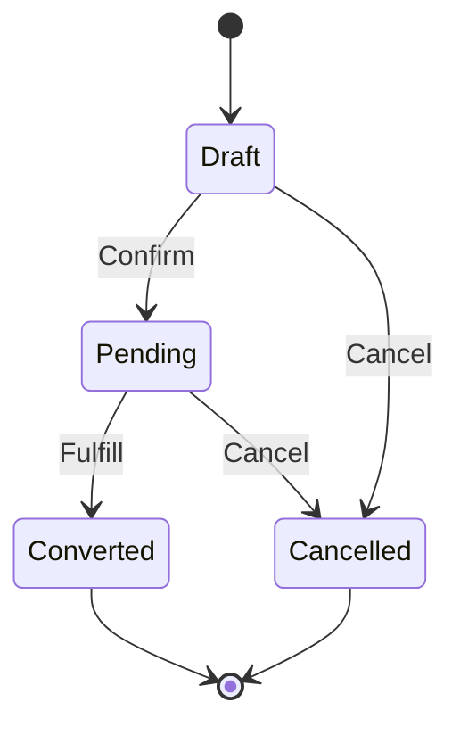
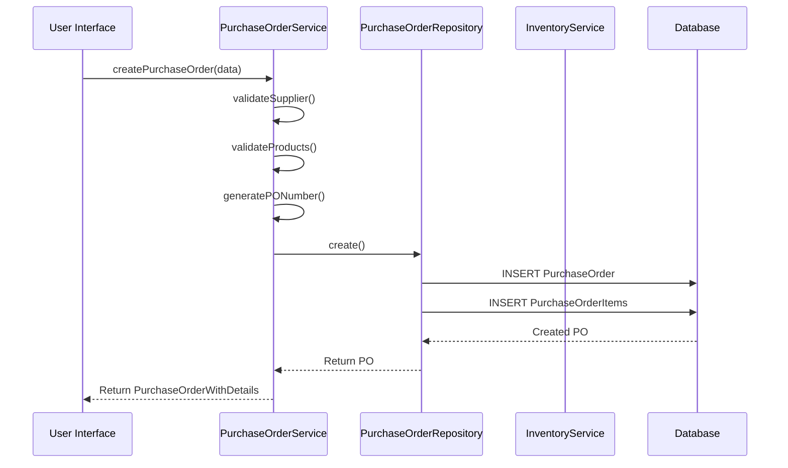
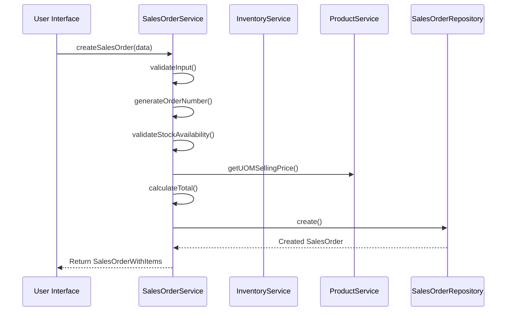
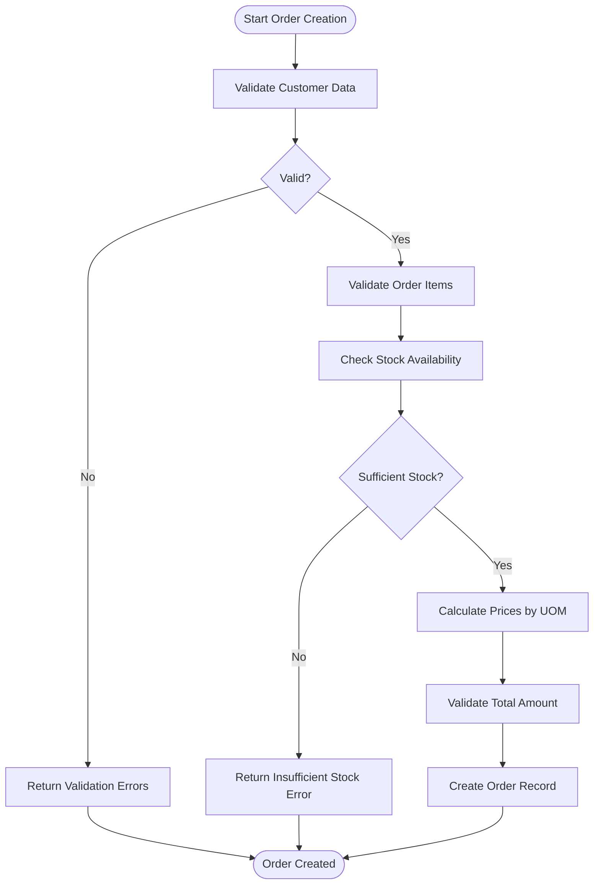
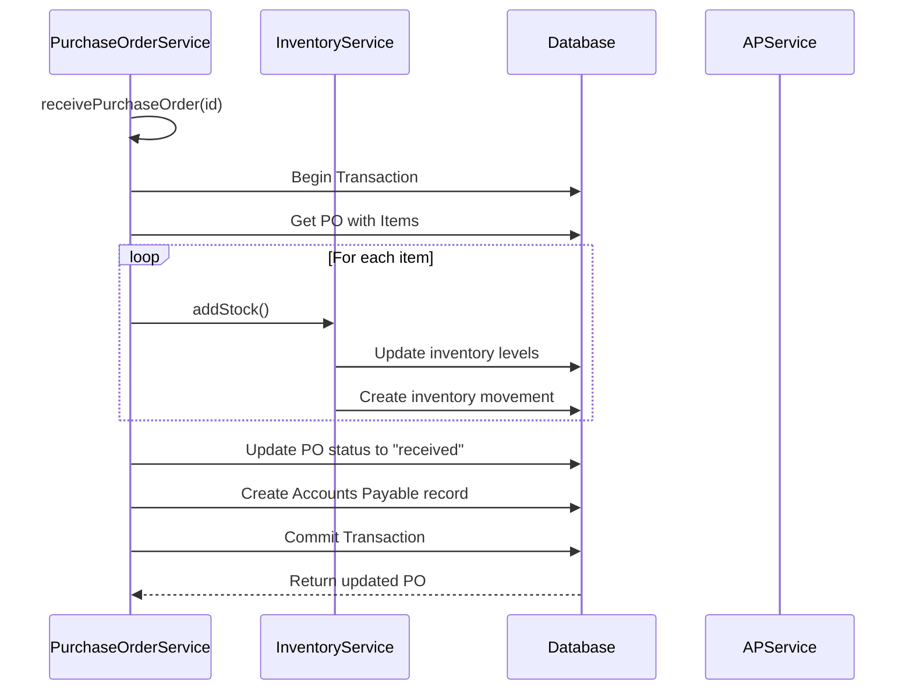
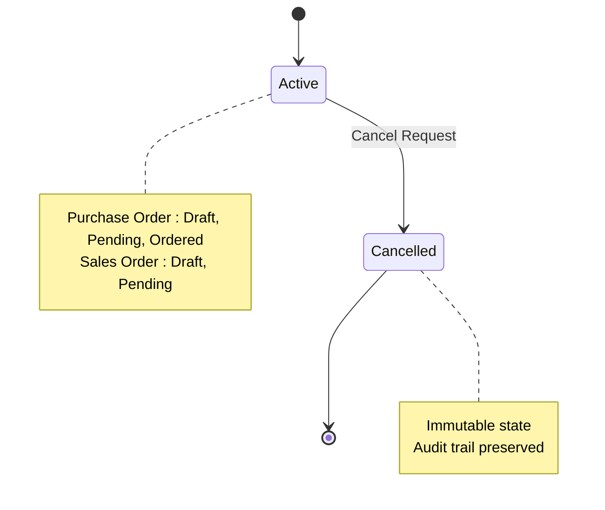
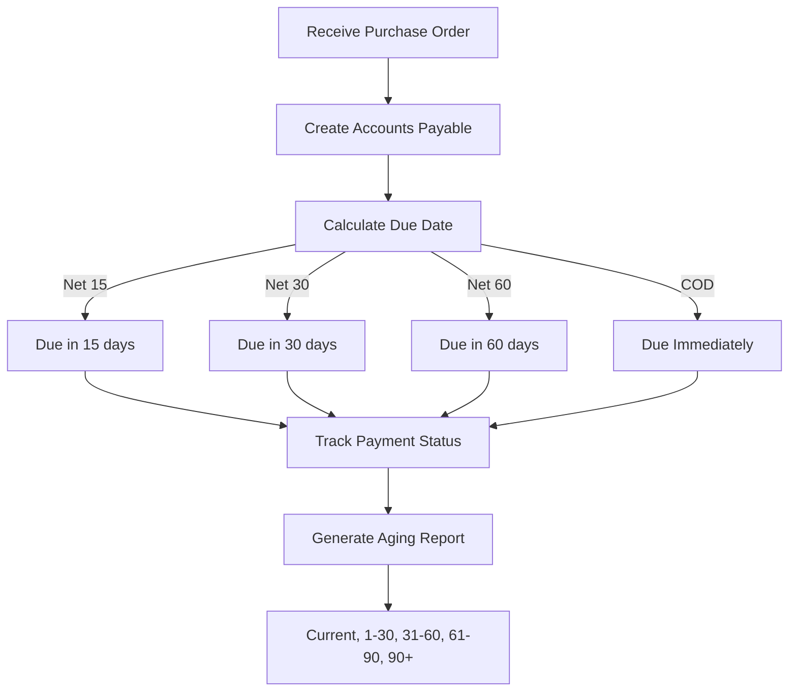
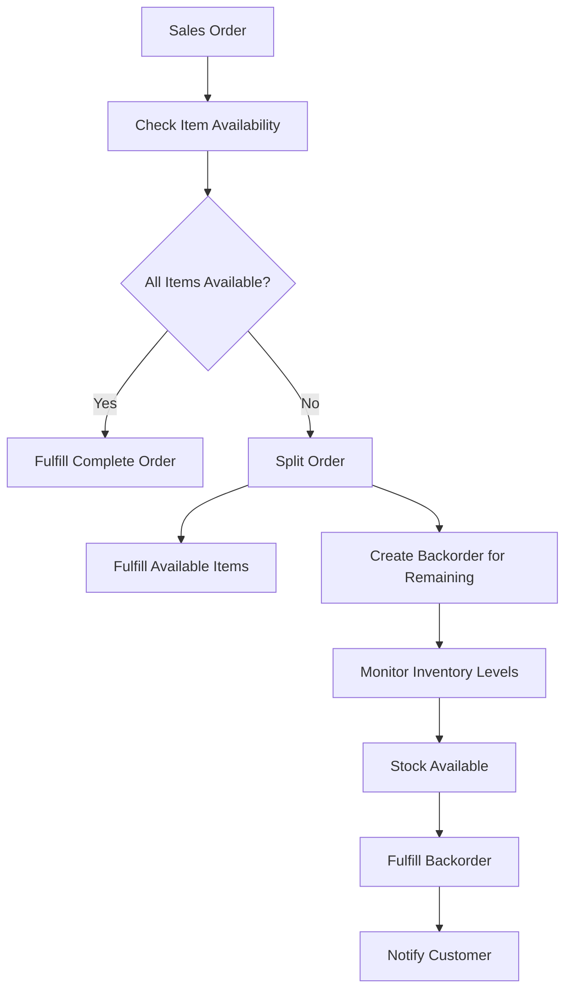
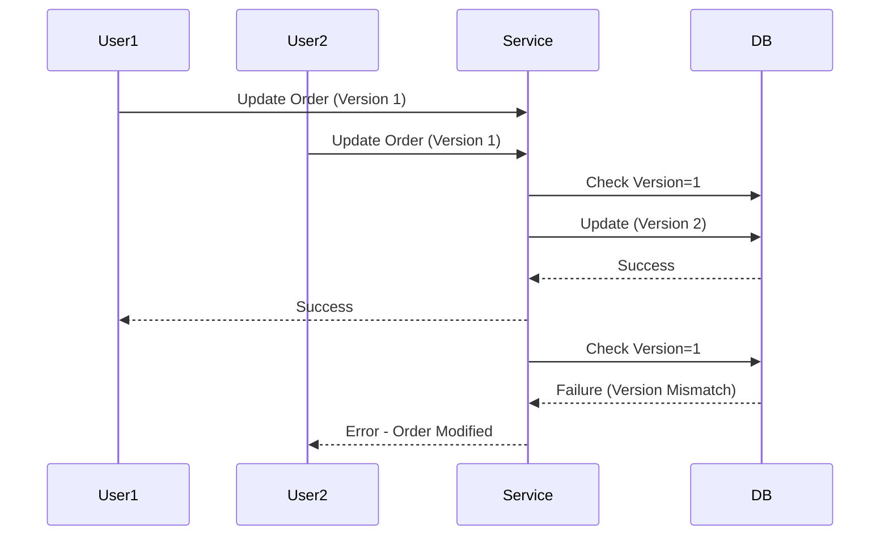

# Order Processing Service

<cite>
**Referenced Files in This Document**   
- [purchase-order.service.ts](file://services/purchase-order.service.ts)
- [sales-order.service.ts](file://services/sales-order.service.ts)
- [purchase-order.types.ts](file://types/purchase-order.types.ts)
- [sales-order.types.ts](file://types/sales-order.types.ts)
- [purchase-order.validation.ts](file://lib/validations/purchase-order.validation.ts)
- [sales-order.validation.ts](file://lib/validations/sales-order.validation.ts)
- [purchase-order.repository.ts](file://repositories/purchase-order.repository.ts)
- [sales-order.repository.ts](file://repositories/sales-order.repository.ts)
</cite>

## Table of Contents
1. [Introduction](#introduction)
2. [Order Lifecycle Management](#order-lifecycle-management)
3. [Purchase Order Service](#purchase-order-service)
4. [Sales Order Service](#sales-order-service)
5. [Business Validation Logic](#business-validation-logic)
6. [Inventory Integration](#inventory-integration)
7. [Cancellation Workflows](#cancellation-workflows)
8. [Aging Reports for AR/AP](#aging-reports-for-arap)
9. [Partial Fulfillment and Backordering](#partial-fulfillment-and-backordering)
10. [Notification Triggers](#notification-triggers)
11. [Concurrency and Race Condition Handling](#concurrency-and-race-condition-handling)
12. [Conclusion](#conclusion)

## Introduction
This document provides a comprehensive overview of the PurchaseOrderService and SalesOrderService implementations within the order processing system. It details the lifecycle management of purchase and sales orders, including state transitions, business validations, inventory integration, cancellation workflows, and reporting mechanisms. The system supports core operations such as supplier and customer validation, product catalog verification, quantity constraints, pricing accuracy, and integration with inventory services upon order fulfillment.

The services are implemented following a clean architecture pattern with separation between service logic, repository data access, and type definitions. Validation is enforced at multiple levels including input schema validation, business rule validation, and database constraints.

**Section sources**
- [purchase-order.service.ts](file://services/purchase-order.service.ts#L1-L375)
- [sales-order.service.ts](file://services/sales-order.service.ts#L1-L287)

## Order Lifecycle Management

### Purchase Order States
The PurchaseOrderService manages orders through the following state transitions:
- **Draft**: Initial state where order can be freely edited
- **Pending**: Confirmed order awaiting delivery
- **Received**: Goods have been received and inventory updated
- **Cancelled**: Order has been cancelled before receipt

State transitions are strictly controlled with validation to prevent invalid operations such as updating received orders or cancelling already received purchase orders.

### Sales Order States
The SalesOrderService manages customer orders through these states:
- **Draft**: Order in creation phase
- **Pending**: Confirmed order awaiting fulfillment
- **Converted**: Order has been fulfilled as a point-of-sale transaction
- **Cancelled**: Order has been cancelled before conversion

Orders can only be modified when in Draft or Pending status. Once converted to a sale, they become immutable.

**Diagram sources**
- [purchase-order.types.ts](file://types/purchase-order.types.ts#L3)
- [sales-order.types.ts](file://types/sales-order.types.ts#L3)

**Section sources**
- [purchase-order.types.ts](file://types/purchase-order.types.ts#L3)
- [sales-order.types.ts](file://types/sales-order.types.ts#L3)

## Purchase Order Service

### Core Functionality
The PurchaseOrderService handles the complete lifecycle of purchase orders from creation to receipt. Key operations include:
- PO number generation in format PO-YYYYMMDD-XXXX
- Supplier and product validation
- Total amount calculation
- Status management
- Receipt processing with inventory update
- Accounts Payable record creation

### Key Methods
- `createPurchaseOrder()`: Validates supplier and products, calculates totals, and creates new PO
- `updatePurchaseOrder()`: Allows modifications only for Draft/Pending orders
- `receivePurchaseOrder()`: Processes goods receipt with inventory update and AP creation
- `cancelPurchaseOrder()`: Handles cancellation with audit trail in notes

**Diagram sources**
- [purchase-order.service.ts](file://services/purchase-order.service.ts#L95-L153)
- [purchase-order.repository.ts](file://repositories/purchase-order.repository.ts#L91-L125)

**Section sources**
- [purchase-order.service.ts](file://services/purchase-order.service.ts#L15-L375)
- [purchase-order.repository.ts](file://repositories/purchase-order.repository.ts#L11-L223)

## Sales Order Service

### Core Functionality
The SalesOrderService manages customer sales orders with focus on:
- Order number generation (SO-YYYYMMDD-XXXX)
- Stock availability validation
- UOM-based pricing
- Conversion to POS sales
- Status tracking and reporting

### Key Methods
- `createSalesOrder()`: Validates input, checks stock, calculates prices, creates order
- `updateSalesOrder()`: Modifies order with revalidation of stock and prices
- `cancelSalesOrder()`: Cancels order before conversion
- `markAsConverted()`: Flags order as fulfilled through POS

**Diagram sources**
- [sales-order.service.ts](file://services/sales-order.service.ts#L108-L163)
- [sales-order.repository.ts](file://repositories/sales-order.repository.ts#L114-L130)

**Section sources**
- [sales-order.service.ts](file://services/sales-order.service.ts#L17-L287)
- [sales-order.repository.ts](file://repositories/sales-order.repository.ts#L10-L239)

## Business Validation Logic

### Supplier and Customer Validation
The system enforces strict validation rules for business partners:

**Purchase Orders**:
- Supplier must exist and be in "active" status
- All products must be active and available in catalog
- Quantity and unit price must be positive values

**Sales Orders**:
- Customer contact information must be valid
- Phone number must match Philippine format (+63 or 0 followed by 10 digits)
- Email must be properly formatted
- All products must be available in requested UOM

### Item and Pricing Validation
Both services validate order items against the product catalog:

- Product existence and active status verification
- Unit of Measure (UOM) validation for sales orders
- Automatic price lookup based on UOM
- Subtotal and total amount calculation
- Minimum one item required per order

**Diagram sources**
- [purchase-order.service.ts](file://services/purchase-order.service.ts#L96-L136)
- [sales-order.service.ts](file://services/sales-order.service.ts#L109-L130)
- [sales-order.validation.ts](file://lib/validations/sales-order.validation.ts#L11-L38)

**Section sources**
- [purchase-order.validation.ts](file://lib/validations/purchase-order.validation.ts#L3-L31)
- [sales-order.validation.ts](file://lib/validations/sales-order.validation.ts#L1-L67)

## Inventory Integration

### Purchase Order Receipt
When a purchase order is received, the system integrates with the InventoryService to:
- Add stock to the specified warehouse
- Create inventory batches with cost tracking
- Reference the PO for audit trail
- Update inventory levels in base UOM

The integration occurs within a database transaction to ensure data consistency between order status and inventory levels.

### Sales Order Fulfillment
For sales orders, inventory integration happens through:
- Pre-fulfillment stock validation
- Automatic UOM conversion to base units
- Real-time stock level checking
- Prevention of overselling

The system calculates the base quantity needed by converting from the requested UOM to the product's base UOM before checking availability.

**Diagram sources**
- [purchase-order.service.ts](file://services/purchase-order.service.ts#L274-L370)
- [inventory.service.ts](file://services/inventory.service.ts)
- [ap.service.ts](file://services/ap.service.ts)

**Section sources**
- [purchase-order.service.ts](file://services/purchase-order.service.ts#L274-L370)
- [inventory.service.ts](file://services/inventory.service.ts)

## Cancellation Workflows

### Purchase Order Cancellation
Purchase orders can be cancelled if they are in Draft, Pending, or Ordered status but not if already Received or Cancelled. The cancellation process:
- Validates current status
- Updates status to "cancelled"
- Appends cancellation reason to order notes
- Preserves audit trail with original notes

The system prevents cancellation of received orders to maintain inventory and accounting integrity.

### Sales Order Cancellation
Sales orders can be cancelled if in Draft or Pending status but not after conversion to a POS sale. The cancellation:
- Checks current status
- Prevents cancellation of converted orders
- Updates status to "cancelled"
- Maintains record for reporting purposes

**Diagram sources**
- [purchase-order.service.ts](file://services/purchase-order.service.ts#L239-L269)
- [sales-order.service.ts](file://services/sales-order.service.ts#L235-L257)

**Section sources**
- [purchase-order.service.ts](file://services/purchase-order.service.ts#L237-L269)
- [sales-order.service.ts](file://services/sales-order.service.ts#L231-L257)

## Aging Reports for AR/AP

### Accounts Payable Aging
The system generates AP aging reports based on purchase order payment status and due dates. When a purchase order is received:
- Accounts Payable record is created
- Due date calculated based on supplier payment terms (Net 15, Net 30, Net 60, COD)
- Balance tracking with paid amount
- Status management (pending, paid, overdue)

The aging report categorizes outstanding payables by age buckets (current, 1-30 days, 31-60 days, etc.) for financial analysis.

### Accounts Receivable Aging
For sales orders that are converted to POS sales, the system tracks:
- Customer payment status
- Outstanding balances
- Payment due dates
- Aging categories for receivables

The AR aging report helps monitor customer payment patterns and identify potential collection issues.

**Diagram sources**
- [purchase-order.service.ts](file://services/purchase-order.service.ts#L333-L346)
- [ap.service.ts](file://services/ap.service.ts)
- [ar.service.ts](file://services/ar.service.ts)

**Section sources**
- [purchase-order.service.ts](file://services/purchase-order.service.ts#L50-L72)
- [ap.service.ts](file://services/ap.service.ts)
- [ar.service.ts](file://services/ar.service.ts)

## Partial Fulfillment and Backordering

### Current System Behavior
The current implementation does not support partial fulfillment or backordering directly. The system operates on an all-or-nothing inventory availability model:
- Sales orders require sufficient stock for all items before creation
- Purchase orders are received in full quantity
- No built-in backorder status or functionality

### Recommended Enhancement
To support partial fulfillment and backordering, the following enhancements could be implemented:

1. **Add Backorder Status**: Introduce "backordered" status for sales orders with insufficient stock
2. **Partial Receipt**: Allow partial receipt of purchase orders with remaining quantities tracked
3. **Backorder Management**: Create backorder records that trigger when inventory becomes available
4. **Notification System**: Alert sales team when backordered items are restocked

**Section sources**
- [sales-order.service.ts](file://services/sales-order.service.ts#L48-L78)
- [purchase-order.service.ts](file://services/purchase-order.service.ts)

## Notification Triggers

### Email Notifications
The system includes triggers for email notifications at key order events:

**Purchase Orders**:
- Order confirmation to supplier
- Delivery reminder before expected date
- Receipt confirmation with inventory update
- Payment reminder before due date

**Sales Orders**:
- Order confirmation to customer
- Fulfillment notification when converted to sale
- Delivery reminder before scheduled date
- Payment receipt confirmation

### Implementation Approach
While the notification service implementation is not shown in the provided code, the system appears designed to support event-driven notifications through:
- Service method calls that could trigger events
- Status change hooks that could emit notification events
- Repository patterns that could include post-processing callbacks

The notification system would likely integrate with an email service provider to deliver messages to suppliers and customers.

**Section sources**
- [purchase-order.service.ts](file://services/purchase-order.service.ts)
- [sales-order.service.ts](file://services/sales-order.service.ts)

## Concurrency and Race Condition Handling

### Current Safeguards
The system implements several mechanisms to handle concurrent access and prevent race conditions:

**Database Transactions**:
- Purchase order receipt wrapped in transaction
- Ensures atomicity of inventory update and status change
- Prevents partial updates during high-volume scenarios

**Validation Checks**:
- Status validation before state changes
- Stock availability check at time of order creation
- Unique order number generation with collision detection

### Potential Race Conditions
Despite these safeguards, potential race conditions exist in high-volume scenarios:

**Order Number Generation**:
- Time-based sequence could have collisions under heavy load
- Solution: Use database sequence or UUID fallback

**Inventory Availability**:
- Stock check and order creation are separate operations
- Risk of overselling between check and creation
- Solution: Implement locking or reserve system

**Concurrent Edits**:
- No versioning or optimistic locking for order edits
- Risk of lost updates when multiple users edit same order
- Solution: Add version field and conditional updates

**Diagram sources**
- [purchase-order.service.ts](file://services/purchase-order.service.ts#L274-L370)
- [sales-order.service.ts](file://services/sales-order.service.ts)

**Section sources**
- [purchase-order.service.ts](file://services/purchase-order.service.ts#L274-L370)
- [sales-order.service.ts](file://services/sales-order.service.ts)

## Conclusion
The PurchaseOrderService and SalesOrderService implementations provide a robust foundation for order processing with comprehensive lifecycle management, business validation, and inventory integration. The services follow a clean architectural pattern with clear separation of concerns between service logic, data access, and type definitions.

Key strengths include:
- Comprehensive validation at multiple levels
- Proper state management with restricted transitions
- Integration with inventory and accounting systems
- Audit trails for critical operations
- Scalable design patterns

Areas for enhancement include:
- Implementation of partial fulfillment and backordering
- Strengthened concurrency controls
- Expanded notification system
- Versioning for concurrent edit protection

The system effectively manages the core order processing workflow while providing extensibility for future enhancements to support more complex business scenarios.