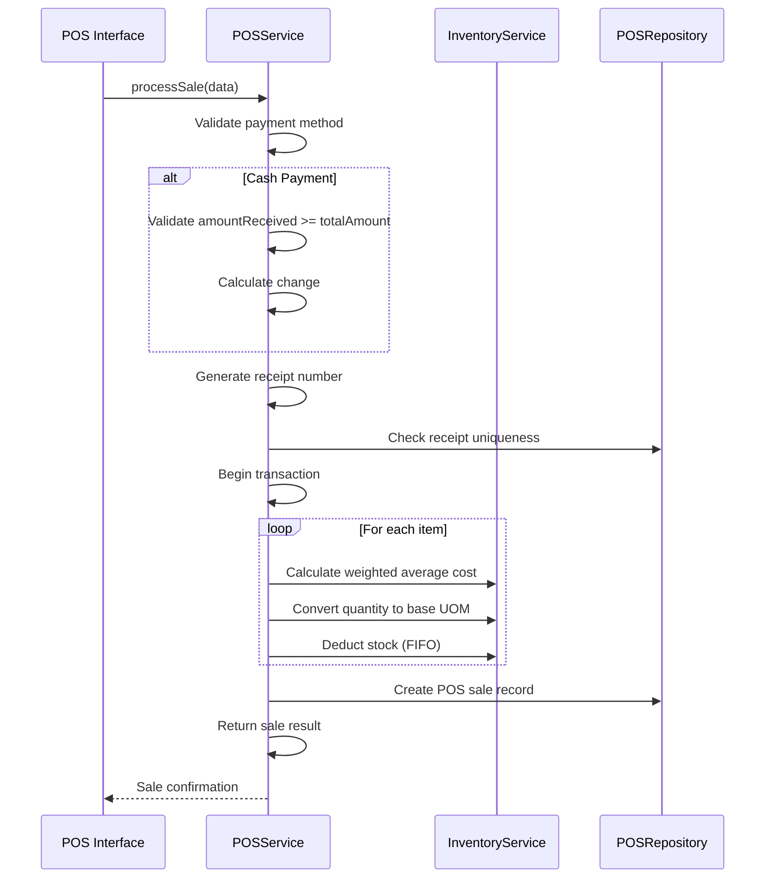

# POS Service

<cite>
**Referenced Files in This Document**   
- [pos.service.ts](file://services/pos.service.ts)
- [inventory.service.ts](file://services/inventory.service.ts)
- [pos.repository.ts](file://repositories/pos.repository.ts)
- [pos-payment.tsx](file://components/pos/pos-payment.tsx)
- [pos-cart.tsx](file://components/pos/pos-cart.tsx)
- [requirements.md](file://specs/inventory-pro-system/requirements.md)
- [design.md](file://specs/inventory-pro-system/design.md)
- [pos.types.ts](file://types/pos.types.ts)
</cite>

## Table of Contents
1. [Introduction](#introduction)
2. [Cart Management](#cart-management)
3. [Payment Processing](#payment-processing)
4. [Inventory Integration](#inventory-integration)
5. [Receipt Generation](#receipt-generation)
6. [Transaction Rollback Mechanism](#transaction-rollback-mechanism)
7. [Pending Orders and Order Conversion](#pending-orders-and-order-conversion)
8. [Discounts and Tax Calculations](#discounts-and-tax-calculations)
9. [Reconciliation and Financial Integration](#reconciliation-and-financial-integration)
10. [Split Payments, Refunds, and Loyalty](#split-payments-refunds-and-loyalty)
11. [Performance Considerations](#performance-considerations)

## Introduction
The POS Service is a core component of the inventory management system responsible for processing point-of-sale transactions. It handles cart management, payment processing for multiple payment methods (cash, GCash, credit), receipt generation, and real-time inventory updates. The service integrates with inventory, sales order, and financial modules to ensure accurate stock levels, proper accounting, and seamless transaction processing. This document details the implementation of the POS service, focusing on its transaction processing capabilities, inventory integration, and financial reconciliation features.

## Cart Management
The POS service provides comprehensive cart management functionality that allows users to add products, adjust quantities, select unit of measure (UOM), and calculate totals in real-time. The cart interface displays active products with available stock, validates quantity against inventory levels before addition, and calculates item subtotals based on selected UOM pricing.

The cart component supports real-time filtering by category and searching by product name with case-insensitive matching. When a product is added to the cart, the system validates that the requested quantity does not exceed available stock. The cart maintains product information including name, image, available UOM options with selling prices, and current stock availability.

**Section sources**
- [pos-cart.tsx](file://components/pos/pos-cart.tsx#L1-L162)
- [requirements.md](file://specs/inventory-pro-system/requirements.md#L167-L172)

## Payment Processing
The POS service supports multiple payment methods including cash, card, check, GCash, and online transfer. The payment processing logic validates payment details based on the selected method and calculates appropriate financial values.

For cash payments, the system validates that the amount received is greater than or equal to the total amount due and automatically calculates change. The payment interface provides a clean selection mechanism for different payment methods with appropriate validation for each type.



**Diagram sources**
- [pos.service.ts](file://services/pos.service.ts#L127-L213)
- [pos-payment.tsx](file://components/pos/pos-payment.tsx#L47-L54)
- [requirements.md](file://specs/inventory-pro-system/requirements.md#L177-L180)

**Section sources**
- [pos.service.ts](file://services/pos.service.ts#L127-L213)
- [pos-payment.tsx](file://components/pos/pos-payment.tsx#L1-L230)
- [pos.types.ts](file://types/pos.types.ts#L3-L4)

## Inventory Integration
The POS service integrates with the inventory system to deduct stock in real-time when transactions are completed. The integration uses a First-In, First-Out (FIFO) approach based on expiration dates to ensure proper stock rotation.

When a sale is processed, the system deducts inventory quantities from batches prioritizing the earliest expiration dates. Before deduction, the system validates that sufficient stock is available and throws an InsufficientStockError if inventory levels are inadequate. The inventory deduction occurs within a database transaction to ensure data consistency.

The service also calculates the cost of goods sold (COGS) using the weighted average cost method for each product in the warehouse. This cost calculation is based on the current inventory valuation and is recorded with each sale item.

```mermaid
flowchart TD
A[Process Sale] --> B{Payment Valid?}
B --> |Yes| C[Generate Receipt Number]
C --> D[Check Receipt Uniqueness]
D --> E[Begin Transaction]
E --> F[For Each Item]
F --> G[Calculate Weighted Average Cost]
G --> H[Convert Quantity to Base UOM]
H --> I[Deduct Inventory (FIFO)]
I --> J[Calculate COGS]
J --> K{More Items?}
K --> |Yes| F
K --> |No| L[Create Sale Record]
L --> M[Update Sales Order Status?]
M --> |Yes| N[Mark as Converted]
M --> |No| O[Return Sale Result]
N --> O
```

**Diagram sources**
- [pos.service.ts](file://services/pos.service.ts#L160-L209)
- [inventory.service.ts](file://services/inventory.service.ts#L185-L258)
- [requirements.md](file://specs/inventory-pro-system/requirements.md#L180-L181)

**Section sources**
- [pos.service.ts](file://services/pos.service.ts#L160-L209)
- [inventory.service.ts](file://services/inventory.service.ts#L185-L258)
- [inventory.service.ts](file://services/inventory.service.ts#L46-L71)

## Receipt Generation
The POS service generates unique receipt numbers for each transaction using the format RCP-YYYYMMDD-XXXX, where YYYYMMDD represents the current date and XXXX is a sequential number. The system ensures receipt number uniqueness by checking against existing receipts for the current day.

Receipts include comprehensive transaction details such as all items with product name, quantity, UOM, unit price, and subtotal, along with cart subtotal, tax (12%), and total amount. The receipt preview is displayed to the user before transaction completion, allowing verification of all details.

The service also records timestamps for each transaction and assigns unique UUID identifiers to ensure traceability and prevent duplication.

**Section sources**
- [pos.service.ts](file://services/pos.service.ts#L16-L49)
- [requirements.md](file://specs/inventory-pro-system/requirements.md#L182-L183)

## Transaction Rollback Mechanism
The POS service implements a robust transaction rollback mechanism using database transactions to ensure data consistency in case of payment failure or system errors. All critical operations are wrapped in Prisma transactions that automatically roll back if any step fails.

When processing a sale, the entire operation—including inventory deduction, COGS calculation, and sale record creation—occurs within a single transaction. If any validation fails or an error occurs during processing, the transaction is automatically rolled back, preventing partial updates to the database.

The service also handles specific error types such as ValidationError for input validation issues and InsufficientStockError for inventory availability problems, ensuring appropriate user feedback and preventing invalid transactions.

**Section sources**
- [pos.service.ts](file://services/pos.service.ts#L159-L209)
- [inventory.service.ts](file://services/inventory.service.ts#L223-L258)

## Pending Orders and Order Conversion
The POS service supports the conversion of pending sales orders to POS transactions, either individually or in bulk. When converting a sales order, the system pre-populates the cart with the order items and customer information, streamlining the checkout process.

After successful conversion, the original sales order status is updated to "converted" and linked to the new POS sale record. This integration ensures proper tracking of order fulfillment and prevents duplicate processing of the same order.

The service also maintains today's POS summary with transaction count, total revenue, and average sale value, providing real-time business insights.

**Section sources**
- [pos.service.ts](file://services/pos.service.ts#L203-L206)
- [requirements.md](file://specs/inventory-pro-system/requirements.md#L184-L186)

## Discounts and Tax Calculations
The POS service automatically calculates tax at 12% of the cart subtotal, following VAT requirements. The tax amount is calculated with two decimal places precision and added to the subtotal to determine the total amount due.

While the current implementation focuses on standard pricing, the system architecture supports future discount functionality through the flexible pricing model that includes UOM-specific selling prices. The cart calculation logic can be extended to incorporate various discount types while maintaining accurate financial records.

The service ensures all financial calculations are performed with appropriate precision and rounding to prevent discrepancies in accounting records.

**Section sources**
- [pos-payment.tsx](file://components/pos/pos-payment.tsx#L49-L50)
- [requirements.md](file://specs/inventory-pro-system/requirements.md#L175-L176)

## Reconciliation and Financial Integration
The POS service integrates with financial modules (Accounts Receivable/Accounts Payable) to support end-of-day reporting and financial reconciliation. While direct AR/AP creation occurs through credit sales orders, POS transactions contribute to overall financial reporting and inventory valuation.

The service records all transaction details necessary for reconciliation, including timestamps, payment methods, and unique identifiers. The integration with inventory costing (weighted average method) ensures accurate cost of goods sold calculations for financial reporting.

The system also supports the generation of various reports including sales summaries, best sellers, and profit/loss statements, facilitating comprehensive financial analysis.

**Section sources**
- [pos.service.ts](file://services/pos.service.ts#L177-L178)
- [requirements.md](file://specs/inventory-pro-system/requirements.md#L274-L277)

## Split Payments, Refunds, and Loyalty
The POS service architecture supports split payments through its flexible payment method design, allowing transactions to be completed using multiple payment types. While the current implementation processes single-method payments, the data model can be extended to support multiple payment entries per transaction.

Refund processing follows the same inventory integration principles as sales, with appropriate reversal of inventory deductions and financial records. The system maintains transaction history that enables accurate refund processing while preventing duplicate refunds.

Loyalty program integration is supported through the extensible transaction model, which can incorporate loyalty points calculation and redemption. The unique transaction identifiers and detailed item records provide the necessary data for loyalty program operations.

**Section sources**
- [pos.types.ts](file://types/pos.types.ts#L21-L23)
- [pos-payment.tsx](file://components/pos/pos-payment.tsx#L28-L33)

## Performance Considerations
The POS service is designed for high-frequency transactions with performance optimizations including efficient database queries, batch operations, and client-side validation to minimize server round trips. The use of database transactions ensures data integrity while maintaining acceptable performance for typical retail scenarios.

The service supports offline mode capabilities through its API design, allowing transactions to be queued and processed when connectivity is restored. The unique receipt numbering system and UUID identifiers prevent conflicts when synchronizing offline transactions.

Caching strategies are implemented for frequently accessed data such as product catalogs and inventory levels, reducing database load during peak transaction periods. The system also includes error handling and retry mechanisms to ensure reliability in high-volume environments.

**Section sources**
- [pos.service.ts](file://services/pos.service.ts#L159-L160)
- [requirements.md](file://specs/inventory-pro-system/requirements.md#L21-L22)