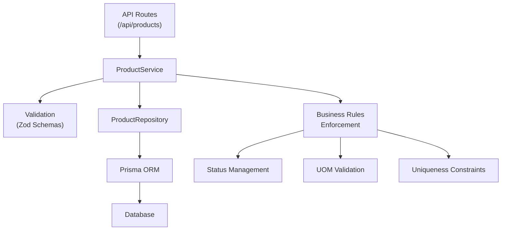
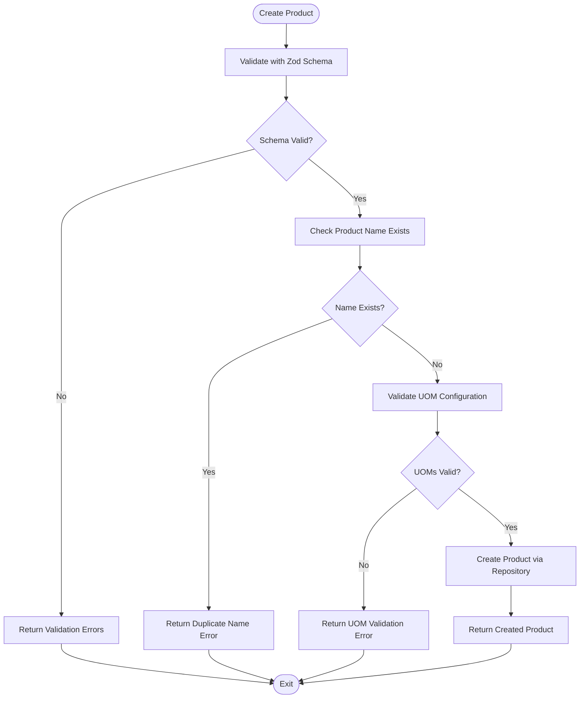
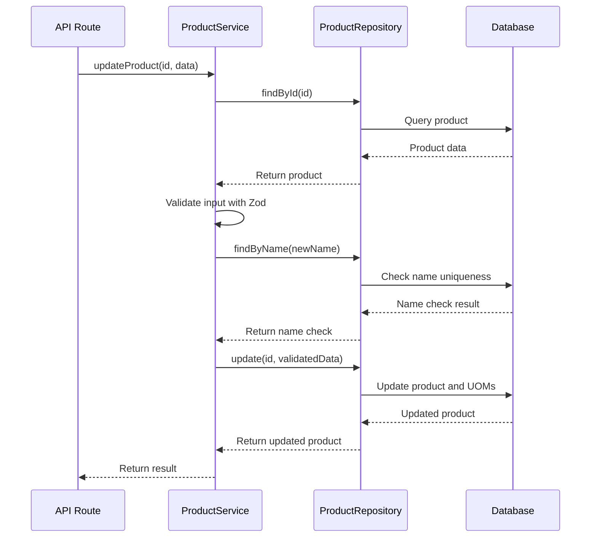
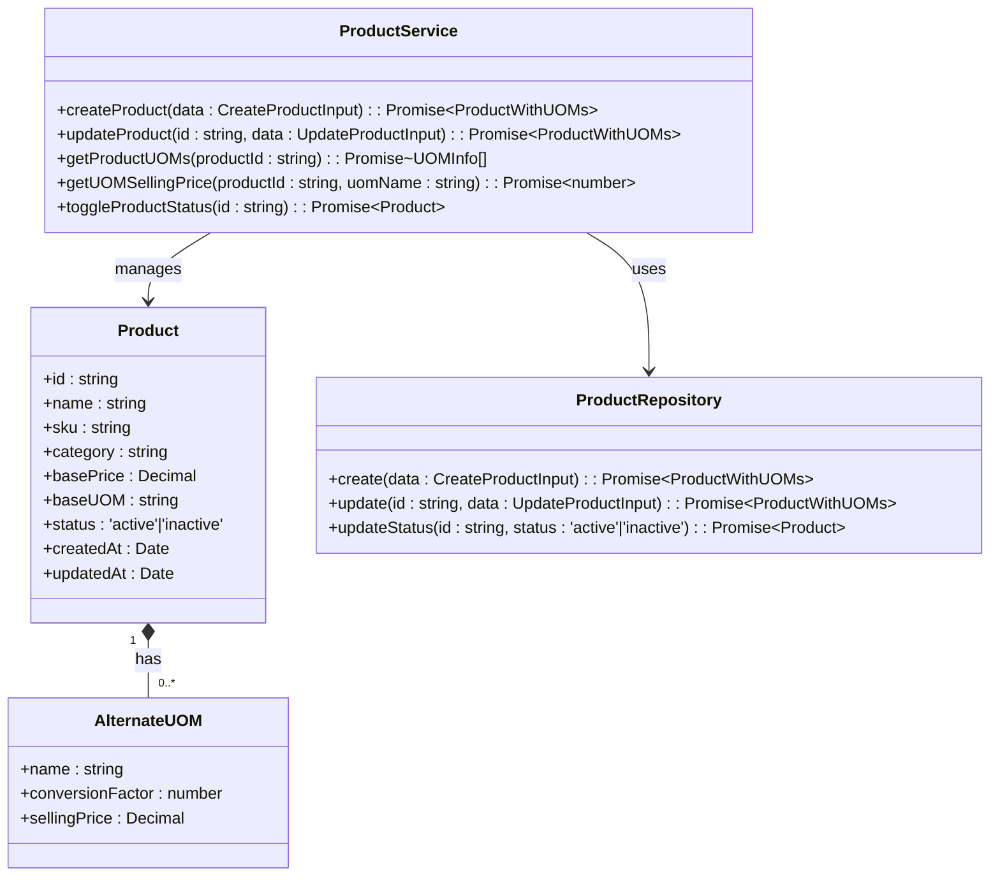
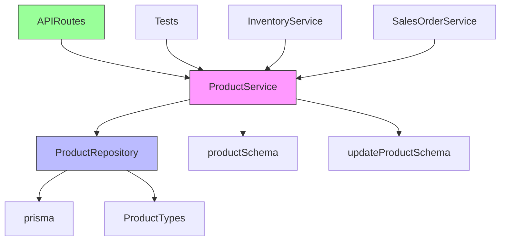

# Product Service

<cite>
**Referenced Files in This Document**   
- [product.service.ts](file://services/product.service.ts)
- [product.repository.ts](file://repositories/product.repository.ts)
- [product.validation.ts](file://lib/validations/product.validation.ts)
- [route.ts](file://app/api/products/route.ts)
- [route.ts](file://app/api/products/[id]/route.ts)
</cite>

## Table of Contents
1. [Introduction](#introduction)
2. [Core Components](#core-components)
3. [Architecture Overview](#architecture-overview)
4. [Detailed Component Analysis](#detailed-component-analysis)
5. [Dependency Analysis](#dependency-analysis)
6. [Performance Considerations](#performance-considerations)
7. [Troubleshooting Guide](#troubleshooting-guide)
8. [Conclusion](#conclusion)

## Introduction
The ProductService provides a comprehensive interface for managing product data within the inventory system. It handles product creation, updates, retrieval, and deletion while enforcing business rules and data validation. The service integrates with the ProductRepository for database operations and uses Zod schemas for input validation. It supports advanced features like multi-unit of measure (UOM) configuration, pricing rules, and image handling through API routes.

## Core Components

The ProductService implementation centers around several key components that work together to manage product data. The service uses Zod validation schemas to ensure data integrity during product creation and updates. It interacts with the ProductRepository to perform database operations and enforces business rules around product status, uniqueness constraints, and UOM configurations. The service also provides methods for toggling product status and retrieving product information with associated UOMs.

**Section sources**
- [product.service.ts](file://services/product.service.ts#L12-L189)
- [product.validation.ts](file://lib/validations/product.validation.ts#L1-L32)
- [product.repository.ts](file://repositories/product.repository.ts#L4-L123)

## Architecture Overview

The ProductService follows a clean architecture pattern with clear separation between service logic, data validation, and database operations. The service acts as an intermediary between the API routes and the repository layer, handling business logic and validation before persisting data.

**Diagram sources**
- [product.service.ts](file://services/product.service.ts#L12-L189)
- [product.repository.ts](file://repositories/product.repository.ts#L4-L123)
- [product.validation.ts](file://lib/validations/product.validation.ts#L1-L32)

## Detailed Component Analysis

### Product Creation and Validation
The ProductService handles product creation through the `createProduct` method, which implements comprehensive validation using Zod schemas. The process begins with schema validation using `productSchema` from product.validation.ts, which validates required fields like name, category, base price, and base UOM. The service also checks for duplicate product names by querying the repository before creation.

For multi-UOM configuration, the service validates that alternate UOM names do not conflict with the base UOM and ensures all alternate UOM names are unique. Each alternate UOM must have a valid conversion factor and selling price. The validation schema supports optional fields like description and image URL, with specific constraints on URL format.

**Diagram sources**
- [product.service.ts](file://services/product.service.ts#L28-L65)
- [product.validation.ts](file://lib/validations/product.validation.ts#L9-L25)

**Section sources**
- [product.service.ts](file://services/product.service.ts#L28-L65)
- [product.validation.ts](file://lib/validations/product.validation.ts#L9-L25)

### Product Update and Status Management
The ProductService provides robust update functionality through the `updateProduct` method, which follows a similar validation pattern to creation but with additional considerations for existing products. The service first verifies the product exists before applying updates. When updating product names, it checks for duplicates while excluding the current product.

The service includes specific handling for UOM updates, where providing a new set of alternate UOMs replaces all existing ones. This is implemented in the repository by deleting existing UOMs before creating new ones. The `toggleProductStatus` method allows switching between active and inactive states, with the repository directly updating the status field in the database.

**Diagram sources**
- [product.service.ts](file://services/product.service.ts#L67-L116)
- [product.repository.ts](file://repositories/product.repository.ts#L76-L110)

**Section sources**
- [product.service.ts](file://services/product.service.ts#L67-L116)
- [product.repository.ts](file://repositories/product.repository.ts#L76-L110)

### Multi-UOM Configuration and Pricing
The ProductService supports complex multi-unit of measure configurations through dedicated methods for retrieving and validating UOM data. The `getProductUOMs` method returns both the base UOM and all alternate UOMs with their respective selling prices. The `getUOMSellingPrice` method provides a convenient way to retrieve the selling price for a specific UOM, with case-insensitive matching.

When creating or updating products with alternate UOMs, the service validates that the base UOM is not duplicated in the alternate UOMs list and that all alternate UOM names are unique. Each UOM must have a positive conversion factor and selling price. The pricing system supports different selling prices for different units of measure, allowing for volume pricing or packaging variations.

**Diagram sources**
- [product.service.ts](file://services/product.service.ts#L146-L189)
- [product.repository.ts](file://repositories/product.repository.ts#L58-L74)
- [product.validation.ts](file://lib/validations/product.validation.ts#L3-L7)

**Section sources**
- [product.service.ts](file://services/product.service.ts#L146-L189)
- [product.validation.ts](file://lib/validations/product.validation.ts#L3-L7)

### API Integration and Image Handling
The ProductService integrates with API routes to handle HTTP requests for product operations. The API routes in `/api/products` and `/api/products/[id]` serve as the entry points for CRUD operations, delegating business logic to the ProductService. The service supports image upload handling through the imageUrl field, which is validated to ensure it's either a relative path or a valid HTTP/HTTPS URL.

The API routes implement proper error handling, catching validation errors and other exceptions from the service layer and returning appropriate HTTP status codes and error messages. Successful operations return the product data with a 200 or 201 status code, while validation failures return a 400 status with detailed field errors.

**Section sources**
- [route.ts](file://app/api/products/route.ts#L1-L62)
- [route.ts](file://app/api/products/[id]/route.ts#L1-L84)
- [product.service.ts](file://services/product.service.ts#L12-L189)

## Dependency Analysis

The ProductService has well-defined dependencies that follow the dependency inversion principle. It depends on the ProductRepository for data access operations but does not directly depend on the Prisma client, maintaining separation between business logic and data persistence.

**Diagram sources**
- [product.service.ts](file://services/product.service.ts#L2-L10)
- [product.repository.ts](file://repositories/product.repository.ts#L1-L3)
- [route.ts](file://app/api/products/route.ts#L2-L3)

**Section sources**
- [product.service.ts](file://services/product.service.ts#L2-L10)
- [product.repository.ts](file://repositories/product.repository.ts#L1-L3)

## Performance Considerations

The ProductService implementation includes several performance optimizations. Database queries are optimized through the use of Prisma's include feature to eagerly load alternate UOMs along with product data, preventing N+1 query problems. The repository methods use appropriate filtering and ordering to ensure efficient data retrieval.

For product creation and updates, the service minimizes database round trips by combining validation checks with the main operation. The UOM update process, while requiring a delete-then-create approach, is handled efficiently within a single transaction by Prisma. The service also benefits from Next.js's built-in caching mechanisms when used with the API routes.

## Troubleshooting Guide

Common issues with the ProductService typically involve validation failures or business rule violations. For duplicate SKU or product name errors, verify that the product name is unique across all products. For validation failures, check that all required fields are provided and meet the schema requirements, particularly for numeric fields like prices and stock levels.

When encountering UOM configuration errors, ensure that alternate UOM names do not conflict with the base UOM and that all UOM names are unique. For image URL issues, verify that the URL is properly formatted and accessible. Status-related errors when deleting products can be resolved by first deactivating the product through the toggleStatus method.

**Section sources**
- [product.service.ts](file://services/product.service.ts#L37-L43)
- [product.service.ts](file://services/product.service.ts#L83-L89)
- [product.service.ts](file://services/product.service.ts#L120-L131)
- [product.validation.ts](file://lib/validations/product.validation.ts#L15-L18)

## Conclusion

The ProductService provides a robust and well-structured implementation for managing product data in the inventory system. By separating concerns between validation, business logic, and data access, it offers a maintainable and extensible foundation. The service effectively handles product creation, updates, and retrieval with comprehensive validation and business rule enforcement. Its integration with the API routes provides a clean interface for frontend applications, while its dependency on the repository pattern ensures flexibility for future database changes or enhancements.