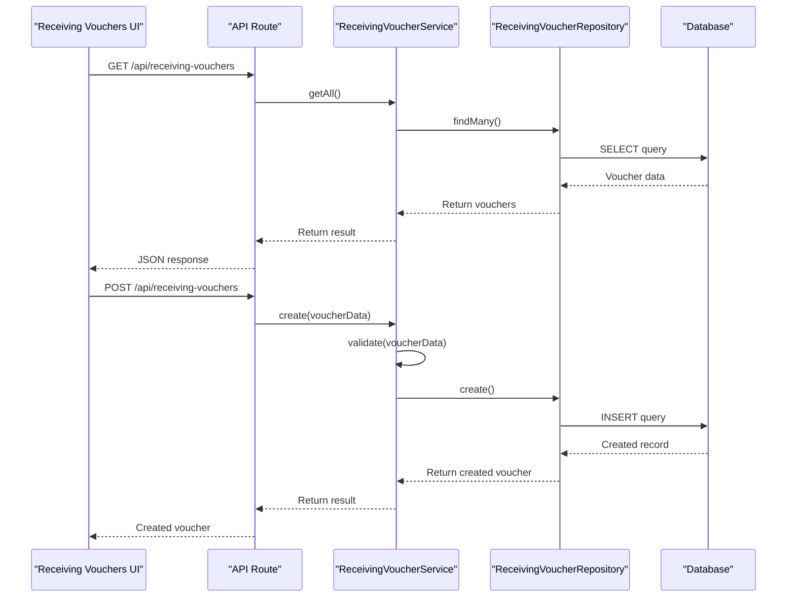
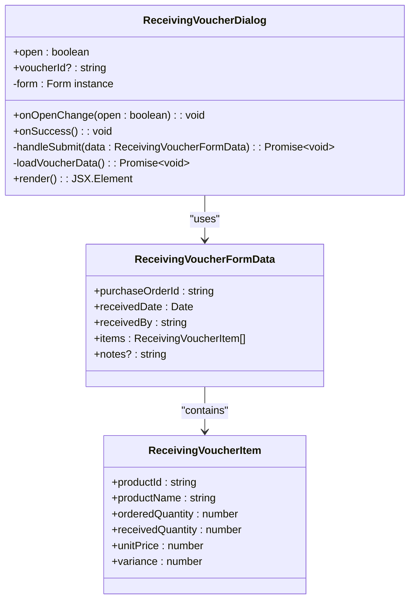
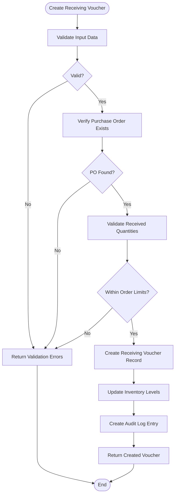
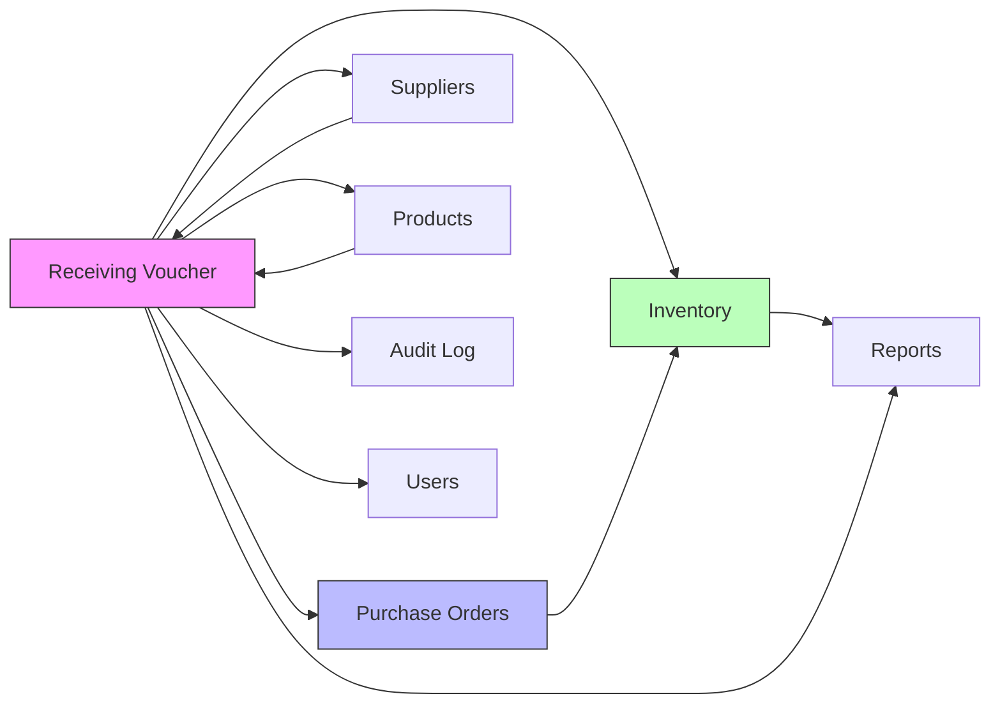

# Receiving Voucher System

<cite>
**Referenced Files in This Document**   
- [page.tsx](file://app/(dashboard)/receiving-vouchers/page.tsx)
- [receiving-voucher-dialog.tsx](file://components/receiving-vouchers/receiving-voucher-dialog.tsx)
- [receiving-voucher.service.ts](file://services/receiving-voucher.service.ts)
- [receiving-voucher.repository.ts](file://repositories/receiving-voucher.repository.ts)
- [receiving-voucher.validation.ts](file://lib/validations/receiving-voucher.validation.ts)
- [receiving-voucher.types.ts](file://types/receiving-voucher.types.ts)
- [use-receiving-vouchers.ts](file://hooks/use-receiving-vouchers.ts)
- [route.ts](file://app/api/receiving-vouchers/route.ts)
- [route.ts](file://app/api/receiving-vouchers/[id]/route.ts)
- [20251114172258_add_receiving_voucher/migration.sql](file://prisma/migrations/20251114172258_add_receiving_voucher/migration.sql)
- [receiving-voucher.service.test.ts](file://tests/unit/services/receiving-voucher.service.test.ts)
</cite>

## Table of Contents
1. [Introduction](#introduction)
2. [Project Structure](#project-structure)
3. [Core Components](#core-components)
4. [Architecture Overview](#architecture-overview)
5. [Detailed Component Analysis](#detailed-component-analysis)
6. [Dependency Analysis](#dependency-analysis)
7. [Performance Considerations](#performance-considerations)
8. [Troubleshooting Guide](#troubleshooting-guide)
9. [Conclusion](#conclusion)

## Introduction
The Receiving Voucher System is a critical component of the inventory and procurement workflow within the application. It enables users to document and verify the receipt of goods against purchase orders, ensuring accurate inventory updates and financial accountability. This system integrates with purchase orders, inventory management, and supplier modules to provide a seamless receiving process.

## Project Structure
The receiving voucher functionality is organized across multiple directories following a modular architecture. The core UI components reside in the `app/(dashboard)/receiving-vouchers` directory, while business logic, data access, and validation are separated into dedicated service, repository, and validation layers.

```mermaid
graph TB
subgraph "UI Layer"
A[app/(dashboard)/receiving-vouchers]
B[components/receiving-vouchers]
end
subgraph "API Layer"
C[app/api/receiving-vouchers]
end
subgraph "Business Logic"
D[services/receiving-voucher.service.ts]
end
subgraph "Data Access"
E[repositories/receiving-voucher.repository.ts]
end
subgraph "Validation & Types"
F[lib/validations/receiving-voucher.validation.ts]
G[types/receiving-voucher.types.ts]
end
A --> C
B --> A
C --> D
D --> E
D --> F
D --> G
```

**Diagram sources**
- [app/(dashboard)/receiving-vouchers](file://app/(dashboard)/receiving-vouchers)
- [components/receiving-vouchers](file://components/receiving-vouchers)
- [services/receiving-voucher.service.ts](file://services/receiving-voucher.service.ts)
- [repositories/receiving-voucher.repository.ts](file://repositories/receiving-voucher.repository.ts)
- [lib/validations/receiving-voucher.validation.ts](file://lib/validations/receiving-voucher.validation.ts)
- [types/receiving-voucher.types.ts](file://types/receiving-voucher.types.ts)

**Section sources**
- [app/(dashboard)/receiving-vouchers](file://app/(dashboard)/receiving-vouchers)
- [components/receiving-vouchers](file://components/receiving-vouchers)

## Core Components
The receiving voucher system consists of several key components that work together to manage the receiving process. These include the main listing page, detail view, creation/edit dialog, API endpoints, service layer, repository, validation logic, and associated types. The system follows a clean architecture pattern with clear separation of concerns between UI, business logic, and data access layers.

**Section sources**
- [page.tsx](file://app/(dashboard)/receiving-vouchers/page.tsx)
- [receiving-voucher-dialog.tsx](file://components/receiving-vouchers/receiving-voucher-dialog.tsx)
- [receiving-voucher.service.ts](file://services/receiving-voucher.service.ts)
- [receiving-voucher.repository.ts](file://repositories/receiving-voucher.repository.ts)

## Architecture Overview
The receiving voucher system follows a layered architecture with well-defined interfaces between components. The frontend UI interacts with API routes, which delegate business logic to the service layer. The service layer orchestrates operations, validates data, and coordinates with the repository for data persistence. All components are strongly typed using TypeScript interfaces defined in the types directory.



**Diagram sources**
- [route.ts](file://app/api/receiving-vouchers/route.ts)
- [receiving-voucher.service.ts](file://services/receiving-voucher.service.ts)
- [receiving-voucher.repository.ts](file://repositories/receiving-voucher.repository.ts)

## Detailed Component Analysis

### Receiving Voucher UI Components
The user interface for the receiving voucher system consists of a main listing page and a dialog component for creating and editing vouchers. The listing page displays all receiving vouchers with filtering and search capabilities, while the dialog provides a form interface for data entry with validation.

#### Receiving Voucher Dialog Component


**Diagram sources**
- [receiving-voucher-dialog.tsx](file://components/receiving-vouchers/receiving-voucher-dialog.tsx)
- [receiving-voucher.types.ts](file://types/receiving-voucher.types.ts)

**Section sources**
- [receiving-voucher-dialog.tsx](file://components/receiving-vouchers/receiving-voucher-dialog.tsx)
- [receiving-voucher.types.ts](file://types/receiving-voucher.types.ts)

### Service Layer Analysis
The receiving voucher service layer contains the core business logic for managing receiving vouchers. It handles creation, retrieval, updating, and deletion of vouchers, as well as validation and integration with other systems like inventory and purchase orders.

#### Receiving Voucher Service Implementation


**Diagram sources**
- [receiving-voucher.service.ts](file://services/receiving-voucher.service.ts)
- [receiving-voucher.validation.ts](file://lib/validations/receiving-voucher.validation.ts)
- [inventory.service.ts](file://services/inventory.service.ts)

**Section sources**
- [receiving-voucher.service.ts](file://services/receiving-voucher.service.ts)
- [receiving-voucher.validation.ts](file://lib/validations/receiving-voucher.validation.ts)

## Dependency Analysis
The receiving voucher system has dependencies on several other modules within the application. These dependencies ensure data consistency and enable integrated workflows across procurement, inventory, and financial systems.



**Diagram sources**
- [receiving-voucher.service.ts](file://services/receiving-voucher.service.ts)
- [purchase-order.service.ts](file://services/purchase-order.service.ts)
- [inventory.service.ts](file://services/inventory.service.ts)
- [supplier.service.ts](file://services/supplier.service.ts)

**Section sources**
- [receiving-voucher.service.ts](file://services/receiving-voucher.service.ts)
- [services](file://services)

## Performance Considerations
The receiving voucher system is designed with performance in mind, particularly for operations that involve large datasets or complex calculations. The API endpoints implement pagination for listing operations, and database queries are optimized with appropriate indexing. The service layer caches frequently accessed data such as product information to reduce database load during voucher creation.

The system also implements batch operations for inventory updates, minimizing the number of database transactions when multiple items are received in a single voucher. Validation is performed efficiently using pre-compiled validation schemas to reduce processing time.

[No sources needed since this section provides general guidance]

## Troubleshooting Guide
Common issues with the receiving voucher system typically relate to data validation, permission errors, or integration failures with dependent systems. The system provides detailed error messages through the API responses, which are displayed in the UI for user guidance.

When encountering issues with voucher creation, verify that the associated purchase order exists and is in an "open" status. Ensure that received quantities do not exceed ordered quantities, as this is enforced by the validation layer. For inventory update failures, check that the warehouse and product records are active and available.

The system logs all operations in the audit log, which can be reviewed to trace the history of any voucher. Unit tests in the `receiving-voucher.service.test.ts` file provide examples of valid and invalid scenarios that can help diagnose issues.

**Section sources**
- [receiving-voucher.service.test.ts](file://tests/unit/services/receiving-voucher.service.test.ts)
- [receiving-voucher.validation.ts](file://lib/validations/receiving-voucher.validation.ts)
- [audit.service.ts](file://services/audit.service.ts)

## Conclusion
The Receiving Voucher System provides a robust solution for managing the receipt of goods against purchase orders. Its modular architecture ensures maintainability and extensibility, while its integration with inventory and procurement systems maintains data consistency across the application. The system follows best practices in validation, error handling, and performance optimization, making it a reliable component of the overall business workflow.