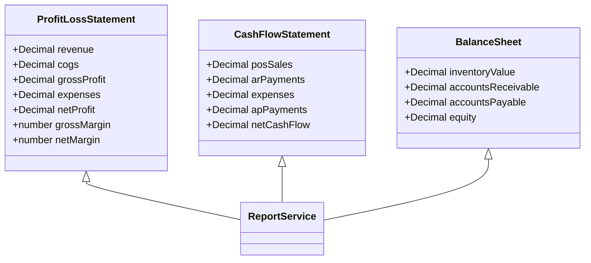
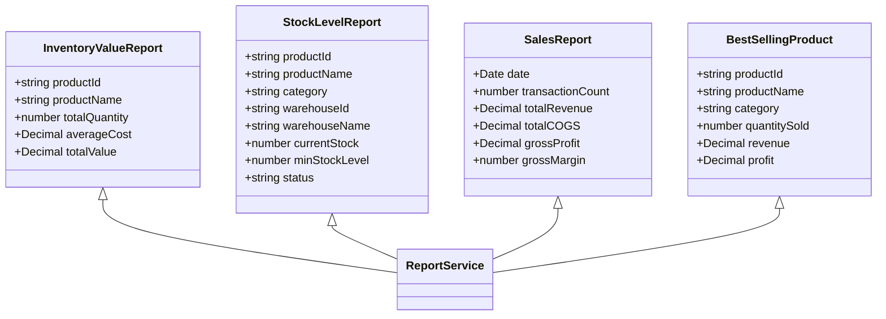
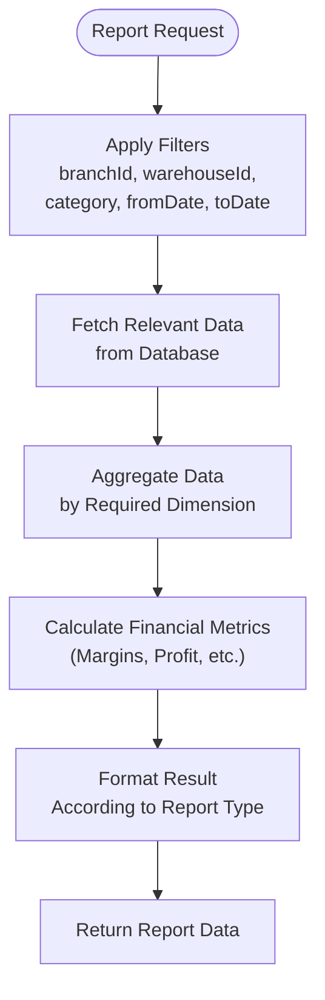
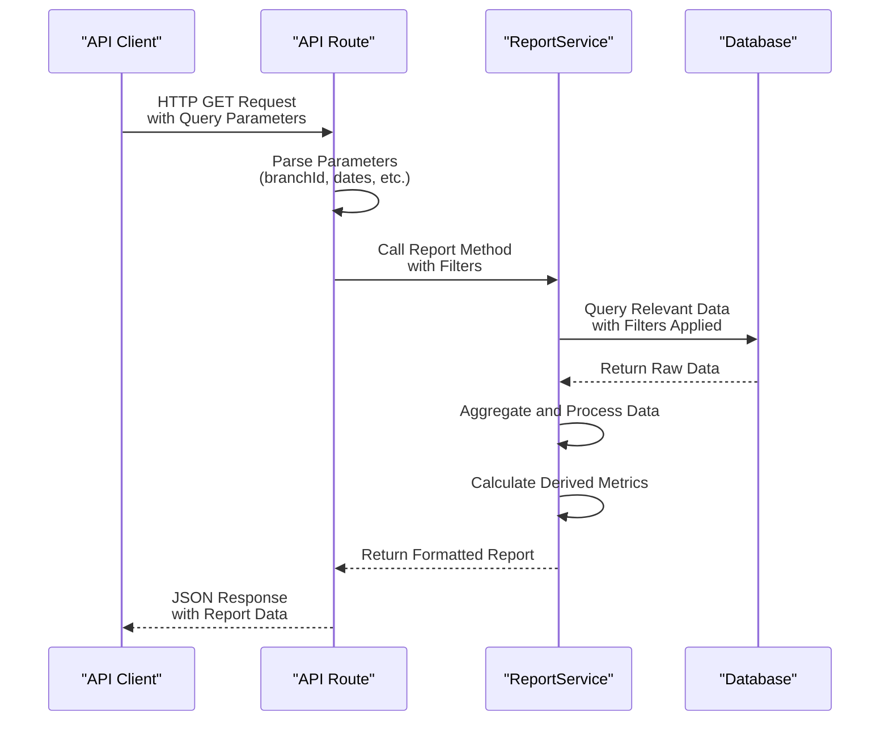
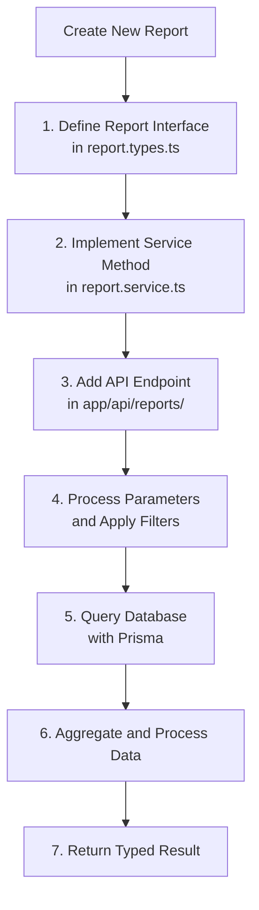

# Reporting Service

<cite>
**Referenced Files in This Document**   
- [report.service.ts](file://services/report.service.ts)
- [report.types.ts](file://types/report.types.ts)
- [profit-loss/route.ts](file://app/api/reports/profit-loss/route.ts)
- [balance-sheet/route.ts](file://app/api/reports/balance-sheet/route.ts)
- [cash-flow/route.ts](file://app/api/reports/cash-flow/route.ts)
- [best-sellers/route.ts](file://app/api/reports/best-sellers/route.ts)
- [inventory-value/route.ts](file://app/api/reports/inventory-value/route.ts)
- [sales/route.ts](file://app/api/reports/sales/route.ts)
- [stock-levels/route.ts](file://app/api/reports/stock-levels/route.ts)
</cite>

## Table of Contents
1. [Introduction](#introduction)
2. [Core Report Types](#core-report-types)
3. [Data Aggregation and Filtering](#data-aggregation-and-filtering)
4. [Parameterized Report Execution](#parameterized-report-execution)
5. [Report Generation Workflow](#report-generation-workflow)
6. [Integration with Dashboard KPIs](#integration-with-dashboard-kpis)
7. [Scheduled Report Generation](#scheduled-report-generation)
8. [Data Accuracy and Processing Trade-offs](#data-accuracy-and-processing-trade-offs)
9. [Extending the Report Service](#extending-the-report-service)
10. [Export Formats](#export-formats)

## Introduction
The ReportService provides a comprehensive suite of financial and operational reporting capabilities for multi-branch retail operations. It enables generation of key financial statements, inventory valuation reports, sales analytics, and performance metrics. The service is designed to support real-time decision-making through accurate data aggregation across multiple dimensions including branches, warehouses, categories, and time periods.

**Section sources**
- [report.service.ts](file://services/report.service.ts#L13-L393)
- [report.types.ts](file://types/report.types.ts#L1-L85)

## Core Report Types

### Financial Reports
The service supports three primary financial statements:

**Profit & Loss Statement**: Calculates revenue, cost of goods sold (COGS), gross profit, expenses, and net profit over a specified period. Revenue and COGS are derived from POS sales data, while expenses are aggregated from the expense ledger.

**Cash Flow Statement**: Tracks cash inflows (POS sales and accounts receivable payments) and outflows (expenses and accounts payable payments) to determine net cash flow during a period.

**Balance Sheet**: Provides a snapshot of financial position by calculating total assets (inventory value and accounts receivable), liabilities (accounts payable), and equity as of a specific date.

**Diagram sources**
- [report.types.ts](file://types/report.types.ts#L41-L76)
- [report.service.ts](file://services/report.service.ts#L234-L393)

### Inventory and Sales Reports
The service provides operational reports for inventory management and sales performance:

**Inventory Valuation Report**: Calculates total inventory value by aggregating the quantity and unit cost of all active inventory batches, grouped by product.

**Stock Level Report**: Monitors current stock levels against minimum thresholds, categorizing inventory status as adequate, low, or critical.

**Sales Analytics Report**: Aggregates daily sales data including transaction count, revenue, COGS, and gross profit margin.

**Best-Seller Report**: Identifies top-performing products based on revenue generation within a specified period.

**Diagram sources**
- [report.types.ts](file://types/report.types.ts#L3-L40)
- [report.service.ts](file://services/report.service.ts#L15-L232)

## Data Aggregation and Filtering
The ReportService supports multi-dimensional filtering and aggregation across organizational units and time periods. All reports accept a common set of filter parameters through the ReportFilters interface.

### Filter Dimensions
- **Branch**: Filter reports by specific branch ID to generate location-specific insights
- **Warehouse**: Narrow results to a particular warehouse within a branch
- **Category**: Filter by product category for category-specific analysis
- **Time Period**: Specify date ranges using fromDate and toDate parameters

### Aggregation Logic
The service implements sophisticated aggregation logic to handle data from multiple branches:

- **Financial Aggregation**: Revenue, expenses, and cash flows are summed across all relevant transactions
- **Inventory Aggregation**: Stock levels and values are calculated per product-warehouse combination
- **Sales Aggregation**: Daily sales data is grouped by date, with options to group by week or month
- **Product Performance**: Sales items are aggregated by product to identify best-sellers

**Diagram sources**
- [report.service.ts](file://services/report.service.ts#L15-L393)
- [report.types.ts](file://types/report.types.ts#L78-L84)

**Section sources**
- [report.service.ts](file://services/report.service.ts#L15-L393)
- [report.types.ts](file://types/report.types.ts#L78-L84)

## Parameterized Report Execution
Reports can be executed with specific parameters to customize the output. The service accepts parameters through the ReportFilters interface and additional method-specific parameters.

### Example Parameter Combinations
- **Branch-Specific P&L**: `getProfitLossStatement({ branchId: "branch-001", fromDate: startDate, toDate: endDate })`
- **Category-Specific Inventory**: `getInventoryValueReport({ category: "Electronics", warehouseId: "wh-002" })`
- **Top 20 Best-Sellers**: `getBestSellingProducts({ fromDate: lastMonth, toDate: today }, 20)`
- **Daily Sales Trend**: `getSalesReport({ branchId: "branch-001", fromDate: weekStart, toDate: weekEnd }, "day")`

### Parameter Validation
The service automatically handles optional parameters and provides default behaviors:
- When no branch is specified, reports aggregate data across all branches
- When no date range is provided, financial reports use all available data
- The best-sellers report defaults to a limit of 10 products if not specified

**Section sources**
- [report.service.ts](file://services/report.service.ts#L15-L393)
- [report.types.ts](file://types/report.types.ts#L78-L84)

## Report Generation Workflow
The report generation process follows a consistent pattern across all report types, ensuring reliability and maintainability.

**Diagram sources**
- [profit-loss/route.ts](file://app/api/reports/profit-loss/route.ts#L6-L27)
- [report.service.ts](file://services/report.service.ts#L234-L281)

## Integration with Dashboard KPIs
The ReportService directly supports dashboard functionality by providing data for key performance indicators. Several API routes in the dashboard namespace consume report data:

- **Branch Comparison**: Uses profit and loss data to compare performance across branches
- **Top Products**: Leverages best-sellers report to highlight high-performing items
- **Warehouse Utilization**: Based on inventory stock level and value reports
- **KPIs**: Aggregates financial data from profit & loss and cash flow statements

This tight integration ensures that dashboard metrics are consistent with formal reports and are generated using the same underlying logic.

**Section sources**
- [report.service.ts](file://services/report.service.ts#L15-L393)
- [dashboard/kpis/route.ts](file://app/api/dashboard/kpis/route.ts)
- [dashboard/top-products/route.ts](file://app/api/dashboard/top-products/route.ts)

## Scheduled Report Generation
While the current implementation focuses on on-demand reporting, the service architecture supports scheduled report generation. The stateless nature of the ReportService methods makes them ideal for integration with scheduling systems.

Potential implementation approaches:
- **Cron Jobs**: Schedule report generation at specific times using cron expressions
- **Queue-Based Processing**: Add report generation tasks to a message queue for asynchronous processing
- **Cache Pre-Warming**: Generate frequently accessed reports during off-peak hours to improve response times

The service's parameterized design allows for easy automation of recurring reports with predefined filter combinations.

## Data Accuracy and Processing Trade-offs
The ReportService prioritizes data accuracy through direct database queries rather than relying on pre-aggregated data. This approach ensures reports reflect the current state of the system.

### Real-time vs. Batch Processing
The service implements real-time processing for all reports, meaning data is queried and aggregated at request time. This provides the most current information but may impact performance with large datasets.

**Advantages of Real-time Processing:**
- Always reflects the latest data
- No need for complex cache invalidation logic
- Consistent with transactional data

**Potential Performance Optimizations:**
- Implement result caching for frequently accessed reports
- Use database views for complex aggregations
- Consider materialized views for large datasets with acceptable staleness

The service uses the Prisma ORM with efficient querying patterns, including appropriate where clauses and selective field inclusion to minimize data transfer.

**Section sources**
- [report.service.ts](file://services/report.service.ts#L15-L393)
- [prisma/migrations](file://prisma/migrations)

## Extending the Report Service
The ReportService is designed to be extensible, allowing for the addition of new report types while maintaining consistency with existing patterns.

### Creating Custom Reports
To create a new report type:

1. **Define the Report Interface**: Add a new interface in report.types.ts that defines the report structure
2. **Implement the Service Method**: Create a new method in ReportService that follows the established pattern of filtering, querying, and aggregation
3. **Add API Endpoint**: Create a new route in app/api/reports/ that exposes the new report
4. **Handle Parameters**: Use the existing ReportFilters interface or extend it as needed

### Query Pattern Guidelines
When implementing new reports, follow these patterns:
- Use the ReportFilters interface for common filter parameters
- Leverage Prisma's relation queries to minimize database round-trips
- Use Decimal.js for financial calculations to avoid floating-point errors
- Implement efficient in-memory aggregation using Map objects
- Handle edge cases such as zero denominators in margin calculations

**Diagram sources**
- [report.types.ts](file://types/report.types.ts#L3-L85)
- [report.service.ts](file://services/report.service.ts#L13-L393)

**Section sources**
- [report.types.ts](file://types/report.types.ts#L3-L85)
- [report.service.ts](file://services/report.service.ts#L13-L393)

## Export Formats
While the current implementation returns JSON data through API endpoints, the service architecture supports multiple export formats. The clean separation between data generation and presentation allows for easy addition of export functionality.

### Supported Export Options
- **PDF**: Suitable for formal financial statements and printable reports
- **CSV**: Ideal for data analysis in spreadsheet applications
- **Excel**: Supports formatted financial reports with multiple sheets

### Implementation Strategy
Export functionality could be added by:
- Creating export-specific methods that wrap existing report generation
- Using template engines for PDF generation
- Implementing streaming responses for large CSV files
- Adding format parameters to existing API routes (e.g., ?format=pdf)

The service's return of structured TypeScript objects makes it straightforward to transform report data into various formats while maintaining data integrity.

**Section sources**
- [report.service.ts](file://services/report.service.ts#L15-L393)
- [report.types.ts](file://types/report.types.ts#L3-L85)