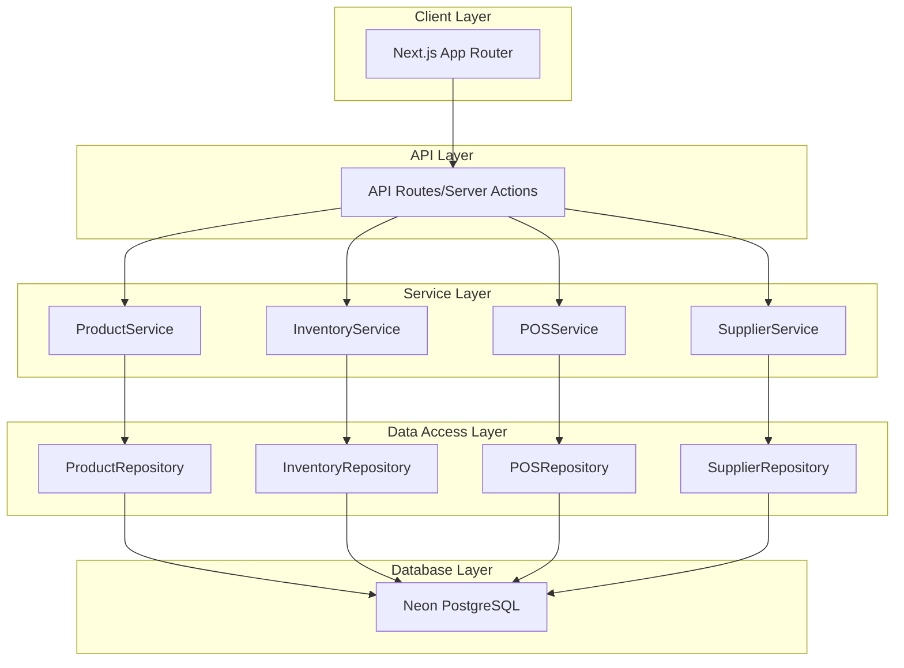
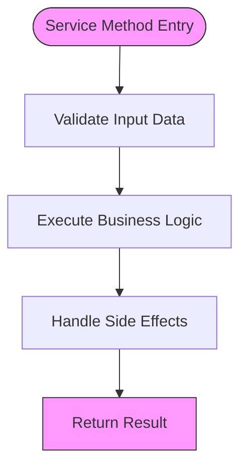
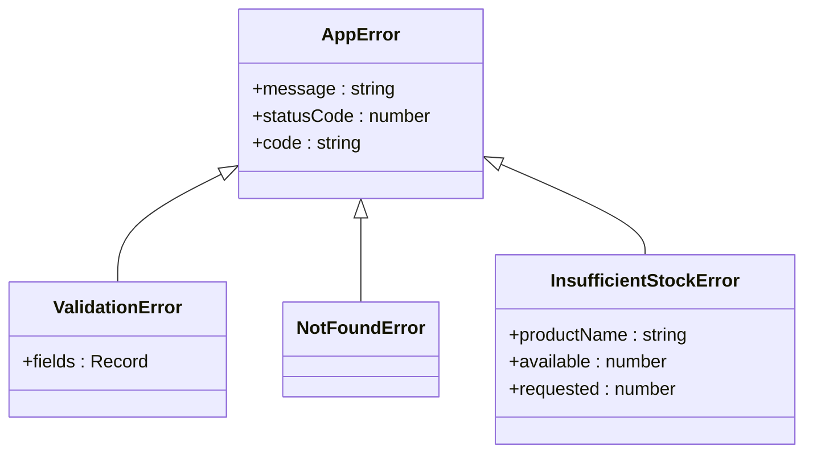
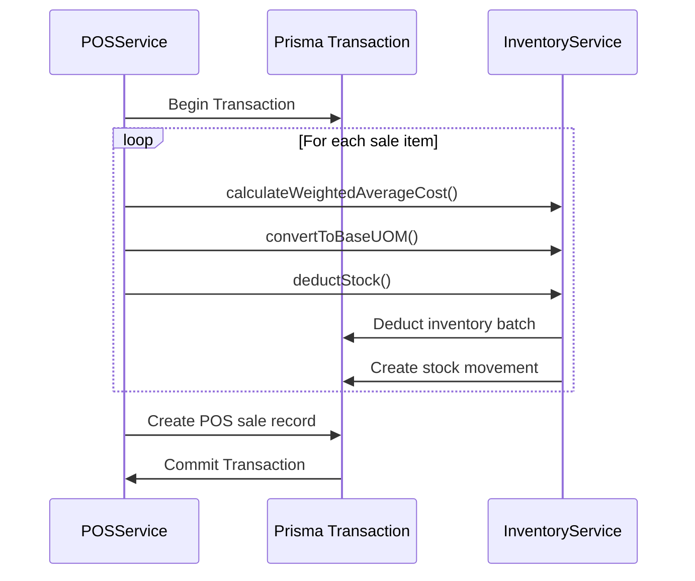

# Service Layer

<cite>
**Referenced Files in This Document**   
- [product.service.ts](file://services/product.service.ts)
- [inventory.service.ts](file://services/inventory.service.ts)
- [pos.service.ts](file://services/pos.service.ts)
- [supplier.service.ts](file://services/supplier.service.ts)
- [lib/errors.ts](file://lib/errors.ts)
- [lib/validations/product.validation.ts](file://lib/validations/product.validation.ts)
- [specs/inventory-pro-system/design.md](file://specs/inventory-pro-system/design.md)
</cite>

## Table of Contents
1. [Introduction](#introduction)
2. [Service Layer Architecture](#service-layer-architecture)
3. [Business Logic Encapsulation](#business-logic-encapsulation)
4. [Service-Repository Interaction](#service-repository-interaction)
5. [Error Handling and Validation](#error-handling-and-validation)
6. [Dependency Injection and Singleton Pattern](#dependency-injection-and-singleton-pattern)
7. [Key Service Implementations](#key-service-implementations)
8. [Cross-Module Interactions](#cross-module-interactions)
9. [Transaction Management](#transaction-management)
10. [Extending Services](#extending-services)

## Introduction
The Service Layer in this application implements a robust business logic encapsulation pattern, serving as the intermediary between API routes and data repositories. Each service class orchestrates complex operations, enforces business rules, and manages transactions while maintaining separation of concerns. The layer follows a consistent pattern across all modules, with services handling validation, business logic, and side effects while delegating data access to repository classes. This documentation details the implementation of key services including ProductService, InventoryService, POSService, and others, focusing on how they encapsulate business logic, interact with repositories, handle errors, and maintain data integrity.

## Service Layer Architecture
The application follows a clean architectural pattern with distinct layers: Client Layer (Next.js App Router), API Layer (Server Actions), Service Layer (Business Logic), Data Access Layer (Prisma ORM), and Database Layer (Neon PostgreSQL). The Service Layer sits at the core of this architecture, receiving requests from API routes, processing business logic, and interacting with repositories for data persistence. Each service class is designed as a singleton instance, exported as a named constant (e.g., productService), enabling consistent dependency management across the application. Services are organized by domain (Product, Inventory, POS, etc.) with each service class containing methods specific to its business domain.

**Diagram sources**
- [specs/inventory-pro-system/design.md](file://specs/inventory-pro-system/design.md#L40-L80)

**Section sources**
- [specs/inventory-pro-system/design.md](file://specs/inventory-pro-system/design.md#L40-L80)
- [steer/structure.md](file://steer/structure.md#L5-L81)

## Business Logic Encapsulation
Services encapsulate business logic following a consistent three-step pattern: validation, business logic execution, and side effects. The ProductService exemplifies this pattern in its createProduct method, which first validates input data against Zod schemas, then executes the core business logic by creating the product record, and finally handles any side effects such as generating alerts. This separation ensures that business rules are centralized within services rather than scattered across API routes or components. Complex operations like inventory adjustments and POS transactions involve multiple steps and calculations that are fully encapsulated within their respective service methods.

**Diagram sources**
- [specs/inventory-pro-system/design.md](file://specs/inventory-pro-system/design.md#L468-L478)

**Section sources**
- [specs/inventory-pro-system/design.md](file://specs/inventory-pro-system/design.md#L468-L478)
- [services/product.service.ts](file://services/product.service.ts#L29-L66)

## Service-Repository Interaction
Services interact with repositories to perform data access operations, maintaining a clear separation between business logic and data persistence. Each service imports its corresponding repository and calls repository methods to retrieve or persist data. For example, the ProductService uses productRepository to create, update, and find products, while the InventoryService uses inventoryRepository to manage inventory batches and stock movements. This pattern allows repositories to handle database-specific concerns like Prisma queries, while services focus on business rules and orchestration. Services may also interact with multiple repositories when implementing cross-domain functionality.

**Section sources**
- [services/product.service.ts](file://services/product.service.ts#L2-L9)
- [services/inventory.service.ts](file://services/inventory.service.ts#L3-L4)
- [services/pos.service.ts](file://services/pos.service.ts#L3-L4)

## Error Handling and Validation
The Service Layer implements comprehensive error handling using custom error classes and validation patterns. The lib/errors.ts file defines a hierarchy of error classes including ValidationError, NotFoundError, and InsufficientStockError, which extend a base AppError class. Services use these custom errors to provide meaningful error messages and appropriate HTTP status codes. Input validation is performed using Zod schemas, with validation errors converted to ValidationError instances. Business rule violations such as insufficient stock or duplicate entries trigger specific error types that are handled consistently across the application.

**Diagram sources**
- [lib/errors.ts](file://lib/errors.ts#L1-L33)
- [services/supplier.service.ts](file://services/supplier.service.ts#L38-L40)

**Section sources**
- [lib/errors.ts](file://lib/errors.ts#L1-L33)
- [services/supplier.service.ts](file://services/supplier.service.ts#L38-L40)
- [services/product.service.ts](file://services/product.service.ts#L30-L35)

## Dependency Injection and Singleton Pattern
Services are implemented using the singleton pattern, with each service class instantiated once and exported as a named constant. This approach provides a simple form of dependency injection, allowing services to be imported and used throughout the application without requiring complex dependency injection containers. The singleton pattern ensures consistent state and behavior across the application while maintaining loose coupling between components. Services may depend on other services, such as POSService depending on inventoryService and salesOrderService, creating a network of collaborating singletons that orchestrate complex business workflows.

**Section sources**
- [services/product.service.ts](file://services/product.service.ts#L192-L193)
- [services/inventory.service.ts](file://services/inventory.service.ts#L503-L504)
- [services/pos.service.ts](file://services/pos.service.ts#L213-L214)

## Key Service Implementations

### ProductService
The ProductService handles all product-related business logic, including creation, updating, and status management. It enforces business rules such as unique product names and valid UOM configurations. The service validates input against Zod schemas defined in lib/validations/product.validation.ts and interacts with productRepository for data persistence. Key methods include createProduct, updateProduct, and deleteProduct, each implementing appropriate validation and business rules. The service also provides utility methods for retrieving product UOMs and selling prices.

**Section sources**
- [services/product.service.ts](file://services/product.service.ts#L12-L193)
- [lib/validations/product.validation.ts](file://lib/validations/product.validation.ts#L1-L32)

### InventoryService
The InventoryService manages inventory operations including stock addition, deduction, and transfer between warehouses. It implements critical business logic such as FIFO (First In, First Out) inventory deduction based on expiry dates and weighted average cost calculation for inventory valuation. The service handles UOM conversion, ensuring quantities are properly converted to base units for calculations. Complex operations like transferStock are wrapped in Prisma transactions to ensure atomicity. The service also provides methods for retrieving stock levels and identifying expiring or expired batches.

**Section sources**
- [services/inventory.service.ts](file://services/inventory.service.ts#L17-L504)
- [specs/inventory-pro-system/tasks.md](file://specs/inventory-pro-system/tasks.md#L322-L341)

### POSService
The POSService orchestrates point-of-sale transactions, handling the complete sale process from payment processing to inventory deduction and COGS calculation. The processSale method executes in a transaction, calculating the cost of goods sold using weighted average costs, deducting inventory using FIFO rules, and creating the sale record with all associated items. The service integrates with inventoryService for stock management and salesOrderService for converting sales orders to POS transactions. It also handles receipt number generation and validation.

**Section sources**
- [services/pos.service.ts](file://services/pos.service.ts#L16-L214)
- [specs/inventory-pro-system/tasks.md](file://specs/inventory-pro-system/tasks.md#L550-L561)

## Cross-Module Interactions
Services collaborate across modules to implement complex business workflows. The POSService depends on inventoryService to deduct stock and calculate COGS during sale processing. Similarly, the purchase-order.service would interact with inventoryService to add stock when receiving purchase orders. These cross-module interactions are facilitated through direct imports of service singletons, creating a network of collaborating services that maintain business integrity across domain boundaries. This approach enables features like sales order conversion to POS transactions, where the POSService updates the sales order status through the salesOrderService.

**Section sources**
- [services/pos.service.ts](file://services/pos.service.ts#L3-L4)
- [services/pos.service.ts](file://services/pos.service.ts#L181-L188)

## Transaction Management
The Service Layer employs transaction management to ensure data consistency during complex operations. The InventoryService uses Prisma's transaction functionality to wrap multi-step operations like stock deduction and transfer, ensuring that either all steps succeed or all are rolled back. The POSService similarly wraps the entire sale process in a transaction, including inventory deduction and sale creation. This prevents partial updates that could lead to data inconsistency. Transactions are implemented using Prisma's $transaction method, which provides ACID properties for database operations.

**Diagram sources**
- [services/pos.service.ts](file://services/pos.service.ts#L160-L209)
- [services/inventory.service.ts](file://services/inventory.service.ts#L149-L177)

**Section sources**
- [services/pos.service.ts](file://services/pos.service.ts#L160-L209)
- [services/inventory.service.ts](file://services/inventory.service.ts#L149-L177)

## Extending Services
To extend existing services or create new ones, follow the established patterns in the codebase. New services should be implemented as classes with methods that follow the validation-business logic-side effects pattern. Services should import and use their corresponding repository for data access operations. Input validation should use Zod schemas defined in the lib/validations directory. Custom errors should extend the AppError hierarchy defined in lib/errors.ts. New service classes should be instantiated as singletons and exported for use throughout the application. When implementing cross-service dependencies, import the required service singleton directly.

**Section sources**
- [specs/inventory-pro-system/design.md](file://specs/inventory-pro-system/design.md#L467-L493)
- [steer/structure.md](file://steer/structure.md#L69-L71)