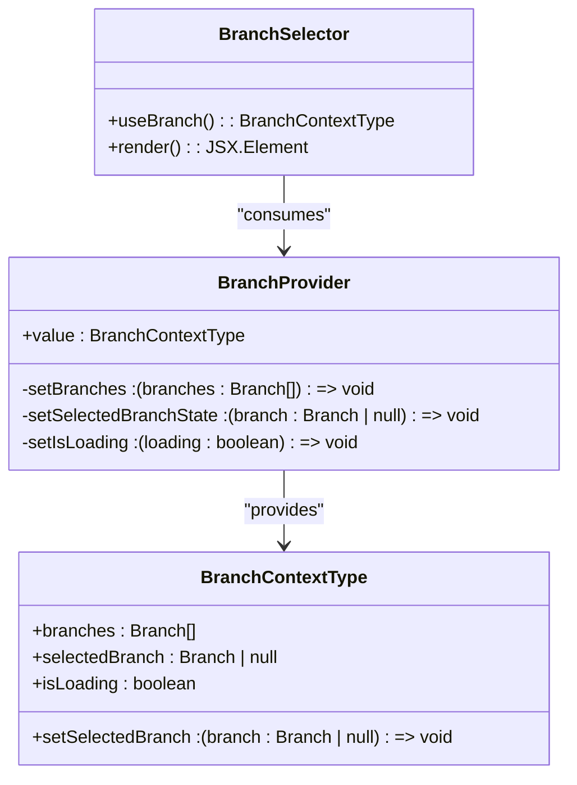
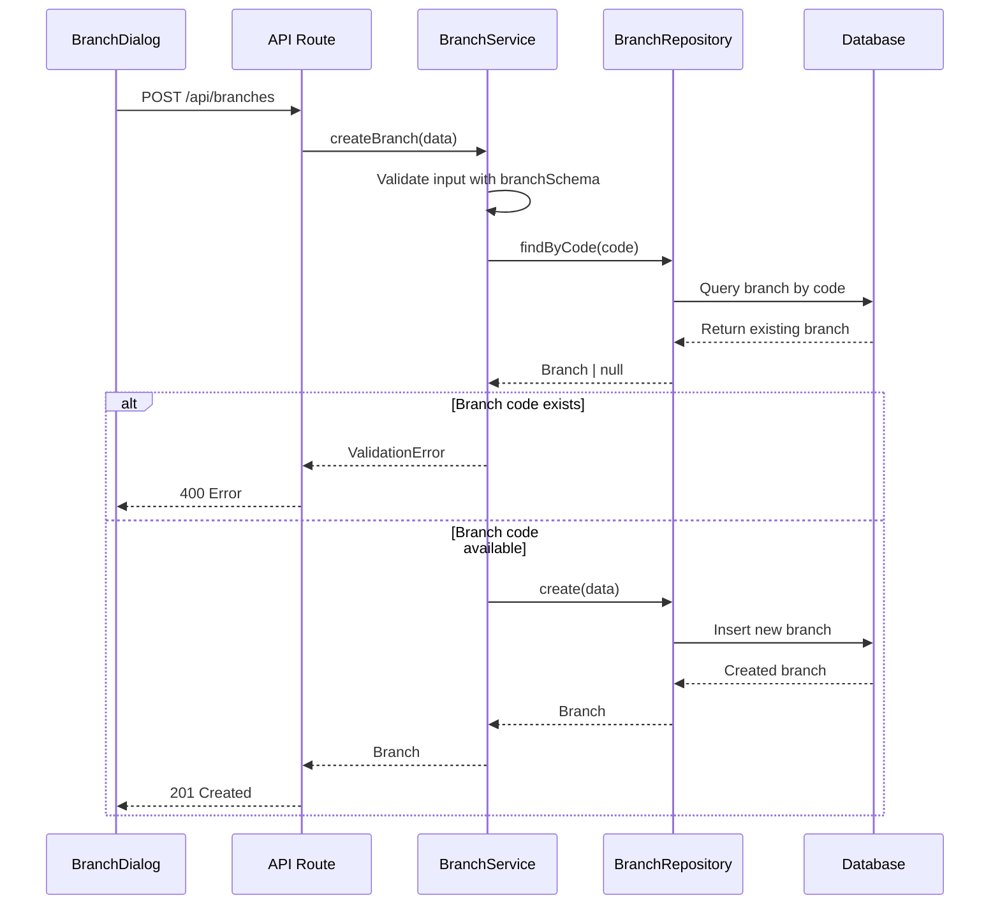
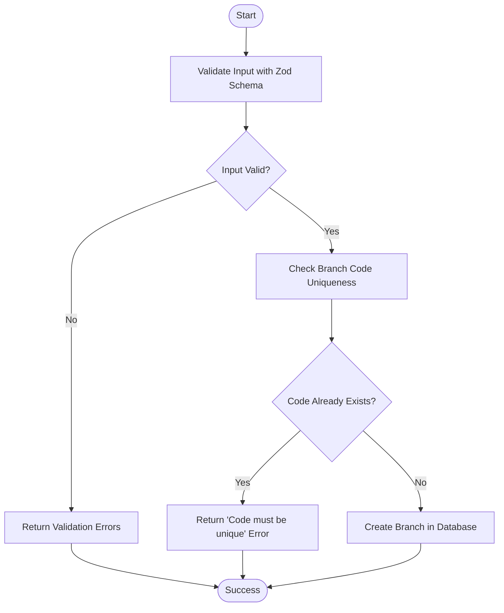
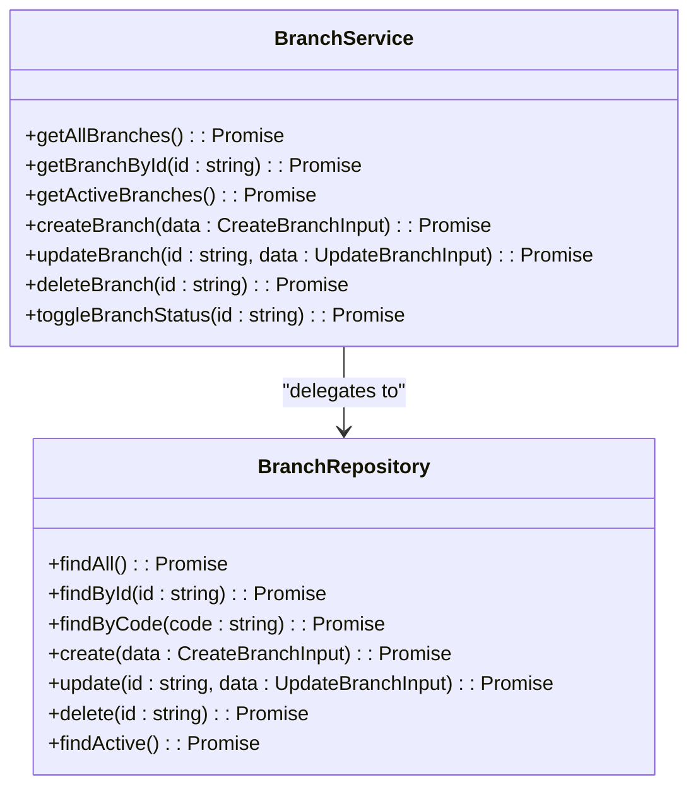

# Branches Module

<cite>
**Referenced Files in This Document**   
- [branch-context.tsx](file://contexts/branch-context.tsx)
- [branch.service.ts](file://services/branch.service.ts)
- [branch.repository.ts](file://repositories/branch.repository.ts)
- [branch.validation.ts](file://lib/validations/branch.validation.ts)
- [branch-dialog.tsx](file://components/branches/branch-dialog.tsx)
- [branch-table.tsx](file://components/branches/branch-table.tsx)
- [branch-selector.tsx](file://components/shared/branch-selector.tsx)
- [route.ts](file://app/api/branches/route.ts)
- [route.ts](file://app/api/branches/[id]/route.ts)
- [use-branches.ts](file://hooks/use-branches.ts)
- [use-branch.ts](file://hooks/use-branch.ts)
</cite>

## Table of Contents
1. [Introduction](#introduction)
2. [Branch Context and Global Selection](#branch-context-and-global-selection)
3. [Multi-Branch Operations](#multi-branch-operations)
4. [Branch Creation and Management](#branch-creation-and-management)
5. [Branch Validation Rules](#branch-validation-rules)
6. [Service Layer CRUD Operations](#service-layer-crud-operations)
7. [Integration with Core Modules](#integration-with-core-modules)
8. [Common Issues and Performance Implications](#common-issues-and-performance-implications)
9. [Troubleshooting Guide](#troubleshooting-guide)

## Introduction
The Branches module provides a comprehensive system for managing multiple business locations within the inventory management application. It enables users to create, manage, and switch between different branches, with all data operations being context-aware based on the selected branch. This document details the architecture, functionality, and integration points of the Branches module, focusing on multi-branch operations, branch lifecycle management, and the global branch context system that affects data visibility across Inventory, POS, Sales, and other core modules.

## Branch Context and Global Selection
The BranchContext system enables users to select and switch between branches, with the selection persisting across sessions and affecting data visibility throughout the application. The context is implemented using React's Context API and provides a global state management solution for branch selection.

**Diagram sources**
- [branch-context.tsx](file://contexts/branch-context.tsx#L14-L20)
- [branch-context.tsx](file://contexts/branch-context.tsx#L26-L81)
- [branch-selector.tsx](file://components/shared/branch-selector.tsx#L14-L88)

**Section sources**
- [branch-context.tsx](file://contexts/branch-context.tsx#L1-L90)
- [branch-selector.tsx](file://components/shared/branch-selector.tsx#L1-L88)
- [use-branch.ts](file://hooks/use-branch.ts#L1-L5)

## Multi-Branch Operations
The system supports operations across multiple branches through a centralized API and service layer. When a user selects a branch via the BranchSelector component, this selection is stored in localStorage with the key 'inventoryPro_selectedBranch' and used to filter data across all modules. The BranchProvider loads all available branches on initialization and maintains the selected branch state, which is then consumed by all branch-aware components.

The multi-branch architecture ensures that data operations in Inventory, POS, Sales, and other modules are automatically scoped to the currently selected branch, providing data isolation between locations while allowing administrators to view consolidated reports when needed.

**Section sources**
- [branch-context.tsx](file://contexts/branch-context.tsx#L24-L81)
- [branch-selector.tsx](file://components/shared/branch-selector.tsx#L14-L88)

## Branch Creation and Management
Branch creation and management is handled through a combination of UI components, API routes, and service layer operations. The BranchDialog component provides a form interface for creating and editing branches, with validation handled by Zod schemas. When a user submits the form, the data is sent to the API endpoint, which processes the request through the service layer.

To set up a new branch, users can click the "Create Branch" button in the branches management interface, fill out the required information (name, code, location, manager, phone), and submit the form. The system validates the input and creates the new branch record in the database.

Assigning warehouses to a branch is managed through the warehouse management interface, where each warehouse record includes a branchId field that establishes the relationship between the warehouse and its parent branch.

**Diagram sources**
- [branch-dialog.tsx](file://components/branches/branch-dialog.tsx#L42-L253)
- [route.ts](file://app/api/branches/route.ts#L28-L52)
- [branch.service.ts](file://services/branch.service.ts#L24-L39)
- [branch.repository.ts](file://repositories/branch.repository.ts#L24-L34)

**Section sources**
- [branch-dialog.tsx](file://components/branches/branch-dialog.tsx#L1-L253)
- [branch-table.tsx](file://components/branches/branch-table.tsx#L1-L47)
- [use-branches.ts](file://hooks/use-branches.ts#L1-L91)

## Branch Validation Rules
The system enforces strict validation rules for branch data integrity. Validation is performed at multiple levels: client-side using Zod schemas, and server-side in the service layer. The branchSchema defines the following validation rules:

- Name: Required, minimum 1 character, maximum 100 characters
- Code: Required, minimum 1 character, maximum 20 characters, must be unique
- Location: Required, minimum 1 character, maximum 200 characters
- Manager: Required, minimum 1 character, maximum 100 characters
- Phone: Required, must match phone number format regex
- Status: Optional, defaults to 'active', must be either 'active' or 'inactive'

The system checks for unique branch codes both during creation and updates. When creating a new branch, it verifies that no existing branch has the same code. When updating a branch, it only performs the uniqueness check if the code is being changed.

**Diagram sources**
- [branch.validation.ts](file://lib/validations/branch.validation.ts#L3-L10)
- [branch.service.ts](file://services/branch.service.ts#L24-L39)
- [branch.service.ts](file://services/branch.service.ts#L40-L63)

**Section sources**
- [branch.validation.ts](file://lib/validations/branch.validation.ts#L1-L16)
- [branch.service.ts](file://services/branch.service.ts#L24-L63)

## Service Layer CRUD Operations
The BranchService class provides a comprehensive set of CRUD operations for branch management. These operations are organized in a service layer that sits between the API routes and the repository layer, providing business logic and validation.

The service layer methods include:
- getAllBranches(): Retrieves all branches ordered by name
- getBranchById(id): Retrieves a specific branch by ID with error handling
- getActiveBranches(): Retrieves only active branches
- createBranch(data): Creates a new branch with validation and uniqueness checks
- updateBranch(id, data): Updates an existing branch with validation and code uniqueness checks
- deleteBranch(id): Deletes a branch after verifying it exists
- toggleBranchStatus(id): Toggles a branch between active and inactive states

Each operation follows a consistent pattern of validation, business logic, and repository interaction, ensuring data integrity and proper error handling.

**Diagram sources**
- [branch.service.ts](file://services/branch.service.ts#L7-L84)
- [branch.repository.ts](file://repositories/branch.repository.ts#L6-L55)

**Section sources**
- [branch.service.ts](file://services/branch.service.ts#L1-L87)
- [branch.repository.ts](file://repositories/branch.repository.ts#L1-L58)

## Integration with Core Modules
The Branches module integrates with all core modules (Inventory, POS, Sales, etc.) to ensure branch-aware operations and reporting. The BranchContext is consumed by various modules to filter data based on the selected branch. For example:

- Inventory module displays stock levels only for the selected branch
- POS module processes sales transactions in the context of the selected branch
- Sales Orders module shows orders specific to the selected branch
- Reports module can generate both branch-specific and consolidated reports

The integration is achieved through the useBranch hook, which provides access to the current branch context, and API endpoints that automatically scope data to the selected branch. This ensures that users only see data relevant to their current branch context while maintaining data isolation between branches.

**Section sources**
- [branch-context.tsx](file://contexts/branch-context.tsx#L83-L89)
- [use-branch.ts](file://hooks/use-branch.ts#L1-L5)
- [branch-selector.tsx](file://components/shared/branch-selector.tsx#L1-L88)

## Common Issues and Performance Implications
Several common issues may arise in multi-branch environments:

1. **Inconsistent data across branches**: This can occur when branch selection is not properly maintained across page transitions or when cached data becomes stale. The system addresses this by storing the selected branch in localStorage and reloading branch data on application initialization.

2. **Performance degradation with large branch networks**: As the number of branches grows, the initial load time for branch data may increase. The current implementation loads all branches at startup, which could become a bottleneck with hundreds of branches. Potential optimizations include pagination or lazy loading of branch data.

3. **Race conditions during branch switching**: When users rapidly switch between branches, there is a potential for data from the previous branch to be momentarily displayed. The isLoading state in the BranchContext helps mitigate this by showing a loading state during branch context changes.

4. **Validation conflicts**: The unique constraint on branch codes is enforced at the application level, but in high-concurrency scenarios, there is a small window where two users could create branches with the same code. This could be addressed by adding a unique constraint at the database level.

The system currently does not prevent deletion of branches that have related records (warehouses, orders, etc.), which could lead to referential integrity issues. In a production environment, the deleteBranch method should check for related records and prevent deletion if they exist, or implement appropriate cascade rules.

**Section sources**
- [branch-context.tsx](file://contexts/branch-context.tsx#L31-L58)
- [branch.service.ts](file://services/branch.service.ts#L66-L77)
- [branch.repository.ts](file://repositories/branch.repository.ts#L44-L48)

## Troubleshooting Guide
When encountering issues with the Branches module, consider the following troubleshooting steps:

1. **Branch selection not persisting**: Verify that localStorage is working correctly and that the 'inventoryPro_selectedBranch' key is being set and retrieved properly.

2. **Validation errors on branch creation**: Check that all required fields are filled and that the branch code is unique. The validation messages should provide specific guidance on what needs to be corrected.

3. **Branch data not loading**: Check the browser's developer tools for API errors when calling /api/branches. Ensure the backend service is running and accessible.

4. **Performance issues with many branches**: Monitor the response time of the /api/branches endpoint. If response times are slow, consider implementing pagination or optimizing the database query.

5. **Inconsistent data display**: Ensure that all branch-aware components are properly using the useBranch hook and responding to changes in the selected branch context.

**Section sources**
- [branch-context.tsx](file://contexts/branch-context.tsx#L50-L52)
- [branch.service.ts](file://services/branch.service.ts#L10-L11)
- [branch.service.ts](file://services/branch.service.ts#L38-L39)
- [route.ts](file://app/api/branches/route.ts#L11-L23)