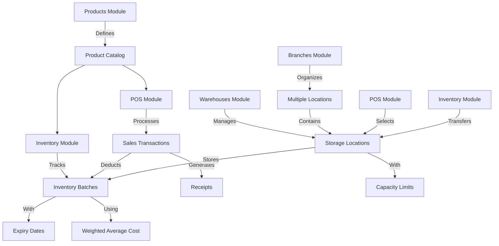

# Core Modules

<cite>
**Referenced Files in This Document**   
- [products/page.tsx](file://app/(dashboard)/products/page.tsx)
- [inventory/page.tsx](file://app/(dashboard)/inventory/page.tsx)
- [pos/page.tsx](file://app/(dashboard)/pos/page.tsx)
- [warehouses/page.tsx](file://app/(dashboard)/warehouses/page.tsx)
- [branches/page.tsx](file://app/(dashboard)/branches/page.tsx)
- [product.service.ts](file://services/product.service.ts)
- [inventory.service.ts](file://services/inventory.service.ts)
- [pos.service.ts](file://services/pos.service.ts)
- [warehouse.service.ts](file://services/warehouse.service.ts)
- [branch.service.ts](file://services/branch.service.ts)
- [product.repository.ts](file://repositories/product.repository.ts)
- [inventory.repository.ts](file://repositories/inventory.repository.ts)
- [pos.repository.ts](file://repositories/pos.repository.ts)
- [warehouse.repository.ts](file://repositories/warehouse.repository.ts)
- [branch.repository.ts](file://repositories/branch.repository.ts)
- [product.types.ts](file://types/product.types.ts)
- [inventory.types.ts](file://types/inventory.types.ts)
- [pos.types.ts](file://types/pos.types.ts)
- [warehouse.types.ts](file://types/warehouse.types.ts)
- [branch.types.ts](file://types/branch.types.ts)
- [product-table.tsx](file://components/products/product-table.tsx)
- [inventory-table.tsx](file://components/inventory/inventory-table.tsx)
- [pos-cart.tsx](file://components/pos/pos-cart.tsx)
- [warehouse-table.tsx](file://components/warehouses/warehouse-table.tsx)
- [branch-table.tsx](file://components/branches/branch-table.tsx)
- [route.ts](file://app/api/products/route.ts)
- [route.ts](file://app/api/inventory/route.ts)
- [route.ts](file://app/api/pos/sales/route.ts)
- [route.ts](file://app/api/warehouses/route.ts)
- [route.ts](file://app/api/branches/route.ts)
- [design.md](file://specs/inventory-pro-system/design.md)
</cite>

## Table of Contents
1. [Products](#products)
2. [Inventory](#inventory)
3. [POS](#pos)
4. [Warehouses](#warehouses)
5. [Branches](#branches)
6. [Module Interconnections](#module-interconnections)

## Products

The Products module provides comprehensive catalog management for the inventory system, enabling users to manage product information, unit of measure configurations, and pricing structures. This module serves as the foundation for all inventory and sales operations.

The user interface is accessible through the `/products` route and features a clean, intuitive layout with search functionality, category filtering, and status controls. Users can add new products, edit existing ones, and view detailed information including alternate units of measure and their respective pricing.

Each product record includes essential attributes such as name, description, category, base price, base unit of measure (UOM), minimum stock level, shelf life in days, and status. The system enforces data integrity by ensuring product names are unique and validating that alternate UOM names do not conflict with the base UOM or contain duplicates.

The module supports multi-UOM configurations, allowing products to be sold in different units (such as bottle, pack, carton) with independent pricing for each unit type. When a product is created or updated, the system validates that the base UOM is not duplicated in the alternate UOM list and that all alternate UOM names are unique.

Products can be toggled between active and inactive states, but inactive products must be explicitly deleted rather than active ones, preventing accidental removal of products currently in use. The interface displays products in a tabular format with expandable rows that reveal alternate UOM details when clicked.

**Section sources**
- [products/page.tsx](file://app/(dashboard)/products/page.tsx#L21-L164)
- [product.service.ts](file://services/product.service.ts#L11-L189)
- [product.repository.ts](file://repositories/product.repository.ts#L5-L127)
- [product.types.ts](file://types/product.types.ts)
- [product-table.tsx](file://components/products/product-table.tsx#L20-L20)
- [route.ts](file://app/api/products/route.ts#L6-L62)

## Inventory

The Inventory module provides comprehensive stock tracking with batch management and movement operations. It implements a weighted average costing method for inventory valuation and tracks items by batch with expiration date monitoring.

The user interface at `/inventory` presents inventory batches in a detailed table format with summary cards showing total inventory value, expiring items, and expired batches. Users can filter inventory by product, warehouse, status, and expiry date to focus on specific subsets of stock.

Each inventory batch is uniquely identified and contains information about the product, warehouse location, quantity, unit cost, expiry date, received date, and status. The system uses FIFO (First In, First Out) logic for stock deduction, prioritizing batches with earlier expiry dates to minimize waste.

Stock movements are tracked for all operations including additions, deductions, transfers, and adjustments. Each movement record includes the type of movement, quantity, reason, and reference to related transactions such as purchase orders or sales. The module supports three primary operations: adding stock (IN), deducting stock (OUT), and transferring stock between warehouses.

When adding stock, the system automatically generates a unique batch number in the format BATCH-YYYYMMDD-XXXX and calculates the expiry date based on the product's shelf life. When deducting stock, the system ensures sufficient inventory is available and updates batch quantities accordingly, marking batches as "depleted" when their quantity reaches zero.

The interface includes action buttons for transferring stock between warehouses and adjusting stock levels, providing complete control over inventory operations. The table highlights expiring and expired batches with color-coded indicators to draw attention to items requiring immediate attention.

**Section sources**
- [inventory/page.tsx](file://app/(dashboard)/inventory/page.tsx#L23-L228)
- [inventory.service.ts](file://services/inventory.service.ts#L16-L500)
- [inventory.repository.ts](file://repositories/inventory.repository.ts#L12-L371)
- [inventory.types.ts](file://types/inventory.types.ts)
- [inventory-table.tsx](file://components/inventory/inventory-table.tsx#L25-L29)
- [route.ts](file://app/api/inventory/route.ts#L6-L41)

## POS

The POS (Point of Sale) module handles sales transaction processing, payment handling, and receipt generation. Accessible through the `/pos` route, it provides a comprehensive interface for processing sales with support for multiple payment methods and integration with inventory management.

The user interface is divided into three main sections: a product grid for selecting items, a shopping cart displaying selected items, and a payment processing section. When a branch is selected, users can choose a warehouse from which to fulfill the sale, enabling multi-warehouse operations within a single branch.

The sales workflow begins with adding products to the cart from the product grid. Each product displays its name, category, image, and current stock level. When added to the cart, users can select the unit of measure and quantity. The system automatically applies the appropriate selling price based on the selected UOM.

The shopping cart displays all selected items with controls to adjust quantity, change UOM, or remove items. It calculates the subtotal, applies 12% VAT, and shows the total amount due. When the user proceeds to payment, they can select from multiple payment methods including cash, card, and GCash.

For cash payments, the system requires the amount received and automatically calculates change. Upon successful payment processing, the system generates a unique receipt number in the format RCP-YYYYMMDD-XXXX and creates a sales record. The system simultaneously deducts inventory using FIFO logic and calculates the cost of goods sold based on the weighted average cost of the inventory batches.

The POS interface also includes a pending orders section that allows conversion of sales orders into POS transactions, creating a seamless workflow from order to fulfillment. After a sale is completed, a receipt is displayed with all transaction details.

**Section sources**
- [pos/page.tsx](file://app/(dashboard)/pos/page.tsx#L47-L78)
- [pos.service.ts](file://services/pos.service.ts#L71-L114)
- [pos.repository.ts](file://repositories/pos.repository.ts#L1-L185)
- [pos.types.ts](file://types/pos.types.ts)
- [pos-cart.tsx](file://components/pos/pos-cart.tsx#L15-L15)
- [route.ts](file://app/api/pos/sales/route.ts#L6-L75)

## Warehouses

The Warehouses module manages storage locations and capacity tracking. It enables users to create and manage multiple warehouse locations with capacity limits and utilization monitoring.

The user interface at `/warehouses` displays all warehouses in a table format with columns for name, location, branch assignment, manager, capacity, current stock, and utilization percentage. Users can filter warehouses by branch and expand rows to view detailed product distribution within each warehouse.

Each warehouse record includes a name, location, manager, maximum capacity in units, and branch assignment. The system calculates warehouse utilization as a percentage of maximum capacity and provides visual indicators for warehouses approaching capacity limits: yellow for 60% utilization (warning) and red for 80% utilization (critical).

When viewing warehouse details, users can see the distribution of products across the warehouse, showing each product name and the quantity stored. This information is fetched on demand when a warehouse row is expanded, optimizing performance for large datasets.

The module includes validation to prevent warehouse deletion when inventory is present and prevents reducing warehouse capacity below the current stock level. These safeguards ensure data integrity and prevent operational issues.

Warehouse capacity is enforced during inventory operations. When adding stock to a warehouse, the system checks if the operation would exceed capacity and prevents the transaction if insufficient space is available. This real-time validation helps maintain accurate inventory records and prevents overstocking.

**Section sources**
- [warehouses/page.tsx](file://app/(dashboard)/warehouses/page.tsx#L21-L152)
- [warehouse.service.ts](file://services/warehouse.service.ts#L12-L249)
- [warehouse.repository.ts](file://repositories/warehouse.repository.ts#L1-L117)
- [warehouse.types.ts](file://types/warehouse.types.ts)
- [warehouse-table.tsx](file://components/warehouses/warehouse-table.tsx#L20-L20)
- [route.ts](file://app/api/warehouses/route.ts#L5-L59)

## Branches

The Branches module manages multi-location operations, enabling the system to support multiple business locations. It provides context switching between branches and ensures data isolation between locations.

The user interface at `/branches` displays all branches in a table with search functionality. Each branch record includes a name, unique code, location, manager, phone number, and status. Users can create, edit, and delete branches as needed to reflect the organizational structure.

The system implements branch context through a context provider that maintains the currently selected branch. This context is used throughout the application to filter data and operations to the appropriate location. The active branch name is displayed in the navigation header, providing clear indication of the current context.

All inventory, sales, and purchasing operations are associated with a specific branch, ensuring that transactions are properly attributed to the correct location. When users switch branches, the system updates all relevant data views to reflect the new context, including available warehouses and inventory levels.

The module supports filtering of warehouses by branch, allowing users to easily manage storage locations associated with each business location. This hierarchical relationship between branches and warehouses enables complex organizational structures while maintaining data integrity.

Branch status can be toggled between active and inactive, allowing temporary deactivation of locations without permanent deletion of data. This feature supports seasonal operations or temporary closures without losing historical transaction data.

**Section sources**
- [branches/page.tsx](file://app/(dashboard)/branches/page.tsx#L14-L127)
- [branch.service.ts](file://services/branch.service.ts#L7-L9)
- [branch.repository.ts](file://repositories/branch.repository.ts#L1-L59)
- [branch.types.ts](file://types/branch.types.ts)
- [branch-table.tsx](file://components/branches/branch-table.tsx#L19-L19)
- [route.ts](file://app/api/branches/route.ts#L5-L53)

## Module Interconnections

The core modules of the inventory management system are interconnected through a series of well-defined relationships and workflows that ensure data consistency and operational efficiency.

When a POS sale is processed, the system automatically deducts inventory from the selected warehouse using FIFO logic. This integration ensures that inventory levels are updated in real-time as sales occur. The POS module calculates the cost of goods sold based on the weighted average cost of the inventory batches, providing accurate financial reporting.

Inventory movements are tracked for all operations, creating an audit trail of stock changes. When stock is added through a purchase order, new inventory batches are created with appropriate expiry dates. When stock is deducted through a POS sale, movement records are created with references to the sale transaction.

Warehouses are assigned to specific branches, creating a hierarchical structure where inventory operations are scoped to the appropriate business location. When users select a branch, the system filters available warehouses and inventory data accordingly, ensuring that operations are performed on the correct subset of data.

Product information serves as the foundation for all modules. The product catalog defines units of measure and pricing that are used in both inventory management and POS operations. When a product is updated, changes are reflected across all modules that use the product data.

The system implements cascading validations to maintain data integrity. For example, a warehouse cannot be deleted if it contains inventory, and a product cannot be deleted if it is active. These constraints prevent orphaned data and ensure that the system remains in a consistent state.

**Diagram sources**
- [design.md](file://specs/inventory-pro-system/design.md#L146-L442)

**Section sources**
- [pos.service.ts](file://services/pos.service.ts#L124-L210)
- [inventory.service.ts](file://services/inventory.service.ts#L114-L258)
- [warehouse.service.ts](file://services/warehouse.service.ts#L127-L190)
- [branch.service.ts](file://services/branch.service.ts#L24-L88)
- [product.service.ts](file://services/product.service.ts#L29-L189)