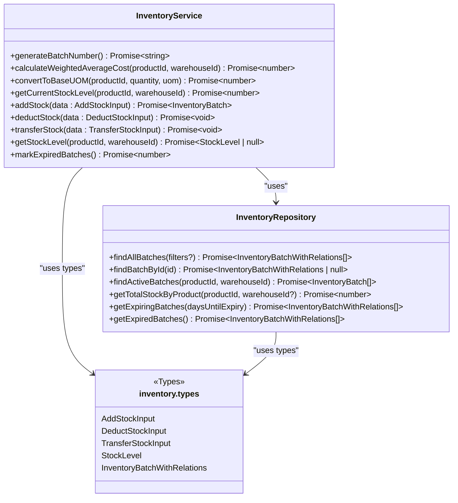
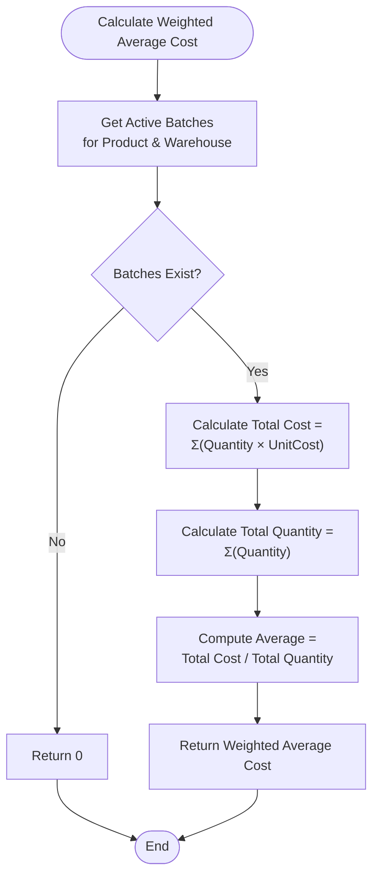
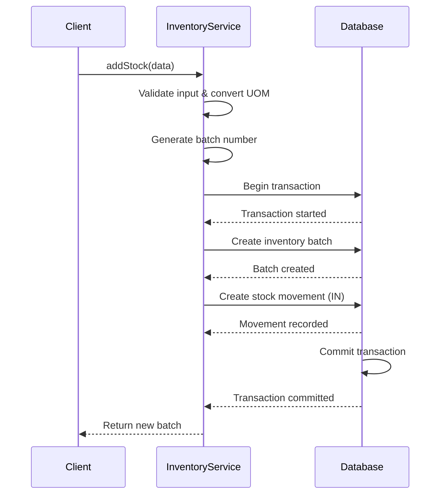
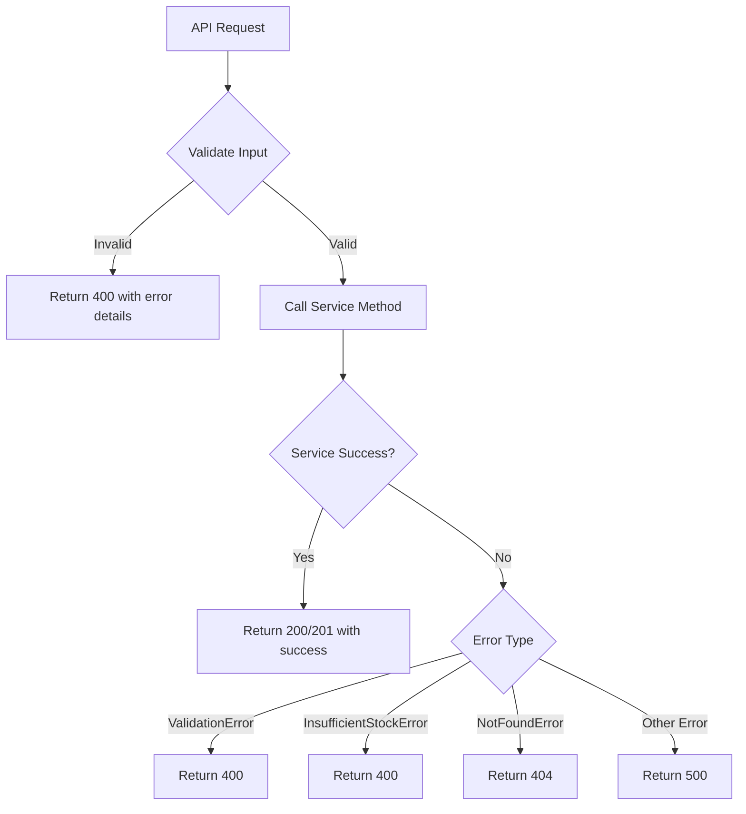

# Inventory Module

<cite>
**Referenced Files in This Document**   
- [inventory.service.ts](file://services/inventory.service.ts)
- [inventory.repository.ts](file://repositories/inventory.repository.ts)
- [inventory.types.ts](file://types/inventory.types.ts)
- [product.validation.ts](file://lib/validations/product.validation.ts)
- [add-stock/route.ts](file://app/api/inventory/add-stock/route.ts)
- [deduct-stock/route.ts](file://app/api/inventory/deduct-stock/route.ts)
- [transfer/route.ts](file://app/api/inventory/transfer/route.ts)
</cite>

## Table of Contents
1. [Introduction](#introduction)
2. [Core Components](#core-components)
3. [Stock Level Tracking](#stock-level-tracking)
4. [Batch Management and Average Costing](#batch-management-and-average-costing)
5. [Stock Movements](#stock-movements)
6. [Warehouse-Specific Inventory Views](#warehouse-specific-inventory-views)
7. [API Routes and Validation Logic](#api-routes-and-validation-logic)
8. [Usage Examples](#usage-examples)
9. [Edge Cases and Error Handling](#edge-cases-and-error-handling)
10. [Performance Considerations](#performance-considerations)
11. [Integration with Products and Warehouses Modules](#integration-with-products-and-warehouses-modules)

## Introduction
The Inventory Module provides comprehensive functionality for managing product stock across multiple warehouses. It supports batch tracking, average costing, stock movements (additions, deductions, transfers), and warehouse-specific inventory views. The system ensures data integrity through atomic transactions and implements FIFO (First In, First Out) logic for stock deductions and transfers. This document details the implementation of key features, including cost calculation, stock level tracking, API validation, and integration with other modules.

## Core Components

The Inventory Module is structured around three primary components: the `InventoryService`, `InventoryRepository`, and associated type definitions. The service layer orchestrates business logic, while the repository handles database operations. Type definitions ensure consistent data structures across the application.

**Diagram sources**
- [inventory.service.ts](file://services/inventory.service.ts#L17-L503)
- [inventory.repository.ts](file://repositories/inventory.repository.ts#L13-L374)
- [inventory.types.ts](file://types/inventory.types.ts#L1-L128)

**Section sources**
- [inventory.service.ts](file://services/inventory.service.ts#L1-L504)
- [inventory.repository.ts](file://repositories/inventory.repository.ts#L1-L375)
- [inventory.types.ts](file://types/inventory.types.ts#L1-L128)

## Stock Level Tracking

The system tracks stock levels at the batch level, aggregating quantities across active batches for real-time inventory visibility. Stock levels are maintained in the base unit of measure (UOM) to ensure consistency. The `getCurrentStockLevel` method calculates the total available quantity by summing all active batches for a product in a specific warehouse.

When stock is added or removed, the system updates batch quantities atomically within database transactions to prevent race conditions. Each stock movement is recorded in the `stockMovement` table, providing a complete audit trail of inventory changes.

**Section sources**
- [inventory.service.ts](file://services/inventory.service.ts#L106-L110)
- [inventory.repository.ts](file://repositories/inventory.repository.ts#L96-L109)

## Batch Management and Average Costing

The Inventory Module implements batch-level tracking with automatic average cost calculation using the weighted average method. Each batch contains metadata such as batch number, received date, expiry date, quantity, and unit cost.

The weighted average cost is calculated using the formula: (sum of quantity × unitCost) / (sum of quantity). This calculation considers all active batches for a product within a warehouse, providing an accurate representation of inventory value. The average cost is particularly important during stock transfers, where the destination warehouse receives the transferred stock at the source warehouse's average cost.

Batches are automatically assigned unique identifiers in the format BATCH-YYYYMMDD-XXXX, ensuring traceability and preventing duplication.

**Diagram sources**
- [inventory.service.ts](file://services/inventory.service.ts#L50-L71)
- [inventory.repository.ts](file://repositories/inventory.repository.ts#L96-L109)

**Section sources**
- [inventory.service.ts](file://services/inventory.service.ts#L50-L71)
- [inventory.repository.ts](file://repositories/inventory.repository.ts#L96-L109)

## Stock Movements

The system supports three primary types of stock movements: additions (IN), deductions (OUT), and transfers between warehouses. All movements are processed atomically using database transactions to ensure data consistency.

Stock additions create new batches with automatically generated batch numbers and expiry dates calculated from the product's shelf life. Deductions follow FIFO (First Expiry, First Out) principles, consuming stock from batches with the earliest expiry dates first. Transfers deduct stock from the source warehouse using FIFO and create a new batch in the destination warehouse at the source's weighted average cost.

Each movement is recorded in the `stockMovement` table with metadata including type, quantity, reason, and reference to related documents (e.g., purchase orders).

**Diagram sources**
- [inventory.service.ts](file://services/inventory.service.ts#L115-L177)
- [inventory.repository.ts](file://repositories/inventory.repository.ts#L111-L124)

**Section sources**
- [inventory.service.ts](file://services/inventory.service.ts#L115-L177)
- [inventory.repository.ts](file://repositories/inventory.repository.ts#L111-L124)

## Warehouse-Specific Inventory Views

The system provides detailed inventory views specific to each warehouse, accessible through the `getStockLevel` method. These views include comprehensive information such as total quantity, weighted average cost, and detailed breakdown of individual batches with their quantities, costs, and expiry dates.

Warehouse-specific views enable users to monitor inventory levels, identify expiring stock, and make informed decisions about stock transfers or replenishment. The system also supports filtering and querying inventory data across multiple dimensions including product, warehouse, batch status, and expiry date ranges.

**Section sources**
- [inventory.service.ts](file://services/inventory.service.ts#L413-L456)
- [inventory.repository.ts](file://repositories/inventory.repository.ts#L16-L64)

## API Routes and Validation Logic

The Inventory Module exposes RESTful API endpoints for key operations, with comprehensive validation at both the service and API layers.

### Add Stock API
- **Endpoint**: POST `/api/inventory/add-stock`
- **Validation**: Ensures positive quantity and unit cost, valid product and warehouse IDs, and correct UOM
- **Processing**: Converts quantity to base UOM, generates batch number, calculates expiry date

### Deduct Stock API
- **Endpoint**: POST `/api/inventory/deduct-stock`
- **Validation**: Checks for sufficient stock (prevents negative inventory), valid UOM, positive quantity
- **Processing**: Applies FIFO logic across active batches

### Transfer Stock API
- **Endpoint**: POST `/api/inventory/transfer`
- **Validation**: Ensures source and destination warehouses differ, sufficient stock available, valid product
- **Processing**: Deducts from source using FIFO, creates new batch in destination at average cost

All API routes implement centralized error handling, returning appropriate HTTP status codes and structured error responses.

**Diagram sources**
- [add-stock/route.ts](file://app/api/inventory/add-stock/route.ts#L1-L38)
- [deduct-stock/route.ts](file://app/api/inventory/deduct-stock/route.ts#L1-L33)
- [transfer/route.ts](file://app/api/inventory/transfer/route.ts#L1-L33)

**Section sources**
- [add-stock/route.ts](file://app/api/inventory/add-stock/route.ts#L1-L38)
- [deduct-stock/route.ts](file://app/api/inventory/deduct-stock/route.ts#L1-L33)
- [transfer/route.ts](file://app/api/inventory/transfer/route.ts#L1-L33)

## Usage Examples

### Receiving Goods from Purchase Order
When receiving goods from a purchase order, the system creates a new inventory batch with:
- Automatically generated batch number
- Quantity converted to base UOM
- Unit cost from the purchase order
- Expiry date calculated from product shelf life
- Reference to the purchase order ID

The stock movement is recorded as type "IN" with the purchase order as the reference.

### Transferring Stock Between Warehouses
When transferring stock:
1. System validates source and destination warehouses are different
2. Checks sufficient stock in source warehouse
3. Deducts stock from source batches using FIFO
4. Calculates weighted average cost from source warehouse
5. Creates new batch in destination warehouse with transfer cost
6. Records two movements: OUT from source, IN to destination

**Section sources**
- [inventory.service.ts](file://services/inventory.service.ts#L115-L383)
- [transfer/route.ts](file://app/api/inventory/transfer/route.ts#L1-L33)

## Edge Cases and Error Handling

The system implements robust handling of edge cases:

### Negative Stock Prevention
The `deductStock` and `transferStock` methods validate available inventory before processing. If requested quantity exceeds available stock, an `InsufficientStockError` is thrown with details about available vs. requested quantities.

### Batch Expiration Tracking
The system automatically identifies and manages expired batches:
- `markExpiredBatches` method updates status of expired active batches
- `getExpiringBatches` identifies batches expiring within a specified period
- `getExpiredBatches` retrieves all expired but non-depleted batches

### UOM Conversion Validation
When quantities are provided in non-base UOMs, the system validates the UOM against the product's defined alternate UOMs and applies the correct conversion factor. Invalid UOMs result in validation errors.

**Section sources**
- [inventory.service.ts](file://services/inventory.service.ts#L215-L221)
- [inventory.service.ts](file://services/inventory.service.ts#L468-L486)
- [inventory.service.ts](file://services/inventory.service.ts#L76-L101)

## Performance Considerations

The Inventory Module is optimized for performance in large-scale operations:

- **Database Indexing**: Critical fields like `productId`, `warehouseId`, and `expiryDate` are indexed for fast queries
- **Batched Operations**: Stock movements are processed in single transactions to minimize database round-trips
- **Aggregate Queries**: Stock level calculations use database-level aggregation rather than in-memory processing
- **Caching Opportunities**: Frequently accessed data like product information and warehouse details could be cached
- **Pagination Support**: Batch and movement queries support filtering to handle large datasets efficiently

For high-volume operations, the system maintains data integrity while optimizing query performance through appropriate indexing and efficient transaction management.

**Section sources**
- [inventory.repository.ts](file://repositories/inventory.repository.ts#L267-L289)
- [inventory.repository.ts](file://repositories/inventory.repository.ts#L16-L64)

## Integration with Products and Warehouses Modules

The Inventory Module integrates closely with other system components:

### Products Module Integration
- Validates product existence before inventory operations
- Retrieves product-specific data like base UOM, alternate UOMs, and shelf life
- Uses product category and naming in inventory reports
- Respects product status (active/inactive) for inventory operations

### Warehouses Module Integration
- Validates warehouse existence and ensures source ≠ destination in transfers
- Retrieves warehouse names and locations for inventory views
- Supports multi-warehouse inventory tracking and reporting
- Respects warehouse-specific configurations

The integration is facilitated through service dependencies (`productService` in `inventoryService`) and shared type definitions, ensuring consistent data exchange across modules.

**Section sources**
- [inventory.service.ts](file://services/inventory.service.ts#L4-L5)
- [inventory.service.ts](file://services/inventory.service.ts#L117-L118)
- [inventory.service.ts](file://services/inventory.service.ts#L272-L273)