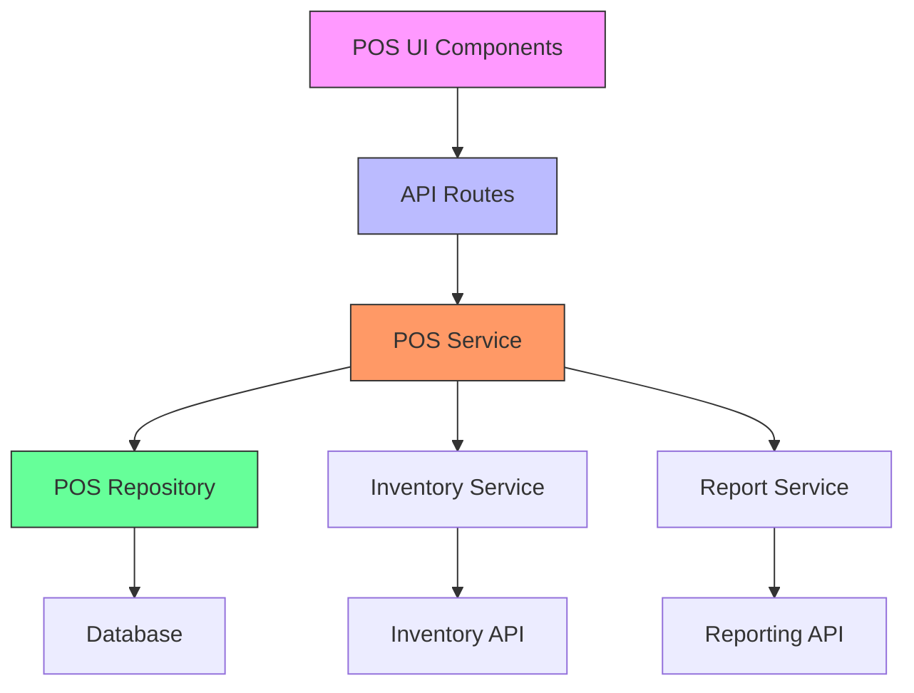
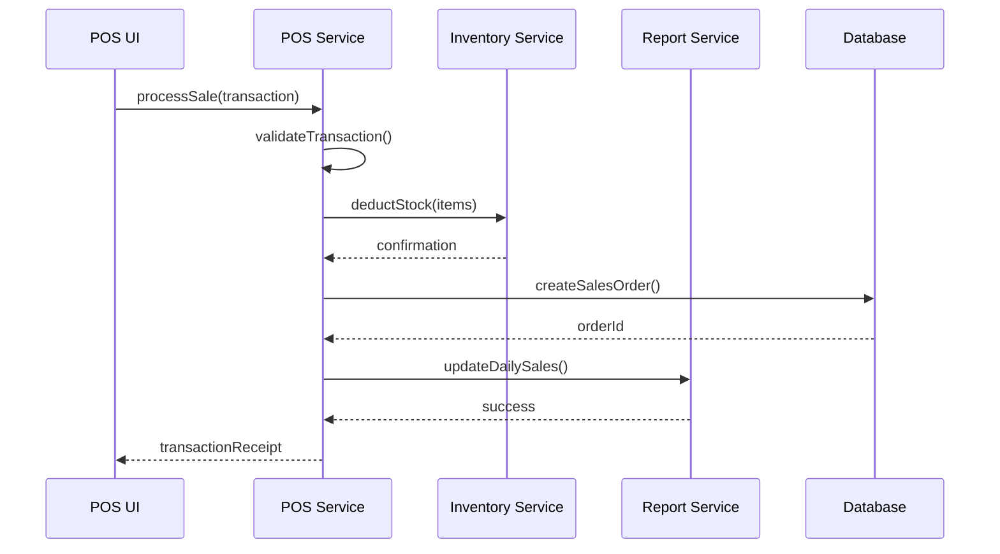
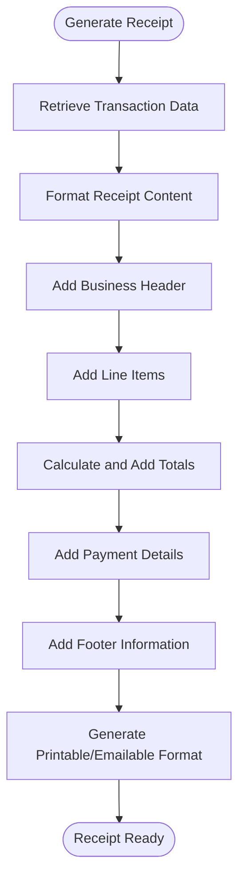
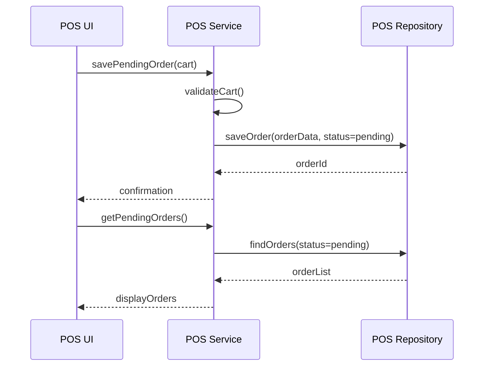
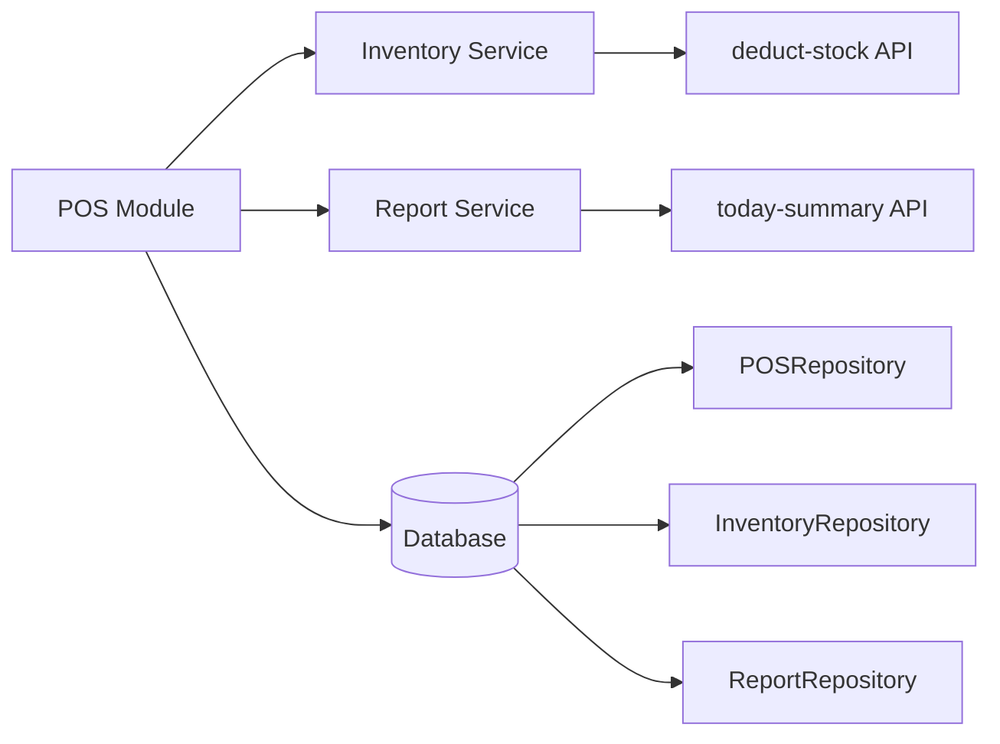

# POS Module

<cite>
**Referenced Files in This Document**   
- [page.tsx](file://app/(dashboard)/pos/page.tsx)
- [pos-cart.tsx](file://components/pos/pos-cart.tsx)
- [pos-payment.tsx](file://components/pos/pos-payment.tsx)
- [pos-pending-orders.tsx](file://components/pos/pos-pending-orders.tsx)
- [pos-receipt.tsx](file://components/pos/pos-receipt.tsx)
- [pos.service.ts](file://services/pos.service.ts)
- [pos.repository.ts](file://repositories/pos.repository.ts)
- [inventory.service.ts](file://services/inventory.service.ts)
- [report.service.ts](file://services/report.service.ts)
- [pos.types.ts](file://types/pos.types.ts)
- [sales/route.ts](file://app/api/pos/sales/route.ts)
- [pending-orders/route.ts](file://app/api/pos/pending-orders/route.ts)
- [deduct-stock/route.ts](file://app/api/inventory/deduct-stock/route.ts)
- [today-summary/route.ts](file://app/api/pos/today-summary/route.ts)
</cite>

## Table of Contents
1. [Introduction](#introduction)
2. [Project Structure](#project-structure)
3. [Core Components](#core-components)
4. [Architecture Overview](#architecture-overview)
5. [Detailed Component Analysis](#detailed-component-analysis)
6. [Dependency Analysis](#dependency-analysis)
7. [Performance Considerations](#performance-considerations)
8. [Troubleshooting Guide](#troubleshooting-guide)
9. [Conclusion](#conclusion)

## Introduction
The POS Module is a central component of the application, designed to facilitate seamless sales transactions in retail environments. It supports key functionalities including cart management, multiple payment methods, receipt generation, handling of pending orders, and real-time inventory updates. This document provides a comprehensive analysis of the POS workflow, service logic, and integration points with Inventory and Reporting modules. The system is built to handle partial payments, resume interrupted transactions, and reconcile daily sales summaries, ensuring reliability even during network disruptions.

## Project Structure
The POS module is organized within a Next.js application using App Router architecture. The frontend components are located in the `components/pos/` directory, while API routes are defined under `app/api/pos/`. The business logic is abstracted into services and repositories for separation of concerns. Key structural elements include:
- UI components for cart, payment, pending orders, and receipt display
- API endpoints for processing sales, retrieving pending orders, and generating daily summaries
- Service layer handling transaction orchestration
- Repository layer interfacing with the database
- Type definitions for transaction and order entities

```mermaid
graph TB
subgraph "Frontend"
A[pos-product-grid.tsx] --> B[pos-cart.tsx]
B --> C[pos-payment.tsx]
C --> D[pos-receipt.tsx]
B --> E[pos-pending-orders.tsx]
end
subgraph "Backend"
F[page.tsx] --> G[sales/route.ts]
F --> H[pending-orders/route.ts]
G --> I[pos.service.ts]
H --> I
I --> J[pos.repository.ts]
I --> K[inventory.service.ts]
I --> L[report.service.ts]
end
A < --> F
B < --> F
C < --> F
G < --> M[deduct-stock/route.ts]
I --> N[today-summary/route.ts]
```

**Diagram sources**
- [page.tsx](file://app/(dashboard)/pos/page.tsx)
- [pos-cart.tsx](file://components/pos/pos-cart.tsx)
- [sales/route.ts](file://app/api/pos/sales/route.ts)
- [pos.service.ts](file://services/pos.service.ts)

**Section sources**
- [page.tsx](file://app/(dashboard)/pos/page.tsx)
- [pos-cart.tsx](file://components/pos/pos-cart.tsx)
- [sales/route.ts](file://app/api/pos/sales/route.ts)

## Core Components
The POS module comprises several core components that work together to deliver a complete checkout experience. These include the product grid for item selection, cart for managing selected items, payment processor for handling multiple payment methods, receipt generator for transaction documentation, and pending orders manager for saving incomplete transactions. The service layer coordinates these components, ensuring data consistency and proper state management throughout the transaction lifecycle.

**Section sources**
- [pos-cart.tsx](file://components/pos/pos-cart.tsx)
- [pos-payment.tsx](file://components/pos/pos-payment.tsx)
- [pos-pending-orders.tsx](file://components/pos/pos-pending-orders.tsx)
- [pos.service.ts](file://services/pos.service.ts)

## Architecture Overview
The POS architecture follows a clean separation between presentation, business logic, and data access layers. The frontend components manage user interaction and state, while API routes handle HTTP requests. The service layer contains the core transaction logic, coordinating with repositories for data persistence and other services for cross-module functionality. This design enables maintainability, testability, and scalability of the POS functionality.



**Diagram sources**
- [pos.service.ts](file://services/pos.service.ts)
- [pos.repository.ts](file://repositories/pos.repository.ts)
- [inventory.service.ts](file://services/inventory.service.ts)
- [report.service.ts](file://services/report.service.ts)

## Detailed Component Analysis

### Sales Transaction Workflow
The sales transaction workflow begins when a user selects products from the grid, which are then added to the cart. The cart component manages quantity adjustments, item removal, and calculates running totals. When ready to pay, the payment component accepts multiple payment methods and handles partial payments. Upon finalization, the transaction is processed through the service layer, which orchestrates inventory deduction, sales order creation, and reporting updates.



**Diagram sources**
- [pos.service.ts](file://services/pos.service.ts)
- [sales/route.ts](file://app/api/pos/sales/route.ts)
- [deduct-stock/route.ts](file://app/api/inventory/deduct-stock/route.ts)

**Section sources**
- [pos.service.ts](file://services/pos.service.ts)
- [sales/route.ts](file://app/api/pos/sales/route.ts)

### Cart Management
The cart component provides real-time management of selected items, including addition, quantity modification, and removal. It maintains the transaction state and calculates subtotals, taxes, and final amounts. The cart interface is designed for quick access and efficient checkout, with visual feedback for inventory availability and pricing information.

**Section sources**
- [pos-cart.tsx](file://components/pos/pos-cart.tsx)
- [pos.types.ts](file://types/pos.types.ts)

### Multiple Payment Methods
The payment component supports various payment methods including cash, credit/debit cards, and digital wallets. It handles partial payments by allowing users to apply available funds toward the total and saving the remaining balance as a pending transaction. The component validates payment amounts and ensures that the total payment matches the transaction value before finalization.

**Section sources**
- [pos-payment.tsx](file://components/pos/pos-payment.tsx)
- [pos.service.ts](file://services/pos.service.ts)

### Receipt Generation
The receipt component generates transaction documentation upon sale completion. It includes transaction details such as date, items purchased, quantities, prices, taxes, payment methods, and final amounts. The receipt can be printed or emailed to customers, and is also stored in the system for record-keeping and reporting purposes.



**Diagram sources**
- [pos-receipt.tsx](file://components/pos/pos-receipt.tsx)
- [pos.service.ts](file://services/pos.service.ts)

**Section sources**
- [pos-receipt.tsx](file://components/pos/pos-receipt.tsx)

### Pending Orders Handling
The pending orders feature allows users to save incomplete transactions and resume them later. This is particularly useful for partial payments or when customers need to complete transactions at a later time. The system stores pending orders with their current state, including selected items and any payments already made.



**Diagram sources**
- [pos-pending-orders.tsx](file://components/pos/pos-pending-orders.tsx)
- [pending-orders/route.ts](file://app/api/pos/pending-orders/route.ts)
- [pos.repository.ts](file://repositories/pos.repository.ts)

**Section sources**
- [pos-pending-orders.tsx](file://components/pos/pos-pending-orders.tsx)
- [pending-orders/route.ts](file://app/api/pos/pending-orders/route.ts)

## Dependency Analysis
The POS module has critical dependencies on several other modules within the system. It relies on the Inventory module for real-time stock level checks and updates, the Reporting module for sales analytics and daily summaries, and the Database layer for persistent storage of transactions. These dependencies are managed through service interfaces, ensuring loose coupling and maintainability.



**Diagram sources**
- [pos.service.ts](file://services/pos.service.ts)
- [inventory.service.ts](file://services/inventory.service.ts)
- [report.service.ts](file://services/report.service.ts)
- [pos.repository.ts](file://repositories/pos.repository.ts)

**Section sources**
- [pos.service.ts](file://services/pos.service.ts)
- [inventory.service.ts](file://services/inventory.service.ts)
- [report.service.ts](file://services/report.service.ts)

## Performance Considerations
The POS module is optimized for fast transaction processing, with minimal latency between user actions and system responses. Caching strategies are employed for frequently accessed data such as product information and price lists. The system handles network failures gracefully by allowing local transaction storage and synchronization when connectivity is restored. Batch processing is used for daily summary generation to minimize impact on real-time transaction performance.

## Troubleshooting Guide
Common issues in the POS module include network failures during payment processing and discrepancies in daily sales summaries. For network issues, the system provides offline mode capabilities where transactions can be temporarily stored and synchronized later. For reconciliation issues, the system maintains detailed audit logs of all transactions and inventory changes, enabling easy identification of discrepancies. The pending orders feature helps mitigate issues related to interrupted transactions.

**Section sources**
- [pos.service.ts](file://services/pos.service.ts)
- [today-summary/route.ts](file://app/api/pos/today-summary/route.ts)
- [pos.repository.ts](file://repositories/pos.repository.ts)

## Conclusion
The POS module provides a comprehensive solution for retail sales transactions, with robust features for cart management, multiple payment methods, receipt generation, and pending order handling. Its integration with the Inventory module ensures real-time stock updates, while the connection to the Reporting module enables detailed sales analytics. The architecture supports reliable operation even in challenging network conditions, making it suitable for various retail environments.