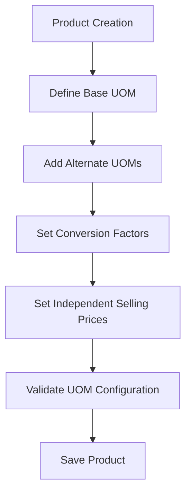
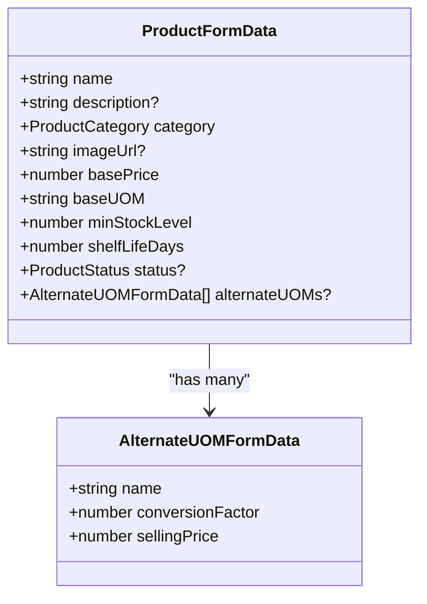
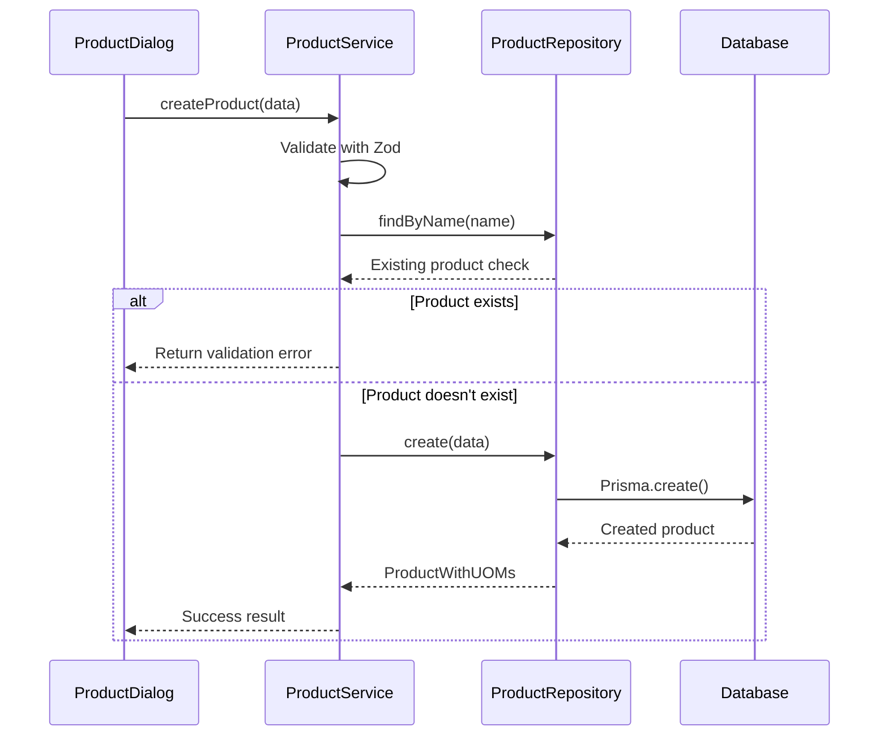

# Products Module

<cite>
**Referenced Files in This Document**   
- [product-dialog.tsx](file://components/products/product-dialog.tsx)
- [product.service.ts](file://services/product.service.ts)
- [product.repository.ts](file://repositories/product.repository.ts)
- [product.validation.ts](file://lib/validations/product.validation.ts)
- [product.types.ts](file://types/product.types.ts)
</cite>

## Table of Contents
1. [Introduction](#introduction)
2. [Product Catalog Management](#product-catalog-management)
3. [Unit of Measure (UOM) Configuration](#unit-of-measure-uom-configuration)
4. [Pricing Strategies](#pricing-strategies)
5. [Form Validation with Zod](#form-validation-with-zod)
6. [Data Flow from UI to Persistence](#data-flow-from-ui-to-persistence)
7. [UOM Conversion Logic](#uom-conversion-logic)
8. [Price Tier Configuration](#price-tier-configuration)
9. [Common Issues and Troubleshooting](#common-issues-and-troubleshooting)
10. [Integration with Inventory and POS Modules](#integration-with-inventory-and-pos-modules)

## Introduction
The Products module is a core component of the inventory management system, responsible for managing the product catalog with comprehensive support for multiple units of measure (UOM), flexible pricing strategies, and robust validation. This document details the architecture, functionality, and integration points of the Products module, focusing on how product data is created, validated, stored, and utilized across the system.

## Product Catalog Management
The Products module enables users to create, edit, and manage products within the catalog. Each product contains essential information including name, description, category, image URL, base selling price, base UOM, minimum stock level, shelf life days, and status (active/inactive). Products are uniquely identified by UUIDs and must have unique names within the system to prevent duplicates.

The module supports filtering products by category and status, allowing users to quickly locate specific items. The product catalog serves as the foundation for inventory tracking, sales transactions, and reporting across the application.

**Section sources**
- [product.service.ts](file://services/product.service.ts#L11-L189)
- [product.repository.ts](file://repositories/product.repository.ts#L4-L123)
- [product.types.ts](file://types/product.types.ts#L12-L23)

## Unit of Measure (UOM) Configuration
The Products module supports flexible UOM configurations, allowing products to be sold in different quantities such as bottles, packs, or cartons. Each product has a base UOM and can have multiple alternate UOMs, each with its own conversion factor to the base UOM and independent selling price.

The UOM configuration is validated to ensure data integrity:
- Alternate UOM names cannot be the same as the base UOM
- Alternate UOM names must be unique within a product
- Conversion factors must be greater than zero
- Each UOM must have a selling price greater than zero

Users can add or remove alternate UOMs through the ProductDialog component, which provides a dynamic interface for managing multiple UOM configurations.

**Diagram sources**
- [product-dialog.tsx](file://components/products/product-dialog.tsx#L45-L491)
- [product.service.ts](file://services/product.service.ts#L11-L189)

## Pricing Strategies
The Products module implements flexible pricing strategies that allow different selling prices for each UOM, independent of conversion factor calculations. This enables businesses to offer volume discounts or premium pricing for different packaging options.

The pricing model includes:
- Base price for the base UOM
- Independent selling prices for each alternate UOM
- Validation that all prices are greater than zero
- Support for decimal pricing with two decimal places

When displaying products in the POS interface, all available UOMs with their respective selling prices are shown, allowing cashiers to select the appropriate unit for each sale.

**Section sources**
- [product.validation.ts](file://lib/validations/product.validation.ts#L3-L32)
- [product.service.ts](file://services/product.service.ts#L146-L189)

## Form Validation with Zod
The Products module uses Zod for comprehensive form validation through the product.validation.ts schema. The validation schema ensures data integrity and prevents invalid product configurations.

Key validation rules include:
- Product name must be unique and between 1-100 characters
- Description limited to 500 characters
- Base price and minimum stock level must be positive numbers
- Shelf life days must be a positive integer
- Image URL must be a valid URL or relative path
- Alternate UOMs array is optional with default empty array

The ProductDialog component integrates with react-hook-form and Zod resolver to provide real-time validation feedback, displaying error messages directly below the relevant form fields.

**Diagram sources**
- [product.validation.ts](file://lib/validations/product.validation.ts#L3-L32)
- [product-dialog.tsx](file://components/products/product-dialog.tsx#L45-L491)

## Data Flow from UI to Persistence
The Products module follows a clean architecture pattern with data flowing from the UI through service and repository layers to persistent storage. The data flow begins with the ProductDialog component, which collects user input and validates it using Zod.

When a user submits the form, the onSave callback is triggered, which calls the appropriate service method (createProduct or updateProduct). The ProductService validates the input data, checks business rules (such as unique product names), and then delegates to the ProductRepository for database operations.

The ProductRepository uses Prisma ORM to interact with the PostgreSQL database, handling CRUD operations and ensuring data consistency through transactions.

**Diagram sources**
- [product-dialog.tsx](file://components/products/product-dialog.tsx#L45-L491)
- [product.service.ts](file://services/product.service.ts#L11-L189)
- [product.repository.ts](file://repositories/product.repository.ts#L4-L123)

## UOM Conversion Logic
The UOM conversion logic is implemented in the ProductService to ensure consistent handling of unit conversions across the application. When a product is created or updated, the system validates that conversion factors are positive numbers and that UOM names do not conflict.

The conversion logic is used in various contexts:
- Inventory tracking: Converting quantities to base UOM for stock level calculations
- POS transactions: Converting sold quantities to base UOM for inventory deduction
- Reporting: Aggregating quantities across different UOMs by converting to base UOM

The system prioritizes data integrity by preventing invalid UOM configurations and ensuring that all conversions are based on the defined conversion factors.

**Section sources**
- [product.service.ts](file://services/product.service.ts#L11-L189)
- [product.validation.ts](file://lib/validations/product.validation.ts#L3-L32)

## Price Tier Configuration
The Products module supports price tier configuration through its alternate UOM system, allowing different prices for different packaging levels. This enables businesses to implement volume-based pricing strategies without complex pricing rules.

Price tiers are configured by:
- Defining alternate UOMs (e.g., pack, carton)
- Setting conversion factors (e.g., 6 bottles per pack)
- Assigning independent selling prices for each UOM

The system validates that all prices are greater than zero and displays validation errors if pricing rules are violated. Price tier information is stored with the product record and retrieved when needed for sales transactions or reporting.

**Section sources**
- [product.service.ts](file://services/product.service.ts#L146-L189)
- [product.validation.ts](file://lib/validations/product.validation.ts#L3-L32)

## Common Issues and Troubleshooting
The Products module includes validation and error handling to prevent common issues and guide users toward correct configurations.

### Duplicate SKUs
The system prevents duplicate product names by checking for existing products during creation and updates. If a duplicate name is detected, a validation error is returned with the message "Product name must be unique."

### Invalid UOM Hierarchies
The system validates UOM configurations to prevent invalid hierarchies:
- Alternate UOM names cannot match the base UOM
- Alternate UOM names must be unique within a product
- Conversion factors must be greater than zero

When validation fails, specific error messages are returned to help users correct the issues.

### Troubleshooting Guide
1. **Product creation fails with validation errors**: Check that all required fields are filled and meet validation criteria (positive prices, unique name, etc.)
2. **UOM configuration not saving**: Verify that alternate UOM names are not duplicates and do not match the base UOM
3. **Price not updating**: Ensure the selling price is greater than zero and that changes are being saved correctly
4. **Product not appearing in POS**: Check that the product status is "active" and has sufficient stock levels

**Section sources**
- [product.service.ts](file://services/product.service.ts#L11-L189)
- [product.validation.ts](file://lib/validations/product.validation.ts#L3-L32)

## Integration with Inventory and POS Modules
The Products module serves as the foundation for both Inventory and POS modules, providing essential product data that drives stock tracking and sales transactions.

### Inventory Module Integration
The Inventory module uses product data to:
- Track stock levels in base UOM
- Calculate weighted average costs
- Monitor minimum stock levels and generate low stock alerts
- Track expiration dates based on shelf life days

When new inventory is added, quantities are converted to base UOM using the conversion factors defined in the product configuration.

### POS Module Integration
The POS module relies on the Products module to:
- Display products with all available UOMs and selling prices
- Validate that sales do not exceed available stock
- Calculate transaction totals based on selected UOMs
- Deduct inventory using base UOM conversions
- Generate receipts with accurate pricing information

The tight integration between these modules ensures data consistency and enables efficient business operations across inventory management and point-of-sale functions.

**Section sources**
- [product.service.ts](file://services/product.service.ts#L146-L189)
- [product.repository.ts](file://repositories/product.repository.ts#L4-L123)
- [product.types.ts](file://types/product.types.ts#L12-L23)