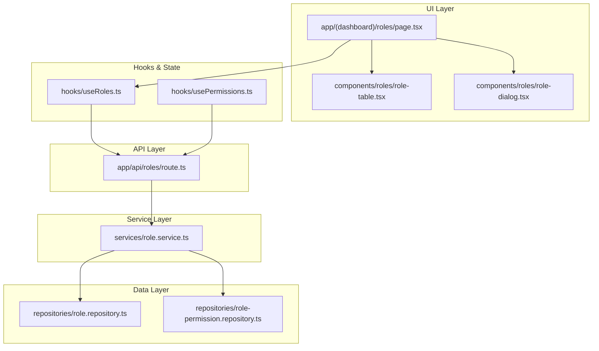
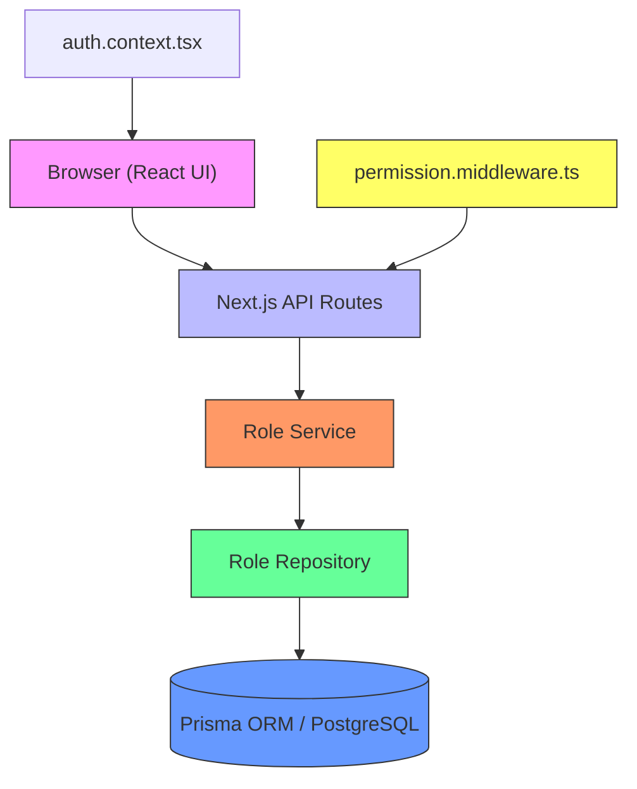
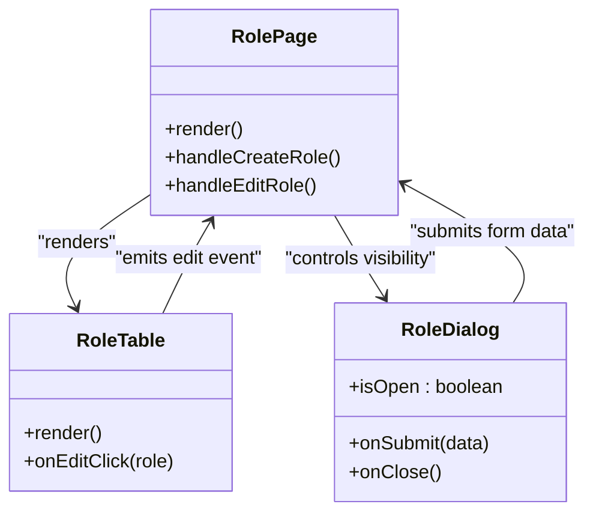
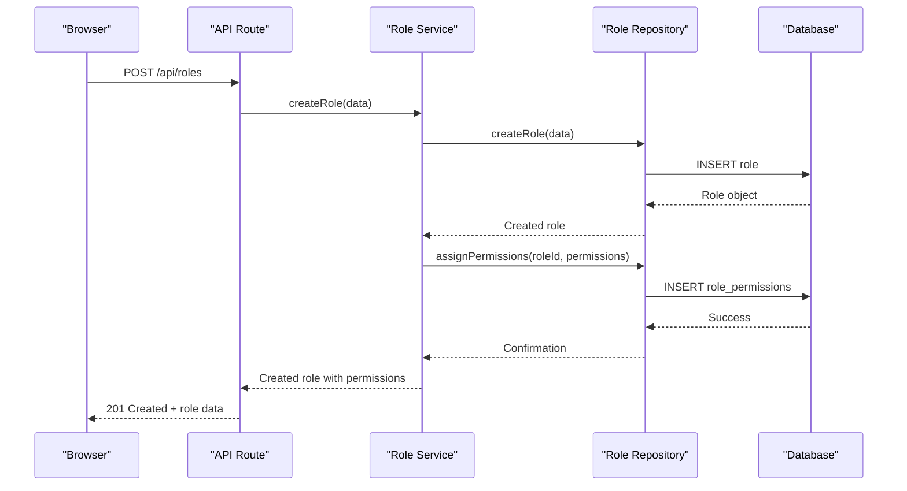
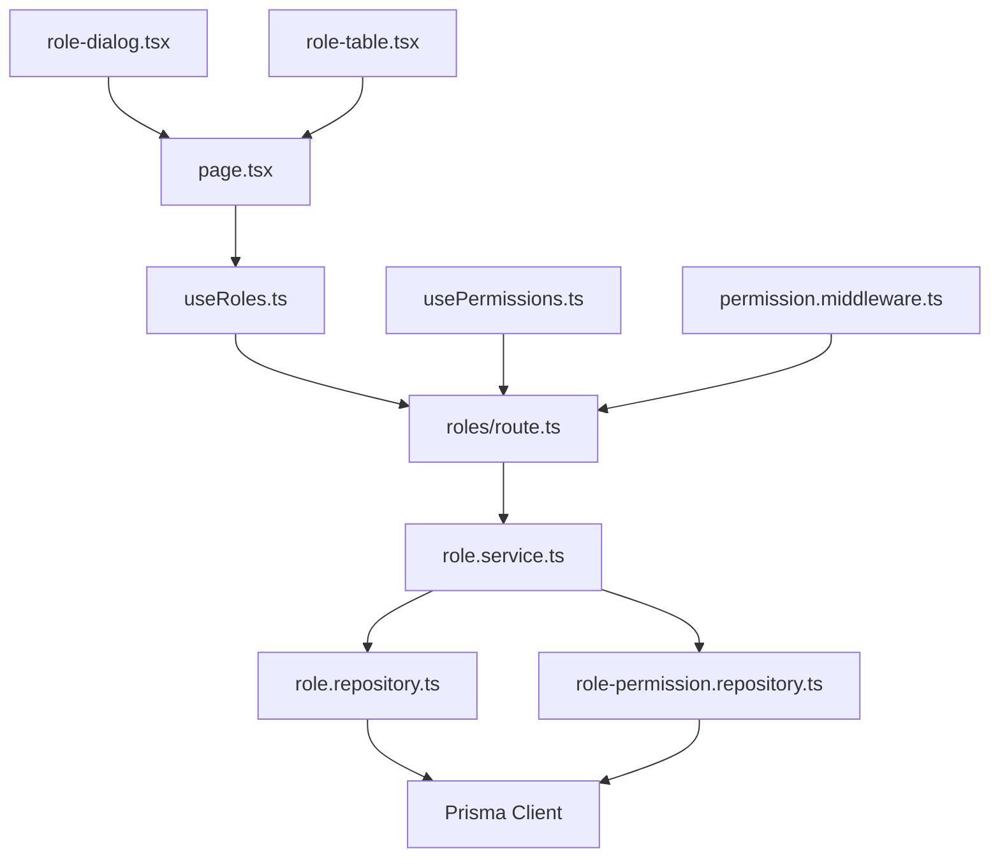
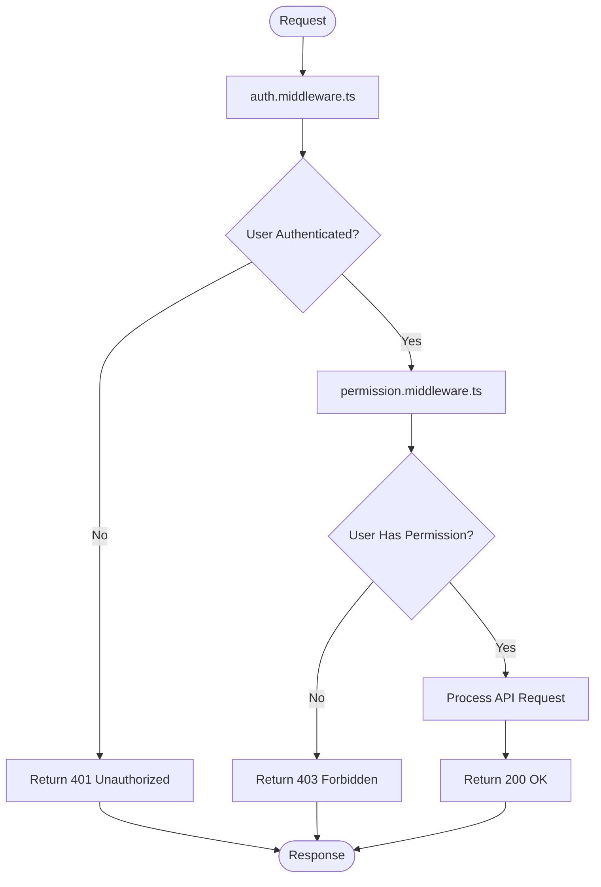
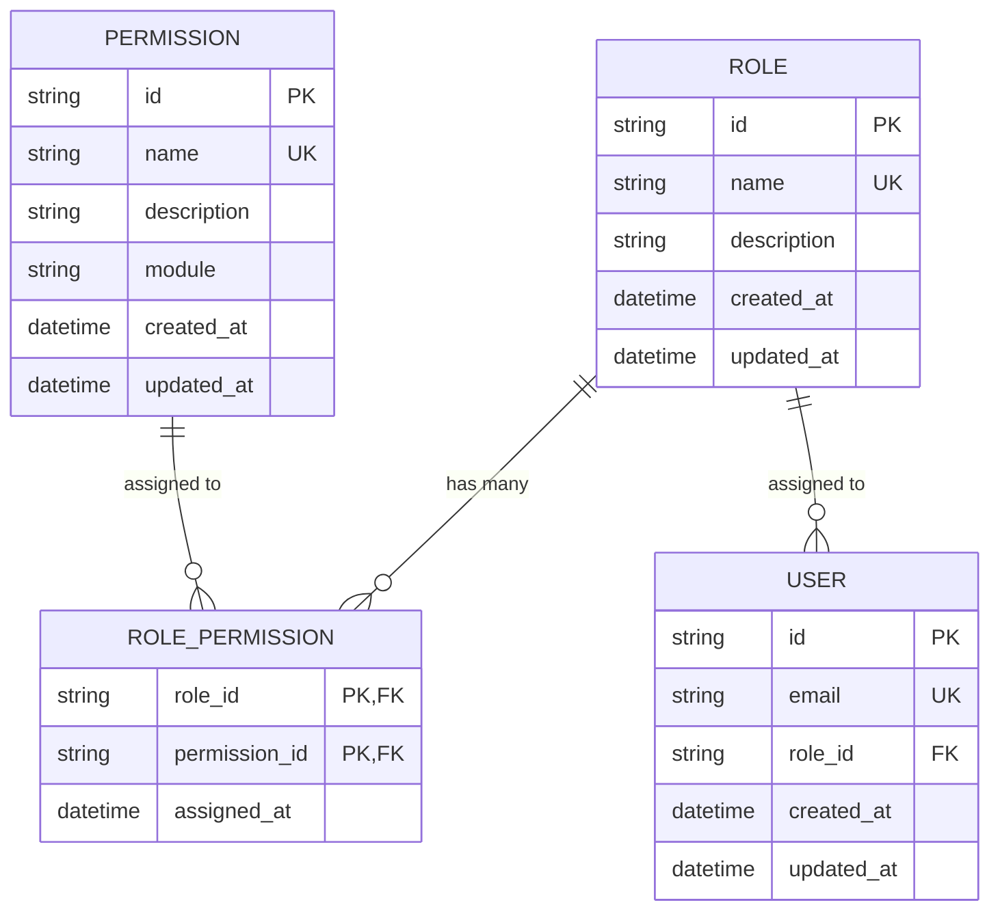

# User Role Permission Management

<cite>
**Referenced Files in This Document**   
- [app/(dashboard)/roles/page.tsx](file://app/(dashboard)/roles/page.tsx)
- [app/api/roles/route.ts](file://app/api/roles/route.ts)
- [components/roles/role-table.tsx](file://components/roles/role-table.tsx)
- [components/roles/role-dialog.tsx](file://components/roles/role-dialog.tsx)
- [services/role.service.ts](file://services/role.service.ts)
- [repositories/role.repository.ts](file://repositories/role.repository.ts)
- [repositories/role-permission.repository.ts](file://repositories/role-permission.repository.ts)
- [middleware/permission.middleware.ts](file://middleware/permission.middleware.ts)
- [hooks/useRoles.ts](file://hooks/useRoles.ts)
- [hooks/usePermissions.ts](file://hooks/usePermissions.ts)
- [types/role.types.ts](file://types/role.types.ts)
- [prisma/seeds/roles.seed.ts](file://prisma/seeds/roles.seed.ts)
- [prisma/seeds/permissions.seed.ts](file://prisma/seeds/permissions.seed.ts)
- [prisma/seeds/role-permissions.seed.ts](file://prisma/seeds/role-permissions.seed.ts)
</cite>

## Table of Contents
1. [Introduction](#introduction)
2. [Project Structure](#project-structure)
3. [Core Components](#core-components)
4. [Architecture Overview](#architecture-overview)
5. [Detailed Component Analysis](#detailed-component-analysis)
6. [Dependency Analysis](#dependency-analysis)
7. [Permission Flow and Middleware](#permission-flow-and-middleware)
8. [Data Models and Seeding](#data-models-and-seeding)
9. [Troubleshooting Guide](#troubleshooting-guide)
10. [Conclusion](#conclusion)

## Introduction
This document provides a comprehensive analysis of the user role and permission management system in the application. It covers the architecture, implementation, data models, and workflow for managing user roles and their associated permissions. The system enables fine-grained access control across various modules such as inventory, sales, purchasing, and dashboard analytics.

## Project Structure
The role and permission management system is organized across multiple directories following a modular and scalable architecture. Key components are separated by responsibility: UI components in `components/roles`, API routes in `app/api/roles`, business logic in `services`, data access in `repositories`, and type definitions in `types`.

**Diagram sources**
- [app/(dashboard)/roles/page.tsx](file://app/(dashboard)/roles/page.tsx)
- [services/role.service.ts](file://services/role.service.ts)
- [repositories/role.repository.ts](file://repositories/role.repository.ts)
- [repositories/role-permission.repository.ts](file://repositories/role-permission.repository.ts)
- [hooks/useRoles.ts](file://hooks/useRoles.ts)
- [hooks/usePermissions.ts](file://hooks/usePermissions.ts)

**Section sources**
- [app/(dashboard)/roles/page.tsx](file://app/(dashboard)/roles/page.tsx)
- [components/roles/role-table.tsx](file://components/roles/role-table.tsx)
- [components/roles/role-dialog.tsx](file://components/roles/role-dialog.tsx)

## Core Components
The core components of the role and permission system include the role management page, role table for displaying roles, role dialog for creating and editing roles, and backend services for handling CRUD operations and permission assignments. The system uses React hooks to manage state and fetch data from API endpoints.

**Section sources**
- [app/(dashboard)/roles/page.tsx](file://app/(dashboard)/roles/page.tsx)
- [components/roles/role-table.tsx](file://components/roles/role-table.tsx)
- [components/roles/role-dialog.tsx](file://components/roles/role-dialog.tsx)
- [hooks/useRoles.ts](file://hooks/useRoles.ts)

## Architecture Overview
The role and permission system follows a layered architecture with clear separation of concerns. The frontend uses React components with server-side rendering via Next.js, communicates with API routes, which in turn invoke service layer logic that interacts with repositories for database operations.

**Diagram sources**
- [app/api/roles/route.ts](file://app/api/roles/route.ts)
- [services/role.service.ts](file://services/role.service.ts)
- [repositories/role.repository.ts](file://repositories/role.repository.ts)
- [middleware/permission.middleware.ts](file://middleware/permission.middleware.ts)
- [contexts/auth.context.tsx](file://contexts/auth.context.tsx)

## Detailed Component Analysis

### Role Management Page Analysis
The role management page serves as the central interface for viewing, creating, and editing user roles. It renders a table of existing roles and provides a dialog for role creation and modification.

#### UI Component Structure

**Diagram sources**
- [app/(dashboard)/roles/page.tsx](file://app/(dashboard)/roles/page.tsx)
- [components/roles/role-table.tsx](file://components/roles/role-table.tsx)
- [components/roles/role-dialog.tsx](file://components/roles/role-dialog.tsx)

**Section sources**
- [app/(dashboard)/roles/page.tsx](file://app/(dashboard)/roles/page.tsx)
- [components/roles/role-table.tsx](file://components/roles/role-table.tsx)
- [components/roles/role-dialog.tsx](file://components/roles/role-dialog.tsx)

### API and Service Layer Analysis
The API route handles HTTP requests for role operations, while the service layer orchestrates business logic including permission validation and data persistence.

#### Request Flow for Role Creation

**Diagram sources**
- [app/api/roles/route.ts](file://app/api/roles/route.ts)
- [services/role.service.ts](file://services/role.service.ts)
- [repositories/role.repository.ts](file://repositories/role.repository.ts)
- [repositories/role-permission.repository.ts](file://repositories/role-permission.repository.ts)

**Section sources**
- [app/api/roles/route.ts](file://app/api/roles/route.ts)
- [services/role.service.ts](file://services/role.service.ts)

## Dependency Analysis
The role and permission system has well-defined dependencies across layers. The frontend depends on hooks for data fetching, which in turn depend on API routes. The backend services depend on repositories for data access, and both rely on type definitions for consistency.

**Diagram sources**
- [app/(dashboard)/roles/page.tsx](file://app/(dashboard)/roles/page.tsx)
- [hooks/useRoles.ts](file://hooks/useRoles.ts)
- [app/api/roles/route.ts](file://app/api/roles/route.ts)
- [services/role.service.ts](file://services/role.service.ts)
- [repositories/role.repository.ts](file://repositories/role.repository.ts)
- [repositories/role-permission.repository.ts](file://repositories/role-permission.repository.ts)
- [hooks/usePermissions.ts](file://hooks/usePermissions.ts)
- [middleware/permission.middleware.ts](file://middleware/permission.middleware.ts)

**Section sources**
- [hooks/useRoles.ts](file://hooks/useRoles.ts)
- [hooks/usePermissions.ts](file://hooks/usePermissions.ts)
- [services/role.service.ts](file://services/role.service.ts)
- [repositories/role.repository.ts](file://repositories/role.repository.ts)

## Permission Flow and Middleware
The system implements a middleware-based permission checking mechanism that validates user access rights before allowing API operations. This ensures that only authorized users can manage roles and permissions.

**Diagram sources**
- [middleware/auth.middleware.ts](file://middleware/auth.middleware.ts)
- [middleware/permission.middleware.ts](file://middleware/permission.middleware.ts)
- [app/api/roles/route.ts](file://app/api/roles/route.ts)

**Section sources**
- [middleware/permission.middleware.ts](file://middleware/permission.middleware.ts)
- [middleware/auth.middleware.ts](file://middleware/auth.middleware.ts)

## Data Models and Seeding
The system includes predefined data models for roles and permissions, with seed data for initial setup including default roles like "Admin", "Manager", and "Staff", along with granular permissions for different modules.

**Diagram sources**
- [prisma/seeds/roles.seed.ts](file://prisma/seeds/roles.seed.ts)
- [prisma/seeds/permissions.seed.ts](file://prisma/seeds/permissions.seed.ts)
- [prisma/seeds/role-permissions.seed.ts](file://prisma/seeds/role-permissions.seed.ts)
- [types/role.types.ts](file://types/role.types.ts)

**Section sources**
- [prisma/seeds/roles.seed.ts](file://prisma/seeds/roles.seed.ts)
- [prisma/seeds/permissions.seed.ts](file://prisma/seeds/permissions.seed.ts)
- [prisma/seeds/role-permissions.seed.ts](file://prisma/seeds/role-permissions.seed.ts)

## Troubleshooting Guide
Common issues in the role and permission system typically involve permission assignment failures, UI rendering problems, or middleware authorization blocks. Ensure that the seed data is properly loaded and that the current user has the necessary administrative permissions to manage roles.

**Section sources**
- [services/role.service.ts](file://services/role.service.ts)
- [repositories/role-permission.repository.ts](file://repositories/role-permission.repository.ts)
- [middleware/permission.middleware.ts](file://middleware/permission.middleware.ts)

## Conclusion
The user role and permission management system provides a robust, scalable solution for access control in the application. It features a clean separation of concerns, comprehensive type safety, and a well-structured API that supports both UI interactions and backend operations. The integration of middleware-based permission checks ensures security across all role management operations.