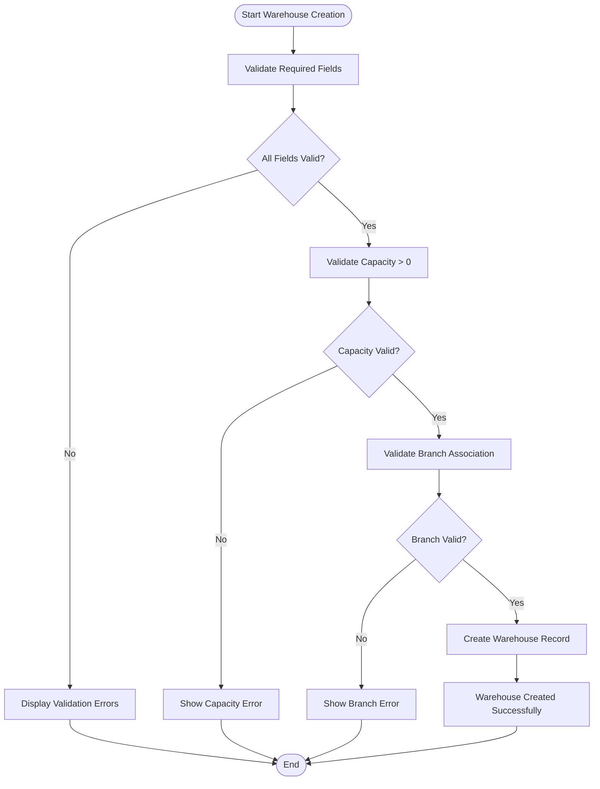
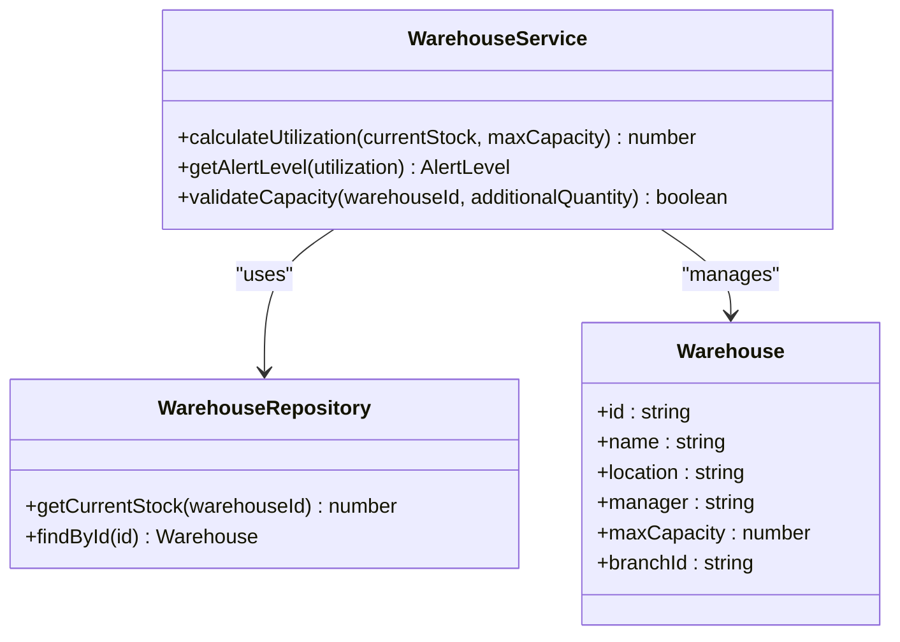
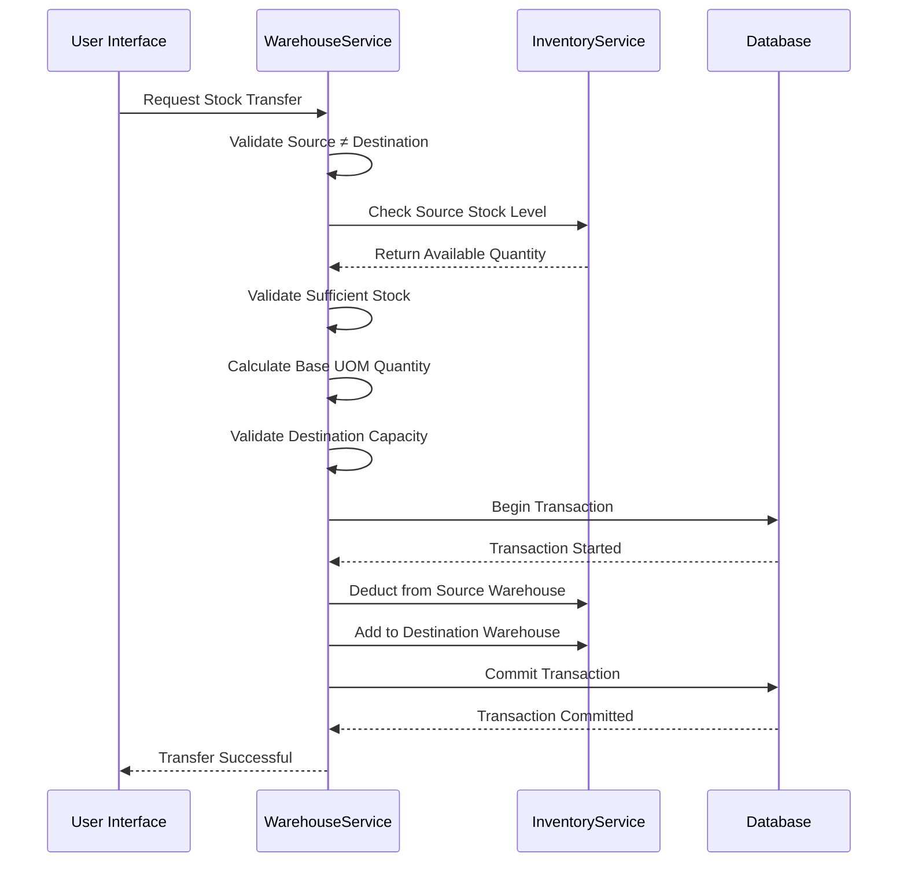
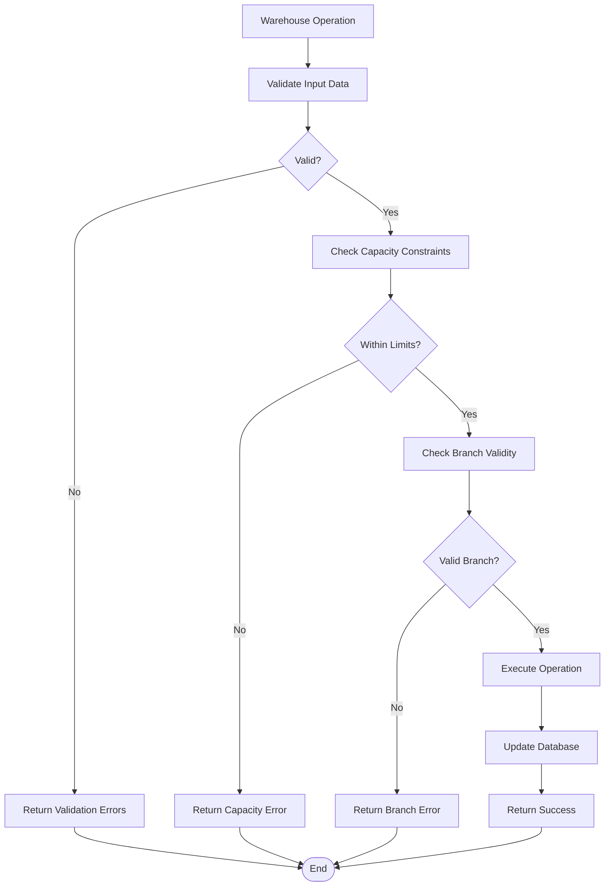

# Warehouses Module

<cite>
**Referenced Files in This Document**   
- [warehouse.service.ts](file://services/warehouse.service.ts)
- [warehouse.repository.ts](file://repositories/warehouse.repository.ts)
- [warehouse.validation.ts](file://lib/validations/warehouse.validation.ts)
- [warehouse.types.ts](file://types/warehouse.types.ts)
- [warehouse-dialog.tsx](file://components/warehouses/warehouse-dialog.tsx)
- [inventory.service.ts](file://services/inventory.service.ts)
- [branch.service.ts](file://services/branch.service.ts)
</cite>

## Table of Contents
1. [Introduction](#introduction)
2. [Warehouse Creation and Configuration](#warehouse-creation-and-configuration)
3. [Capacity Management and Utilization](#capacity-management-and-utilization)
4. [Location Tracking and Branch Assignment](#location-tracking-and-branch-assignment)
5. [Inventory Assignment and Stock Transfers](#inventory-assignment-and-stock-transfers)
6. [Validation Rules and Constraints](#validation-rules-and-constraints)
7. [Integration with Inventory and Branches Modules](#integration-with-inventory-and-branches-modules)
8. [Troubleshooting Common Issues](#troubleshooting-common-issues)
9. [Conclusion](#conclusion)

## Introduction
The Warehouses module provides comprehensive functionality for managing warehouse locations within a multi-branch inventory system. This document details the core operations including warehouse creation, capacity enforcement, location tracking, and integration with inventory and branch systems. The module ensures data integrity through validation rules and prevents operational issues such as over-capacity storage through real-time validation.

**Section sources**
- [warehouse.service.ts](file://services/warehouse.service.ts#L1-L253)

## Warehouse Creation and Configuration
The warehouse creation process allows administrators to set up new storage locations with essential details including name, location, manager, capacity limits, and branch association. The system provides a user-friendly dialog interface for data entry with real-time validation.

When creating a new warehouse, the following information must be provided:
- **Name**: Unique identifier for the warehouse (1-100 characters)
- **Location**: Physical address or description of the warehouse
- **Manager**: Responsible personnel for warehouse operations
- **Maximum Capacity**: Storage limit in base units of measure
- **Branch Assignment**: Association with a specific business branch

The creation process validates all inputs before persisting to the database and automatically calculates utilization metrics upon creation.



**Diagram sources**
- [warehouse.service.ts](file://services/warehouse.service.ts#L110-L125)
- [warehouse-dialog.tsx](file://components/warehouses/warehouse-dialog.tsx#L85-L120)

**Section sources**
- [warehouse.service.ts](file://services/warehouse.service.ts#L108-L125)
- [warehouse-dialog.tsx](file://components/warehouses/warehouse-dialog.tsx#L1-L253)

## Capacity Management and Utilization
The system implements robust capacity management to prevent warehouses from exceeding their storage limits. Each warehouse has a maximum capacity threshold that is enforced during all inventory operations.

Key capacity metrics include:
- **Current Stock**: Total inventory units currently stored
- **Maximum Capacity**: Configured storage limit
- **Utilization Percentage**: (Current Stock / Maximum Capacity) × 100
- **Alert Levels**: Normal (<60%), Warning (60-79%), Critical (≥80%)

The system automatically calculates utilization and triggers alerts when thresholds are crossed. Warehouse capacity cannot be reduced below the current stock level to prevent data inconsistency.



**Diagram sources**
- [warehouse.service.ts](file://services/warehouse.service.ts#L20-L34)
- [warehouse.repository.ts](file://repositories/warehouse.repository.ts#L65-L77)

**Section sources**
- [warehouse.service.ts](file://services/warehouse.service.ts#L20-L34)
- [warehouse.repository.ts](file://repositories/warehouse.repository.ts#L65-L77)

## Location Tracking and Branch Assignment
Warehouses are tracked by their physical location and assigned to specific business branches. This hierarchical structure enables multi-location inventory visibility and reporting.

Each warehouse must be associated with exactly one branch, establishing a clear organizational structure. The system validates branch assignments during warehouse creation and updates, ensuring that only valid, existing branches can be referenced.

The location field provides descriptive information about the warehouse's physical position, which can include street addresses, building names, or internal location codes depending on organizational needs.

**Section sources**
- [warehouse.service.ts](file://services/warehouse.service.ts#L118-L125)
- [warehouse.validation.ts](file://lib/validations/warehouse.validation.ts#L3-L9)

## Inventory Assignment and Stock Transfers
The Warehouses module integrates with the Inventory system to manage stock levels and enforce capacity constraints during inventory operations. When transferring stock between warehouses or adjusting inventory levels, the system validates that destination warehouses have sufficient capacity.

During stock transfers:
1. Source warehouse stock is deducted using FIFO (First-In, First-Out) methodology
2. Destination warehouse capacity is validated before transfer
3. New inventory batches are created in the destination warehouse
4. Weighted average cost is calculated for transferred items

The system prevents transfers that would exceed the destination warehouse's capacity limit, ensuring operational integrity.



**Diagram sources**
- [warehouse.service.ts](file://services/warehouse.service.ts#L230-L248)
- [inventory.service.ts](file://services/inventory.service.ts#L263-L383)

**Section sources**
- [warehouse.service.ts](file://services/warehouse.service.ts#L230-L248)
- [inventory.service.ts](file://services/inventory.service.ts#L263-L383)

## Validation Rules and Constraints
The system enforces several validation rules to maintain data integrity and prevent operational issues:

### Warehouse Setup Validation
- **Name**: Required, 1-100 characters
- **Location**: Required, 1-200 characters
- **Manager**: Required, 1-100 characters
- **Maximum Capacity**: Must be a positive integer
- **Branch Association**: Must reference a valid branch ID (UUID format)

### Capacity Constraints
- Maximum capacity must be greater than zero
- Cannot reduce capacity below current stock level
- Cannot add stock that would exceed maximum capacity
- Cannot delete warehouses with existing inventory

### Unique Constraints
- Warehouse names should be unique within a branch (enforced at business logic level)
- Each warehouse must have a unique combination of name and branch



**Diagram sources**
- [warehouse.validation.ts](file://lib/validations/warehouse.validation.ts#L3-L9)
- [warehouse.service.ts](file://services/warehouse.service.ts#L112-L116)

**Section sources**
- [warehouse.validation.ts](file://lib/validations/warehouse.validation.ts#L3-L9)
- [warehouse.service.ts](file://services/warehouse.service.ts#L112-L163)

## Integration with Inventory and Branches Modules
The Warehouses module integrates seamlessly with both the Inventory and Branches modules to provide a comprehensive inventory management solution.

### Inventory Module Integration
- **Stock Queries**: Retrieve warehouse-specific inventory levels
- **Capacity Validation**: Enforce limits during stock additions and transfers
- **Utilization Reporting**: Provide real-time capacity metrics
- **Product Distribution**: Show inventory breakdown by product within warehouses

### Branches Module Integration
- **Hierarchical Organization**: Assign warehouses to specific branches
- **Multi-Location Visibility**: View all warehouses within a branch
- **Branch-Specific Alerts**: Generate capacity warnings per branch
- **Cross-Branch Reporting**: Aggregate warehouse data across multiple locations

The integration enables features such as branch-level warehouse utilization reports and inventory visibility across all warehouses within an organization.

```mermaid
graph TB
subgraph "Warehouses Module"
W1[Warehouse Service]
W2[Warehouse Repository]
end
subgraph "Inventory Module"
I1[Inventory Service]
I2[Inventory Repository]
end
subgraph "Branches Module"
B1[Branch Service]
B2[Branch Repository]
end
W1 --> I1 : "Validate capacity"
W1 --> I1 : "Get stock levels"
W1 --> B1 : "Get branch assignments"
I1 --> W1 : "Transfer stock"
B1 --> W1 : "List branch warehouses"
```

**Diagram sources**
- [warehouse.service.ts](file://services/warehouse.service.ts#L39-L57)
- [branch.service.ts](file://services/branch.service.ts#L8-L10)
- [inventory.service.ts](file://services/inventory.service.ts#L115-L180)

**Section sources**
- [warehouse.service.ts](file://services/warehouse.service.ts#L39-L105)
- [branch.service.ts](file://services/branch.service.ts#L8-L22)
- [inventory.service.ts](file://services/inventory.service.ts#L115-L180)

## Troubleshooting Common Issues
This section addresses common issues encountered when managing warehouses and provides resolution steps.

### Exceeding Warehouse Capacity
**Symptoms**: Error messages when adding stock or transferring inventory indicating capacity limits have been exceeded.

**Causes**:
- Attempting to add more inventory than available capacity
- System miscalculation due to unrecorded inventory movements
- Incorrect capacity configuration

**Solutions**:
1. Verify current stock levels in the warehouse
2. Check the configured maximum capacity
3. Consider creating additional warehouses if permanent capacity increase is needed
4. Transfer excess inventory to other warehouses with available capacity

**Prevention**: Monitor utilization alerts and plan inventory movements before reaching 80% capacity.

### Incorrect Location Mappings
**Symptoms**: Inventory appears in wrong physical locations or branch reporting shows inaccurate data.

**Causes**:
- Warehouse assigned to incorrect branch
- Typographical errors in location descriptions
- Outdated location information

**Solutions**:
1. Verify branch assignment in warehouse settings
2. Update location field with accurate information
3. Audit inventory transfers to ensure correct warehouse selection
4. Implement barcode/RFID scanning to prevent misplacement

**Prevention**: Regularly audit warehouse configurations and implement location verification during inventory movements.

### Branch Assignment Issues
**Symptoms**: Unable to assign warehouse to a branch or branch not appearing in selection dropdown.

**Causes**:
- Invalid branch ID format
- Referenced branch does not exist
- Branch has been deactivated

**Solutions**:
1. Verify the branch exists in the system
2. Ensure using correct UUID format for branch ID
3. Check branch status (active/inactive)
4. Contact system administrator if branch should exist but doesn't appear

**Prevention**: Use the branch selector component which only displays valid, active branches.

**Section sources**
- [warehouse.service.ts](file://services/warehouse.service.ts#L152-L163)
- [warehouse.repository.ts](file://repositories/warehouse.repository.ts#L24-L32)
- [warehouse-dialog.tsx](file://components/warehouses/warehouse-dialog.tsx#L200-L229)

## Conclusion
The Warehouses module provides a robust foundation for managing inventory storage locations with comprehensive capacity management, validation rules, and integration with other system components. By enforcing capacity limits during inventory operations and providing real-time utilization metrics, the system prevents overstocking and helps optimize warehouse usage. The integration with branches enables multi-location inventory visibility, while the validation framework ensures data integrity and operational efficiency. Proper configuration and monitoring of warehouse settings are essential for maintaining optimal inventory management processes.