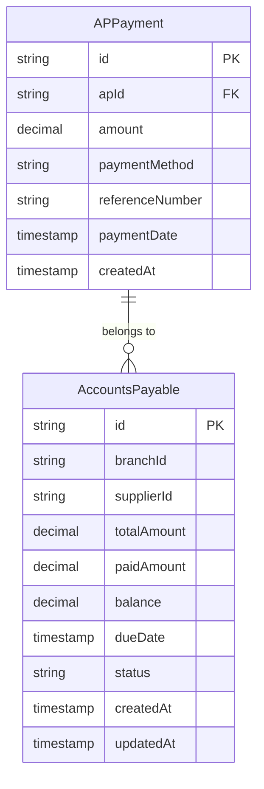
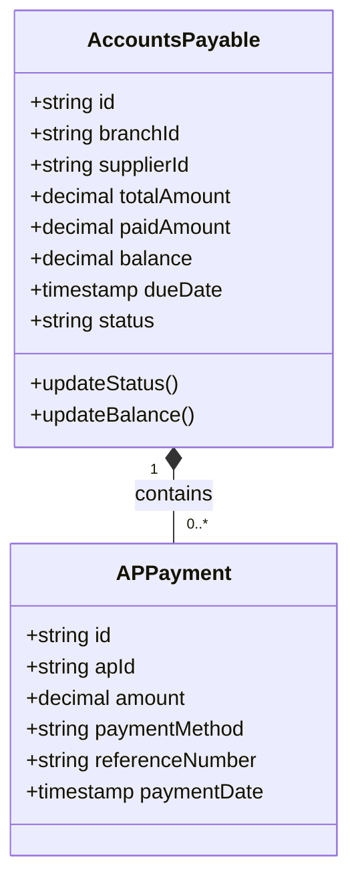
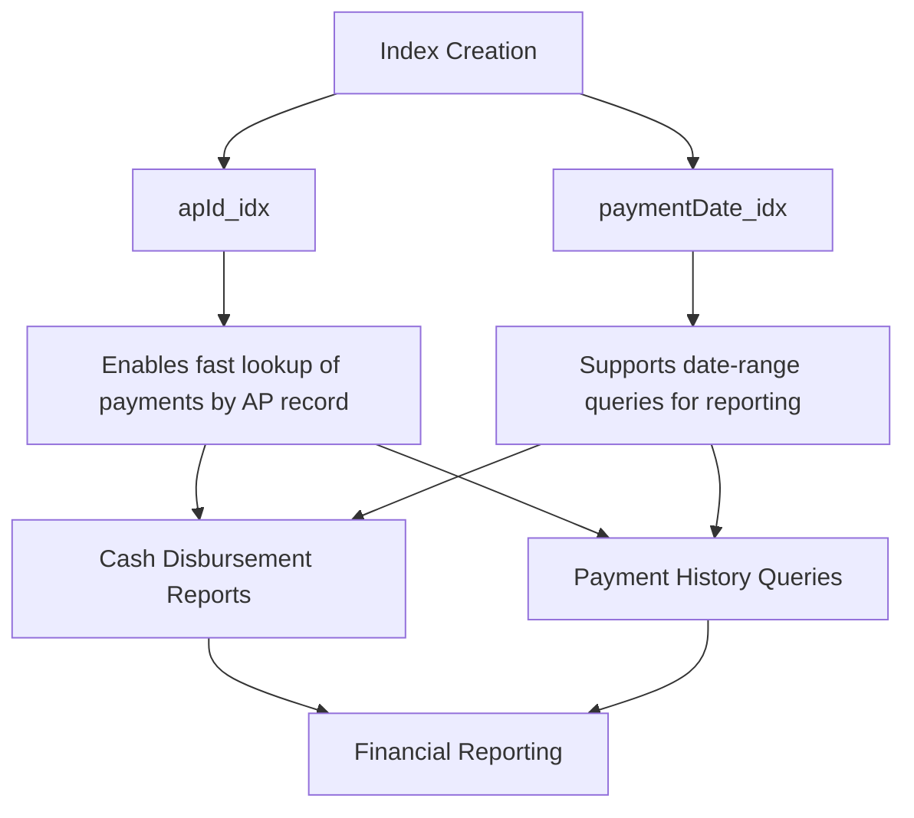
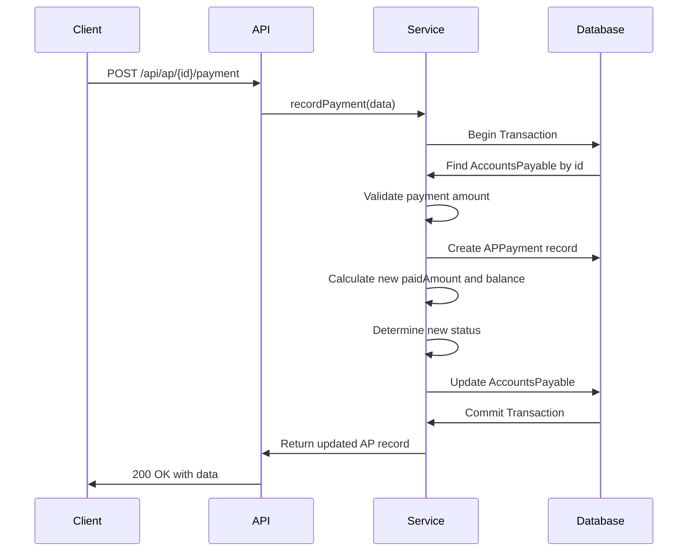

# AP Payment Model

<cite>
**Referenced Files in This Document**   
- [ap.service.ts](file://services/ap.service.ts)
- [ap.validation.ts](file://lib/validations/ap.validation.ts)
- [ap.types.ts](file://types/ap.types.ts)
- [route.ts](file://app/api/ap/[id]/payment/route.ts)
- [migration.sql](file://prisma/migrations/20251113094445_init/migration.sql)
</cite>

## Table of Contents
1. [Introduction](#introduction)
2. [AP Payment Data Model](#ap-payment-data-model)
3. [Field Definitions](#field-definitions)
4. [Relationship with AccountsPayable](#relationship-with-accountspayable)
5. [Indexing Strategy](#indexing-strategy)
6. [Payment Processing Workflow](#payment-processing-workflow)
7. [Query Examples](#query-examples)
8. [Business Rules](#business-rules)
9. [Conclusion](#conclusion)

## Introduction
The AP Payment model is designed to record supplier payments against outstanding accounts payable balances. This document provides comprehensive documentation of the APPayment entity, detailing its structure, relationships, validation rules, and business logic. The model supports financial operations including payment recording, reconciliation, reporting, and cash flow management.

**Section sources**
- [ap.service.ts](file://services/ap.service.ts#L42-L99)
- [ap.validation.ts](file://lib/validations/ap.validation.ts#L23-L34)

## AP Payment Data Model
The APPayment entity represents individual payment transactions made against accounts payable records. Each payment is linked to a parent AccountsPayable record and contributes to reducing the outstanding balance.



**Diagram sources **
- [migration.sql](file://prisma/migrations/20251113094445_init/migration.sql#L248-L258)
- [ap.types.ts](file://types/ap.types.ts#L43-L49)

## Field Definitions
The APPayment entity contains the following fields that capture essential payment information:

| Field | Type | Constraints | Description |
|-------|------|-------------|-------------|
| id | string | Primary Key | Unique identifier for the payment record |
| apId | string | Foreign Key | Reference to the parent AccountsPayable record |
| amount | decimal(10,2) | Positive value | Payment amount in currency units |
| paymentMethod | string | Enum values | Method used for payment |
| referenceNumber | string | Optional | External reference or transaction ID |
| paymentDate | timestamp | Required | Date when payment was made |
| createdAt | timestamp | Default: CURRENT_TIMESTAMP | Record creation timestamp |

**Section sources**
- [migration.sql](file://prisma/migrations/20251113094445_init/migration.sql#L248-L258)
- [ap.validation.ts](file://lib/validations/ap.validation.ts#L23-L34)

## Relationship with AccountsPayable
The APPayment entity maintains a one-to-many relationship with the AccountsPayable entity, where each accounts payable record can have multiple payment transactions.



When a payment is recorded, the system automatically updates the parent AccountsPayable record's paidAmount and balance fields. The relationship includes cascade delete behavior, ensuring that when an AccountsPayable record is deleted, all associated payments are also removed.

**Diagram sources **
- [ap.service.ts](file://services/ap.service.ts#L42-L99)
- [migration.sql](file://prisma/migrations/20251113094445_init/migration.sql#L527-L528)

## Indexing Strategy
The APPayment table includes strategic indexes to optimize query performance for reconciliation and reporting operations.



Two key indexes are implemented:
- **apId_idx**: Index on the apId foreign key to efficiently retrieve all payments for a specific accounts payable record
- **paymentDate_idx**: Index on the paymentDate field to support date-based queries for cash flow analysis and reconciliation

**Diagram sources **
- [migration.sql](file://prisma/migrations/20251113094445_init/migration.sql#L446-L449)

## Payment Processing Workflow
The payment recording process follows a transactional workflow that ensures data consistency between the payment record and the parent accounts payable balance.



**Diagram sources **
- [route.ts](file://app/api/ap/[id]/payment/route.ts#L4-L38)
- [ap.service.ts](file://services/ap.service.ts#L42-L99)

## Query Examples
The following query examples demonstrate common use cases for the APPayment model in financial reporting and analysis.

### Payment History Query
Retrieve all payments for a specific accounts payable record with supplier details:
```sql
SELECT 
    ap.id,
    s.companyName,
    ap.totalAmount,
    ap.paidAmount,
    p.paymentDate,
    p.amount,
    p.paymentMethod,
    p.referenceNumber
FROM APPayment p
JOIN AccountsPayable ap ON p.apId = ap.id
JOIN Supplier s ON ap.supplierId = s.id
WHERE p.apId = 'specific-ap-id'
ORDER BY p.paymentDate DESC;
```

### Cash Disbursement Report
Generate a cash disbursement report for a date range:
```sql
SELECT 
    p.paymentDate,
    s.companyName,
    p.amount,
    p.paymentMethod,
    p.referenceNumber,
    ap.totalAmount
FROM APPayment p
JOIN AccountsPayable ap ON p.apId = ap.id
JOIN Supplier s ON ap.supplierId = s.id
WHERE p.paymentDate >= '2025-01-01' 
    AND p.paymentDate < '2025-02-01'
ORDER BY p.paymentDate, s.companyName;
```

### Payment Method Analysis
Analyze payment methods across all transactions:
```sql
SELECT 
    paymentMethod,
    COUNT(*) as transactionCount,
    SUM(amount) as totalAmount,
    AVG(amount) as averageAmount
FROM APPayment
GROUP BY paymentMethod
ORDER BY totalAmount DESC;
```

**Section sources**
- [ap.service.ts](file://services/ap.service.ts#L42-L99)
- [report.service.ts](file://services/report.service.ts#L317-L327)

## Business Rules
The AP payment system enforces several business rules to maintain financial integrity and support accounting practices.

### Payment Validation Rules
- Payment amount must be greater than zero
- Payment amount cannot exceed the outstanding balance on the AccountsPayable record
- Payment date is required and must be a valid date
- Payment method must be one of the approved types (Cash, Card, Check, Bank Transfer, Online Transfer)

### AccountsPayable Status Updates
When a payment is recorded, the system automatically updates the parent AccountsPayable record:
- **Paid Amount**: Increased by the payment amount
- **Balance**: Decreased by the payment amount
- **Status**: Updated based on the new balance:
  - If balance = 0: Status changes to 'paid'
  - If 0 < balance < totalAmount: Status changes to 'partial'
  - If dueDate has passed and balance > 0: Status changes to 'overdue'

### Payment Scheduling and Reconciliation
The system supports payment scheduling through the dueDate field on the AccountsPayable record. The aging report functionality helps with reconciliation by categorizing outstanding balances into buckets (0-30, 31-60, 61-90, 90+ days overdue).

**Section sources**
- [ap.service.ts](file://services/ap.service.ts#L42-L99)
- [ap.validation.ts](file://lib/validations/ap.validation.ts#L23-L34)

## Conclusion
The APPayment model provides a robust foundation for managing supplier payments within the accounts payable system. By maintaining a clear relationship with the parent AccountsPayable record and enforcing business rules through the service layer, the model ensures financial accuracy and supports critical accounting functions including reconciliation, reporting, and cash flow management. The indexing strategy and query patterns enable efficient data retrieval for financial analysis and compliance reporting.