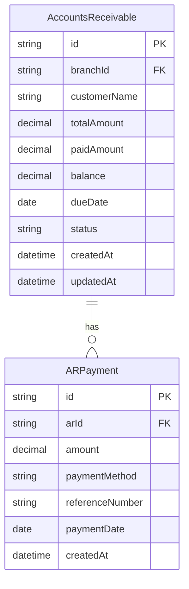
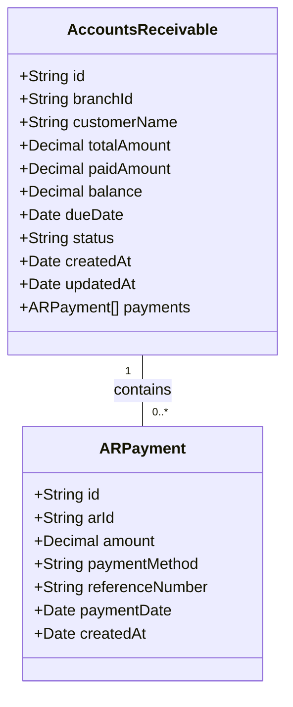
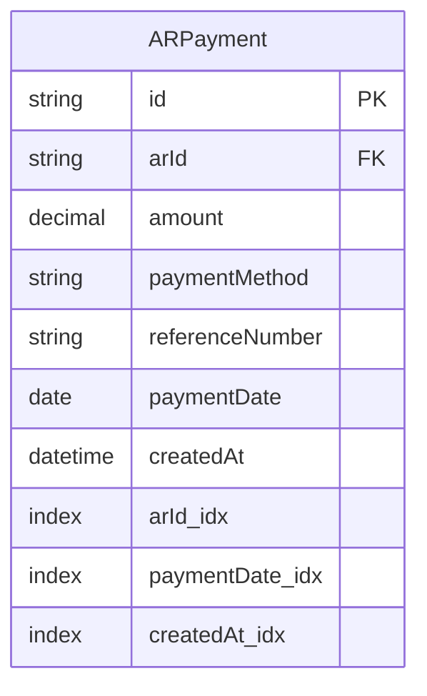
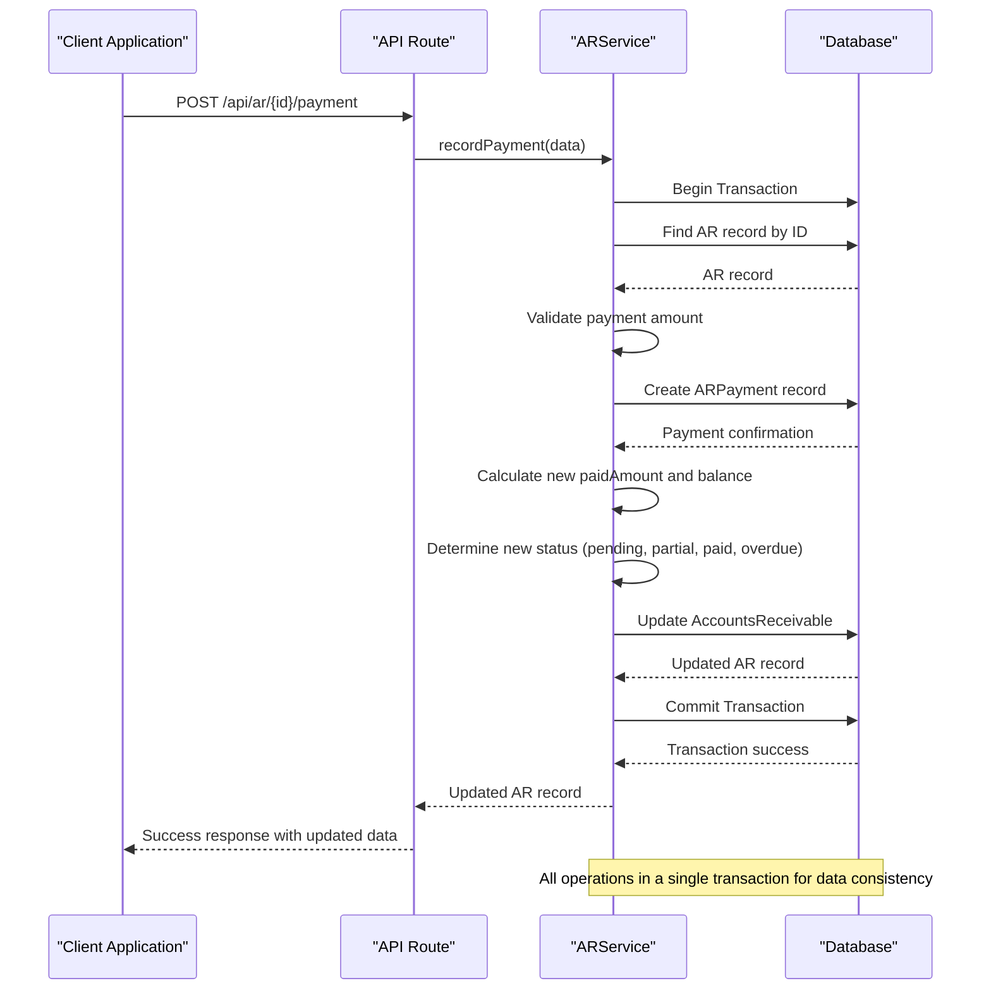
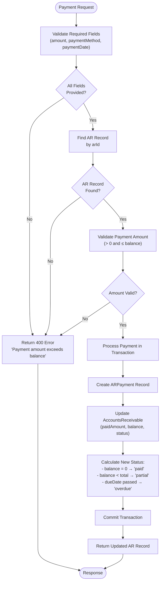
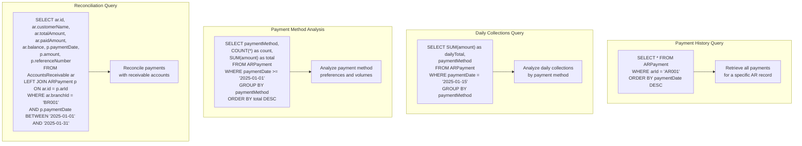
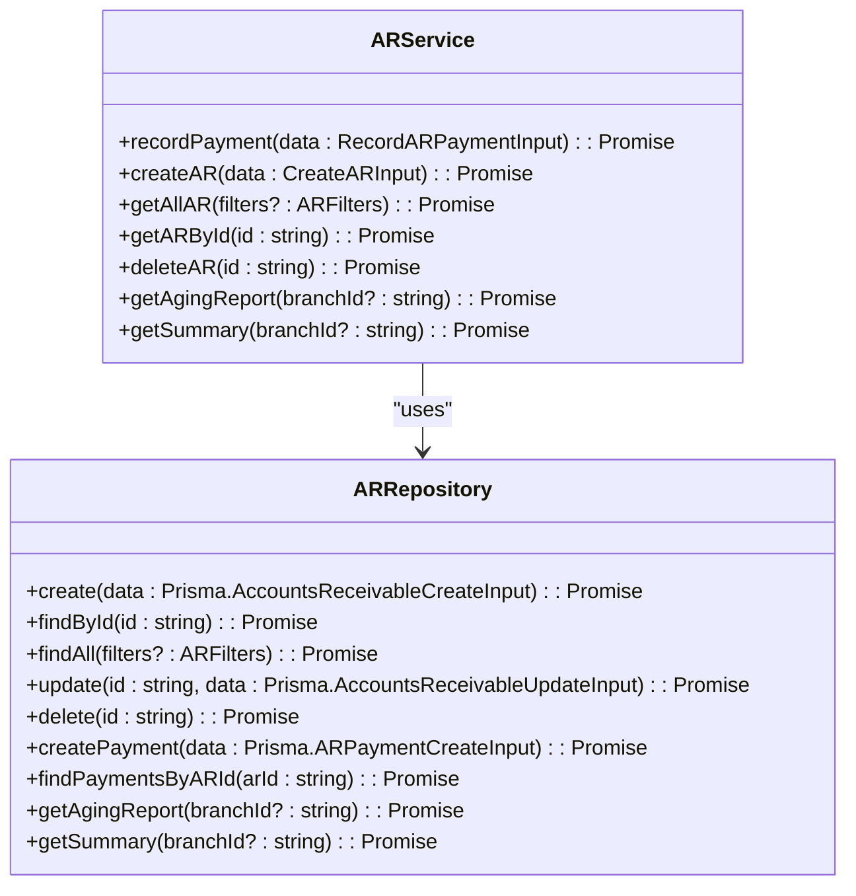
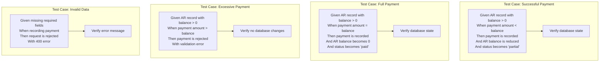

# AR Payment Model

<cite>
**Referenced Files in This Document**   
- [design.md](file://specs\inventory-pro-system\design.md)
- [ar.service.ts](file://services\ar.service.ts)
- [ar.repository.ts](file://repositories\ar.repository.ts)
- [ar.types.ts](file://types\ar.types.ts)
- [route.ts](file://app\api\ar\[id]\payment\route.ts)
- [migration.sql](file://prisma\migrations\20251113094445_init\migration.sql)
- [ar.service.test.ts](file://tests\unit\services\ar.service.test.ts)
</cite>

## Table of Contents
1. [Introduction](#introduction)
2. [AR Payment Entity Definition](#ar-payment-entity-definition)
3. [Field Definitions](#field-definitions)
4. [Relationship with Accounts Receivable](#relationship-with-accounts-receivable)
5. [Indexing Strategy](#indexing-strategy)
6. [Payment Processing Workflow](#payment-processing-workflow)
7. [Business Rules and Validation](#business-rules-and-validation)
8. [Query Examples](#query-examples)
9. [Service Layer Implementation](#service-layer-implementation)
10. [API Endpoint](#api-endpoint)
11. [Testing and Validation](#testing-and-validation)

## Introduction
The AR Payment model is a critical component of the Accounts Receivable system, designed to record customer payments against outstanding invoices. This documentation provides comprehensive details about the ARPayment entity, its relationship with the parent AccountsReceivable record, business rules for payment processing, and implementation details. The model supports financial reconciliation, reporting, and cash flow management by accurately tracking payment transactions and updating the balance of receivable accounts.

## AR Payment Entity Definition
The ARPayment entity represents individual payment transactions made by customers against their outstanding accounts receivable. Each payment record is linked to a specific AccountsReceivable record and contains details about the payment amount, method, date, and reference information. The entity is designed to support partial payments, multiple payment methods, and reconciliation processes.



**Diagram sources**
- [design.md](file://specs\inventory-pro-system\design.md#L385-L395)
- [migration.sql](file://prisma\migrations\20251113094445_init\migration.sql#L219-L229)

## Field Definitions
The ARPayment entity contains the following fields, each serving a specific purpose in the payment recording and reconciliation process:

| Field | Type | Constraints | Description |
|-------|------|-------------|-------------|
| id | String | @id @default(uuid()) | Unique identifier for the payment record |
| arId | String | Foreign Key | Reference to the parent AccountsReceivable record |
| amount | Decimal | @db.Decimal(10,2) | Payment amount in currency units with two decimal places |
| paymentMethod | String | Required | Method used for payment (e.g., Cash, Bank Transfer, Credit Card) |
| referenceNumber | String | Optional | Transaction reference or check number |
| paymentDate | DateTime | Required | Date when the payment was made |
| createdAt | DateTime | @default(now()) | Timestamp when the payment record was created |

**Section sources**
- [design.md](file://specs\inventory-pro-system\design.md#L385-L395)
- [migration.sql](file://prisma\migrations\20251113094445_init\migration.sql#L219-L229)

## Relationship with Accounts Receivable
The ARPayment entity has a one-to-many relationship with the AccountsReceivable entity, where one receivable record can have multiple payment records. The relationship is enforced through a foreign key constraint with cascade delete, ensuring that when an AccountsReceivable record is deleted, all associated payments are automatically removed.



**Diagram sources**
- [design.md](file://specs\inventory-pro-system\design.md#L381-L395)
- [ar.service.ts](file://services\ar.service.ts#L23-L82)

## Indexing Strategy
The ARPayment table includes strategic indexes to optimize query performance for common operations such as reconciliation, reporting, and payment history lookups. These indexes support efficient filtering and sorting operations on the most frequently queried fields.



**Diagram sources**
- [migration.sql](file://prisma\migrations\20251113094445_init\migration.sql#L426-L429)
- [design.md](file://specs\inventory-pro-system\design.md#L448-L456)

## Payment Processing Workflow
The payment processing workflow involves recording a payment and updating the parent AccountsReceivable record in a single transaction to ensure data consistency. The process validates the payment amount against the outstanding balance and updates the receivable status accordingly.



**Diagram sources**
- [ar.service.ts](file://services\ar.service.ts#L23-L82)
- [route.ts](file://app\api\ar\[id]\payment\route.ts#L4-L39)

## Business Rules and Validation
The AR payment system enforces several business rules to ensure data integrity and proper financial accounting. These rules are implemented in the service layer and validated before any database operations occur.



**Diagram sources**
- [ar.service.ts](file://services\ar.service.ts#L33-L40)
- [ar.service.test.ts](file://tests\unit\services\ar.service.test.ts#L90-L108)

## Query Examples
The AR payment model supports various query patterns for reporting, reconciliation, and analysis purposes. These examples demonstrate common use cases for retrieving payment data.



**Diagram sources**
- [ar.repository.ts](file://repositories\ar.repository.ts#L89-L94)
- [ar.service.ts](file://services\ar.service.ts#L89-L91)

## Service Layer Implementation
The ARService class implements the business logic for payment processing, including validation, transaction management, and state updates. The service ensures that all operations are performed atomically and that the system remains in a consistent state.



**Diagram sources**
- [ar.service.ts](file://services\ar.service.ts#L6-L164)
- [ar.repository.ts](file://repositories\ar.repository.ts#L5-L147)

## API Endpoint
The payment recording API endpoint provides a RESTful interface for creating payment records. The endpoint validates input data, processes the payment through the service layer, and returns the updated AccountsReceivable record.

```mermaid
sequenceDiagram
participant Client as "Frontend Client"
participant API as "API Route"
participant Service as "ARService"
Client->>API : POST /api/ar/{arId}/payment
activate API
API->>API : Parse JSON body
API->>API : Validate required fields
alt Missing required fields
API-->>Client : 400 Bad Request
deactivate API
else Valid input
API->>Service : recordPayment(data)
activate Service
Service->>Service : Begin database transaction
Service->>Service : Find AR record
Service->>Service : Validate payment amount
Service->>Service : Create payment record
Service->>Service : Update AR balance and status
Service-->>API : Return updated AR record
deactivate Service
API-->>Client : 200 OK with updated data
deactivate API
end
```

**Diagram sources**
- [route.ts](file://app\api\ar\[id]\payment\route.ts#L4-L39)
- [ar.service.ts](file://services\ar.service.ts#L22-L82)

## Testing and Validation
The AR payment functionality is thoroughly tested to ensure correctness and reliability. Unit tests validate various scenarios including successful payments, validation errors, and edge cases.



**Diagram sources**
- [ar.service.test.ts](file://tests\unit\services\ar.service.test.ts#L29-L135)
- [ar.service.ts](file://services\ar.service.ts#L33-L40)