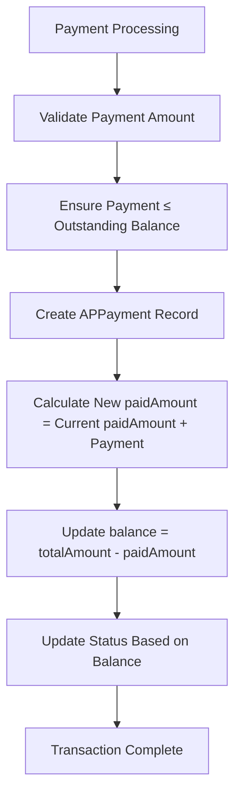
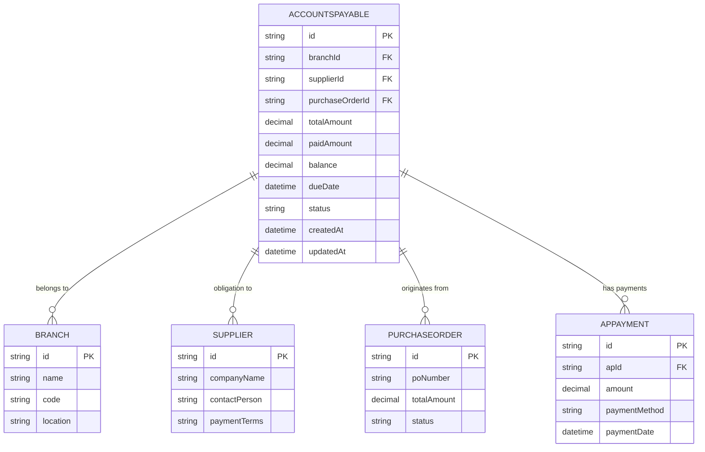
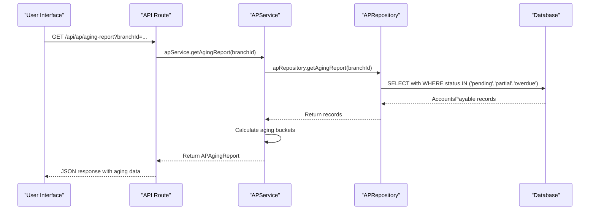
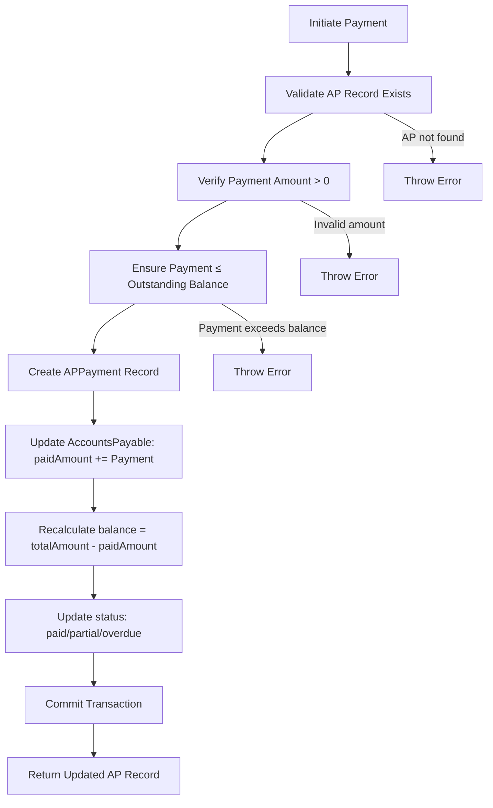

# Accounts Payable Model

<cite>
**Referenced Files in This Document**   
- [design.md](file://specs/inventory-pro-system/design.md#L397-L425)
- [migration.sql](file://prisma/migrations/20251113094445_init/migration.sql#L232-L246)
- [ap.repository.ts](file://repositories/ap.repository.ts)
- [ap.service.ts](file://services/ap.service.ts)
- [ap.types.ts](file://types/ap.types.ts)
</cite>

## Table of Contents
1. [Introduction](#introduction)
2. [Field Definitions](#field-definitions)
3. [Balance Calculation](#balance-calculation)
4. [Database Indexes](#database-indexes)
5. [Entity Relationships](#entity-relationships)
6. [Query Examples](#query-examples)
7. [Payment Processing Workflow](#payment-processing-workflow)
8. [Business Rules](#business-rules)

## Introduction
The AccountsPayable entity represents supplier payment obligations within the inventory management system. It tracks financial liabilities from purchase orders, manages payment schedules, and maintains accurate records of outstanding balances. This model supports critical financial operations including accounts payable aging reports, supplier balance inquiries, and payment processing. The system ensures data integrity through transactional updates and provides comprehensive reporting capabilities for financial analysis.

**Section sources**
- [design.md](file://specs/inventory-pro-system/design.md#L397-L425)
- [migration.sql](file://prisma/migrations/20251113094445_init/migration.sql#L232-L246)

## Field Definitions
The AccountsPayable entity contains the following fields that define supplier payment obligations:

- **id**: Unique identifier for the accounts payable record (String, UUID)
- **branchId**: Identifier linking the obligation to a specific business branch (String)
- **supplierId**: Identifier connecting the obligation to a supplier (String)
- **purchaseOrderId**: Optional reference to the originating purchase order (String)
- **totalAmount**: Total invoice amount with precision of 10 digits and 2 decimal places (Decimal(10,2))
- **paidAmount**: Cumulative amount already paid, defaulting to 0 (Decimal(10,2) @default(0))
- **balance**: Current outstanding balance calculated as totalAmount - paidAmount (Decimal(10,2))
- **dueDate**: Date by which payment should be completed (DateTime)
- **status**: Current payment status with possible values "pending", "partial", "paid", or "overdue" (String @default("pending"))
- **createdAt**: Timestamp of record creation (DateTime @default(now()))
- **updatedAt**: Timestamp of last record modification (DateTime @updatedAt)

**Section sources**
- [design.md](file://specs/inventory-pro-system/design.md#L398-L408)
- [migration.sql](file://prisma/migrations/20251113094445_init/migration.sql#L233-L243)

## Balance Calculation
The balance field in the AccountsPayable entity is dynamically maintained as the difference between totalAmount and paidAmount. When payments are recorded, the system automatically recalculates the balance using precise decimal arithmetic to prevent floating-point errors. The balance is updated within database transactions to ensure consistency. The formula used is: balance = totalAmount - paidAmount. This calculation is performed server-side to maintain data integrity and prevent client-side manipulation.

**Diagram sources**
- [ap.service.ts](file://services/ap.service.ts#L71-L73)
- [ap.repository.ts](file://repositories/ap.repository.ts#L84-L88)

## Database Indexes
The AccountsPayable entity is optimized for financial reporting with the following database indexes:

- **branchId_idx**: Index on branchId to support branch-specific financial reporting
- **supplierId_idx**: Index on supplierId for efficient supplier balance inquiries
- **status_idx**: Index on status to quickly identify records by payment status (pending, partial, paid, overdue)
- **dueDate_idx**: Index on dueDate for aging reports and upcoming payment reminders
- **createdAt_idx**: Index on createdAt for chronological reporting and audit trails

These indexes enable efficient querying for accounts payable aging reports, supplier balance summaries, and payment due date monitoring.

**Section sources**
- [migration.sql](file://prisma/migrations/20251113094445_init/migration.sql#L432-L444)

## Entity Relationships
The AccountsPayable entity maintains relationships with several key entities in the system:

**Diagram sources**
- [design.md](file://specs/inventory-pro-system/design.md#L397-L425)
- [ap.types.ts](file://types/ap.types.ts#L4-L8)

## Query Examples
The system supports various queries for financial analysis and reporting:

**AP Aging Report Query**: Retrieves accounts payable records grouped by aging buckets (0-30, 31-60, 61-90, 90+ days overdue) for a specific branch or organization-wide.

**Supplier Balance Inquiry**: Finds all accounts payable records for a specific supplier, showing total outstanding balance and payment status.

**Upcoming Payments**: Queries accounts payable with due dates within the next 7-30 days to facilitate payment planning.

**Summary Statistics**: Aggregates accounts payable data to provide totals for outstanding amounts, paid amounts, and counts by status.

**Diagram sources**
- [ap.service.ts](file://services/ap.service.ts#L114-L173)
- [ap.repository.ts](file://repositories/ap.repository.ts#L97-L116)

## Payment Processing Workflow
The payment processing workflow ensures data consistency through transactional updates:

**Diagram sources**
- [ap.service.ts](file://services/ap.service.ts#L44-L99)
- [ap.repository.ts](file://repositories/ap.repository.ts#L84-L88)

**Section sources**
- [ap.service.ts](file://services/ap.service.ts#L44-L99)
- [ap.repository.ts](file://repositories/ap.repository.ts#L84-L88)

## Business Rules
The AccountsPayable system enforces several business rules for financial integrity:

- **Payment Validation**: Payment amounts must be greater than zero and cannot exceed the outstanding balance
- **Status Management**: Status transitions automatically based on payment progress (pending → partial → paid) and due dates (overdue when dueDate < today and balance > 0)
- **Transactional Integrity**: Payment updates occur within database transactions to ensure atomicity
- **Liability Tracking**: Each accounts payable record is linked to a supplier and optionally to a purchase order for audit trail
- **Branch Accountability**: All obligations are associated with a specific branch for decentralized financial management
- **Payment Terms**: Due dates are calculated based on supplier payment terms (Net 15, Net 30, Net 60, COD)

The system also supports aging analysis by categorizing outstanding balances into standard accounting periods (0-30, 31-60, 61-90, 90+ days) for financial reporting and cash flow planning.

**Section sources**
- [ap.service.ts](file://services/ap.service.ts#L53-L85)
- [ap.types.ts](file://types/ap.types.ts#L20-L24)