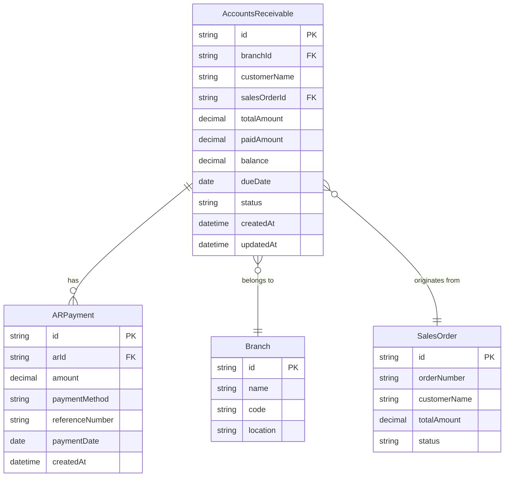
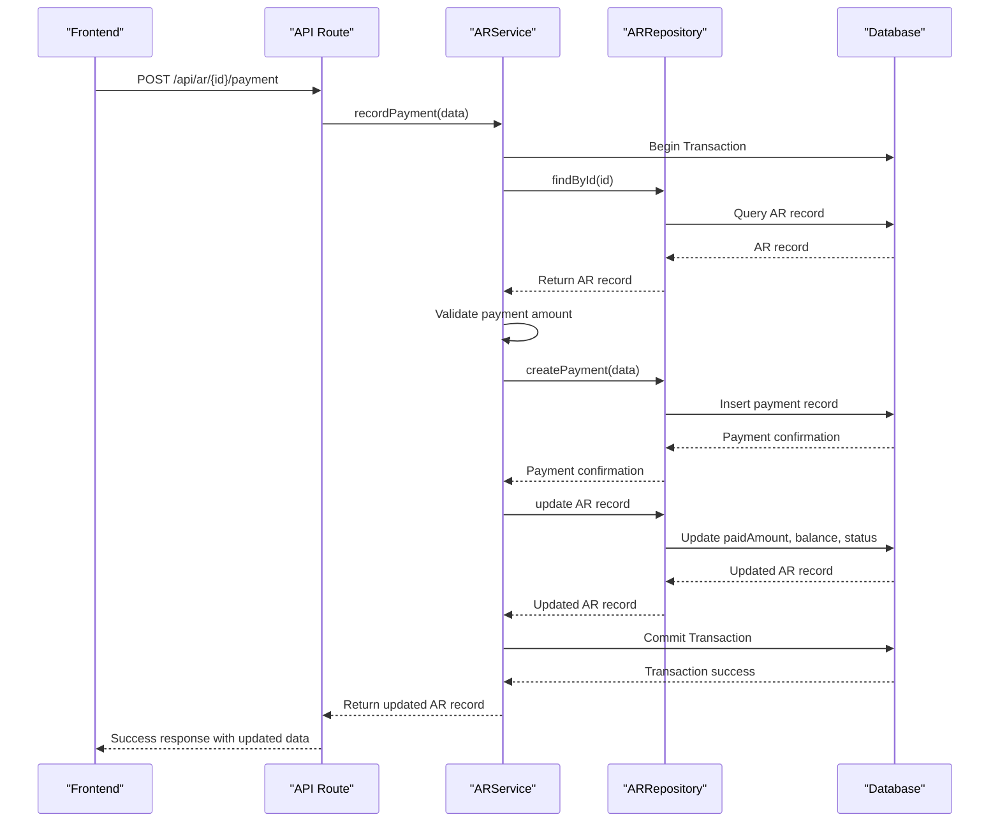

# Accounts Receivable Model

<cite>
**Referenced Files in This Document**   
- [ar.repository.ts](file://repositories/ar.repository.ts)
- [ar.service.ts](file://services/ar.service.ts)
- [design.md](file://specs/inventory-pro-system/design.md)
- [ar.types.ts](file://types/ar.types.ts)
- [route.ts](file://app/api/ar/route.ts)
- [payment/route.ts](file://app/api/ar/[id]/payment/route.ts)
- [ar.service.test.ts](file://tests/unit/services/ar.service.test.ts)
- [report.service.ts](file://services/report.service.ts)
- [dashboard.service.ts](file://services/dashboard.service.ts)
- [ar-ap/page.tsx](file://app/(dashboard)/ar-ap/page.tsx)
</cite>

## Table of Contents
1. [Introduction](#introduction)
2. [Field Definitions](#field-definitions)
3. [Balance Calculation](#balance-calculation)
4. [Indexes and Query Performance](#indexes-and-query-performance)
5. [Relationships](#relationships)
6. [AR Aging Report](#ar-aging-report)
7. [Query Examples](#query-examples)
8. [Payment Processing](#payment-processing)
9. [Business Rules](#business-rules)
10. [Integration Points](#integration-points)

## Introduction

The Accounts Receivable (AR) entity is a core component of the financial management system, designed to track customer credit and outstanding debts. This model enables the system to manage customer invoices, payments, and aging reports for effective credit management. The AR system integrates with sales orders, payment processing, and financial reporting to provide comprehensive customer debt tracking across multiple branches.

**Section sources**
- [design.md](file://specs/inventory-pro-system/design.md#L368-L383)

## Field Definitions

The AccountsReceivable model contains the following fields for comprehensive customer credit tracking:

- **id**: Unique identifier for the AR record (UUID)
- **branchId**: Identifier linking the AR record to a specific branch
- **customerName**: Name of the customer who owes the debt
- **salesOrderId**: Optional reference to the originating sales order
- **totalAmount**: Total invoice amount owed by the customer, stored as Decimal(10,2) for precise financial calculations
- **paidAmount**: Amount already paid by the customer, stored as Decimal(10,2) with a default value of 0
- **balance**: Current outstanding balance, calculated as totalAmount - paidAmount, stored as Decimal(10,2)
- **dueDate**: Date by which the full amount should be paid
- **status**: Current status of the AR record with possible values: "pending", "partial", "paid", or "overdue"
- **createdAt**: Timestamp when the AR record was created
- **updatedAt**: Timestamp automatically updated when the record is modified

**Section sources**
- [design.md](file://specs/inventory-pro-system/design.md#L368-L383)
- [ar.types.ts](file://types/ar.types.ts#L1-L57)

## Balance Calculation

The balance field represents the current outstanding amount owed by the customer and is calculated using the formula: balance = totalAmount - paidAmount. This calculation is maintained consistently across the system to ensure accurate financial tracking. The balance is automatically updated whenever payments are recorded against the AR record, ensuring real-time accuracy in customer debt tracking.

The system ensures precision in financial calculations by using the Decimal type with (10,2) precision, preventing floating-point arithmetic errors that could occur with standard floating-point numbers in financial computations.

**Section sources**
- [ar.service.ts](file://services/ar.service.ts#L54-L55)
- [design.md](file://specs/inventory-pro-system/design.md#L374-L375)
- [requirements.md](file://specs/inventory-pro-system/requirements.md#L276)

## Indexes and Query Performance

To optimize query performance for financial reporting and aging analysis, the following database indexes are implemented:

- **branchId**: Enables efficient filtering of AR records by branch for multi-branch operations
- **status**: Facilitates quick retrieval of records by their current status (pending, partial, paid, overdue)
- **dueDate**: Optimizes queries for aging reports and overdue account tracking
- **createdAt**: Supports time-based filtering for financial period reporting

These indexes are critical for generating AR aging reports, customer balance inquiries, and identifying overdue accounts efficiently, especially as the volume of financial records grows.

**Section sources**
- [design.md](file://specs/inventory-pro-system/design.md#L448-L450)
- [ar.repository.ts](file://repositories/ar.repository.ts#L28-L63)

## Relationships

The AccountsReceivable entity maintains the following relationships with other system components:

- **Branch**: Each AR record belongs to a specific branch, establishing organizational hierarchy and enabling branch-level financial reporting
- **ARPayment**: One-to-many relationship with payment records, allowing tracking of partial payments and payment history
- **SalesOrder**: Optional relationship to the originating sales order, providing context for the debt

These relationships enable comprehensive financial tracking, allowing the system to trace customer debts from their origin through payment processing to final settlement.



**Diagram sources**
- [design.md](file://specs/inventory-pro-system/design.md#L368-L383)
- [ar.repository.ts](file://repositories/ar.repository.ts#L5-L146)

## AR Aging Report

The system provides comprehensive aging reports to track outstanding customer debts. The aging report categorizes receivables into buckets based on days past due:
- 0-30 days
- 31-60 days
- 61-90 days
- 90+ days

The aging report is generated by comparing the current date with the dueDate of each AR record and calculating the days overdue. This report is essential for credit management, helping identify customers with overdue payments and supporting collection efforts. The report can be filtered by branch to provide localized views of receivables.

**Section sources**
- [ar.service.ts](file://services/ar.service.ts#L97-L157)
- [ar.repository.ts](file://repositories/ar.repository.ts#L96-L113)
- [requirements.md](file://specs/inventory-pro-system/requirements.md#L280)

## Query Examples

The following query examples demonstrate common operations for AR management:

**Retrieve all AR records for a specific branch:**
```typescript
const records = await arService.getAllAR({ branchId: 'branch-123' });
```

**Get AR records filtered by status:**
```typescript
const pendingRecords = await arService.getAllAR({ status: 'pending' });
```

**Find AR records for a specific customer:**
```typescript
const customerRecords = await arService.getAllAR({ customerName: 'John Doe' });
```

**Generate AR aging report for a branch:**
```typescript
const agingReport = await arService.getAgingReport('branch-123');
```

**Get customer balance inquiry:**
```typescript
const records = await arService.getAllAR({ customerName: 'Customer Name' });
const totalOutstanding = records.reduce((sum, ar) => sum.plus(ar.balance), new Decimal(0));
```

**Track overdue accounts:**
```typescript
const overdueRecords = await prisma.accountsReceivable.findMany({
  where: {
    status: 'overdue',
    branchId: 'branch-123'
  }
});
```

**Section sources**
- [ar.service.ts](file://services/ar.service.ts#L89-L91)
- [ar.repository.ts](file://repositories/ar.repository.ts#L28-L63)
- [route.ts](file://app/api/ar/route.ts#L4-L25)

## Payment Processing

The payment processing workflow is implemented through the ARService and follows these steps:

1. Validate that the payment amount is greater than zero
2. Verify that the payment amount does not exceed the outstanding balance
3. Create a payment record in the ARPayment table
4. Update the AR record with the new paidAmount and balance
5. Update the status based on the new balance:
   - If balance equals zero: status becomes "paid"
   - If balance is less than totalAmount but greater than zero: status becomes "partial"
   - If dueDate has passed and balance is greater than zero: status becomes "overdue"

All payment operations are executed within database transactions to ensure data consistency and prevent financial discrepancies.



**Diagram sources**
- [ar.service.ts](file://services/ar.service.ts#L23-L82)
- [payment/route.ts](file://app/api/ar/[id]/payment/route.ts#L4-L38)
- [ar.service.test.ts](file://tests/unit/services/ar.service.test.ts#L29-L108)

## Business Rules

The Accounts Receivable system enforces the following business rules for credit management:

1. **Payment Validation**: Payment amounts must be greater than zero and cannot exceed the outstanding balance
2. **Status Management**: The system automatically updates the status based on payment activity and due dates
3. **Overdue Detection**: Accounts with past due dates and non-zero balances are automatically marked as "overdue"
4. **Partial Payments**: The system supports partial payments, allowing customers to pay portions of their outstanding balance
5. **Data Integrity**: All payment operations are performed within database transactions to ensure financial accuracy
6. **Credit Terms**: Due dates are established based on customer credit terms, typically ranging from 15 to 60 days from invoice date

These rules ensure consistent credit management practices across all branches and protect the organization from financial risks associated with customer credit.

**Section sources**
- [ar.service.ts](file://services/ar.service.ts#L34-L40)
- [ar.service.ts](file://services/ar.service.ts#L57-L68)
- [ar.service.test.ts](file://tests/unit/services/ar.service.test.ts#L90-L108)

## Integration Points

The Accounts Receivable model integrates with multiple system components:

- **Sales Orders**: AR records are created when sales orders are marked as credit sales
- **Payment Processing**: The system records payments and updates AR balances in real-time
- **Financial Reporting**: AR data contributes to balance sheets, cash flow statements, and other financial reports
- **Dashboard**: Outstanding receivables are displayed on the financial dashboard for quick visibility
- **Alerts**: The system generates alerts for overdue accounts to support collection efforts

These integrations create a comprehensive financial management system that tracks customer debts from inception through collection, providing valuable insights for business decision-making.

**Section sources**
- [report.service.ts](file://services/report.service.ts#L361-L367)
- [dashboard.service.ts](file://services/dashboard.service.ts#L97-L106)
- [ar-ap/page.tsx](file://app/(dashboard)/ar-ap/page.tsx#L34-L35)
- [requirements.md](file://specs/inventory-pro-system/requirements.md#L274-L275)