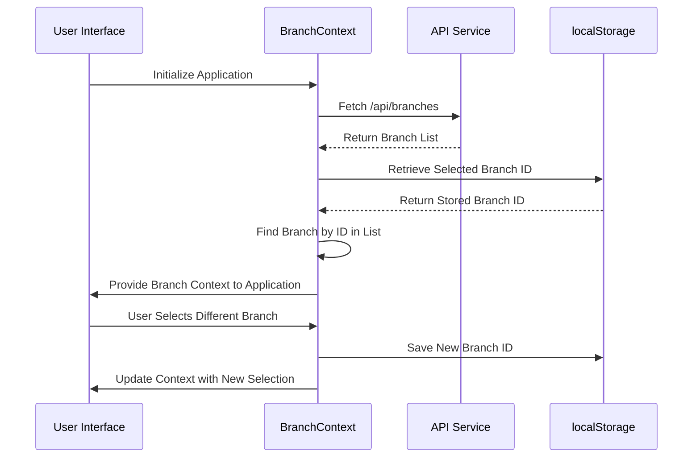

# Branch Model

<cite>
**Referenced Files in This Document**   
- [branch-context.tsx](file://contexts/branch-context.tsx)
- [branch.validation.ts](file://lib/validations/branch.validation.ts)
- [schema.prisma](file://prisma/schema.prisma)
- [branch.repository.ts](file://repositories/branch.repository.ts)
- [branch.service.ts](file://services/branch.service.ts)
- [types.ts](file://types/branch.types.ts)
</cite>

## Table of Contents
1. [Introduction](#introduction)
2. [Entity Purpose and Business Context](#entity-purpose-and-business-context)
3. [Field Definitions](#field-definitions)
4. [Constraints and Indexes](#constraints-and-indexes)
5. [Relationships with Other Entities](#relationships-with-other-entities)
6. [Common Queries](#common-queries)
7. [Branch Context Implementation](#branch-context-implementation)
8. [Validation Rules](#validation-rules)
9. [Business Rules](#business-rules)
10. [Conclusion](#conclusion)

## Introduction
The Branch entity serves as a foundational component in the multi-location management system for wholesale distribution companies. This documentation provides a comprehensive overview of the Branch model, detailing its structure, relationships, constraints, and business logic. The model enables organizations to manage multiple physical locations efficiently while maintaining data isolation and operational integrity across branches.

## Entity Purpose and Business Context
The Branch entity is designed to support multi-branch operations for wholesale distribution companies by providing a structured way to manage multiple physical locations. Each branch represents a distinct operational unit with its own inventory, sales, purchasing, and financial activities. The model enables data isolation through branch-specific contexts, ensuring that operations at one location do not interfere with others while allowing centralized reporting and management.

**Section sources**
- [branch-context.tsx](file://contexts/branch-context.tsx#L4-L12)
- [schema.prisma](file://prisma/schema.prisma#L14-L35)

## Field Definitions
The Branch entity contains the following fields with their respective data types and constraints:

| Field | Data Type | Description | Constraints |
|-------|---------|-------------|-------------|
| id | String | Unique identifier for the branch | Primary key, UUID default |
| name | String | Official name of the branch | Required, no uniqueness constraint |
| code | String | Unique code identifier for the branch | Required, unique constraint |
| location | String | Physical address or location of the branch | Required |
| manager | String | Name of the branch manager | Required |
| phone | String | Contact phone number for the branch | Required, format validation |
| status | String | Operational status of the branch | Default: "active", enum values: "active", "inactive" |

**Section sources**
- [branch.validation.ts](file://lib/validations/branch.validation.ts#L3-L9)
- [types.ts](file://types/branch.types.ts#L5-L11)
- [schema.prisma](file://prisma/schema.prisma#L15-L21)

## Constraints and Indexes
The Branch model implements several constraints and indexes to ensure data integrity and optimize query performance:

- **Unique Constraint**: The `code` field has a unique constraint (`@unique`) to prevent duplicate branch codes across the system
- **Default Values**: The `status` field defaults to "active" when a new branch is created
- **Indexes**: 
  - Index on `status` field to optimize queries filtering by operational status
  - Index on `code` field to enhance lookup performance when searching by branch code

These constraints ensure data consistency while the indexes improve query efficiency for common operations such as retrieving active branches or finding branches by their unique code.

```mermaid
erDiagram
Branch {
string id PK
string name
string code UK
string location
string manager
string phone
string status
datetime createdAt
datetime updatedAt
}
Branch ||--o{ Warehouse : "has"
Branch ||--o{ PurchaseOrder : "has"
Branch ||--o{ SalesOrder : "has"
Branch ||--o{ POSSale : "has"
Branch ||--o{ Expense : "has"
Branch ||--o{ AccountsReceivable : "has"
Branch ||--o{ AccountsPayable : "has"
}
```

**Diagram sources**
- [schema.prisma](file://prisma/schema.prisma#L17-L34)

**Section sources**
- [schema.prisma](file://prisma/schema.prisma#L17-L34)

## Relationships with Other Entities
The Branch entity maintains one-to-many relationships with several key business entities, establishing it as a central organizational unit in the system:

- **Warehouses**: One branch can have multiple warehouses for inventory storage
- **PurchaseOrders**: All purchasing activities are associated with a specific branch
- **SalesOrders**: Sales operations are tracked at the branch level
- **POSSales**: Point-of-sale transactions are linked to their originating branch
- **Expenses**: Financial expenditures are recorded per branch
- **AccountsReceivable**: Customer receivables are managed at the branch level
- **AccountsPayable**: Supplier payments and obligations are tracked by branch

These relationships ensure that all business operations are properly scoped to their respective branches, enabling accurate financial reporting and operational analysis at both the individual branch and enterprise levels.

**Section sources**
- [schema.prisma](file://prisma/schema.prisma#L25-L31)
- [branch.repository.ts](file://repositories/branch.repository.ts#L6-L9)

## Common Queries
The system supports several common query patterns for branch management:

- **Retrieve all active branches**: Use the `getActiveBranches()` method in the BranchService to fetch only branches with status "active"
- **Find branch by unique code**: Utilize the `findByCode()` method in the BranchRepository to locate a branch using its unique code identifier
- **Get all branches**: Call `getAllBranches()` to retrieve the complete list of branches sorted alphabetically by name

These queries leverage the defined indexes on status and code fields for optimal performance, ensuring responsive user experiences when navigating between branches or searching for specific locations.

**Section sources**
- [branch.service.ts](file://services/branch.service.ts#L8-L22)
- [branch.repository.ts](file://repositories/branch.repository.ts#L18-L22)

## Branch Context Implementation
The Branch Context implementation in `contexts/branch-context.tsx` provides a global state management solution for branch selection across the application. When a user selects a branch, this selection is persisted in localStorage under the key 'inventoryPro_selectedBranch'. The context automatically loads all available branches from the API endpoint `/api/branches` and maintains the selected branch state throughout the user session.

This implementation ensures data isolation by filtering all subsequent operations to only include records associated with the currently selected branch. Components throughout the application can access the current branch context using the `useBranchContext()` hook, enabling consistent and secure multi-branch operation.



**Diagram sources**
- [branch-context.tsx](file://contexts/branch-context.tsx#L25-L81)

**Section sources**
- [branch-context.tsx](file://contexts/branch-context.tsx#L25-L81)

## Validation Rules
Validation rules for the Branch entity are defined in `branch.validation.ts` using Zod schema validation:

- **Name**: Required field with minimum 1 character and maximum 100 characters
- **Code**: Required field with minimum 1 character and maximum 20 characters, must be unique
- **Location**: Required field with minimum 1 character and maximum 200 characters
- **Manager**: Required field with minimum 1 character and maximum 100 characters
- **Phone**: Required field with regex validation for phone number format
- **Status**: Optional field with enum values "active" or "inactive", defaults to "active"

The system validates these rules both on the client-side through form validation and server-side during API operations, ensuring data consistency regardless of the entry point.

**Section sources**
- [branch.validation.ts](file://lib/validations/branch.validation.ts#L3-L10)

## Business Rules
The Branch entity implements several important business rules:

- **Branch Status Transitions**: The `toggleBranchStatus()` method in BranchService allows switching between "active" and "inactive" states. When a branch is deactivated, it remains in the system for historical reference but is excluded from active operations.
- **Code Generation Patterns**: Branch codes must be unique across the organization. The system validates code uniqueness during both creation and updates, preventing conflicts.
- **Soft Deletion Pattern**: While branches can be marked as inactive, they are not physically deleted from the database to preserve historical data integrity.
- **Data Isolation**: All transactions and operations are scoped to the currently selected branch, preventing cross-branch data contamination.

These business rules ensure operational consistency while maintaining data integrity across the multi-branch environment.

**Section sources**
- [branch.service.ts](file://services/branch.service.ts#L80-L84)
- [branch.repository.ts](file://repositories/branch.repository.ts#L32-L36)

## Conclusion
The Branch model provides a robust foundation for multi-location management in wholesale distribution operations. By implementing proper constraints, relationships, and business rules, the model enables organizations to scale their operations across multiple locations while maintaining data integrity and operational efficiency. The combination of database-level constraints, application-level validation, and context-based data isolation creates a comprehensive solution for managing complex multi-branch environments.