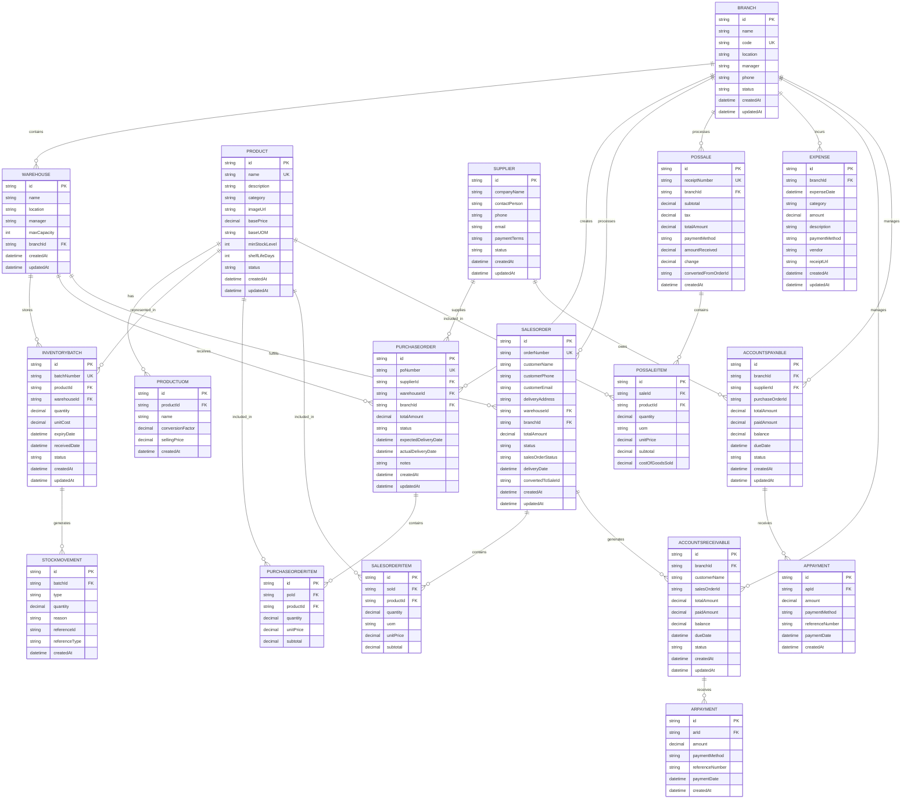
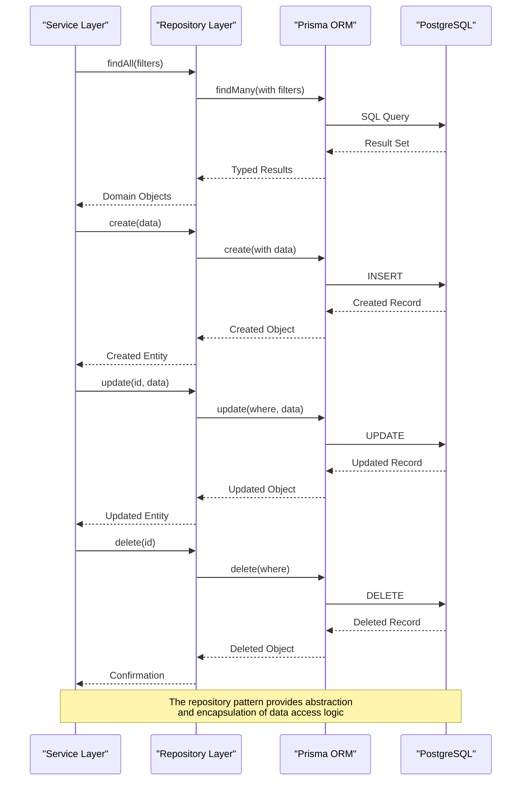

# Data Model Design

<cite>
**Referenced Files in This Document**   
- [design.md](file://specs/inventory-pro-system/design.md)
- [seed.ts](file://prisma/seed.ts)
- [product.validation.ts](file://lib/validations/product.validation.ts)
- [purchase-order.validation.ts](file://lib/validations/purchase-order.validation.ts)
- [sales-order.validation.ts](file://lib/validations/sales-order.validation.ts)
- [product.repository.ts](file://repositories/product.repository.ts)
- [inventory.repository.ts](file://repositories/inventory.repository.ts)
- [purchase-order.repository.ts](file://repositories/purchase-order.repository.ts)
- [sales-order.repository.ts](file://repositories/sales-order.repository.ts)
- [product.types.ts](file://types/product.types.ts)
- [inventory.types.ts](file://types/inventory.types.ts)
- [purchase-order.types.ts](file://types/purchase-order.types.ts)
- [sales-order.types.ts](file://types/sales-order.types.ts)
</cite>

## Table of Contents
1. [Introduction](#introduction)
2. [Core Entity Relationships](#core-entity-relationships)
3. [Product Data Model](#product-data-model)
4. [Inventory and Batch Management](#inventory-and-batch-management)
5. [Warehouse and Branch Structure](#warehouse-and-branch-structure)
6. [Procurement and Sales Orders](#procurement-and-sales-orders)
7. [Financial Entities: AR/AP](#financial-entities-arap)
8. [POS Transaction Model](#pos-transaction-model)
9. [Data Access Patterns](#data-access-patterns)
10. [Complex Query Examples](#complex-query-examples)

## Introduction

The InventoryPro system implements a comprehensive data model for inventory management and point-of-sale operations. The database schema is defined using Prisma ORM with PostgreSQL as the underlying database engine. The model supports core business entities including Products, InventoryBatches, Warehouses, Branches, Suppliers, PurchaseOrders, SalesOrders, and financial entities for Accounts Receivable (AR) and Accounts Payable (AP). The system incorporates advanced features such as unit of measure (UOM) configurations, average costing calculations, and multi-warehouse inventory tracking.

The data model follows a normalized structure with appropriate relationships and constraints to ensure data integrity. It supports complex business operations including inventory valuation, stock level monitoring, order fulfillment, and financial tracking. The architecture separates concerns through repository and service layers, enabling clean data access patterns and business logic implementation.

## Core Entity Relationships

The core entities in the InventoryPro system are interconnected through well-defined relationships that reflect the business domain. Products serve as the central entity, connected to inventory batches, purchase orders, sales orders, and POS transactions. Each product can exist in multiple warehouses through inventory batches, which track quantity, cost, and expiration information.

Branches represent physical locations and contain multiple warehouses. Suppliers provide products through purchase orders, creating accounts payable obligations. Customers generate sales orders and POS transactions, creating accounts receivable entries. The system maintains referential integrity through foreign key constraints and cascading operations where appropriate.



**Diagram sources**
- [design.md](file://specs/inventory-pro-system/design.md#L146-L442)
- [seed.ts](file://prisma/seed.ts#L8-L246)

## Product Data Model

The Product entity serves as the foundation for inventory management, containing essential information about each item in the system. Each product is uniquely identified by a UUID and must have a unique name. The data model includes comprehensive product attributes such as category, pricing, unit of measure configurations, and inventory thresholds.

Products support multiple units of measure through the ProductUOM entity, which allows for different packaging configurations (e.g., bottle, pack, carton) with corresponding conversion factors and selling prices. This enables flexible pricing and inventory tracking across different packaging levels. The baseUOM field specifies the fundamental unit for inventory tracking, while alternate UOMs are defined with their conversion factors relative to the base unit.

Validation rules ensure data quality, requiring non-empty names, positive prices, and valid categories. The system supports five product categories: Carbonated, Juices, Energy Drinks, Water, and Other. Each product has a minimum stock level that triggers alerts when inventory falls below this threshold, and a shelf life duration in days that determines expiration dates for inventory batches.

```mermaid
classDiagram
class Product {
+string id
+string name
+string? description
+string category
+string? imageUrl
+Decimal basePrice
+string baseUOM
+int minStockLevel
+int shelfLifeDays
+string status
+DateTime createdAt
+DateTime updatedAt
}
class ProductUOM {
+string id
+string productId
+string name
+Decimal conversionFactor
+Decimal sellingPrice
+DateTime createdAt
}
Product "1" -- "0..*" ProductUOM : contains
ProductUOM --> Product : belongs to
note right of Product
Validation Rules :
- Name : required, unique, max 100 chars
- BasePrice : positive number
- MinStockLevel : positive integer
- ShelfLifeDays : positive integer
- Status : 'active' or 'inactive'
end note
note right of ProductUOM
Validation Rules :
- Name : required, max 50 chars
- ConversionFactor : positive number
- SellingPrice : positive number
- Unique constraint : (productId, name)
end note
```

**Diagram sources**
- [design.md](file://specs/inventory-pro-system/design.md#L172-L204)
- [product.validation.ts](file://lib/validations/product.validation.ts#L3-L25)
- [product.types.ts](file://types/product.types.ts#L13-L23)

**Section sources**
- [design.md](file://specs/inventory-pro-system/design.md#L172-L204)
- [product.validation.ts](file://lib/validations/product.validation.ts#L3-L25)
- [product.types.ts](file://types/product.types.ts#L13-L23)

## Inventory and Batch Management

The inventory management system implements a batch tracking approach that enables precise inventory costing and expiration management. The InventoryBatch entity represents a specific quantity of a product received at a particular time, with its own cost, expiration date, and status. This approach supports the weighted average costing method, where the cost of goods sold is calculated based on the average cost of all active inventory batches.

Each inventory batch is associated with a specific product and warehouse, allowing for multi-location inventory tracking. Batches have a quantity field that is updated through stock movements, which record all inventory transactions including receipts, issuances, transfers, and adjustments. The system uses FIFO (First-In, First-Out) logic for inventory deduction to ensure older stock is used first, minimizing waste from expired products.

The StockMovement entity captures the history of all inventory transactions, providing an audit trail for inventory changes. Each movement is linked to a specific batch and includes details such as movement type, quantity, reason, and reference to the originating transaction (purchase order, sales order, or POS sale). This enables comprehensive inventory reporting and reconciliation.

```mermaid
classDiagram
class InventoryBatch {
+string id
+string batchNumber
+string productId
+string warehouseId
+Decimal quantity
+Decimal unitCost
+DateTime expiryDate
+DateTime receivedDate
+string status
+DateTime createdAt
+DateTime updatedAt
}
class StockMovement {
+string id
+string batchId
+string type
+Decimal quantity
+string? reason
+string? referenceId
+string? referenceType
+DateTime createdAt
}
InventoryBatch "1" -- "0..*" StockMovement : generates
StockMovement --> InventoryBatch : affects
note right of InventoryBatch
Key Features :
- Batch-specific costing
- Expiration date tracking
- Multi-warehouse support
- Status : active, expired, depleted
- Unique batchNumber constraint
end note
note right of StockMovement
Movement Types :
- IN : Inventory receipt
- OUT : Inventory issuance
- TRANSFER : Between warehouses
- ADJUSTMENT : Inventory correction
end note
```

**Diagram sources**
- [design.md](file://specs/inventory-pro-system/design.md#L222-L251)
- [inventory.repository.ts](file://repositories/inventory.repository.ts#L16-L152)
- [inventory.types.ts](file://types/inventory.types.ts#L9-L25)

**Section sources**
- [design.md](file://specs/inventory-pro-system/design.md#L222-L251)
- [inventory.repository.ts](file://repositories/inventory.repository.ts#L16-L152)
- [inventory.types.ts](file://types/inventory.types.ts#L9-L25)

## Warehouse and Branch Structure

The organizational structure of the InventoryPro system is built around branches and warehouses, reflecting the physical locations of business operations. A Branch represents a business location with its own management, contact information, and operational status. Each branch can contain multiple warehouses, which are physical storage facilities with specific capacity limits and managers.

Warehouses are assigned to branches through a foreign key relationship, ensuring that all inventory operations are associated with a specific business location. This structure supports multi-location inventory management, allowing products to be stored in different warehouses within the same branch or across different branches. The system tracks warehouse capacity through the maxCapacity field, enabling capacity planning and utilization monitoring.

The branch-warehouse hierarchy enables localized inventory management while maintaining centralized control. Each branch can have its own suppliers, customers, and financial records, while sharing product definitions across the organization. This structure supports business expansion with new branches and warehouses while maintaining data consistency and operational efficiency.

```mermaid
classDiagram
class Branch {
+string id
+string name
+string code
+string location
+string manager
+string phone
+string status
+DateTime createdAt
+DateTime updatedAt
}
class Warehouse {
+string id
+string name
+string location
+string manager
+int maxCapacity
+string branchId
+DateTime createdAt
+DateTime updatedAt
}
Branch "1" -- "0..*" Warehouse : contains
Warehouse --> Branch : belongs to
note right of Branch
Key Attributes :
- Unique code for identification
- Manager responsible for operations
- Status : active or inactive
- Contact information
end note
note right of Warehouse
Key Attributes :
- Max capacity in units
- Manager responsible for storage
- Location within the branch
- Capacity utilization tracking
end note
```

**Diagram sources**
- [design.md](file://specs/inventory-pro-system/design.md#L152-L170)
- [design.md](file://specs/inventory-pro-system/design.md#L206-L220)
- [seed.ts](file://prisma/seed.ts#L8-L62)

**Section sources**
- [design.md](file://specs/inventory-pro-system/design.md#L152-L170)
- [design.md](file://specs/inventory-pro-system/design.md#L206-L220)
- [seed.ts](file://prisma/seed.ts#L8-L62)

## Procurement and Sales Orders

The procurement and sales order system manages the complete lifecycle of product acquisition and customer fulfillment. PurchaseOrders represent agreements with suppliers to acquire products, while SalesOrders represent commitments to deliver products to customers. Both order types follow a similar structure with header information, line items, and status tracking.

PurchaseOrders are created with a draft status and progress through pending, ordered, received, and cancelled states. Each purchase order is associated with a supplier, warehouse for delivery, and branch for accounting. The order contains multiple PurchaseOrderItems that specify the products, quantities, and prices. When inventory is received, the purchase order status is updated, and inventory batches are created with the received quantities and costs.

SalesOrders follow a similar lifecycle from draft to pending to converted (when fulfilled) or cancelled. They include customer information, delivery details, and order items with specific units of measure. When a sales order is fulfilled through a POS sale, the sales order status is updated to converted, and the POS sale references the original sales order. This linkage enables order tracking and fulfillment reporting.

```mermaid
classDiagram
class PurchaseOrder {
+string id
+string poNumber
+string supplierId
+string warehouseId
+string branchId
+Decimal totalAmount
+string status
+DateTime expectedDeliveryDate
+DateTime actualDeliveryDate
+string? notes
+DateTime createdAt
+DateTime updatedAt
}
class PurchaseOrderItem {
+string id
+string poId
+string productId
+Decimal quantity
+Decimal unitPrice
+Decimal subtotal
}
class SalesOrder {
+string id
+string orderNumber
+string customerName
+string customerPhone
+string customerEmail
+string deliveryAddress
+string warehouseId
+string branchId
+Decimal totalAmount
+string status
+string salesOrderStatus
+DateTime deliveryDate
+string? convertedToSaleId
+DateTime createdAt
+DateTime updatedAt
}
class SalesOrderItem {
+string id
+string soId
+string productId
+Decimal quantity
+string uom
+Decimal unitPrice
+Decimal subtotal
}
PurchaseOrder "1" -- "0..*" PurchaseOrderItem : contains
PurchaseOrderItem --> PurchaseOrder : belongs to
SalesOrder "1" -- "0..*" SalesOrderItem : contains
SalesOrderItem --> SalesOrder : belongs to
note right of PurchaseOrder
Status Flow :
draft → pending → ordered → received → cancelled
Total amount calculated from items
end note
note right of SalesOrder
Status Flow :
draft → pending → converted → cancelled
SalesOrderStatus : pending, converted
ConvertedToSaleId links to POS sale
end note
```

**Diagram sources**
- [design.md](file://specs/inventory-pro-system/design.md#L269-L334)
- [purchase-order.repository.ts](file://repositories/purchase-order.repository.ts#L12-L60)
- [sales-order.repository.ts](file://repositories/sales-order.repository.ts#L11-L65)
- [purchase-order.types.ts](file://types/purchase-order.types.ts#L11-L17)
- [sales-order.types.ts](file://types/sales-order.types.ts#L14-L26)

**Section sources**
- [design.md](file://specs/inventory-pro-system/design.md#L269-L334)
- [purchase-order.repository.ts](file://repositories/purchase-order.repository.ts#L12-L60)
- [sales-order.repository.ts](file://repositories/sales-order.repository.ts#L11-L65)

## Financial Entities: AR/AP

The financial management system in InventoryPro tracks accounts receivable (AR) and accounts payable (AP) to manage customer and supplier obligations. AccountsReceivable records represent amounts owed by customers, typically generated from sales orders or POS transactions. AccountsPayable records represent amounts owed to suppliers, typically generated from purchase orders.

Each AR record includes the customer name, total amount, paid amount, remaining balance, due date, and status. Payments are recorded in ARPayment entries that reference the AR record and include payment method, amount, and date. Similarly, AP records track obligations to suppliers with payment details recorded in APPayment entries. This structure enables aging reports, payment tracking, and financial reconciliation.

The system supports multiple payment methods including cash, credit card, bank transfer, and check. Payment references can be tracked through reference numbers, enabling reconciliation with bank statements. The financial entities are linked to their originating transactions (sales orders, purchase orders, or POS sales) through reference IDs, maintaining the audit trail from order to payment.

```mermaid
classDiagram
class AccountsReceivable {
+string id
+string branchId
+string customerName
+string? salesOrderId
+Decimal totalAmount
+Decimal paidAmount
+Decimal balance
+DateTime dueDate
+string status
+DateTime createdAt
+DateTime updatedAt
}
class ARPayment {
+string id
+string arId
+Decimal amount
+string paymentMethod
+string? referenceNumber
+DateTime paymentDate
+DateTime createdAt
}
class AccountsPayable {
+string id
+string branchId
+string supplierId
+string? purchaseOrderId
+Decimal totalAmount
+Decimal paidAmount
+Decimal balance
+DateTime dueDate
+string status
+DateTime createdAt
+DateTime updatedAt
}
class APPayment {
+string id
+string apId
+Decimal amount
+string paymentMethod
+string? referenceNumber
+DateTime paymentDate
+DateTime createdAt
}
AccountsReceivable "1" -- "0..*" ARPayment : receives
ARPayment --> AccountsReceivable : reduces
AccountsPayable "1" -- "0..*" APPayment : receives
APPayment --> AccountsPayable : reduces
note right of AccountsReceivable
Key Features :
- Balance calculated as total - paid
- Status : pending, paid, overdue
- Due date for payment terms
- Linked to sales transactions
end note
note right of AccountsPayable
Key Features :
- Balance calculated as total - paid
- Status : pending, paid, overdue
- Due date for payment terms
- Linked to purchase transactions
end note
```

**Diagram sources**
- [design.md](file://specs/inventory-pro-system/design.md#L368-L425)
- [design.md](file://specs/inventory-pro-system/design.md#L384-L395)
- [design.md](file://specs/inventory-pro-system/design.md#L397-L424)

**Section sources**
- [design.md](file://specs/inventory-pro-system/design.md#L368-L425)

## POS Transaction Model

The point-of-sale (POS) transaction model captures retail sales at branch locations. POSSale records represent completed transactions with customers, including subtotal, tax, total amount, and payment details. Each POS sale consists of multiple POSSaleItems that specify the products sold, quantities, units of measure, and prices.

The POS system supports multiple payment methods and calculates change when the amount received exceeds the total amount. POS sales can be generated directly at the register or converted from sales orders when customers pick up pre-ordered items. The convertedFromOrderId field links POS sales to their originating sales orders, enabling order fulfillment tracking.

Each POSSaleItem includes the cost of goods sold (COGS), which is calculated based on the weighted average cost of inventory batches at the time of sale. This enables accurate profit margin calculation and inventory valuation. The system also supports pending orders through a separate workflow, allowing customers to place orders for later pickup or delivery.

```mermaid
classDiagram
class POSSale {
+string id
+string receiptNumber
+string branchId
+Decimal subtotal
+Decimal tax
+Decimal totalAmount
+string paymentMethod
+Decimal? amountReceived
+Decimal? change
+string? convertedFromOrderId
+DateTime createdAt
}
class POSSaleItem {
+string id
+string saleId
+string productId
+Decimal quantity
+string uom
+Decimal unitPrice
+Decimal subtotal
+Decimal costOfGoodsSold
}
POSSale "1" -- "0..*" POSSaleItem : contains
POSSaleItem --> POSSale : belongs to
note right of POSSale
Key Features :
- Unique receipt number
- Tax calculation (12% VAT)
- Payment method tracking
- Change calculation
- Link to sales orders
end note
note right of POSSaleItem
Key Features :
- Unit of measure flexibility
- Subtotal calculation
- Cost of Goods Sold tracking
- Profit margin analysis
end note
```

**Diagram sources**
- [design.md](file://specs/inventory-pro-system/design.md#L336-L365)
- [design.md](file://specs/inventory-pro-system/design.md#L353-L364)

**Section sources**
- [design.md](file://specs/inventory-pro-system/design.md#L336-L365)

## Data Access Patterns

The data access layer in InventoryPro follows a repository pattern that provides an abstraction over the Prisma ORM. Each core entity has a corresponding repository class that encapsulates database operations and query logic. The repositories expose methods for CRUD operations, filtering, and aggregation, providing a consistent interface for the service layer.

The repository pattern enables separation of concerns, with repositories handling data access concerns and services handling business logic. Repositories use Prisma's type-safe query builder to construct database queries with proper typing and validation. They also handle data shaping, including field selection, sorting, and pagination, to optimize performance and reduce data transfer.

The system leverages Prisma relations to efficiently load related data through include and select options. For example, when retrieving a product, the repository can include its alternate UOMs and active inventory batches in a single query. Similarly, order repositories can include items and related entities to avoid N+1 query problems.



**Diagram sources**
- [design.md](file://specs/inventory-pro-system/design.md#L496-L536)
- [product.repository.ts](file://repositories/product.repository.ts#L6-L31)
- [inventory.repository.ts](file://repositories/inventory.repository.ts#L16-L64)
- [purchase-order.repository.ts](file://repositories/purchase-order.repository.ts#L12-L60)
- [sales-order.repository.ts](file://repositories/sales-order.repository.ts#L11-L65)

**Section sources**
- [design.md](file://specs/inventory-pro-system/design.md#L496-L536)
- [product.repository.ts](file://repositories/product.repository.ts#L6-L31)
- [inventory.repository.ts](file://repositories/inventory.repository.ts#L16-L64)

## Complex Query Examples

The InventoryPro system supports complex queries for inventory and financial reporting. These queries leverage Prisma's aggregation capabilities and relation traversals to provide business insights. The following examples demonstrate key reporting scenarios:

### Inventory Stock Level Calculation

This query calculates the total stock level for a product across all warehouses, including the weighted average cost and detailed batch information:

```typescript
async getTotalStockByProduct(productId: string, warehouseId?: string): Promise<number> {
  const where: Prisma.InventoryBatchWhereInput = {
    productId,
    status: 'active',
    quantity: { gt: 0 },
  };

  if (warehouseId) {
    where.warehouseId = warehouseId;
  }

  const result = await prisma.inventoryBatch.aggregate({
    where,
    _sum: {
      quantity: true,
    },
  });

  return Number(result._sum.quantity || 0);
}
```

### Aging Report for Accounts Receivable

This query identifies outstanding customer balances grouped by aging periods (current, 1-30 days, 31-60 days, 61+ days):

```typescript
async getAgingReport(): Promise<AgingReport[]> {
  const today = new Date();
  
  return await prisma.accountsReceivable.findMany({
    where: {
      status: 'pending',
      balance: { gt: 0 },
    },
    include: {
      payments: true,
      branch: true,
    },
    orderBy: { dueDate: 'asc' },
  });
}
```

### Inventory Valuation Report

This query calculates the total value of inventory by multiplying the quantity of each active batch by its unit cost:

```typescript
async getInventoryValue(): Promise<InventoryValue[]> {
  return await prisma.inventoryBatch.findMany({
    where: {
      status: 'active',
      quantity: { gt: 0 },
    },
    include: {
      product: {
        select: {
          id: true,
          name: true,
          category: true,
        },
      },
      warehouse: {
        select: {
          id: true,
          name: true,
        },
      },
    },
  });
}
```

### Sales Performance Report

This query analyzes sales performance by product, branch, and time period, aggregating sales volume and revenue:

```typescript
async getSalesPerformance(startDate: Date, endDate: Date): Promise<SalesPerformance[]> {
  return await prisma.pOSSaleItem.findMany({
    where: {
      sale: {
        createdAt: {
          gte: startDate,
          lte: endDate,
        },
      },
    },
    include: {
      product: {
        select: {
          id: true,
          name: true,
          category: true,
        },
      },
      sale: {
        select: {
          branch: {
            select: {
              id: true,
              name: true,
            },
          },
        },
      },
    },
  });
}
```

These complex queries demonstrate the system's ability to support business intelligence and decision-making through comprehensive data access patterns. The repository layer encapsulates these queries, providing a clean interface for the service layer while optimizing database performance through proper indexing and query construction.

**Section sources**
- [inventory.repository.ts](file://repositories/inventory.repository.ts#L267-L304)
- [design.md](file://specs/inventory-pro-system/design.md#L621-L653)
- [design.md](file://specs/inventory-pro-system/design.md#L752-L782)