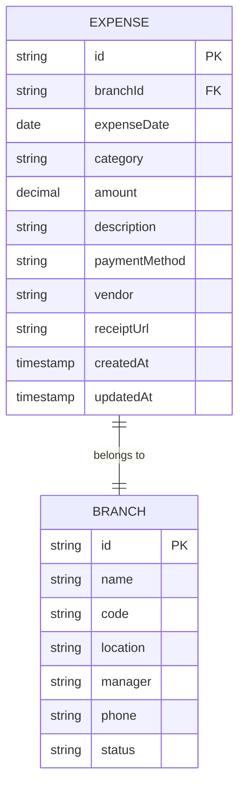

# Expense Model

<cite>
**Referenced Files in This Document**   
- [expense.repository.ts](file://repositories/expense.repository.ts)
- [expense.service.ts](file://services/expense.service.ts)
- [expense.types.ts](file://types/expense.types.ts)
- [seed.ts](file://prisma/seed.ts)
</cite>

## Table of Contents
1. [Introduction](#introduction)
2. [Field Definitions](#field-definitions)
3. [Data Relationships](#data-relationships)
4. [Indexes and Query Performance](#indexes-and-query-performance)
5. [Expense Reporting Capabilities](#expense-reporting-capabilities)
6. [Business Rules and Validation](#business-rules-and-validation)
7. [Receipt Management](#receipt-management)
8. [Conclusion](#conclusion)

## Introduction
The Expense model is designed to support comprehensive operational cost tracking across multiple branches of an organization. It captures detailed financial outflows including vendor information, payment methods, and categorized expenditures. The model enables granular reporting, budget analysis, and financial oversight through structured data fields, indexing strategies, and service-layer methods that facilitate common accounting workflows.

**Section sources**
- [expense.types.ts](file://types/expense.types.ts#L1-L76)
- [expense.repository.ts](file://repositories/expense.repository.ts#L1-L168)

## Field Definitions
The Expense entity includes the following core fields for complete cost tracking:

- **id**: Unique identifier for each expense record (string, primary key)
- **branchId**: Foreign key linking the expense to a specific branch (string, required)
- **expenseDate**: Date when the expense was incurred (Date, required)
- **category**: Classification of the expense using predefined types (string, required)
- **amount**: Monetary value of the expense with precision up to two decimal places (@db.Decimal(10,2), required)
- **description**: Optional textual explanation of the expense (string, optional)
- **paymentMethod**: Method used for payment (e.g., cash, credit card, bank transfer) (string, required)
- **vendor**: Name of the supplier or service provider (string, optional)
- **receiptUrl**: URL pointing to a digital copy of the receipt (string, optional)
- **createdAt** and **updatedAt**: Timestamps automatically managed by the system (Date)

The `amount` field uses Prisma's Decimal type to ensure precision in financial calculations and avoid floating-point errors.

**Section sources**
- [expense.types.ts](file://types/expense.types.ts#L35-L54)
- [expense.repository.ts](file://repositories/expense.repository.ts#L6-L12)

## Data Relationships
The Expense model maintains a critical relationship with the Branch entity via the `branchId` foreign key. This enables multi-branch financial tracking and reporting, allowing organizations to analyze spending patterns across different locations.

Each expense record includes full branch details through the Prisma `include` option, ensuring contextual data is available without additional queries. This relationship supports centralized financial oversight while preserving decentralized expense recording.



**Diagram sources**
- [expense.repository.ts](file://repositories/expense.repository.ts#L9-L11)
- [seed.ts](file://prisma/seed.ts#L9-L30)

## Indexes and Query Performance
To optimize financial reporting and analytical queries, the following indexes are implemented:

- **branchId**: Enables fast filtering of expenses by branch for location-specific reporting
- **category**: Supports efficient categorization and aggregation for budget vs actual analysis
- **expenseDate**: Facilitates time-based queries such as monthly or quarterly expense reports
- **createdAt**: Optimizes audit trails and recent activity monitoring

These indexes ensure high-performance queries even as the dataset grows, particularly for common operations like generating expense summaries, vendor analysis, and trend reporting.

**Section sources**
- [expense.repository.ts](file://repositories/expense.repository.ts#L82-L96)
- [expense.repository.ts](file://repositories/expense.repository.ts#L136-L149)

## Expense Reporting Capabilities
The system provides robust reporting functionality through dedicated service methods:

### Expense Reports by Category
The `getExpensesByCategory` method returns a breakdown of expenses grouped by category, including total amount, count, and percentage of total spending. This enables budget allocation analysis and cost optimization initiatives.

### Vendor Analysis
The `getExpensesByVendor` method aggregates expenses by vendor, sorted in descending order by total amount. This supports supplier negotiation strategies and vendor consolidation efforts.

### Budget vs Actual Comparisons
While not directly implemented in the current code, the data model and repository methods support budget vs actual comparisons through date-range filtering and category-based aggregation. These can be extended in the service layer to include budget thresholds and variance calculations.

```mermaid
flowchart TD
A["Generate Expense Report"] --> B{Report Type}
B --> |By Category| C[Call getExpensesByCategory]
B --> |By Vendor| D[Call getExpensesByVendor]
B --> |Summary| E[Call getSummary]
C --> F[Group by category]
D --> G[Group by vendor]
E --> H[Calculate total amount and count]
F --> I[Calculate percentages]
G --> J[Sort by total descending]
I --> K[Return ExpenseByCategoryReport[]]
J --> L[Return ExpenseByVendorReport[]]
H --> M[Return summary object]
```

**Diagram sources**
- [expense.service.ts](file://services/expense.service.ts#L49-L85)
- [expense.repository.ts](file://repositories/expense.repository.ts#L81-L133)

**Section sources**
- [expense.service.ts](file://services/expense.service.ts#L49-L85)
- [expense.types.ts](file://types/expense.types.ts#L22-L33)

## Business Rules and Validation
The system enforces several business rules to maintain data integrity:

- **Positive Amount Validation**: All expense amounts must be greater than zero. This is enforced in the `createExpense` and `updateExpense` methods in the service layer.
- **Required Fields**: Critical fields such as `branchId`, `expenseDate`, `category`, `amount`, and `paymentMethod` are required for all expense records.
- **Category Standardization**: The `ExpenseCategories` constant defines a fixed set of allowed categories, ensuring consistency in expense classification and reporting.

These rules prevent invalid data entry and ensure the reliability of financial reports generated from the system.

**Section sources**
- [expense.service.ts](file://services/expense.service.ts#L13-L15)
- [expense.types.ts](file://types/expense.types.ts#L65-L73)

## Receipt Management
The `receiptUrl` field supports digital receipt management, enabling:

- Audit trail verification
- Tax compliance documentation
- Dispute resolution with vendors
- Digital archiving of financial documents

While the current implementation stores URLs, this could be extended with file upload functionality and access controls to ensure secure handling of sensitive financial documents.

**Section sources**
- [expense.types.ts](file://types/expense.types.ts#L43)
- [expense.repository.ts](file://repositories/expense.repository.ts#L25)

## Conclusion
The Expense model provides a comprehensive foundation for operational cost tracking with robust support for multi-branch financial management, detailed reporting, and data integrity. Its well-structured schema, strategic indexing, and service-layer methods enable efficient expense management workflows while supporting advanced financial analysis and compliance requirements.