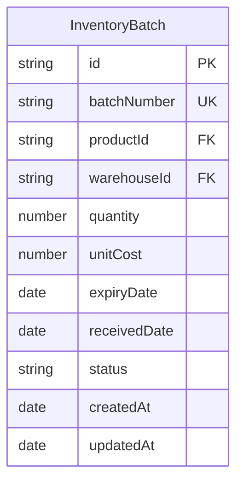
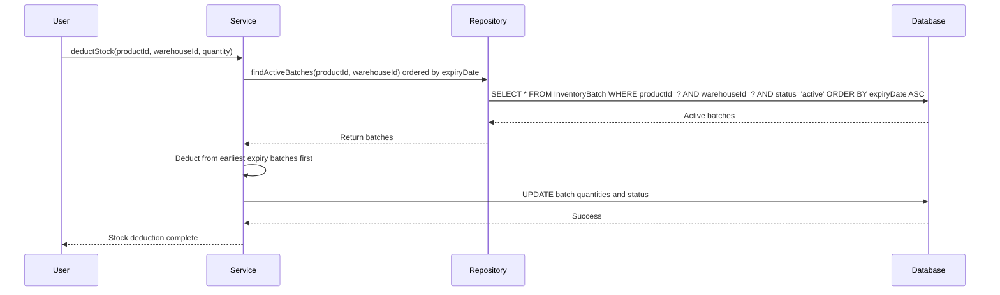
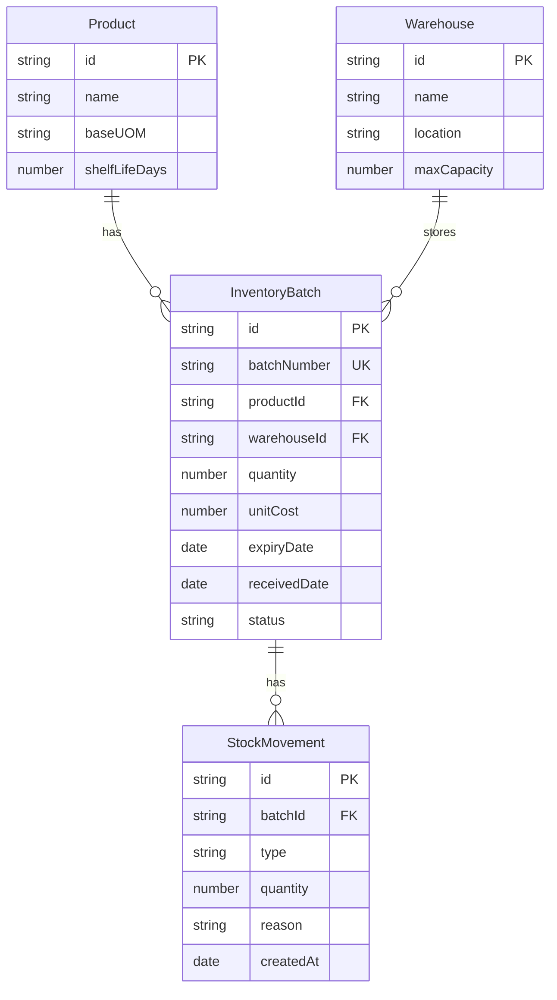
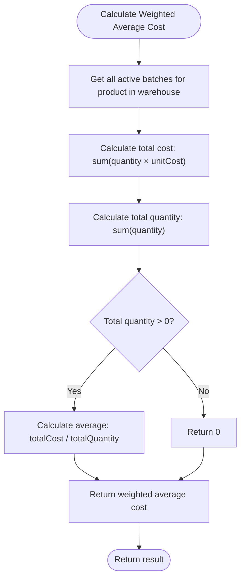
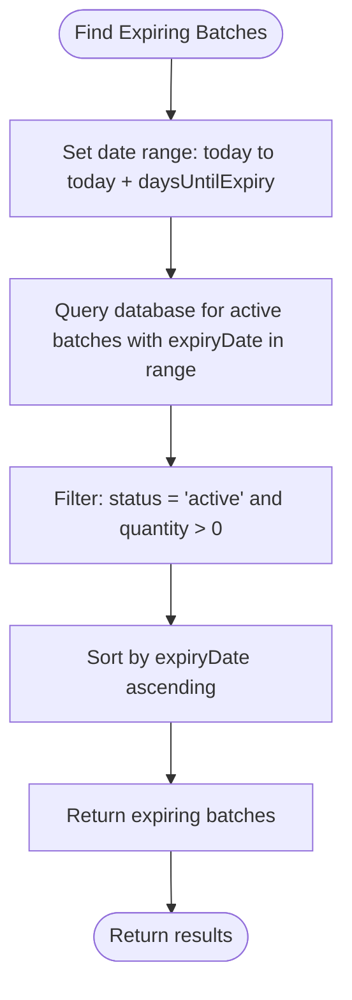
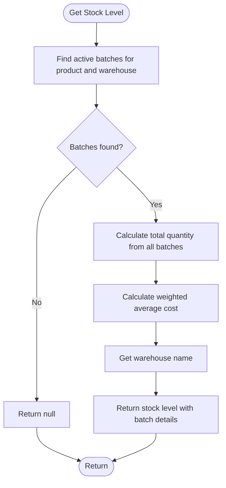
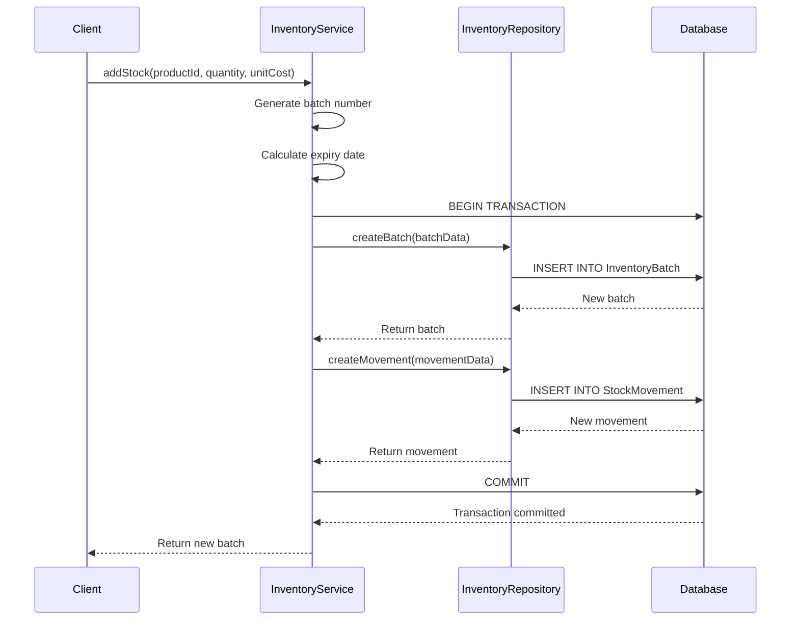

# Inventory Batch Model

<cite>
**Referenced Files in This Document**   
- [inventory.service.ts](file://services/inventory.service.ts)
- [inventory.repository.ts](file://repositories/inventory.repository.ts)
- [inventory.types.ts](file://types/inventory.types.ts)
- [migration.sql](file://prisma/migrations/20251113094445_init/migration.sql)
- [add-stock/route.ts](file://app/api/inventory/add-stock/route.ts)
</cite>

## Table of Contents
1. [Introduction](#introduction)
2. [Field Definitions](#field-definitions)
3. [Batch Tracking Significance](#batch-tracking-significance)
4. [Database Indexes](#database-indexes)
5. [Entity Relationships](#entity-relationships)
6. [Query Examples](#query-examples)
7. [Inventory Service Logic](#inventory-service-logic)
8. [Business Rules](#business-rules)

## Introduction
The InventoryBatch entity provides a comprehensive solution for batch-level inventory tracking with average costing. This model enables precise inventory management by tracking individual batches of products through their lifecycle, from receipt to expiration. The system supports critical business operations including FIFO (First-In-First-Out) inventory management, expiration date monitoring, and accurate cost accounting. The implementation combines database-level constraints with application-level business logic to ensure data integrity and operational efficiency across multiple warehouses.

**Section sources**
- [inventory.service.ts](file://services/inventory.service.ts#L1-L504)
- [migration.sql](file://prisma/migrations/20251113094445_init/migration.sql#L60-L75)

## Field Definitions
The InventoryBatch entity contains the following fields that enable comprehensive batch tracking and cost management:

- **id**: Unique identifier for the inventory batch (Primary Key)
- **batchNumber**: Unique batch identifier in format BATCH-YYYYMMDD-XXXX with @unique constraint
- **productId**: Reference to the Product entity being tracked in this batch
- **warehouseId**: Reference to the Warehouse where this batch is stored
- **quantity**: Current stock quantity stored as decimal with precision (10,2)
- **unitCost**: Cost per unit in local currency stored as decimal with precision (10,2)
- **expiryDate**: Date when the batch expires, critical for perishable goods management
- **receivedDate**: Date when the batch was received into inventory
- **status**: Current status of the batch with possible values: 'active', 'expired', or 'depleted'



**Diagram sources**
- [migration.sql](file://prisma/migrations/20251113094445_init/migration.sql#L60-L75)

**Section sources**
- [migration.sql](file://prisma/migrations/20251113094445_init/migration.sql#L60-L75)
- [inventory.types.ts](file://types/inventory.types.ts#L2-L2)

## Batch Tracking Significance
Batch tracking is essential for effective inventory management, particularly for businesses dealing with perishable goods or products with regulatory requirements. The system implements two critical inventory management methodologies:

**FIFO (First-In-First-Out) Management**: When deducting stock, the system automatically selects batches with the earliest expiry dates first. This ensures older inventory is consumed before newer stock, minimizing waste and spoilage. The inventory service implements this logic by retrieving active batches ordered by expiry date when processing stock deductions.

**Expiration Date Monitoring**: Each batch tracks its expiry date, which is calculated based on the product's shelf life days when the batch is created. The system can identify batches that are expired or nearing expiration, enabling proactive inventory management. This is particularly important for food, pharmaceuticals, and other time-sensitive products.



**Diagram sources**
- [inventory.service.ts](file://services/inventory.service.ts#L184-L257)
- [inventory.repository.ts](file://repositories/inventory.repository.ts#L96-L109)

**Section sources**
- [inventory.service.ts](file://services/inventory.service.ts#L184-L257)
- [inventory.repository.ts](file://repositories/inventory.repository.ts#L96-L109)

## Database Indexes
The database schema includes optimized indexes to ensure efficient querying across common access patterns:

- **Composite index on (productId, warehouseId)**: Optimizes queries that retrieve all batches for a specific product in a specific warehouse, which is common when checking stock levels or processing orders.
- **Index on expiryDate**: Enables efficient retrieval of batches sorted by expiration date, critical for FIFO operations and identifying products nearing expiration.
- **Index on status**: Optimizes queries that filter batches by their current status (active, expired, depleted), commonly used in inventory reports and alerts.
- **Unique index on batchNumber**: Enforces the uniqueness constraint on batch numbers and optimizes lookups by batch number.

These indexes support the application's performance requirements, ensuring that inventory operations remain responsive even as the dataset grows.

```mermaid
erDiagram
InventoryBatch {
string id PK
string batchNumber UK
string productId FK
string warehouseId FK
number quantity
number unitCost
date expiryDate
date receivedDate
string status
}
index "IX_Product_Warehouse" on InventoryBatch(productId, warehouseId)
index "IX_ExpiryDate" on InventoryBatch(expiryDate)
index "IX_Status" on InventoryBatch(status)
index "IX_BatchNumber" on InventoryBatch(batchNumber)
```

**Diagram sources**
- [migration.sql](file://prisma/migrations/20251113094445_init/migration.sql#L310-L322)

**Section sources**
- [migration.sql](file://prisma/migrations/20251113094445_init/migration.sql#L310-L322)

## Entity Relationships
The InventoryBatch entity maintains critical relationships with other core entities in the inventory management system:

- **Product**: Each batch is associated with a specific product, establishing what item is being tracked. This relationship enables product-level inventory aggregation and reporting.
- **Warehouse**: Each batch is stored in a specific warehouse, allowing for multi-location inventory management and stock level monitoring across different facilities.
- **StockMovement**: Each batch has a history of stock movements (additions, deductions, transfers) that track all changes to its quantity over time.

These relationships enable comprehensive inventory tracking, cost accounting, and reporting capabilities across the entire supply chain.



**Diagram sources**
- [migration.sql](file://prisma/migrations/20251113094445_init/migration.sql#L469-L475)
- [inventory.types.ts](file://types/inventory.types.ts#L83-L95)

**Section sources**
- [migration.sql](file://prisma/migrations/20251113094445_init/migration.sql#L469-L475)
- [inventory.types.ts](file://types/inventory.types.ts#L83-L95)

## Query Examples
The system provides several key queries for inventory management and reporting:

**Weighted Average Cost Calculation**: Calculates the average cost of a product in a warehouse by considering all active batches.



**Finding Batches Nearing Expiration**: Retrieves batches that will expire within a specified number of days.



**Checking Stock Levels Across Warehouses**: Retrieves current stock levels for a product across all warehouses or a specific warehouse.



**Diagram sources**
- [inventory.service.ts](file://services/inventory.service.ts#L49-L70)
- [inventory.service.ts](file://services/inventory.service.ts#L490-L492)
- [inventory.service.ts](file://services/inventory.service.ts#L412-L455)

**Section sources**
- [inventory.service.ts](file://services/inventory.service.ts#L49-L70)
- [inventory.service.ts](file://services/inventory.service.ts#L490-L492)
- [inventory.service.ts](file://services/inventory.service.ts#L412-L455)

## Inventory Service Logic
The inventory service implements critical business logic for cost calculation and stock management:

**Cost Calculation**: The `calculateWeightedAverageCost` method computes the weighted average cost for a product in a warehouse using the formula: (sum of quantity × unitCost) / (sum of quantity). This ensures accurate cost accounting for financial reporting and pricing decisions.

**Stock Deduction with FIFO**: When deducting stock, the system follows FIFO principles by first consuming batches with the earliest expiry dates. The `deductStock` method processes deductions by iterating through active batches in expiry date order, deducting from each batch until the required quantity is fulfilled.

**Batch Creation**: When adding stock, the system automatically generates a unique batch number in the format BATCH-YYYYMMDD-XXXX and calculates the expiry date based on the product's shelf life days. All operations are performed within database transactions to ensure data consistency.



**Diagram sources**
- [inventory.service.ts](file://services/inventory.service.ts#L114-L179)
- [add-stock/route.ts](file://app/api/inventory/add-stock/route.ts#L1-L28)

**Section sources**
- [inventory.service.ts](file://services/inventory.service.ts#L49-L70)
- [inventory.service.ts](file://services/inventory.service.ts#L114-L179)
- [inventory.service.ts](file://services/inventory.service.ts#L184-L257)

## Business Rules
The system enforces several critical business rules for batch management and cost accounting:

**Batch Status Management**: Batches have three possible statuses:
- **active**: The batch has available stock and can be used for sales or transfers
- **expired**: The batch has passed its expiry date and should not be used
- **depleted**: The batch has been fully consumed and has zero quantity

When a batch's quantity reaches zero during a deduction, its status automatically changes to 'depleted'. The system periodically checks for expired batches and updates their status accordingly.

**Cost Accounting**: The system uses weighted average costing for inventory valuation. When transferring stock between warehouses, the destination batch is created with the weighted average cost from the source warehouse, ensuring consistent cost accounting across locations.

**Data Integrity**: The system enforces data integrity through database constraints (unique batch numbers, foreign key relationships) and application-level validation (positive quantities, valid dates). All inventory operations are performed within database transactions to prevent partial updates and maintain consistency.

**Section sources**
- [inventory.service.ts](file://services/inventory.service.ts#L468-L486)
- [inventory.service.ts](file://services/inventory.service.ts#L50-L70)
- [inventory.service.ts](file://services/inventory.service.ts#L260-L382)