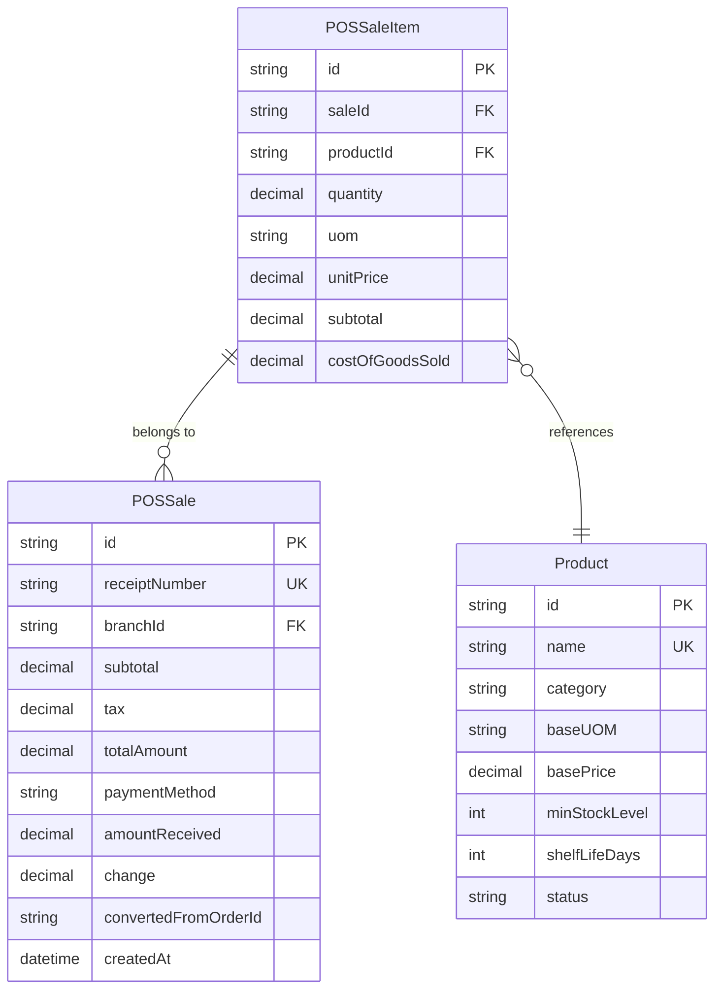
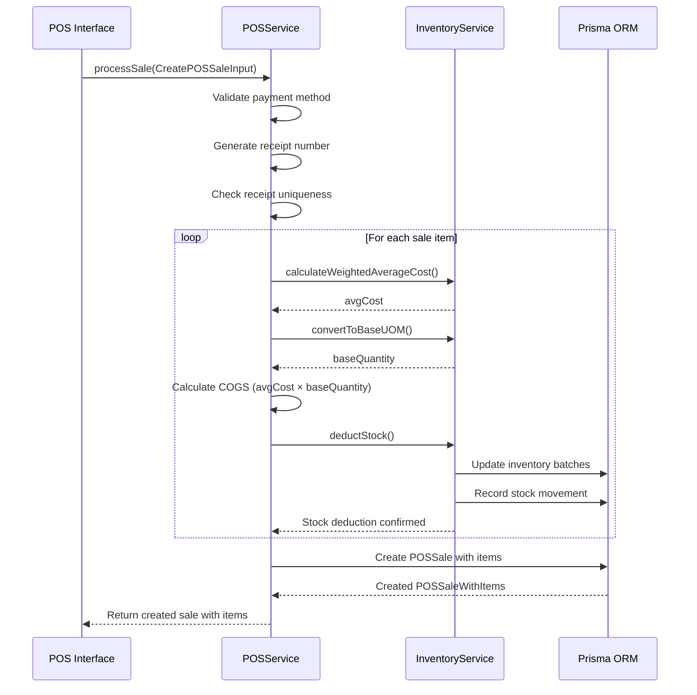

# POS Sale Item Model

<cite>
**Referenced Files in This Document**   
- [pos.types.ts](file://types/pos.types.ts)
- [pos.service.ts](file://services/pos.service.ts)
- [pos.repository.ts](file://repositories/pos.repository.ts)
- [design.md](file://specs/inventory-pro-system/design.md)
- [migration.sql](file://prisma/migrations/20251113094445_init/migration.sql)
- [report.service.ts](file://services/report.service.ts)
</cite>

## Table of Contents
1. [Introduction](#introduction)
2. [Field Definitions](#field-definitions)
3. [Cost of Goods Sold and Gross Profit](#cost-of-goods-sold-and-gross-profit)
4. [Database Indexes](#database-indexes)
5. [Entity Relationships](#entity-relationships)
6. [Data Model Diagram](#data-model-diagram)
7. [POS Sale Processing Flow](#pos-sale-processing-flow)
8. [Query Examples](#query-examples)
9. [Business Rules](#business-rules)
10. [Conclusion](#conclusion)

## Introduction
The POSSaleItem entity represents individual line items within a Point of Sale (POS) transaction, capturing detailed information about each product sold. This model is a critical component of the inventory and financial tracking system, enabling accurate revenue recognition, cost accounting, and inventory management. The entity is designed to support comprehensive reporting capabilities including sales analysis, margin calculations, and inventory impact tracking. This documentation provides a detailed overview of the POSSaleItem data model, its relationships, business logic, and usage patterns within the POS system.

**Section sources**
- [design.md](file://specs/inventory-pro-system/design.md#L353-L365)

## Field Definitions
The POSSaleItem entity contains the following fields that capture essential transaction details:

- **id**: Unique identifier for the sale item (Primary Key)
- **saleId**: Foreign key reference to the parent POSSale transaction
- **productId**: Reference to the Product being sold
- **quantity**: Quantity of the product sold, stored as a decimal with precision (10,2) to support fractional units
- **uom**: Unit of measure used for the transaction (e.g., "bottle", "box", "kg")
- **unitPrice**: Price per unit at the time of sale, stored as decimal (10,2)
- **subtotal**: Total amount for this item (quantity × unitPrice), stored as decimal (10,2)
- **costOfGoodsSold**: Calculated cost of the goods sold, stored as decimal (10,2) using weighted average costing method

All monetary fields use the @db.Decimal(10,2) annotation to ensure precise financial calculations and prevent floating-point arithmetic errors. The quantity field also uses decimal precision to accommodate products sold in fractional amounts (e.g., weight-based items).

**Section sources**
- [design.md](file://specs/inventory-pro-system/design.md#L353-L365)
- [pos.types.ts](file://types/pos.types.ts#L5-L11)

## Cost of Goods Sold and Gross Profit
The costOfGoodsSold field is a critical financial metric that enables gross profit calculation at the transaction level. This value is automatically calculated by the POS service during sale processing using the weighted average costing method. The calculation process converts the sold quantity to the product's base unit of measure, then multiplies the base quantity by the current weighted average cost of the inventory.

Gross profit for each sale item is derived by subtracting the costOfGoodsSold from the subtotal. At the transaction level, total gross profit is the sum of individual item profits. This enables detailed margin analysis and profitability reporting. The system ensures cost accounting accuracy by calculating COGS at the time of sale rather than relying on potentially outdated cost information.

The weighted average cost is calculated across all active inventory batches for a product in a specific warehouse, providing a more accurate representation of inventory value compared to methods like FIFO or LIFO in environments with frequent price fluctuations.

**Section sources**
- [pos.service.ts](file://services/pos.service.ts#L164-L178)
- [inventory.service.ts](file://services/inventory.service.ts#L20-L50)

## Database Indexes
To ensure optimal query performance, the POSSaleItem table includes strategic database indexes on frequently queried fields:

- **saleId_idx**: Index on the saleId foreign key to enable fast retrieval of all items for a specific sale
- **productId_idx**: Index on the productId field to support efficient product-centric queries such as best seller reports

These indexes are critical for maintaining system performance, especially as the transaction volume grows. The saleId index supports the common use case of retrieving complete sale details with all line items, while the productId index enables efficient aggregation of sales data by product for reporting and analysis purposes.

**Section sources**
- [migration.sql](file://prisma/migrations/20251113094445_init/migration.sql#L408-L411)

## Entity Relationships
The POSSaleItem entity participates in several important relationships within the data model:

- **POSSale (Parent)**: One-to-many relationship where each POSSale can have multiple POSSaleItem records. This relationship includes cascade delete behavior, ensuring that when a sale is deleted, all associated sale items are automatically removed.
- **Product (Reference)**: Each sale item references a specific Product, establishing the connection between the transaction and the inventory item being sold.

These relationships maintain data integrity and enable rich data retrieval patterns. The cascade delete on the POSSale relationship ensures referential integrity while simplifying data management operations.

**Section sources**
- [design.md](file://specs/inventory-pro-system/design.md#L363-L364)

## Data Model Diagram

**Diagram sources**
- [design.md](file://specs/inventory-pro-system/design.md#L353-L365)
- [migration.sql](file://prisma/migrations/20251113094445_init/migration.sql#L188-L198)

## POS Sale Processing Flow

**Diagram sources**
- [pos.service.ts](file://services/pos.service.ts#L127-L208)
- [inventory.service.ts](file://services/inventory.service.ts#L16-L500)

## Query Examples
The POSSaleItem model supports various analytical queries for business intelligence:

**Best Seller Reports**: Aggregate sales by product to identify top-performing items, using the productId index for efficient grouping and sorting by revenue or quantity sold.

**Margin Analysis**: Calculate profitability by comparing subtotal (revenue) against costOfGoodsSold for each item, then aggregating to product or category level to identify high-margin products.

**Inventory Impact Tracking**: Analyze the relationship between sales volume and inventory depletion by joining POSSaleItem with inventory movement records, enabling forecasting of restocking needs based on sales trends.

These queries leverage the indexed fields and the comprehensive data captured in each sale item to provide actionable business insights.

**Section sources**
- [report.service.ts](file://services/report.service.ts#L194-L231)

## Business Rules
The system enforces several critical business rules to ensure pricing integrity and cost accounting accuracy:

- **Pricing Integrity**: Unit prices are validated against the product's current pricing configuration to prevent unauthorized discounts or pricing errors.
- **Cost Accounting Accuracy**: COGS is calculated at the time of sale using the current weighted average cost, ensuring accurate margin calculations even when purchase costs fluctuate.
- **Inventory Synchronization**: Stock deduction occurs within the same database transaction as sale creation, maintaining consistency between sales records and inventory levels.
- **Decimal Precision**: All monetary and quantity calculations use decimal arithmetic with defined precision to prevent rounding errors in financial calculations.

These rules are implemented in the service layer to ensure consistent enforcement regardless of the application interface.

**Section sources**
- [pos.service.ts](file://services/pos.service.ts#L127-L208)
- [inventory.service.ts](file://services/inventory.service.ts#L16-L500)

## Conclusion
The POSSaleItem entity serves as a fundamental component of the POS system, capturing detailed transaction data that enables comprehensive financial reporting, inventory management, and business analysis. By storing both revenue (subtotal) and cost (costOfGoodsSold) information at the line item level, the model facilitates accurate gross profit calculation and margin analysis. The integration with inventory management through automated stock deduction and weighted average costing ensures data consistency across financial and operational systems. Strategic indexing supports efficient querying for reporting purposes, while well-defined relationships maintain data integrity throughout the application.