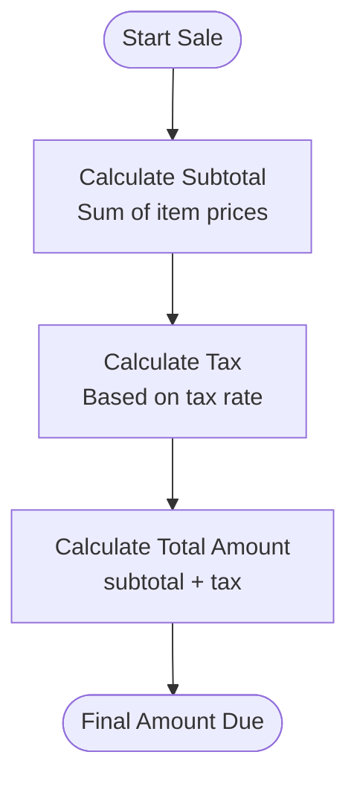
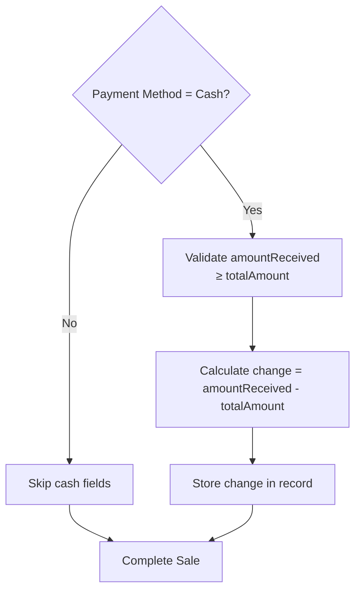
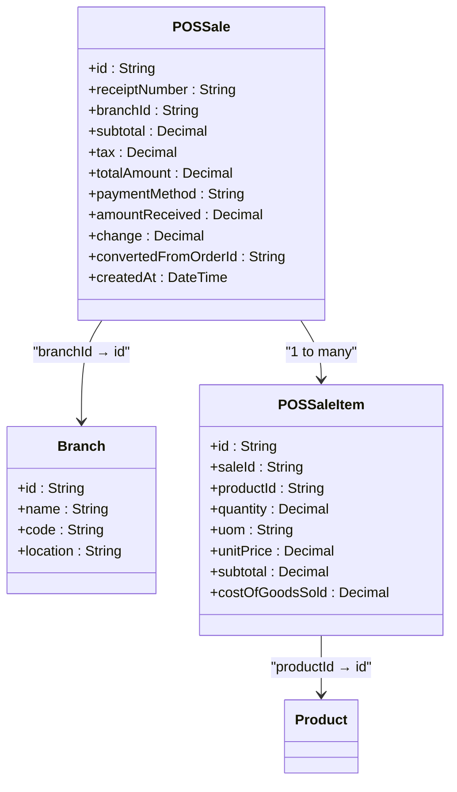
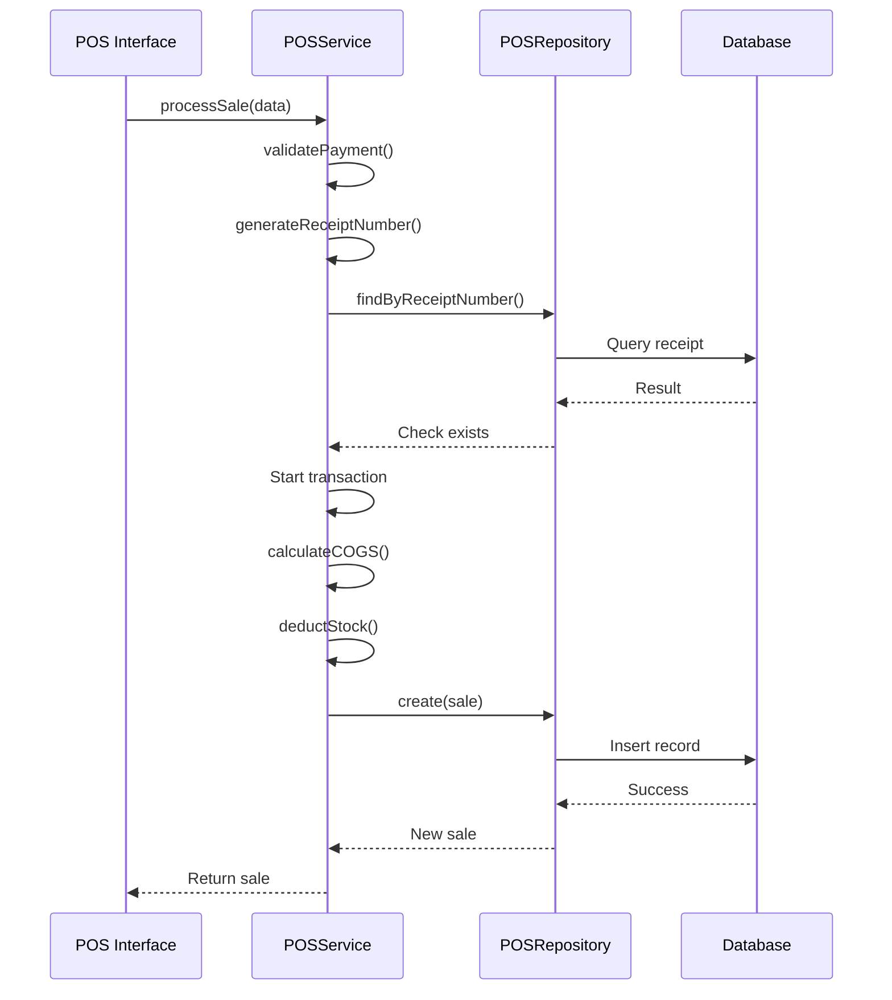

# POS Sale Model

<cite>
**Referenced Files in This Document**   
- [schema.prisma](file://prisma/schema.prisma#L257-L280)
- [pos.service.ts](file://services/pos.service.ts#L16-L213)
- [pos.repository.ts](file://repositories/pos.repository.ts#L10-L184)
- [pos.types.ts](file://types/pos.types.ts#L1-L90)
- [route.ts](file://app/api/pos/sales/route.ts#L1-L75)
</cite>

## Table of Contents
1. [Introduction](#introduction)
2. [Field Definitions](#field-definitions)
3. [Financial Components](#financial-components)
4. [Cash Handling Fields](#cash-handling-fields)
5. [Indexes and Query Performance](#indexes-and-query-performance)
6. [Relationships](#relationships)
7. [Query Examples](#query-examples)
8. [Business Rules](#business-rules)
9. [Data Flow and Transaction Handling](#data-flow-and-transaction-handling)

## Introduction
The POSSale entity represents point-of-sale transactions in the inventory management system. It captures complete sales data including financial details, payment information, and links to sold items. The model supports both standalone POS transactions and conversions from sales orders, enabling integrated retail and order fulfillment workflows.

**Section sources**
- [schema.prisma](file://prisma/schema.prisma#L257-L280)

## Field Definitions
The POSSale model contains the following fields:

| Field | Type | Constraints | Description |
|-------|------|-------------|-------------|
| id | String | @id @default(uuid()) | Unique identifier for the sale |
| receiptNumber | String | @unique | Unique receipt number in format RCP-YYYYMMDD-XXXX |
| branchId | String | | Reference to the branch where sale occurred |
| subtotal | Decimal | @db.Decimal(10,2) | Sum of item prices before tax |
| tax | Decimal | @db.Decimal(10,2) | Tax amount applied to the sale |
| totalAmount | Decimal | @db.Decimal(10,2) | Final amount due (subtotal + tax) |
| paymentMethod | String | | Method used for payment |
| amountReceived | Decimal? | @db.Decimal(10,2) | Amount tendered by customer (required for cash) |
| change | Decimal? | @db.Decimal(10,2) | Change returned to customer |
| convertedFromOrderId | String? | | Reference to source sales order if converted |
| createdAt | DateTime | @default(now()) | Timestamp of sale creation |

**Section sources**
- [schema.prisma](file://prisma/schema.prisma#L259-L269)

## Financial Components
The financial components of a POSSale represent the core monetary calculations:

- **subtotal**: The sum of all item subtotals before tax application
- **tax**: The calculated tax amount based on applicable rates
- **totalAmount**: The final amount due, calculated as subtotal + tax

These fields use the @db.Decimal(10,2) precision to ensure accurate financial calculations with two decimal places for currency representation.



**Diagram sources**
- [schema.prisma](file://prisma/schema.prisma#L262-L264)
- [pos.service.ts](file://services/pos.service.ts#L127-L209)

## Cash Handling Fields
The cash handling fields manage physical payment transactions:

- **amountReceived**: The actual amount tendered by the customer, required when paymentMethod is 'cash'
- **change**: The difference between amountReceived and totalAmount, automatically calculated for cash transactions

The system validates that amountReceived is sufficient and calculates change when processing cash payments.



**Diagram sources**
- [pos.service.ts](file://services/pos.service.ts#L128-L144)
- [pos.types.ts](file://types/pos.types.ts#L22-L23)

## Indexes and Query Performance
The POSSale model includes several indexes to optimize reporting and reconciliation queries:

```mermaid
erDiagram
POSSale {
string id PK
string receiptNumber UK
string branchId FK
decimal subtotal
decimal tax
decimal totalAmount
string paymentMethod
decimal amountReceived
decimal change
string convertedFromOrderId FK
datetime createdAt
}
POSSale ||--o{ Branch : "branchId → id"
POSSale }o--|| POSSaleItem : "id → saleId"
index "branchId" [branchId]
index "receiptNumber" [receiptNumber]
index "createdAt" [createdAt]
index "paymentMethod" [paymentMethod]
index "branchId_createdAt" [branchId, createdAt]
index "branchId_paymentMethod" [branchId, paymentMethod]
```

**Diagram sources**
- [schema.prisma](file://prisma/schema.prisma#L274-L280)

**Section sources**
- [schema.prisma](file://prisma/schema.prisma#L274-L280)

## Relationships
The POSSale entity has the following relationships:



**Diagram sources**
- [schema.prisma](file://prisma/schema.prisma#L271-L272)
- [schema.prisma](file://prisma/schema.prisma#L283-L297)

**Section sources**
- [schema.prisma](file://prisma/schema.prisma#L271-L272)

## Query Examples
### Daily Sales Summary
```typescript
// GET /api/pos/sales?branchId={id}&startDate={today}&endDate={tomorrow}
const filters = {
  branchId: "branch-123",
  startDate: new Date("2025-01-01"),
  endDate: new Date("2025-01-02")
};
const sales = await posService.getAllSales(filters);
```

### Payment Method Analysis
```typescript
// GET /api/pos/sales?paymentMethod=cash
const filters = { paymentMethod: "cash" };
const cashSales = await posService.getAllSales(filters);
```

### Receipt Lookup
```typescript
// GET /api/pos/sales?search=RCP-20250101-0001
const filters = { search: "RCP-20250101-0001" };
const sale = await posService.getAllSales(filters);
```

**Section sources**
- [route.ts](file://app/api/pos/sales/route.ts#L7-L45)
- [pos.repository.ts](file://repositories/pos.repository.ts#L11-L50)

## Business Rules
### Receipt Numbering
- Format: RCP-YYYYMMDD-XXXX (e.g., RCP-20250101-0001)
- Sequential numbering per day
- Unique constraint enforced at database level
- Auto-generated if not provided

### Cash Balancing
- amountReceived must be provided for cash payments
- amountReceived must be ≥ totalAmount
- change is automatically calculated as amountReceived - totalAmount

### Order Conversion
- Sales can be created from existing sales orders
- convertedFromOrderId links to the source order
- Source order status is updated when converted



**Diagram sources**
- [pos.service.ts](file://services/pos.service.ts#L127-L209)
- [pos.repository.ts](file://repositories/pos.repository.ts#L73-L98)

**Section sources**
- [pos.service.ts](file://services/pos.service.ts#L20-L49)
- [pos.service.ts](file://services/pos.service.ts#L128-L144)

## Data Flow and Transaction Handling
The POS sale creation process follows a transactional workflow that ensures data consistency across sales, inventory, and financial records. When a sale is processed, the system validates payment information, generates a unique receipt number, calculates COGS, deducts inventory using FIFO methodology, and creates the sale record in a single database transaction.

**Section sources**
- [pos.service.ts](file://services/pos.service.ts#L127-L209)
- [pos.repository.ts](file://repositories/pos.repository.ts#L73-L98)