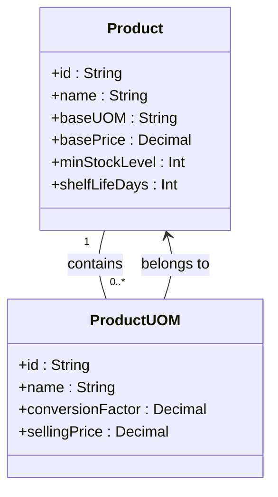
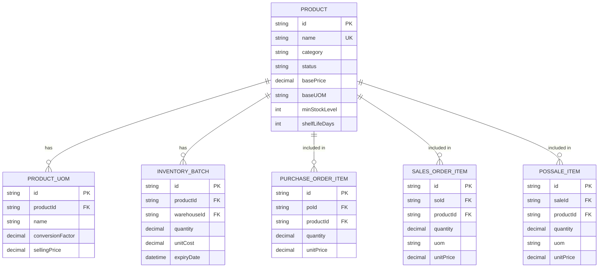
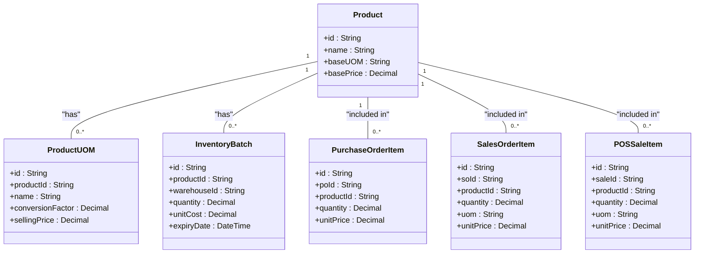

# Product Model

<cite>
**Referenced Files in This Document**   
- [product.validation.ts](file://lib/validations/product.validation.ts)
- [schema.prisma](file://prisma/schema.prisma)
- [product.repository.ts](file://repositories/product.repository.ts)
- [product.service.ts](file://services/product.service.ts)
- [product.types.ts](file://types/product.types.ts)
</cite>

## Table of Contents
1. [Introduction](#introduction)
2. [Field Definitions](#field-definitions)
3. [Base UOM and Multi-UOM System](#base-uom-and-multi-uom-system)
4. [Stock Management and Alerts](#stock-management-and-alerts)
5. [Indexes and Query Optimization](#indexes-and-query-optimization)
6. [Entity Relationships](#entity-relationships)
7. [Validation Rules](#validation-rules)
8. [Business Rules](#business-rules)
9. [Complex Queries](#complex-queries)
10. [Conclusion](#conclusion)

## Introduction
The Product entity serves as the central model for inventory item management in the system, providing comprehensive support for product catalog management, multi-unit of measure (UOM) pricing, and inventory tracking. This documentation details the complete data model for products, including field definitions, relationships, validation rules, and business logic. The model supports a sophisticated inventory system with features like low stock alerts, expiration tracking, and multi-UOM pricing strategies. The Product entity is integrated with various system components including purchase orders, sales orders, POS transactions, and inventory management, making it a critical component of the overall inventory management system.

## Field Definitions
The Product entity contains comprehensive information about inventory items, with each field serving a specific purpose in inventory management and business operations.

| Field | Data Type | Constraints | Description |
|-------|---------|-----------|-------------|
| id | String | @id @default(uuid()) | Unique identifier for the product |
| name | String | @unique | Product name with uniqueness constraint |
| description | String? | Optional | Detailed product description |
| category | String | Enum: Carbonated, Juices, Energy Drinks, Water, Other | Product category classification |
| imageUrl | String? | Optional | URL or path to product image |
| basePrice | Decimal | @db.Decimal(10, 2) | Base selling price in base UOM |
| baseUOM | String | Required | Base unit of measure (e.g., bottle, can) |
| minStockLevel | Int | Positive integer | Minimum stock threshold for alerts |
| shelfLifeDays | Int | Positive integer | Product shelf life in days |
| status | String | @default("active") | Product status (active/inactive) |
| createdAt | DateTime | @default(now()) | Creation timestamp |
| updatedAt | DateTime | @updatedAt | Last update timestamp |

**Section sources**
- [schema.prisma](file://prisma/schema.prisma#L38-L60)
- [product.types.ts](file://types/product.types.ts#L13-L23)

## Base UOM and Multi-UOM System
The Product entity implements a sophisticated multi-unit of measure (UOM) system that allows products to be sold in different packaging configurations while maintaining accurate inventory tracking. The baseUOM field represents the fundamental unit of measure for the product, which serves as the foundation for all inventory calculations and cost accounting. This base unit is used for inventory tracking, cost calculations, and batch management, ensuring consistency across the system.

The multi-UOM system enables products to be sold in various configurations such as individual units, packs, or cartons, each with their own pricing and conversion factors. For example, a beverage product with a baseUOM of "bottle" can have alternate UOMs like "pack" (6 bottles) or "carton" (24 bottles). Each alternate UOM includes a conversion factor that defines how many base units it contains and a specific selling price. This allows for volume pricing strategies while maintaining accurate inventory tracking in the base unit.

The system ensures data integrity by validating that alternate UOM names do not conflict with the base UOM and that all alternate UOM names are unique within a product. When transactions occur using alternate UOMs, the system automatically converts quantities to the base UOM for inventory deduction and cost accounting purposes, maintaining accurate stock levels and cost calculations.

**Diagram sources**
- [schema.prisma](file://prisma/schema.prisma#L38-L75)
- [product.validation.ts](file://lib/validations/product.validation.ts#L3-L7)

**Section sources**
- [product.validation.ts](file://lib/validations/product.validation.ts#L3-L7)
- [product.service.ts](file://services/product.service.ts#L149-L164)

## Stock Management and Alerts
The Product entity includes comprehensive stock management features centered around the minStockLevel and shelfLifeDays fields. The minStockLevel field defines the minimum inventory threshold for a product, triggering low stock alerts when current inventory falls below this level. This proactive alert system helps prevent stockouts and ensures timely reordering of popular items.

The shelfLifeDays field implements expiration tracking for perishable products, enabling the system to identify items nearing expiration. This information is used to generate expiration alerts and support FIFO (First-In, First-Out) inventory management practices. The system automatically monitors batch expiration dates and can flag products that are approaching their expiration date, typically within a configurable window (e.g., 30 days).

Low stock alerts are generated when the total quantity of a product across all active batches in a warehouse falls below the minStockLevel. These alerts are visible in the inventory dashboard and can trigger automated notifications to purchasing staff. The system also considers product status when managing stock alerts, as inactive products are excluded from active inventory calculations and alert generation.

**Section sources**
- [product.service.ts](file://services/product.service.ts#L149-L188)
- [inventory.service.ts](file://services/inventory.service.ts#L488-L492)
- [schema.prisma](file://prisma/schema.prisma#L46-L47)

## Indexes and Query Optimization
The Product entity is optimized for efficient querying through strategic indexing on key fields that are commonly used in search and filtering operations. Three primary indexes have been implemented to enhance query performance: an index on the status field, an index on the category field, and an index on the name field.

The status index supports efficient filtering of active versus inactive products, which is a common operation in the user interface and business logic. This index enables rapid retrieval of active products for display in sales interfaces and inventory management screens. The category index facilitates quick filtering and reporting by product category, supporting business intelligence and inventory analysis by category.

The name index is particularly important for user experience, enabling fast search-as-you-type functionality in product selection interfaces. This index supports case-insensitive partial matching, allowing users to quickly locate products by name without needing to remember exact spellings. These indexes work together to ensure responsive performance even as the product catalog grows in size, supporting efficient data retrieval for both user-facing interfaces and backend reporting functions.

**Diagram sources**
- [schema.prisma](file://prisma/schema.prisma#L58-L60)
- [product.repository.ts](file://repositories/product.repository.ts#L7-L30)

**Section sources**
- [schema.prisma](file://prisma/schema.prisma#L58-L60)
- [product.repository.ts](file://repositories/product.repository.ts#L7-L30)

## Entity Relationships
The Product entity serves as a central hub in the inventory management system, establishing critical relationships with multiple other entities to support comprehensive inventory tracking and business operations. The primary relationships include connections to ProductUOM (for multi-UOM pricing), InventoryBatch (for stock tracking), and various order entities (PurchaseOrderItem, SalesOrderItem, POSSaleItem) for transaction history.

The one-to-many relationship with ProductUOM enables the multi-UOM pricing system, allowing each product to have multiple selling configurations with different packaging and pricing. The relationship with InventoryBatch supports detailed stock tracking, with each batch containing specific quantities, costs, and expiration dates. This relationship enables precise inventory management, cost accounting, and expiration tracking.

The relationships with order entities create a complete transaction history for each product, linking it to purchase orders (incoming stock), sales orders (committed sales), and POS sales (completed transactions). These relationships support inventory valuation, sales reporting, and supply chain analysis. The system maintains referential integrity through cascade deletion rules, ensuring data consistency when products are deactivated or removed from the catalog.

**Diagram sources**
- [schema.prisma](file://prisma/schema.prisma#L52-L56)
- [product.types.ts](file://types/product.types.ts#L39-L41)

**Section sources**
- [schema.prisma](file://prisma/schema.prisma#L52-L56)
- [product.types.ts](file://types/product.types.ts#L39-L41)

## Validation Rules
The Product entity enforces comprehensive validation rules through the Zod validation schema defined in product.validation.ts. These rules ensure data integrity and consistency across the system, preventing invalid or incomplete product data from being saved. The validation schema covers all required fields, data types, and business constraints.

Key validation rules include mandatory fields such as name, basePrice, baseUOM, minStockLevel, and shelfLifeDays, all of which must have valid values. The name field requires a minimum length of 1 character and a maximum of 100 characters, with a uniqueness constraint enforced at the database level. Numeric fields like basePrice, minStockLevel, and shelfLifeDays must be positive values, with minStockLevel and shelfLifeDays restricted to integers.

The category field is restricted to a predefined set of values (Carbonated, Juices, Energy Drinks, Water, Other) to ensure consistent categorization. The status field defaults to "active" if not specified. For multi-UOM configurations, each alternate UOM must have a name, positive conversion factor, and positive selling price. The validation system also prevents circular references by ensuring alternate UOM names do not conflict with the base UOM.

**Section sources**
- [product.validation.ts](file://lib/validations/product.validation.ts#L9-L25)
- [product.service.ts](file://services/product.service.ts#L31-L35)

## Business Rules
The Product entity implements several critical business rules that govern product management and inventory operations. These rules ensure data integrity, enforce business policies, and maintain system consistency. The primary business rules include unique product naming, status management, and multi-UOM configuration constraints.

The unique naming constraint prevents duplicate product entries, ensuring each product has a distinct identity in the catalog. This rule is enforced at both the application and database levels, with the system checking for existing products by name before creating or updating records. The status management rule requires products to be marked as inactive before they can be deleted, preserving historical transaction data while preventing new transactions on discontinued items.

Multi-UOM configuration rules prevent naming conflicts by ensuring alternate UOM names are unique and do not match the base UOM. These rules maintain clarity in product offerings and prevent confusion in sales transactions. Additional business rules govern the creation and modification of products, including validation of category values and numeric constraints on pricing and inventory levels. The system also enforces data consistency by automatically updating the updatedAt timestamp whenever a product record is modified.

**Section sources**
- [product.service.ts](file://services/product.service.ts#L37-L43)
- [product.service.ts](file://services/product.service.ts#L126-L131)
- [product.service.ts](file://services/product.service.ts#L46-L54)

## Complex Queries
The Product entity supports several complex queries that enable advanced inventory management and business intelligence. These queries leverage the entity's relationships and indexed fields to provide valuable insights into inventory status, product performance, and operational efficiency.

One key complex query identifies products nearing expiration by joining the Product entity with InventoryBatch and filtering for batches with expiry dates within a specified window (e.g., 30 days). This query returns product details along with batch information, enabling warehouse staff to prioritize the sale or use of perishable items. Another important query calculates inventory value by aggregating the total quantity and weighted average cost of all active batches for each product, providing an accurate valuation of inventory assets.

Additional complex queries include finding low stock items by comparing current inventory levels against minStockLevel thresholds, analyzing product performance by category, and identifying inactive products that may be candidates for discontinuation. These queries are optimized through the use of database indexes on status, category, and name fields, ensuring responsive performance even with large product catalogs and extensive inventory data.

**Section sources**
- [inventory.service.ts](file://services/inventory.service.ts#L491-L492)
- [report.service.ts](file://services/report.service.ts#L78-L116)
- [inventory.service.ts](file://services/inventory.service.ts#L468-L485)

## Conclusion
The Product entity forms the foundation of the inventory management system, providing comprehensive support for product catalog management, multi-UOM pricing, and inventory tracking. Its well-designed data model, robust validation rules, and strategic relationships with other entities enable efficient inventory operations and accurate business reporting. The implementation of features like low stock alerts, expiration tracking, and multi-UOM pricing supports sophisticated inventory management practices while maintaining data integrity and system performance. This comprehensive product model serves as a critical component in the overall inventory management solution, enabling businesses to effectively manage their inventory assets and optimize their supply chain operations.