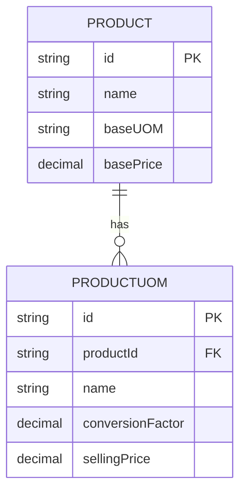
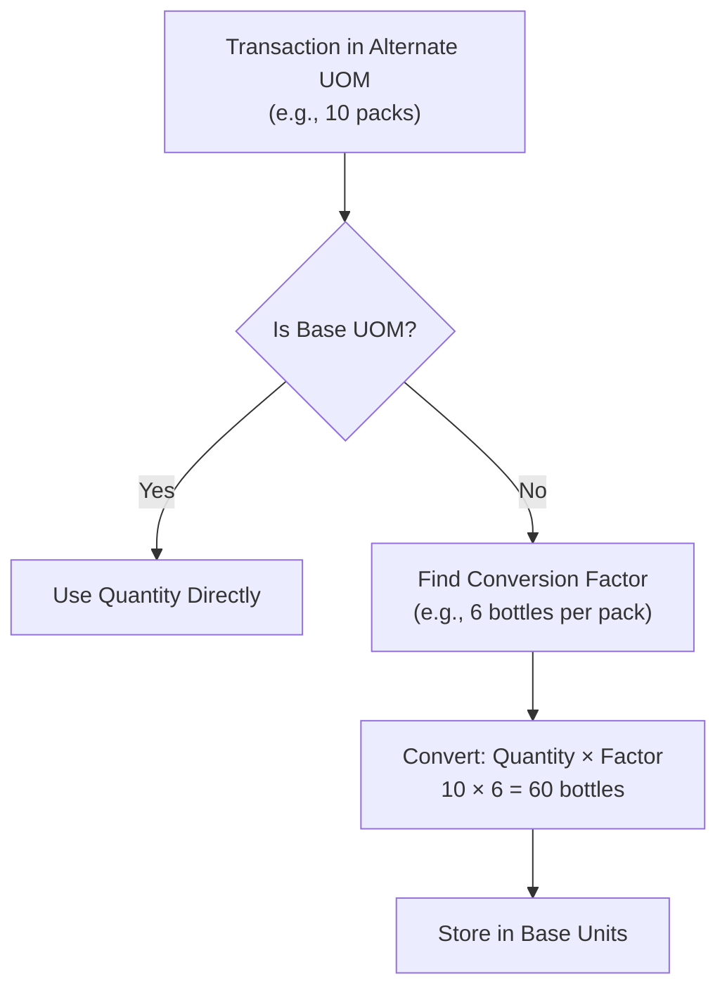
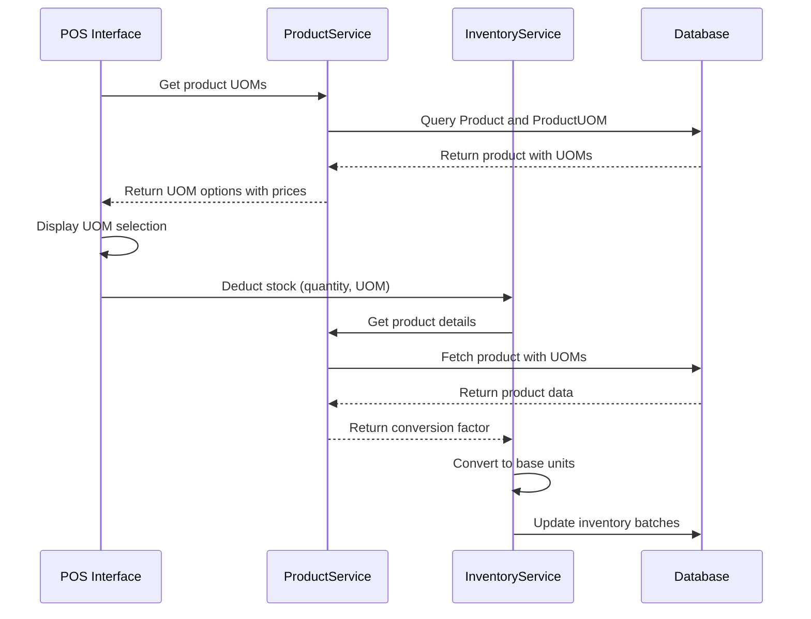

# Product UOM Model

<cite>
**Referenced Files in This Document**   
- [prisma/schema.prisma](file://prisma/schema.prisma)
- [services/product.service.ts](file://services/product.service.ts)
- [services/inventory.service.ts](file://services/inventory.service.ts)
- [types/product.types.ts](file://types/product.types.ts)
- [repositories/product.repository.ts](file://repositories/product.repository.ts)
- [components/products/product-dialog.tsx](file://components/products/product-dialog.tsx)
- [specs/inventory-pro-system/requirements.md](file://specs/inventory-pro-system/requirements.md)
- [prisma/seed.ts](file://prisma/seed.ts)
</cite>

## Table of Contents
1. [Introduction](#introduction)
2. [Field Definitions](#field-definitions)
3. [Constraints and Indexes](#constraints-and-indexes)
4. [Relationships](#relationships)
5. [UOM Conversion Logic](#uom-conversion-logic)
6. [Pricing Strategy](#pricing-strategy)
7. [Usage in POS Transactions](#usage-in-pos-transactions)
8. [Business Rules](#business-rules)
9. [Example Data](#example-data)

## Introduction
The ProductUOM model enables multi-unit of measure (UOM) support for products, allowing items to be sold in different quantities (e.g., bottles, packs, cartons) while tracking inventory in base units. This model is essential for retail and distribution systems where products are purchased and sold in various packaging configurations. The model supports flexible pricing per UOM and accurate inventory conversion between units.

**Section sources**
- [prisma/schema.prisma](file://prisma/schema.prisma#L67-L80)
- [specs/inventory-pro-system/requirements.md](file://specs/inventory-pro-system/requirements.md#L53-L71)

## Field Definitions
The ProductUOM model contains the following fields:

- **id**: Unique identifier (UUID) for the UOM record
- **productId**: Foreign key linking to the Product model
- **name**: Name of the unit of measure (e.g., "pack", "carton")
- **conversionFactor**: Decimal value (10,4) representing how many base units this UOM contains
- **sellingPrice**: Decimal value (10,2) representing the price when sold in this UOM
- **createdAt**: Timestamp when the UOM was created

The conversionFactor field is critical for converting between different units. For example, if a product has a base UOM of "bottle" and an alternate UOM of "pack" with a conversionFactor of 6, then one pack equals six bottles. The sellingPrice field enables different pricing strategies for each UOM, independent of the conversion factor.

**Section sources**
- [prisma/schema.prisma](file://prisma/schema.prisma#L67-L80)
- [services/product.service.ts](file://services/product.service.ts#L148-L163)

## Constraints and Indexes
The model implements several constraints and indexes for data integrity and performance:

- **@@unique([productId, name])**: Ensures no duplicate UOM names per product, preventing conflicts like having two "pack" UOMs for the same product
- **@@index([productId])**: Provides performance optimization for queries filtering by product, which is common in inventory and sales operations

These constraints ensure data consistency while supporting efficient querying patterns used throughout the application.

**Section sources**
- [prisma/schema.prisma](file://prisma/schema.prisma#L78-L80)

## Relationships
The ProductUOM model has a many-to-one relationship with the Product model via the productId foreign key. This relationship is configured with cascade delete, meaning when a product is deleted, all its associated UOMs are automatically removed. The Product model includes a reverse relationship (alternateUOMs) that allows accessing all UOMs for a product in a single query.

**Diagram sources**
- [prisma/schema.prisma](file://prisma/schema.prisma#L40-L80)
- [types/product.types.ts](file://types/product.types.ts#L38-L40)

**Section sources**
- [prisma/schema.prisma](file://prisma/schema.prisma#L76-L77)
- [repositories/product.repository.ts](file://repositories/product.repository.ts#L51-L53)

## UOM Conversion Logic
The system implements UOM conversion logic in the inventory.service.ts file, specifically in the convertToBaseUOM method. This function converts any quantity from a specified UOM to the base UOM using the conversionFactor. When adding or deducting stock, quantities are automatically converted to base units for consistent inventory tracking.

For example, when receiving 10 packs of a product where each pack equals 6 bottles, the system converts this to 60 bottles in inventory. This ensures all inventory levels are tracked in consistent base units while allowing transactions to occur in customer-friendly packaging units.

**Diagram sources**
- [services/inventory.service.ts](file://services/inventory.service.ts#L76-L101)
- [specs/inventory-pro-system/design.md](file://specs/inventory-pro-system/design.md#L755-L782)

**Section sources**
- [services/inventory.service.ts](file://services/inventory.service.ts#L76-L101)

## Pricing Strategy
The ProductUOM model supports independent pricing for each unit of measure through the sellingPrice field. This allows businesses to implement volume pricing strategies where larger packages have a lower per-unit cost. The sellingPrice is not calculated from the base price and conversion factor, providing complete flexibility in pricing.

For example, a bottle might sell for ₱30, a pack of 6 for ₱165 (₱27.50 per bottle), and a carton of 24 for ₱600 (₱25 per bottle), offering discounts for bulk purchases. The validation rules ensure all selling prices are greater than zero.

**Section sources**
- [prisma/schema.prisma](file://prisma/schema.prisma#L73)
- [lib/validations/product.validation.ts](file://lib/validations/product.validation.ts#L6)

## Usage in POS Transactions
In POS transactions, the system allows cashiers to sell items in different UOMs while inventory is automatically deducted in base units. When a product is added to the cart, the user can select from available UOMs (base UOM and alternate UOMs), each displaying its respective selling price.

The POS system uses the UOM information to:
- Display all available units with their prices
- Calculate correct totals based on selected UOM
- Convert quantities to base units for inventory deduction
- Track cost of goods sold using weighted average cost

This enables seamless selling in customer-preferred units while maintaining accurate inventory tracking in base units.

**Diagram sources**
- [services/product.service.ts](file://services/product.service.ts#L148-L163)
- [services/inventory.service.ts](file://services/inventory.service.ts#L190-L194)
- [components/sales-orders/sales-order-dialog.tsx](file://components/sales-orders/sales-order-dialog.tsx#L534-L558)

**Section sources**
- [services/product.service.ts](file://services/product.service.ts#L148-L163)
- [services/inventory.service.ts](file://services/inventory.service.ts#L115-L130)

## Business Rules
The system enforces several business rules around UOM management:

- Alternate UOM names cannot conflict with the base UOM
- UOM names must be unique within a product's configuration
- Conversion factors must be greater than zero
- Selling prices must be greater than zero
- Product names must be unique system-wide
- Minimum stock levels must be greater than zero

These rules are enforced through Zod validation schemas and service-level checks to maintain data integrity and prevent configuration errors.

**Section sources**
- [services/product.service.ts](file://services/product.service.ts#L45-L63)
- [lib/validations/product.validation.ts](file://lib/validations/product.validation.ts#L3-L7)

## Example Data
The system seed data includes example products with multiple UOMs:

- Coca-Cola 8oz Bottle: base UOM "bottle", with alternate UOMs "pack" (conversionFactor: 6, sellingPrice: ₱165.00) and "carton" (conversionFactor: 24, sellingPrice: ₱600.00)
- Absolute Distilled Water 500ml: base UOM "bottle", with alternate UOMs "pack" (conversionFactor: 12, sellingPrice: ₱170.00) and "carton" (conversionFactor: 48, sellingPrice: ₱650.00)

These examples demonstrate how the model supports real-world retail scenarios with different packaging configurations and volume pricing strategies.

**Section sources**
- [prisma/seed.ts](file://prisma/seed.ts#L176-L193)
- [TASK-1-COMPLETION.md](file://TASK-1-COMPLETION.md#L2-L162)